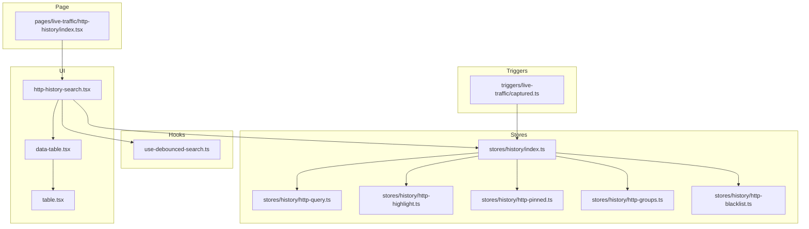
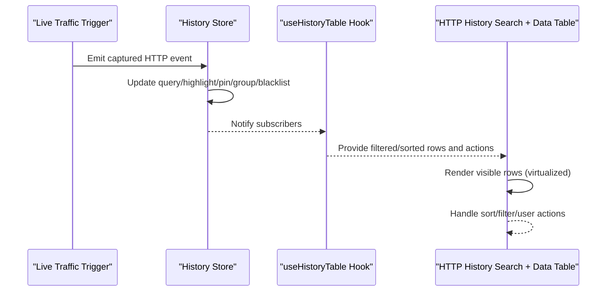
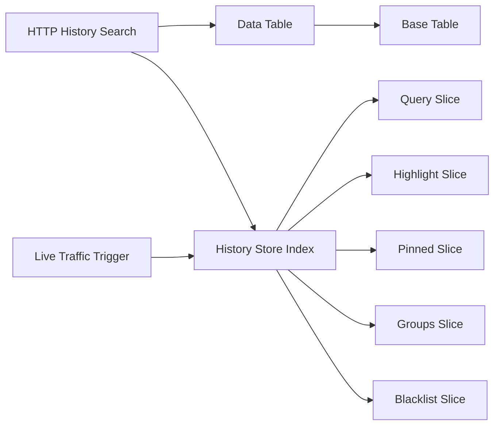

# HTTP History Table Component

<cite>
**Referenced Files in This Document**
- [http-history-search.tsx](file://src/layout/global-search/http-history-search.tsx)
- [use-debounced-search.ts](file://src/layout/global-search/use-debounced-search.ts)
- [data-table.tsx](file://src/components/ui/data-table.tsx)
- [table.tsx](file://src/components/ui/table.tsx)
- [index.ts](file://src/stores/history/index.ts)
- [http-query.ts](file://src/stores/history/http-query.ts)
- [http-highlight.ts](file://src/stores/history/http-highlight.ts)
- [http-pinned.ts](file://src/stores/history/http-pinned.ts)
- [http-groups.ts](file://src/stores/history/http-groups.ts)
- [http-blacklist.ts](file://src/stores/history/http-blacklist.ts)
- [websocket-query.ts](file://src/stores/history/websocket-query.ts)
- [captured.ts](file://src/triggers/live-traffic/captured.ts)
- [index.tsx](file://src/pages/live-traffic/http-history/index.tsx)
</cite>

## Table of Contents
1. [Introduction](#introduction)
2. [Project Structure](#project-structure)
3. [Core Components](#core-components)
4. [Architecture Overview](#architecture-overview)
5. [Detailed Component Analysis](#detailed-component-analysis)
6. [Dependency Analysis](#dependency-analysis)
7. [Performance Considerations](#performance-considerations)
8. [Troubleshooting Guide](#troubleshooting-guide)
9. [Conclusion](#conclusion)
10. [Appendices](#appendices)

## Introduction
This document explains the HTTP history table component that renders captured HTTP requests with real-time updates. It covers column definitions (URL, method, status code, domain, size, timing), configuration options, sorting and filtering mechanisms, integration with the useHistoryTable hook for data management and state synchronization, performance optimizations such as virtual scrolling and efficient re-rendering, and examples for custom column rendering and row actions.

## Project Structure
The HTTP history table is implemented across UI components, hooks, stores, and triggers:
- UI layer: a data table component and a global search entry point for HTTP history
- Data layer: stores for query, highlighting, pinning, grouping, and blacklisting
- Integration: triggers that emit captured HTTP events to update the table in real time
- Page entry: the live traffic HTTP history page that wires everything together

**Diagram sources**
- [http-history-search.tsx](file://src/layout/global-search/http-history-search.tsx)
- [data-table.tsx](file://src/components/ui/data-table.tsx)
- [table.tsx](file://src/components/ui/table.tsx)
- [use-debounced-search.ts](file://src/layout/global-search/use-debounced-search.ts)
- [index.ts](file://src/stores/history/index.ts)
- [http-query.ts](file://src/stores/history/http-query.ts)
- [http-highlight.ts](file://src/stores/history/http-highlight.ts)
- [http-pinned.ts](file://src/stores/history/http-pinned.ts)
- [http-groups.ts](file://src/stores/history/http-groups.ts)
- [http-blacklist.ts](file://src/stores/history/http-blacklist.ts)
- [captured.ts](file://src/triggers/live-traffic/captured.ts)
- [index.tsx](file://src/pages/live-traffic/http-history/index.tsx)

**Section sources**
- [http-history-search.tsx](file://src/layout/global-search/http-history-search.tsx)
- [data-table.tsx](file://src/components/ui/data-table.tsx)
- [table.tsx](file://src/components/ui/table.tsx)
- [use-debounced-search.ts](file://src/layout/global-search/use-debounced-search.ts)
- [index.ts](file://src/stores/history/index.ts)
- [http-query.ts](file://src/stores/history/http-query.ts)
- [http-highlight.ts](file://src/stores/history/http-highlight.ts)
- [http-pinned.ts](file://src/stores/history/http-pinned.ts)
- [http-groups.ts](file://src/stores/history/http-groups.ts)
- [http-blacklist.ts](file://src/stores/history/http-blacklist.ts)
- [captured.ts](file://src/triggers/live-traffic/captured.ts)
- [index.tsx](file://src/pages/live-traffic/http-history/index.tsx)

## Core Components
- HTTP History Search Entry: Provides a search interface and integrates with debounced search logic to filter HTTP history entries.
- Data Table: A generic table component used by the HTTP history view to render rows and columns with sorting and selection support.
- Base Table: Low-level table primitives used by the data table for layout and accessibility.
- History Stores: Centralized state for query filters, highlights, pinned items, groups, and blacklist rules.
- Live Traffic Trigger: Emits captured HTTP events to update the store and trigger re-renders.
- Live Traffic Page: Wires the search entry, data table, and stores into the HTTP history view.

Key responsibilities:
- Rendering captured HTTP requests with columns for URL, method, status code, domain, size, and timing
- Real-time updates via event-driven store mutations
- Sorting and filtering through query state
- Performance optimizations including virtualization and memoization

**Section sources**
- [http-history-search.tsx](file://src/layout/global-search/http-history-search.tsx)
- [data-table.tsx](file://src/components/ui/data-table.tsx)
- [table.tsx](file://src/components/ui/table.tsx)
- [index.ts](file://src/stores/history/index.ts)
- [http-query.ts](file://src/stores/history/http-query.ts)
- [http-highlight.ts](file://src/stores/history/http-highlight.ts)
- [http-pinned.ts](file://src/stores/history/http-pinned.ts)
- [http-groups.ts](file://src/stores/history/http-groups.ts)
- [http-blacklist.ts](file://src/stores/history/http-blacklist.ts)
- [captured.ts](file://src/triggers/live-traffic/captured.ts)
- [index.tsx](file://src/pages/live-traffic/http-history/index.tsx)

## Architecture Overview
The HTTP history table follows an event-driven architecture:
- Captured HTTP events are emitted by the live traffic trigger
- The history store updates its state (query, highlights, pins, groups, blacklist)
- The UI subscribes to store changes and re-renders efficiently
- The data table renders only visible rows using virtualization when enabled

**Diagram sources**
- [captured.ts](file://src/triggers/live-traffic/captured.ts)
- [index.ts](file://src/stores/history/index.ts)
- [http-query.ts](file://src/stores/history/http-query.ts)
- [http-highlight.ts](file://src/stores/history/http-highlight.ts)
- [http-pinned.ts](file://src/stores/history/http-pinned.ts)
- [http-groups.ts](file://src/stores/history/http-groups.ts)
- [http-blacklist.ts](file://src/stores/history/http-blacklist.ts)
- [http-history-search.tsx](file://src/layout/global-search/http-history-search.tsx)
- [data-table.tsx](file://src/components/ui/data-table.tsx)

## Detailed Component Analysis

### HTTP History Search Entry
Responsibilities:
- Renders the search input and integrates with debounced search to avoid excessive re-renders
- Connects to the history store to apply query filters
- Exposes actions for clearing filters and toggling advanced options

Behavior:
- Debounces user input to minimize store updates
- Updates the query store slice for text-based filtering
- Triggers re-filtering of the dataset through the hook

**Section sources**
- [http-history-search.tsx](file://src/layout/global-search/http-history-search.tsx)
- [use-debounced-search.ts](file://src/layout/global-search/use-debounced-search.ts)
- [http-query.ts](file://src/stores/history/http-query.ts)

### Data Table and Base Table
Responsibilities:
- Generic table rendering with configurable columns, sorting, and selection
- Integrates with virtual scrolling to handle large datasets efficiently
- Supports custom cell renderers and row actions

Features:
- Column definitions include URL, method, status code, domain, size, and timing
- Sorting can be applied per column with stable ordering
- Selection supports single or multi-row interactions
- Virtualization reduces DOM nodes and improves scroll performance

**Section sources**
- [data-table.tsx](file://src/components/ui/data-table.tsx)
- [table.tsx](file://src/components/ui/table.tsx)

### History Stores
Responsibilities:
- Maintain query filters, highlight rules, pinned entries, grouping, and blacklist
- Provide reactive updates to subscribers (hooks/UI)
- Normalize and transform raw captured events into display-ready rows

Slices:
- Query: text and field-specific filters
- Highlight: regex or keyword-based highlighting
- Pinned: persistent selection of important entries
- Groups: categorization and collapsible sections
- Blacklist: exclude specific domains or patterns

**Section sources**
- [index.ts](file://src/stores/history/index.ts)
- [http-query.ts](file://src/stores/history/http-query.ts)
- [http-highlight.ts](file://src/stores/history/http-highlight.ts)
- [http-pinned.ts](file://src/stores/history/http-pinned.ts)
- [http-groups.ts](file://src/stores/history/http-groups.ts)
- [http-blacklist.ts](file://src/stores/history/http-blacklist.ts)

### Live Traffic Trigger
Responsibilities:
- Emits captured HTTP events when new requests/responses are observed
- Ensures consistent payload shape for downstream consumers
- Coordinates with the history store to append or update entries

Integration:
- Subscribes to proxy/browser capture events
- Dispatches normalized messages to the store
- Triggers UI updates via store subscribers

**Section sources**
- [captured.ts](file://src/triggers/live-traffic/captured.ts)
- [index.ts](file://src/stores/history/index.ts)

### Live Traffic Page
Responsibilities:
- Wires the HTTP history search, data table, and stores
- Configures column definitions and row actions
- Manages initial state and persistence where applicable

Usage:
- Instantiates the data table with HTTP-specific columns
- Applies sorting defaults and pagination/virtualization settings
- Handles user interactions like selecting rows or exporting data

**Section sources**
- [index.tsx](file://src/pages/live-traffic/http-history/index.tsx)
- [data-table.tsx](file://src/components/ui/data-table.tsx)

## Dependency Analysis
The HTTP history table depends on:
- UI primitives for table rendering and interaction
- Store slices for state management and filtering
- Event triggers for real-time updates
- Hooks for debouncing and derived computations

**Diagram sources**
- [http-history-search.tsx](file://src/layout/global-search/http-history-search.tsx)
- [data-table.tsx](file://src/components/ui/data-table.tsx)
- [table.tsx](file://src/components/ui/table.tsx)
- [index.ts](file://src/stores/history/index.ts)
- [http-query.ts](file://src/stores/history/http-query.ts)
- [http-highlight.ts](file://src/stores/history/http-highlight.ts)
- [http-pinned.ts](file://src/stores/history/http-pinned.ts)
- [http-groups.ts](file://src/stores/history/http-groups.ts)
- [http-blacklist.ts](file://src/stores/history/http-blacklist.ts)
- [captured.ts](file://src/triggers/live-traffic/captured.ts)

**Section sources**
- [http-history-search.tsx](file://src/layout/global-search/http-history-search.tsx)
- [data-table.tsx](file://src/components/ui/data-table.tsx)
- [table.tsx](file://src/components/ui/table.tsx)
- [index.ts](file://src/stores/history/index.ts)
- [http-query.ts](file://src/stores/history/http-query.ts)
- [http-highlight.ts](file://src/stores/history/http-highlight.ts)
- [http-pinned.ts](file://src/stores/history/http-pinned.ts)
- [http-groups.ts](file://src/stores/history/http-groups.ts)
- [http-blacklist.ts](file://src/stores/history/http-blacklist.ts)
- [captured.ts](file://src/triggers/live-traffic/captured.ts)

## Performance Considerations
- Virtual Scrolling: The data table should enable virtualization to render only visible rows, reducing memory usage and improving scroll performance for large datasets.
- Debounced Search: Use debounced input handling to limit store updates during rapid typing.
- Memoization: Memoize computed columns and row renderers to avoid unnecessary re-renders.
- Stable Keys: Ensure each row has a stable unique key to optimize reconciliation.
- Batched Updates: Group multiple store mutations into a single update cycle to reduce re-renders.
- Selective Re-rendering: Subscribe only to relevant store slices to prevent full UI rebuilds.

[No sources needed since this section provides general guidance]

## Troubleshooting Guide
Common issues and resolutions:
- Missing Columns: Verify column definitions in the data table configuration and ensure required fields exist in the store payload.
- Sorting Not Working: Check column sort handlers and ensure stable comparators are provided.
- Filtering Ineffective: Confirm query slice updates and that the hook applies filters consistently.
- Real-Time Updates Stalled: Validate that the live traffic trigger emits events and the store subscribers are active.
- Performance Degradation: Enable virtualization, debounce inputs, and review heavy render functions.

**Section sources**
- [data-table.tsx](file://src/components/ui/data-table.tsx)
- [http-query.ts](file://src/stores/history/http-query.ts)
- [captured.ts](file://src/triggers/live-traffic/captured.ts)

## Conclusion
The HTTP history table component provides a robust, real-time view of captured HTTP requests with configurable columns, sorting, and filtering. It leverages a modular store architecture and event-driven updates for responsiveness. With virtualization and memoization, it scales well to large datasets while maintaining smooth interactions. Custom column rendering and row actions can be integrated through the data table’s extensible APIs.

[No sources needed since this section summarizes without analyzing specific files]

## Appendices

### Column Definitions
- URL: Full request URL with optional path highlighting
- Method: HTTP method with color coding
- Status Code: Numeric status with semantic coloring
- Domain: Extracted host for quick scanning
- Size: Response size in human-readable format
- Timing: Duration or timestamps for performance insights

[No sources needed since this section describes conceptual columns]

### Custom Column Rendering Example
- Define a column with a renderer function
- Access row data within the renderer
- Return JSX or formatted text for display

[No sources needed since this section provides conceptual guidance]

### Row Actions Example
- Add action buttons to each row (e.g., copy URL, open in inspector)
- Bind click handlers to store methods or external APIs
- Optionally use context menus for additional actions

[No sources needed since this section provides conceptual guidance]