# HTTP History View & Table

<cite>
**Referenced Files in This Document**
- [http-history.tsx](file://src/pages/live-traffic/http-history/index.tsx)
- [HttpHistoryTable.tsx](file://src/pages/live-traffic/http-history/components/HttpHistoryTable.tsx)
- [columns.tsx](file://src/pages/live-traffic/http-history/components/columns.tsx)
- [use-http-history.ts](file://src/pages/live-traffic/http-history/hooks/use-http-history.ts)
- [index.ts](file://src/stores/history/index.ts)
- [data-table.tsx](file://src/components/ui/data-table.tsx)
- [pagination.tsx](file://src/components/ui/pagination.tsx)
- [context-menu.tsx](file://src/components/ui/context-menu.tsx)
- [table.tsx](file://src/components/ui/table.tsx)
</cite>

## Table of Contents
1. [Introduction](#introduction)
2. [Project Structure](#project-structure)
3. [Core Components](#core-components)
4. [Architecture Overview](#architecture-overview)
5. [Detailed Component Analysis](#detailed-component-analysis)
6. [Dependency Analysis](#dependency-analysis)
7. [Performance Considerations](#performance-considerations)
8. [Troubleshooting Guide](#troubleshooting-guide)
9. [Conclusion](#conclusion)

## Introduction
This document explains the HTTP history view and table component that displays captured HTTP requests with real-time updates. It covers the main table interface, columns (URL, method, status code, domain, size, timing), row selection, bulk operations, context menu, pagination for large datasets, virtual scrolling optimizations, integration with the traffic store, and the event-driven architecture for live updates. It also includes examples of custom column rendering and row actions.

## Project Structure
The HTTP history feature is implemented under the live-traffic module with a clear separation between UI components, hooks, and stores:
- Page entry point composes the view and hook logic
- Table component renders the data grid with selection and actions
- Column definitions define how each field is displayed and sorted
- Hook manages data fetching, filtering, pagination, and real-time updates
- Store provides reactive state for HTTP history items and related metadata
- Shared UI primitives provide table, pagination, and context menu behaviors

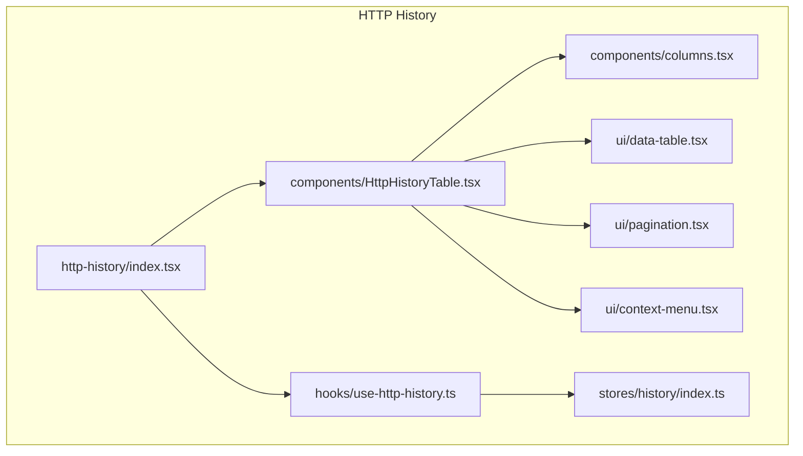

**Diagram sources**
- [http-history.tsx](file://src/pages/live-traffic/http-history/index.tsx)
- [HttpHistoryTable.tsx](file://src/pages/live-traffic/http-history/components/HttpHistoryTable.tsx)
- [columns.tsx](file://src/pages/live-traffic/http-history/components/columns.tsx)
- [use-http-history.ts](file://src/pages/live-traffic/http-history/hooks/use-http-history.ts)
- [index.ts](file://src/stores/history/index.ts)
- [data-table.tsx](file://src/components/ui/data-table.tsx)
- [pagination.tsx](file://src/components/ui/pagination.tsx)
- [context-menu.tsx](file://src/components/ui/context-menu.tsx)

**Section sources**
- [http-history.tsx](file://src/pages/live-traffic/http-history/index.tsx)
- [HttpHistoryTable.tsx](file://src/pages/live-traffic/http-history/components/HttpHistoryTable.tsx)
- [columns.tsx](file://src/pages/live-traffic/http-history/components/columns.tsx)
- [use-http-history.ts](file://src/pages/live-traffic/http-history/hooks/use-http-history.ts)
- [index.ts](file://src/stores/history/index.ts)
- [data-table.tsx](file://src/components/ui/data-table.tsx)
- [pagination.tsx](file://src/components/ui/pagination.tsx)
- [context-menu.tsx](file://src/components/ui/context-menu.tsx)

## Core Components
- HTTP History page: orchestrates the view, subscribes to the hook, and renders the table container.
- HttpHistoryTable: renders the data table with selection, sorting, filtering, pagination, and context menu.
- Columns: defines column schemas for URL, method, status code, domain, size, and timing, including renderers and sorters.
- use-http-history: manages data lifecycle, filters, pagination, and real-time updates from the store.
- Store: holds HTTP history items, selected rows, and query parameters; exposes methods to update state reactively.

Key responsibilities:
- Data binding: table reads from store via hook; updates propagate reactively.
- Selection: single/multi-row selection with keyboard and mouse support.
- Bulk actions: operate on selected rows (e.g., copy, delete).
- Context menu: per-row and multi-row actions exposed via right-click.
- Pagination: server-side or client-side paging with configurable page size.
- Virtualization: efficient rendering for large lists using windowed rendering.

**Section sources**
- [http-history.tsx](file://src/pages/live-traffic/http-history/index.tsx)
- [HttpHistoryTable.tsx](file://src/pages/live-traffic/http-history/components/HttpHistoryTable.tsx)
- [columns.tsx](file://src/pages/live-traffic/http-history/components/columns.tsx)
- [use-http-history.ts](file://src/pages/live-traffic/http-history/hooks/use-http-history.ts)
- [index.ts](file://src/stores/history/index.ts)

## Architecture Overview
The HTTP history view follows an event-driven architecture backed by a reactive store:
- The proxy captures HTTP traffic and emits events.
- The store listens to events and updates the list of requests.
- The hook subscribes to store changes and exposes paginated, filtered results.
- The table component renders only visible rows and handles user interactions.
- Real-time updates are applied without full re-renders through targeted state updates.

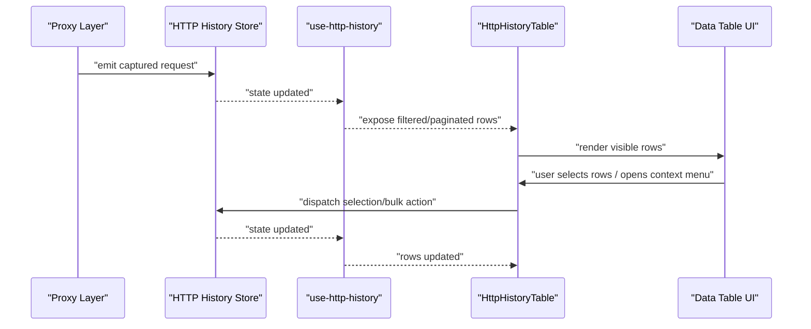

**Diagram sources**
- [use-http-history.ts](file://src/pages/live-traffic/http-history/hooks/use-http-history.ts)
- [index.ts](file://src/stores/history/index.ts)
- [HttpHistoryTable.tsx](file://src/pages/live-traffic/http-history/components/HttpHistoryTable.tsx)
- [data-table.tsx](file://src/components/ui/data-table.tsx)

## Detailed Component Analysis

### HTTP History Page
- Composes the layout and integrates the hook.
- Provides props to the table such as filter state and callbacks.
- Handles initial load and subscription to real-time updates.

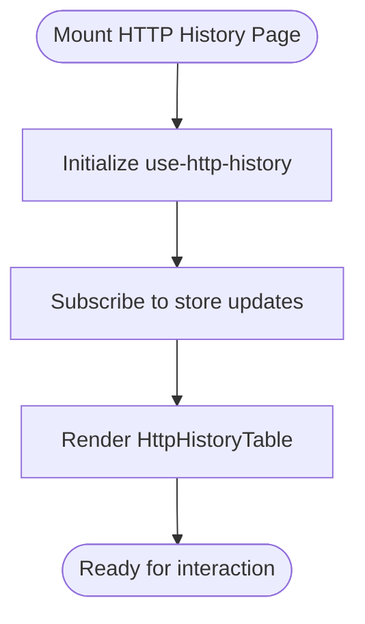

**Section sources**
- [http-history.tsx](file://src/pages/live-traffic/http-history/index.tsx)

### HttpHistoryTable
- Renders the data table with columns defined in columns.tsx.
- Implements row selection (single/multi), bulk actions, and context menu.
- Integrates pagination controls and supports virtual scrolling via the data table primitive.

```mermaid
classDiagram
class HttpHistoryTable {
+props : { rows, selected, onSelect, onBulkAction }
+renderColumns()
+handleRowClick(row)
+handleContextMenu(row, event)
+handleSelectionChange(selectedIds)
+renderPagination()
}
class DataTable {
+renderRows(visibleRows)
+onRowSelect(id)
+onContextMenu(row, event)
}
HttpHistoryTable --> DataTable : "uses"
```

**Diagram sources**
- [HttpHistoryTable.tsx](file://src/pages/live-traffic/http-history/components/HttpHistoryTable.tsx)
- [data-table.tsx](file://src/components/ui/data-table.tsx)

**Section sources**
- [HttpHistoryTable.tsx](file://src/pages/live-traffic/http-history/components/HttpHistoryTable.tsx)
- [data-table.tsx](file://src/components/ui/data-table.tsx)
- [context-menu.tsx](file://src/components/ui/context-menu.tsx)
- [table.tsx](file://src/components/ui/table.tsx)

### Columns Definition
- Defines columns for URL, method, status code, domain, size, and timing.
- Each column specifies label, accessor, sortable flag, and optional renderer.
- Custom renderers can format URLs, colorize methods/status codes, and abbreviate sizes/timing.

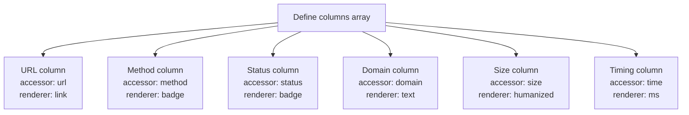

**Section sources**
- [columns.tsx](file://src/pages/live-traffic/http-history/components/columns.tsx)

### Hook: use-http-history
- Manages:
  - Fetching and subscribing to HTTP history items from the store.
  - Filtering by query parameters (e.g., method, status, domain).
  - Sorting by column fields.
  - Pagination with page size and current page.
  - Real-time updates via store subscriptions.
- Exposes:
  - rows: paginated and filtered dataset.
  - total: total count for pagination.
  - selected: set of selected row IDs.
  - actions: handlers for selection, bulk operations, and context menu commands.

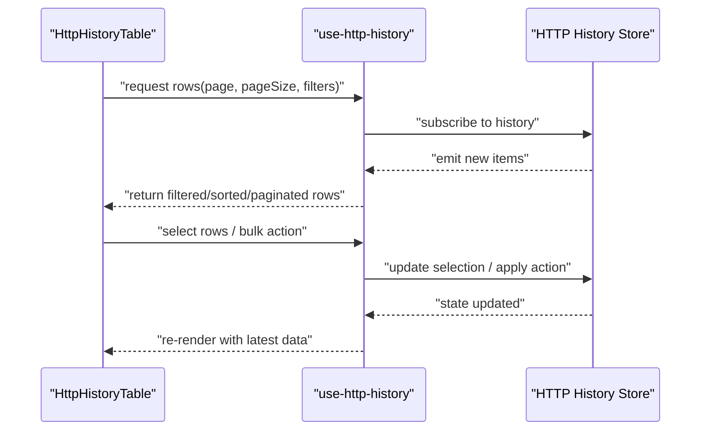

**Diagram sources**
- [use-http-history.ts](file://src/pages/live-traffic/http-history/hooks/use-http-history.ts)
- [index.ts](file://src/stores/history/index.ts)

**Section sources**
- [use-http-history.ts](file://src/pages/live-traffic/http-history/hooks/use-http-history.ts)
- [index.ts](file://src/stores/history/index.ts)

### Store Integration
- Holds:
  - items: array of HTTP request records.
  - selected: set of selected item IDs.
  - filters: active query parameters.
  - pagination: current page and page size.
- Methods:
  - addItems(items): append new captured requests.
  - removeItems(ids): delete selected or specified items.
  - updateFilters(filters): apply search and filters.
  - setPagination(page, pageSize): change page configuration.
  - setSelected(ids): manage row selection.
- Reactivity:
  - Subscribers receive incremental updates to avoid full re-renders.

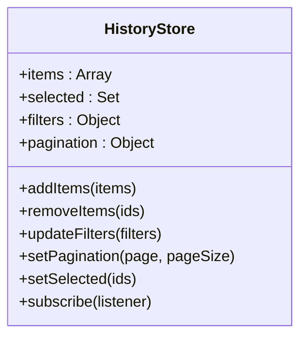

**Diagram sources**
- [index.ts](file://src/stores/history/index.ts)

**Section sources**
- [index.ts](file://src/stores/history/index.ts)

### Pagination System
- Supports configurable page size and current page.
- Integrates with the data table to render only visible rows.
- Works with filtering and sorting to compute correct totals and slices.

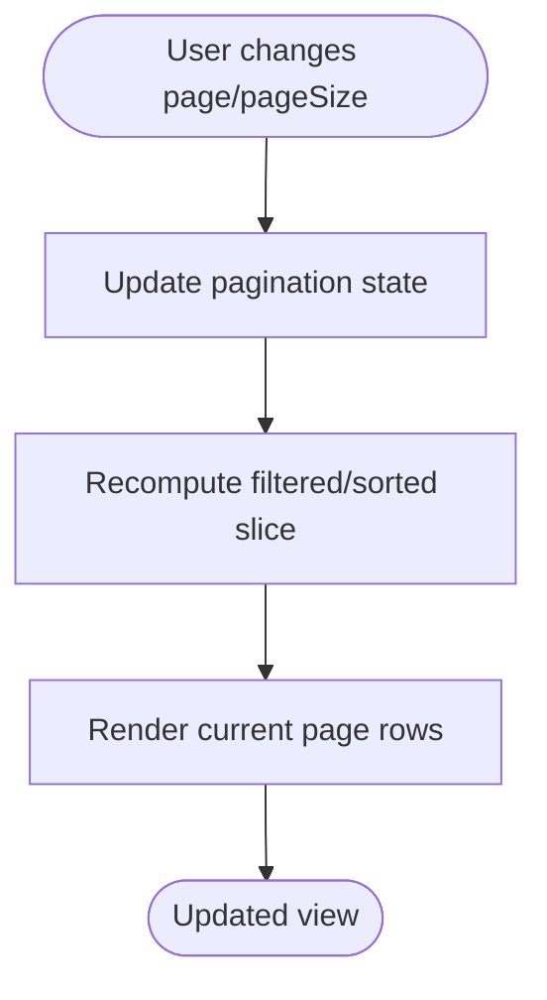

**Section sources**
- [pagination.tsx](file://src/components/ui/pagination.tsx)
- [use-http-history.ts](file://src/pages/live-traffic/http-history/hooks/use-http-history.ts)

### Virtual Scrolling Performance
- Uses windowed rendering to display only visible rows within the viewport.
- Reduces DOM nodes and improves scroll performance for large datasets.
- Integrates with the data table primitive to calculate visible ranges based on row height and container size.

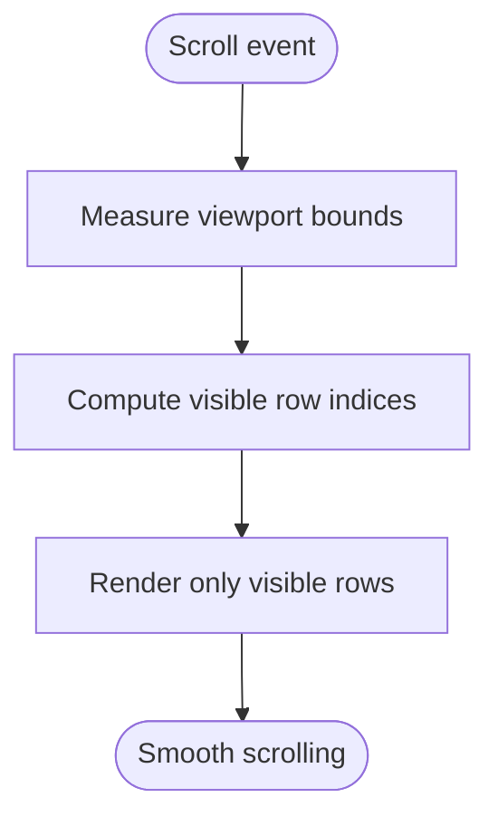

**Section sources**
- [data-table.tsx](file://src/components/ui/data-table.tsx)

### Row Selection and Bulk Operations
- Single click selects a row; Shift/Ctrl/Meta keys enable multi-selection.
- Bulk actions operate on all selected rows (e.g., copy request details, delete).
- Selection state is persisted in the store and reflected across the UI.

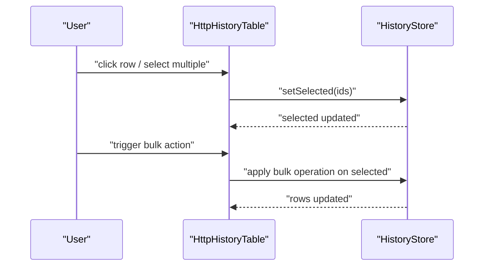

**Section sources**
- [HttpHistoryTable.tsx](file://src/pages/live-traffic/http-history/components/HttpHistoryTable.tsx)
- [index.ts](file://src/stores/history/index.ts)

### Context Menu Functionality
- Right-click opens a context menu for the row or selected rows.
- Actions include open in inspector, copy URL, send to repeater, pin/unpin, etc.
- Menu items can be dynamic based on row properties and user permissions.

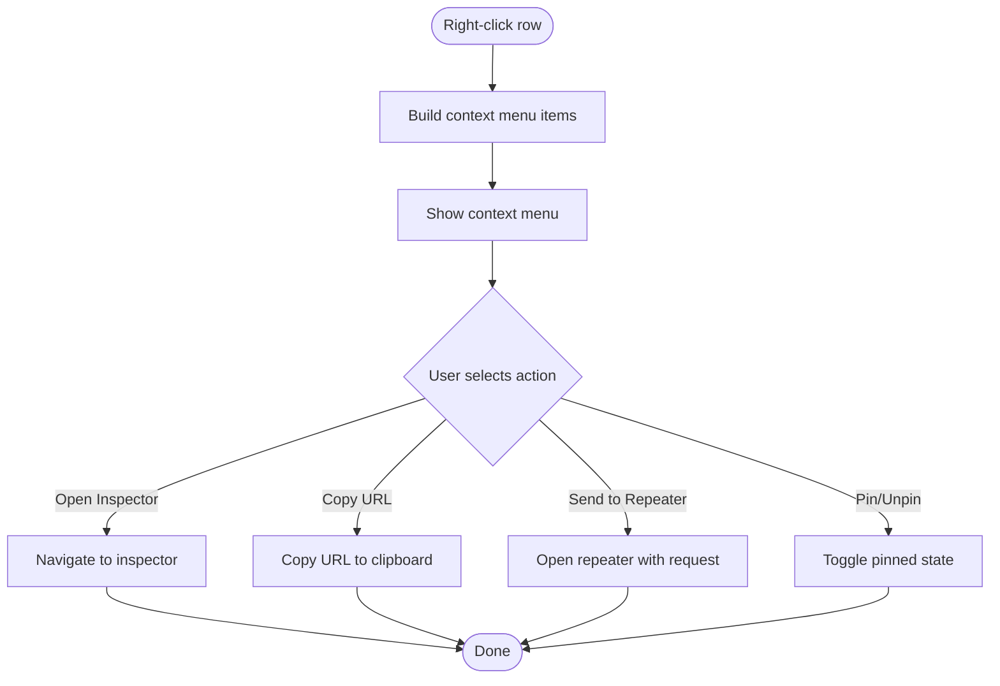

**Section sources**
- [context-menu.tsx](file://src/components/ui/context-menu.tsx)
- [HttpHistoryTable.tsx](file://src/pages/live-traffic/http-history/components/HttpHistoryTable.tsx)

### Custom Column Rendering Examples
- URL column: renders as a clickable link with truncated text and tooltip.
- Method column: renders as a colored badge indicating GET/POST/etc.
- Status column: renders as a badge with color coding for 2xx/3xx/4xx/5xx.
- Domain column: extracts host from URL and displays it.
- Size column: formats bytes into KB/MB with appropriate units.
- Timing column: shows milliseconds with formatting.

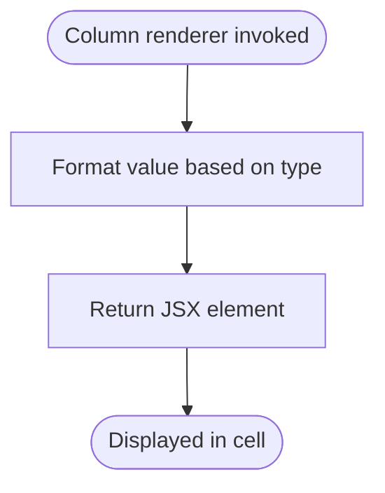

**Section sources**
- [columns.tsx](file://src/pages/live-traffic/http-history/components/columns.tsx)

### Row Actions
- Inline actions can be added per row (e.g., duplicate, delete).
- Actions trigger store updates and refresh the table view.
- Keyboard shortcuts can be bound to common actions.

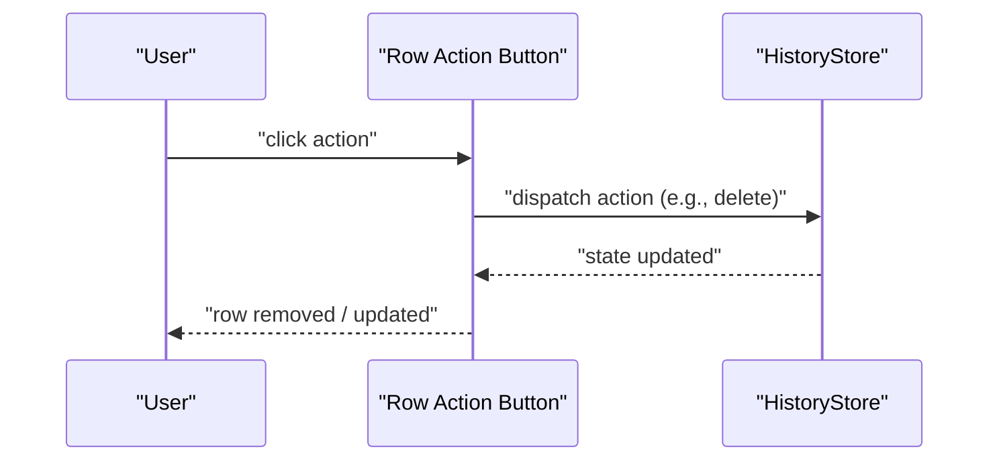

**Section sources**
- [HttpHistoryTable.tsx](file://src/pages/live-traffic/http-history/components/HttpHistoryTable.tsx)
- [index.ts](file://src/stores/history/index.ts)

## Dependency Analysis
The HTTP history view depends on shared UI primitives and the store for data management. The hook bridges the store and the table, ensuring decoupled updates and clean separation of concerns.

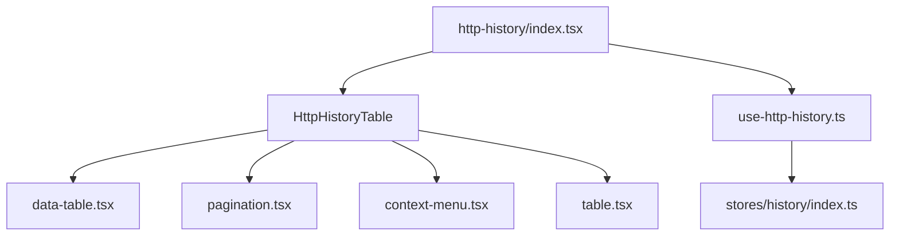

**Diagram sources**
- [HttpHistoryTable.tsx](file://src/pages/live-traffic/http-history/components/HttpHistoryTable.tsx)
- [data-table.tsx](file://src/components/ui/data-table.tsx)
- [pagination.tsx](file://src/components/ui/pagination.tsx)
- [context-menu.tsx](file://src/components/ui/context-menu.tsx)
- [table.tsx](file://src/components/ui/table.tsx)
- [use-http-history.ts](file://src/pages/live-traffic/http-history/hooks/use-http-history.ts)
- [index.ts](file://src/stores/history/index.ts)
- [http-history.tsx](file://src/pages/live-traffic/http-history/index.tsx)

**Section sources**
- [HttpHistoryTable.tsx](file://src/pages/live-traffic/http-history/components/HttpHistoryTable.tsx)
- [data-table.tsx](file://src/components/ui/data-table.tsx)
- [pagination.tsx](file://src/components/ui/pagination.tsx)
- [context-menu.tsx](file://src/components/ui/context-menu.tsx)
- [table.tsx](file://src/components/ui/table.tsx)
- [use-http-history.ts](file://src/pages/live-traffic/http-history/hooks/use-http-history.ts)
- [index.ts](file://src/stores/history/index.ts)
- [http-history.tsx](file://src/pages/live-traffic/http-history/index.tsx)

## Performance Considerations
- Virtual scrolling: Only render visible rows to minimize DOM overhead.
- Memoization: Use memoized selectors for filtered/sorted slices to avoid recomputation.
- Incremental updates: Apply targeted state changes instead of replacing entire arrays.
- Debounced input: Debounce search/filter inputs to reduce frequent re-renders.
- Efficient accessors: Ensure column accessors are lightweight and avoid heavy computations in render paths.

[No sources needed since this section provides general guidance]

## Troubleshooting Guide
Common issues and resolutions:
- Missing data: Verify store subscription and ensure events are emitted by the proxy layer.
- Stale selections: Confirm selection state updates and re-renders after bulk actions.
- Pagination mismatch: Check total count computation and ensure filters are applied before slicing.
- Slow scrolling: Validate virtual scrolling configuration and row heights.
- Context menu not appearing: Ensure event propagation is handled correctly and menu items are built properly.

**Section sources**
- [use-http-history.ts](file://src/pages/live-traffic/http-history/hooks/use-http-history.ts)
- [index.ts](file://src/stores/history/index.ts)
- [HttpHistoryTable.tsx](file://src/pages/live-traffic/http-history/components/HttpHistoryTable.tsx)
- [context-menu.tsx](file://src/components/ui/context-menu.tsx)

## Conclusion
The HTTP history view and table component provides a robust, performant interface for inspecting captured HTTP requests. With a clear separation of concerns, event-driven updates, and optimized rendering, it supports real-time monitoring, flexible filtering, and powerful user interactions like selection, bulk operations, and context menus. Extensibility is achieved through customizable column renderers and row actions, making it adaptable to evolving requirements.

[No sources needed since this section summarizes without analyzing specific files]