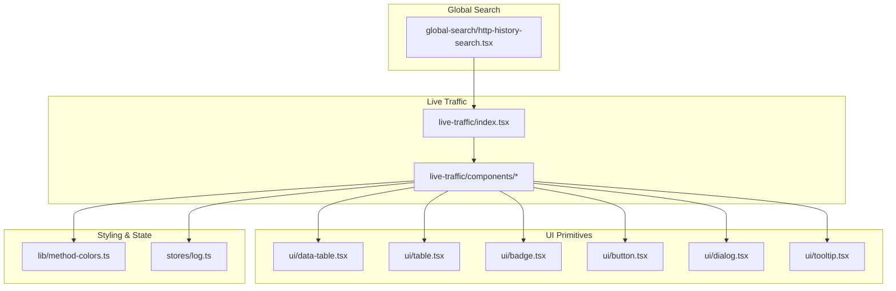
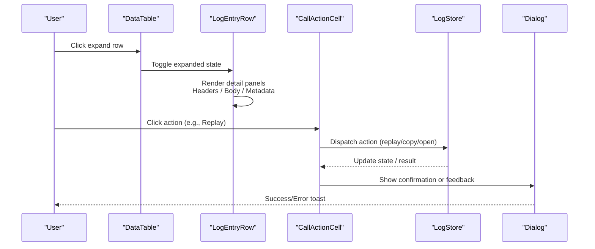
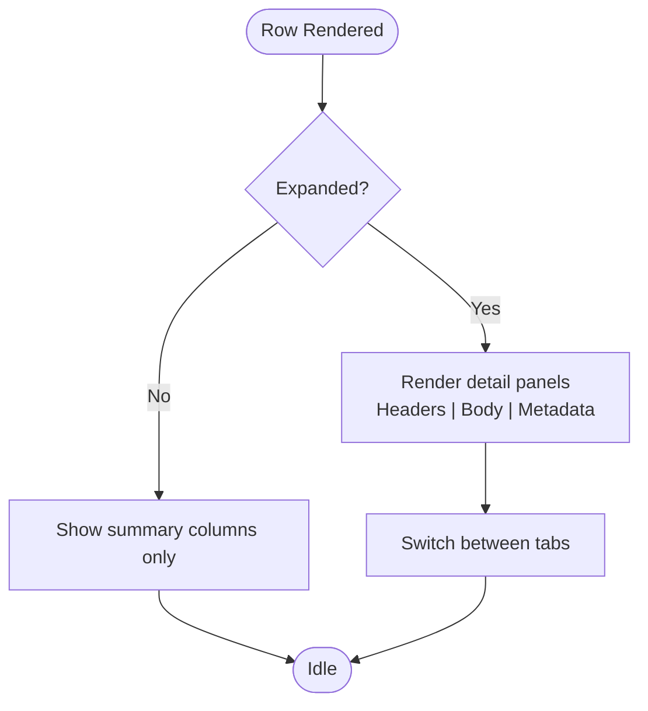
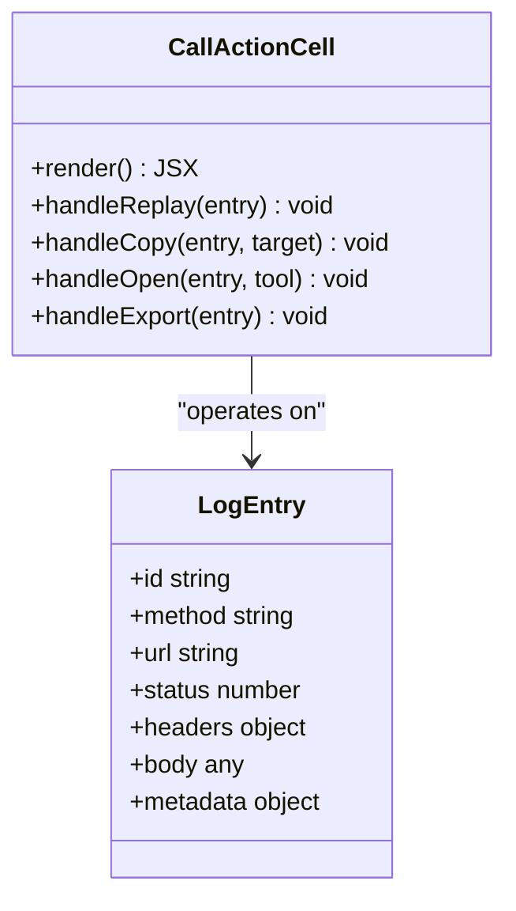
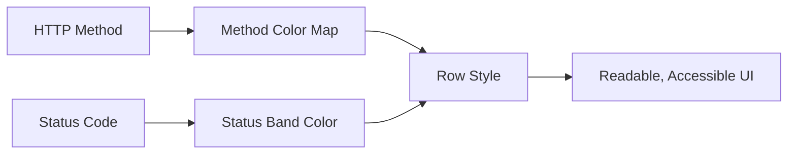
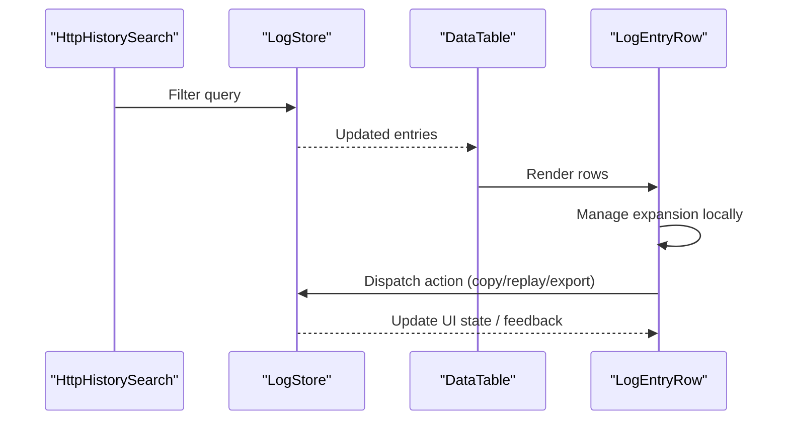
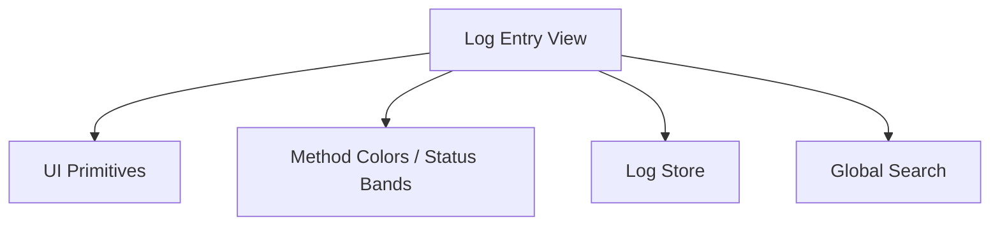

# Log Entry View Component

<cite>
**Referenced Files in This Document**
- [http-history-search.tsx](file://src/layout/global-search/http-history-search.tsx)
- [index.tsx](file://src/pages/live-traffic/index.tsx)
- [components/](file://src/pages/live-traffic/components/)
- [lib/method-colors.ts](file://src/lib/method-colors.ts)
- [stores/log.ts](file://src/stores/log.ts)
- [components/ui/data-table.tsx](file://src/components/ui/data-table.tsx)
- [components/ui/table.tsx](file://src/components/ui/table.tsx)
- [components/ui/badge.tsx](file://src/components/ui/badge.tsx)
- [components/ui/button.tsx](file://src/components/ui/button.tsx)
- [components/ui/dialog.tsx](file://src/components/ui/dialog.tsx)
- [components/ui/tooltip.tsx](file://src/components/ui/tooltip.tsx)
</cite>

## Table of Contents
1. [Introduction](#introduction)
2. [Project Structure](#project-structure)
3. [Core Components](#core-components)
4. [Architecture Overview](#architecture-overview)
5. [Detailed Component Analysis](#detailed-component-analysis)
6. [Dependency Analysis](#dependency-analysis)
7. [Performance Considerations](#performance-considerations)
8. [Troubleshooting Guide](#troubleshooting-guide)
9. [Conclusion](#conclusion)
10. [Appendices](#appendices)

## Introduction
This document explains the log entry view component used to display individual HTTP request details within the live traffic module. It covers how each row represents an HTTP request, how expanding a row reveals headers, body content, and metadata, and how the call action cell enables actions such as replaying requests or copying data. It also documents visual styling patterns including color coding for HTTP methods and status codes, responsive design considerations, and guidance for customizing appearance and extending actions.

## Project Structure
The log entry view is part of the live traffic feature and integrates with shared UI primitives and stores:
- Live traffic page orchestrates the list and detail views.
- Global search includes a filter for HTTP history entries.
- Shared UI components provide table, badge, dialog, tooltip, and button primitives.
- Styling utilities define method colors and status code semantics.
- Store modules manage state for logs and interactions.

**Diagram sources**
- [index.tsx](file://src/pages/live-traffic/index.tsx)
- [http-history-search.tsx](file://src/layout/global-search/http-history-search.tsx)
- [data-table.tsx](file://src/components/ui/data-table.tsx)
- [table.tsx](file://src/components/ui/table.tsx)
- [badge.tsx](file://src/components/ui/badge.tsx)
- [button.tsx](file://src/components/ui/button.tsx)
- [dialog.tsx](file://src/components/ui/dialog.tsx)
- [tooltip.tsx](file://src/components/ui/tooltip.tsx)
- [method-colors.ts](file://src/lib/method-colors.ts)
- [log.ts](file://src/stores/log.ts)

**Section sources**
- [index.tsx](file://src/pages/live-traffic/index.tsx)
- [http-history-search.tsx](file://src/layout/global-search/http-history-search.tsx)
- [data-table.tsx](file://src/components/ui/data-table.tsx)
- [table.tsx](file://src/components/ui/table.tsx)
- [badge.tsx](file://src/components/ui/badge.tsx)
- [button.tsx](file://src/components/ui/button.tsx)
- [dialog.tsx](file://src/components/ui/dialog.tsx)
- [tooltip.tsx](file://src/components/ui/tooltip.tsx)
- [method-colors.ts](file://src/lib/method-colors.ts)
- [log.ts](file://src/stores/log.ts)

## Core Components
- Log Entry Row: Renders a single HTTP request with method, URL, status, and timing. Expanding the row shows detailed panels for request/response headers, body content, cookies, and metadata (e.g., timestamps, size).
- Call Action Cell: A dedicated column that provides actionable buttons per entry, such as replay, copy headers/body, open in repeater, or export.
- Detail Panels: Tabbed or collapsible sections inside the expanded row to organize large payloads without cluttering the main list.
- Status and Method Badges: Visual indicators using color-coded badges for quick scanning.

Key responsibilities:
- Display concise summary on the row.
- Expandable detail view with organized tabs.
- Execute actions via the call action cell.
- Apply consistent styling and accessibility patterns.

**Section sources**
- [index.tsx](file://src/pages/live-traffic/index.tsx)
- [data-table.tsx](file://src/components/ui/data-table.tsx)
- [table.tsx](file://src/components/ui/table.tsx)
- [badge.tsx](file://src/components/ui/badge.tsx)
- [button.tsx](file://src/components/ui/button.tsx)
- [dialog.tsx](file://src/components/ui/dialog.tsx)
- [tooltip.tsx](file://src/components/ui/tooltip.tsx)
- [method-colors.ts](file://src/lib/method-colors.ts)
- [log.ts](file://src/stores/log.ts)

## Architecture Overview
The log entry view composes a table-driven interface where each row is a log entry. Expansion toggles a detail panel that renders multiple sections. Actions are wired through event handlers that may interact with stores or external tools.

**Diagram sources**
- [data-table.tsx](file://src/components/ui/data-table.tsx)
- [index.tsx](file://src/pages/live-traffic/index.tsx)
- [log.ts](file://src/stores/log.ts)
- [dialog.tsx](file://src/components/ui/dialog.tsx)

## Detailed Component Analysis

### Log Entry Row and Expansion
- Summary columns show method, URL path, status code, and duration.
- Expansion reveals:
  - Request Headers: key-value pairs with syntax highlighting.
  - Response Headers: similar presentation.
  - Body Content: formatted JSON/text with optional syntax highlighting.
  - Metadata: timestamps, size, cache info, and other diagnostics.
- Accessibility: keyboard navigation, focus management, and ARIA attributes for expand/collapse.

**Diagram sources**
- [data-table.tsx](file://src/components/ui/data-table.tsx)
- [table.tsx](file://src/components/ui/table.tsx)

**Section sources**
- [data-table.tsx](file://src/components/ui/data-table.tsx)
- [table.tsx](file://src/components/ui/table.tsx)

### Call Action Cell
- Provides per-entry actions:
  - Replay: re-send the captured request via the repeater or proxy.
  - Copy: copy headers, body, or full cURL command.
  - Open: send to another tool (e.g., inspector, repeater).
  - Export: download request/response as files.
- Behavior:
  - Immediate feedback via tooltips and toasts.
  - Optional confirmation dialogs for destructive operations.
  - Integration with clipboard APIs and store actions.

**Diagram sources**
- [button.tsx](file://src/components/ui/button.tsx)
- [tooltip.tsx](file://src/components/ui/tooltip.tsx)
- [dialog.tsx](file://src/components/ui/dialog.tsx)
- [log.ts](file://src/stores/log.ts)

**Section sources**
- [button.tsx](file://src/components/ui/button.tsx)
- [tooltip.tsx](file://src/components/ui/tooltip.tsx)
- [dialog.tsx](file://src/components/ui/dialog.tsx)
- [log.ts](file://src/stores/log.ts)

### Visual Styling Patterns
- Method Colors: Consistent color mapping for HTTP methods (GET, POST, PUT, DELETE, etc.) to aid quick recognition.
- Status Code Coloring: Color bands for 2xx success, 3xx redirect, 4xx client error, 5xx server error.
- Typography and Spacing: Monospace for headers/body, readable line heights, and clear section dividers.
- Responsive Design: Collapsible panels, horizontal scrolling for wide tables, and adaptive font sizes.

**Diagram sources**
- [method-colors.ts](file://src/lib/method-colors.ts)
- [badge.tsx](file://src/components/ui/badge.tsx)

**Section sources**
- [method-colors.ts](file://src/lib/method-colors.ts)
- [badge.tsx](file://src/components/ui/badge.tsx)

### Data Flow and State Management
- Entries are sourced from the log store and filtered/searched by global search.
- Expansion state is local to the row; actions dispatch to the store which may trigger side effects (clipboard, notifications).
- Debounced search updates the visible rows efficiently.

**Diagram sources**
- [http-history-search.tsx](file://src/layout/global-search/http-history-search.tsx)
- [log.ts](file://src/stores/log.ts)
- [data-table.tsx](file://src/components/ui/data-table.tsx)

**Section sources**
- [http-history-search.tsx](file://src/layout/global-search/http-history-search.tsx)
- [log.ts](file://src/stores/log.ts)
- [data-table.tsx](file://src/components/ui/data-table.tsx)

## Dependency Analysis
The log entry view depends on shared UI primitives and utility modules:
- UI primitives: table, badge, button, dialog, tooltip.
- Styling: method colors and status band logic.
- State: log store for entries and actions.
- Search: global search integration for filtering.

**Diagram sources**
- [data-table.tsx](file://src/components/ui/data-table.tsx)
- [table.tsx](file://src/components/ui/table.tsx)
- [badge.tsx](file://src/components/ui/badge.tsx)
- [button.tsx](file://src/components/ui/button.tsx)
- [dialog.tsx](file://src/components/ui/dialog.tsx)
- [tooltip.tsx](file://src/components/ui/tooltip.tsx)
- [method-colors.ts](file://src/lib/method-colors.ts)
- [log.ts](file://src/stores/log.ts)
- [http-history-search.tsx](file://src/layout/global-search/http-history-search.tsx)

**Section sources**
- [data-table.tsx](file://src/components/ui/data-table.tsx)
- [table.tsx](file://src/components/ui/table.tsx)
- [badge.tsx](file://src/components/ui/badge.tsx)
- [button.tsx](file://src/components/ui/button.tsx)
- [dialog.tsx](file://src/components/ui/dialog.tsx)
- [tooltip.tsx](file://src/components/ui/tooltip.tsx)
- [method-colors.ts](file://src/lib/method-colors.ts)
- [log.ts](file://src/stores/log.ts)
- [http-history-search.tsx](file://src/layout/global-search/http-history-search.tsx)

## Performance Considerations
- Virtualization: For large datasets, consider virtualized rendering to limit DOM nodes.
- Lazy Loading: Defer heavy parsing of large bodies until expansion occurs.
- Memoization: Memoize computed values like colored badges and formatted bodies.
- Debounce Search: Throttle input events to avoid excessive re-renders.
- Avoid Unnecessary Re-renders: Keep expansion state local and minimize prop drilling.

[No sources needed since this section provides general guidance]

## Troubleshooting Guide
Common issues and resolutions:
- Expanded panel not showing: Ensure expansion state is correctly toggled and panels render conditionally.
- Copy action fails: Verify clipboard permissions and fallback messages.
- Replay does nothing: Confirm store integration and network availability.
- Slow rendering: Enable virtualization and lazy parsing for large payloads.
- Inconsistent colors: Validate method/status mappings and ensure theme compatibility.

**Section sources**
- [dialog.tsx](file://src/components/ui/dialog.tsx)
- [tooltip.tsx](file://src/components/ui/tooltip.tsx)
- [log.ts](file://src/stores/log.ts)

## Conclusion
The log entry view component provides a robust, accessible, and extensible interface for inspecting HTTP requests. Its row expansion model, action-rich call cell, and consistent styling make it suitable for high-volume traffic inspection. By following the customization and extension guidelines, teams can tailor behavior and appearance to their workflows while maintaining performance and usability.

[No sources needed since this section summarizes without analyzing specific files]

## Appendices

### Customizing Entry Appearance
- Override method colors by extending the method color map.
- Customize status band thresholds for nuanced categorization.
- Adjust typography and spacing via CSS variables or theme configuration.
- Add new tabs in the detail panel for specialized metadata.

**Section sources**
- [method-colors.ts](file://src/lib/method-colors.ts)
- [badge.tsx](file://src/components/ui/badge.tsx)

### Extending Action Capabilities
- Register new actions in the call action cell with icons and tooltips.
- Wire actions to store handlers or external tools (e.g., repeater, inspector).
- Provide confirmation flows for destructive actions.
- Implement feedback mechanisms (toasts, dialogs) for user clarity.

**Section sources**
- [button.tsx](file://src/components/ui/button.tsx)
- [dialog.tsx](file://src/components/ui/dialog.tsx)
- [tooltip.tsx](file://src/components/ui/tooltip.tsx)
- [log.ts](file://src/stores/log.ts)