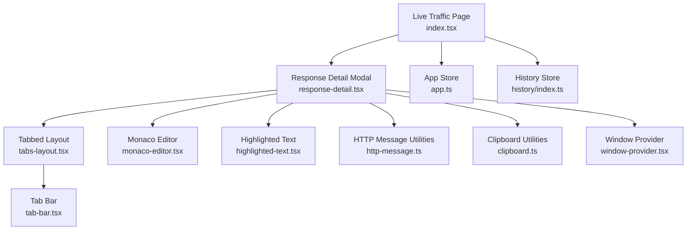
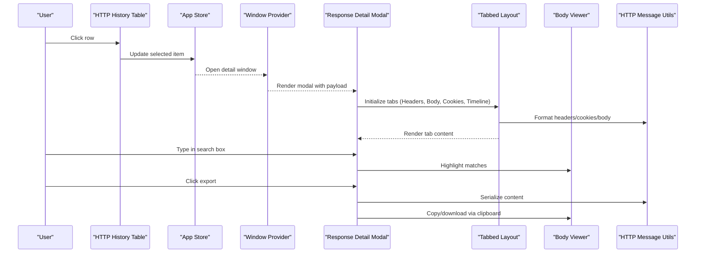
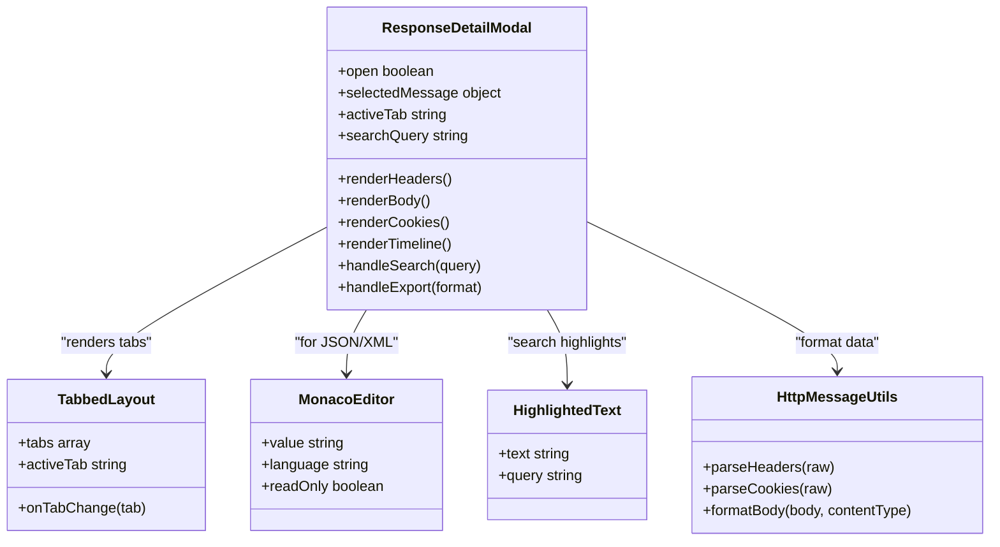
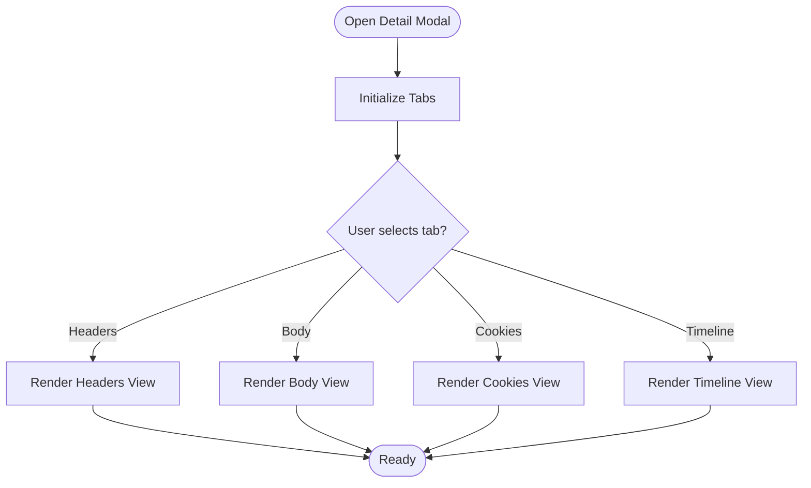
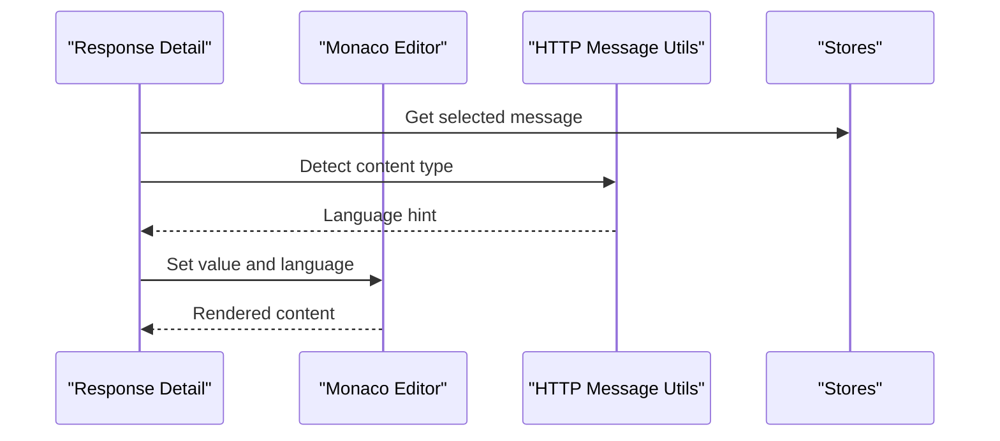
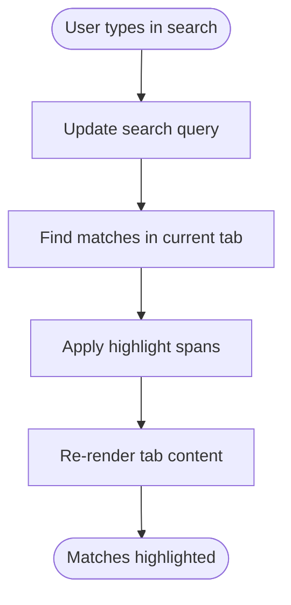
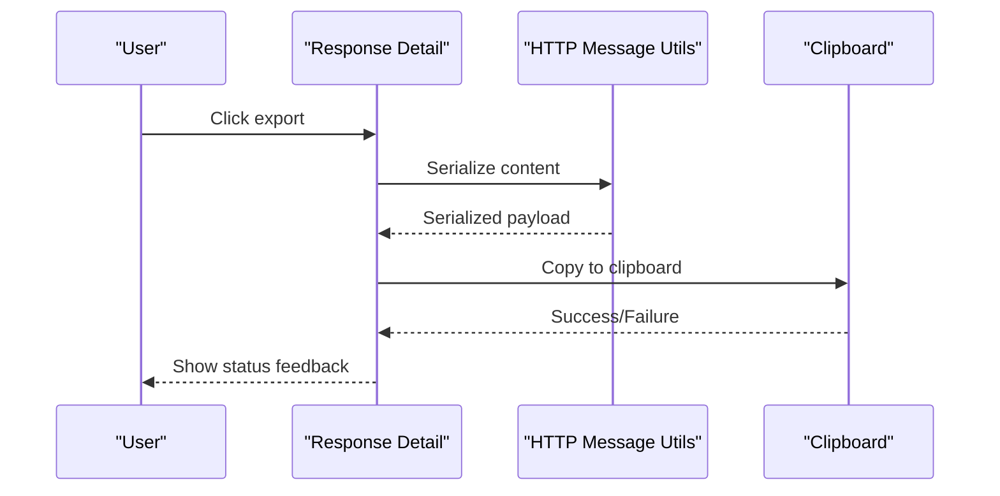
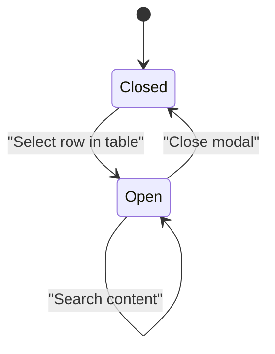
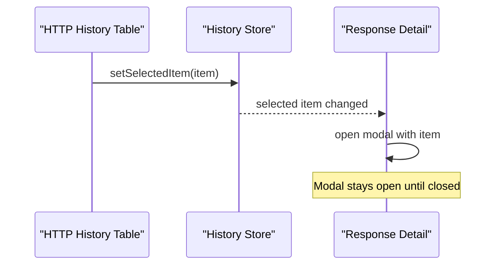
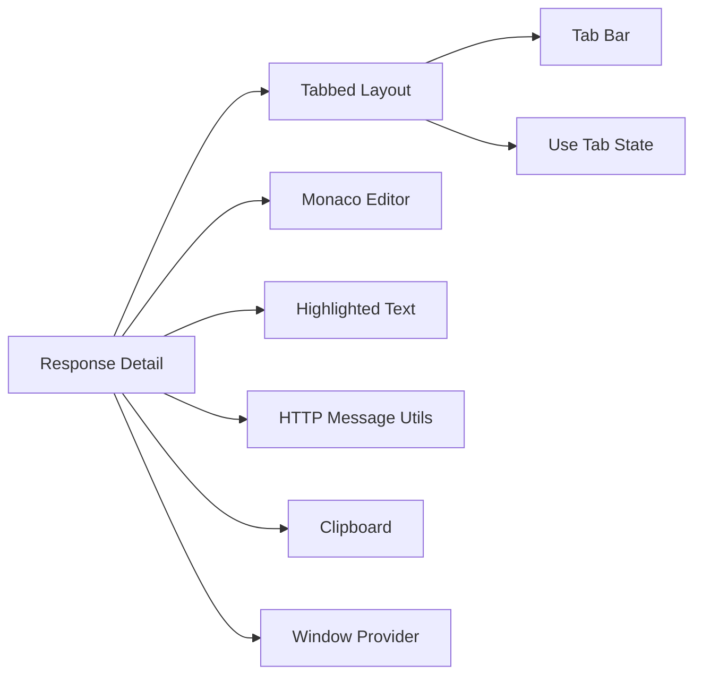

# Response Detail Window

<cite>
**Referenced Files in This Document**
- [index.tsx](file://src/pages/live-traffic/http-history/index.tsx)
- [response-detail.tsx](file://src/pages/live-traffic/http-history/components/response-detail.tsx)
- [tabs-layout.tsx](file://src/components/tabs-layout/tabbed-page-layout.tsx)
- [tab-bar.tsx](file://src/components/tabs-layout/tab-bar.tsx)
- [use-tab-state.ts](file://src/components/tabs-layout/use-tab-state.ts)
- [monaco-editor.tsx](file://src/components/ui/monaco-editor.tsx)
- [highlighted-text.tsx](file://src/components/highlighted-text.tsx)
- [http-message.ts](file://src/lib/http-message.ts)
- [clipboard.ts](file://src/lib/clipboard.ts)
- [window-provider.tsx](file://src/providers/window-provider.tsx)
- [app.ts](file://src/stores/app.ts)
- [history-index.ts](file://src/stores/history/index.ts)
</cite>

## Table of Contents
1. [Introduction](#introduction)
2. [Project Structure](#project-structure)
3. [Core Components](#core-components)
4. [Architecture Overview](#architecture-overview)
5. [Detailed Component Analysis](#detailed-component-analysis)
6. [Dependency Analysis](#dependency-analysis)
7. [Performance Considerations](#performance-considerations)
8. [Troubleshooting Guide](#troubleshooting-guide)
9. [Conclusion](#conclusion)
10. [Appendices](#appendices)

## Introduction
This document explains the Response Detail Window component that provides an expanded, tabbed view of HTTP request/response data. It covers how the detail window is opened and managed, how tabs are organized (headers, body, cookies, timeline), syntax highlighting for JSON/XML, search within responses, export capabilities, and integration with the main table selection state. It also includes guidance on customizing the layout and adding specialized tabs.

## Project Structure
The response detail functionality lives under the live traffic module and reuses shared UI primitives:
- Live traffic page coordinates history selection and opens the detail modal
- The detail component renders a tabbed interface with content panels
- Shared components provide tabs, editor, text highlighting, clipboard utilities, and window management

**Diagram sources**
- [index.tsx](file://src/pages/live-traffic/http-history/index.tsx)
- [response-detail.tsx](file://src/pages/live-traffic/http-history/components/response-detail.tsx)
- [tabs-layout.tsx](file://src/components/tabs-layout/tabbed-page-layout.tsx)
- [tab-bar.tsx](file://src/components/tabs-layout/tab-bar.tsx)
- [monaco-editor.tsx](file://src/components/ui/monaco-editor.tsx)
- [highlighted-text.tsx](file://src/components/highlighted-text.tsx)
- [http-message.ts](file://src/lib/http-message.ts)
- [clipboard.ts](file://src/lib/clipboard.ts)
- [window-provider.tsx](file://src/providers/window-provider.tsx)
- [app.ts](file://src/stores/app.ts)
- [history-index.ts](file://src/stores/history/index.ts)

**Section sources**
- [index.tsx](file://src/pages/live-traffic/http-history/index.tsx)
- [response-detail.tsx](file://src/pages/live-traffic/http-history/components/response-detail.tsx)
- [tabs-layout.tsx](file://src/components/tabs-layout/tabbed-page-layout.tsx)
- [tab-bar.tsx](file://src/components/tabs-layout/tab-bar.tsx)
- [monaco-editor.tsx](file://src/components/ui/monaco-editor.tsx)
- [highlighted-text.tsx](file://src/components/highlighted-text.tsx)
- [http-message.ts](file://src/lib/http-message.ts)
- [clipboard.ts](file://src/lib/clipboard.ts)
- [window-provider.tsx](file://src/providers/window-provider.tsx)
- [app.ts](file://src/stores/app.ts)
- [history-index.ts](file://src/stores/history/index.ts)

## Core Components
- Response Detail Modal: Opens when a row is selected from the HTTP history table; displays tabs for headers, body, cookies, and timeline; supports search and export.
- Tabbed Layout: Manages active tab state and renders tab content panes.
- Monaco Editor: Provides syntax-highlighted editing/viewing for JSON/XML bodies.
- Highlighted Text: Highlights search matches within textual content.
- HTTP Message Utilities: Parse and format headers, cookies, and bodies.
- Clipboard Utilities: Copy formatted content to system clipboard.
- Window Provider: Controls modal visibility and lifecycle.
- Stores: Maintain selected item and application state.

Key responsibilities:
- Selection synchronization between table and detail modal
- Tab navigation and persistence
- Content formatting and syntax highlighting
- Search with match highlighting
- Export actions (copy or download)

**Section sources**
- [response-detail.tsx](file://src/pages/live-traffic/http-history/components/response-detail.tsx)
- [tabs-layout.tsx](file://src/components/tabs-layout/tabbed-page-layout.tsx)
- [tab-bar.tsx](file://src/components/tabs-layout/tab-bar.tsx)
- [use-tab-state.ts](file://src/components/tabs-layout/use-tab-state.ts)
- [monaco-editor.tsx](file://src/components/ui/monaco-editor.tsx)
- [highlighted-text.tsx](file://src/components/highlighted-text.tsx)
- [http-message.ts](file://src/lib/http-message.ts)
- [clipboard.ts](file://src/lib/clipboard.ts)
- [window-provider.tsx](file://src/providers/window-provider.tsx)
- [app.ts](file://src/stores/app.ts)
- [history-index.ts](file://src/stores/history/index.ts)

## Architecture Overview
The detail window is a modal overlay driven by the app’s window provider. When a user selects a row in the HTTP history table, the store updates the selected entry, and the detail modal opens with that payload. Tabs render different views of the same message using shared formatters. Search operates over rendered text nodes, while export uses clipboard helpers.

**Diagram sources**
- [index.tsx](file://src/pages/live-traffic/http-history/index.tsx)
- [response-detail.tsx](file://src/pages/live-traffic/http-history/components/response-detail.tsx)
- [tabs-layout.tsx](file://src/components/tabs-layout/tabbed-page-layout.tsx)
- [http-message.ts](file://src/lib/http-message.ts)
- [clipboard.ts](file://src/lib/clipboard.ts)
- [window-provider.tsx](file://src/providers/window-provider.tsx)
- [app.ts](file://src/stores/app.ts)

## Detailed Component Analysis

### Response Detail Modal
- Purpose: Presents an expanded view of the selected HTTP message across multiple tabs.
- Behavior:
  - Opens when a row is selected in the history table.
  - Renders tabs for Headers, Body, Cookies, and Timeline.
  - Supports searching within the current tab’s content.
  - Provides export actions such as copy to clipboard or save file.
- Integration:
  - Reads selected message from stores.
  - Uses HTTP message utilities to parse/format data.
  - Uses Monaco editor for JSON/XML bodies.
  - Uses highlighted text for search results.

**Diagram sources**
- [response-detail.tsx](file://src/pages/live-traffic/http-history/components/response-detail.tsx)
- [tabs-layout.tsx](file://src/components/tabs-layout/tabbed-page-layout.tsx)
- [monaco-editor.tsx](file://src/components/ui/monaco-editor.tsx)
- [highlighted-text.tsx](file://src/components/highlighted-text.tsx)
- [http-message.ts](file://src/lib/http-message.ts)

**Section sources**
- [response-detail.tsx](file://src/pages/live-traffic/http-history/components/response-detail.tsx)

### Tabbed Interface
- Purpose: Organizes different aspects of the HTTP message into separate tabs.
- Implementation:
  - Tab bar manages active tab state and keyboard navigation.
  - Tabbed layout renders content based on active tab.
  - Default tabs include Headers, Body, Cookies, and Timeline.
- Extensibility:
  - Add new tabs by registering a tab definition and rendering its content.
  - Use shared hooks for consistent tab behavior.

**Diagram sources**
- [tabs-layout.tsx](file://src/components/tabs-layout/tabbed-page-layout.tsx)
- [tab-bar.tsx](file://src/components/tabs-layout/tab-bar.tsx)
- [use-tab-state.ts](file://src/components/tabs-layout/use-tab-state.ts)

**Section sources**
- [tabs-layout.tsx](file://src/components/tabs-layout/tabbed-page-layout.tsx)
- [tab-bar.tsx](file://src/components/tabs-layout/tab-bar.tsx)
- [use-tab-state.ts](file://src/components/tabs-layout/use-tab-state.ts)

### Syntax Highlighting for JSON/XML
- Purpose: Provide readable, color-coded display for structured payloads.
- Implementation:
  - Uses a code editor component configured for JSON/XML languages.
  - Read-only mode ensures safe viewing without accidental edits.
  - Auto-detects language based on content type when available.

**Diagram sources**
- [monaco-editor.tsx](file://src/components/ui/monaco-editor.tsx)
- [http-message.ts](file://src/lib/http-message.ts)
- [response-detail.tsx](file://src/pages/live-traffic/http-history/components/response-detail.tsx)

**Section sources**
- [monaco-editor.tsx](file://src/components/ui/monaco-editor.tsx)
- [http-message.ts](file://src/lib/http-message.ts)

### Search Functionality Within Responses
- Purpose: Quickly locate terms in the currently visible tab content.
- Behavior:
  - Input field filters and highlights matching substrings.
  - Highlights update dynamically as the query changes.
  - Works best with plain text views; for editor-based tabs, consider overlay highlights.

**Diagram sources**
- [highlighted-text.tsx](file://src/components/highlighted-text.tsx)
- [response-detail.tsx](file://src/pages/live-traffic/http-history/components/response-detail.tsx)

**Section sources**
- [highlighted-text.tsx](file://src/components/highlighted-text.tsx)
- [response-detail.tsx](file://src/pages/live-traffic/http-history/components/response-detail.tsx)

### Export Capabilities
- Purpose: Allow users to copy or download response data for further analysis.
- Actions:
  - Copy to clipboard in various formats (raw, pretty-printed).
  - Save as file with appropriate extension based on content type.
- Implementation:
  - Uses clipboard utilities for cross-platform copy operations.
  - Serializes content using HTTP message utilities before export.

**Diagram sources**
- [clipboard.ts](file://src/lib/clipboard.ts)
- [http-message.ts](file://src/lib/http-message.ts)
- [response-detail.tsx](file://src/pages/live-traffic/http-history/components/response-detail.tsx)

**Section sources**
- [clipboard.ts](file://src/lib/clipboard.ts)
- [http-message.ts](file://src/lib/http-message.ts)
- [response-detail.tsx](file://src/pages/live-traffic/http-history/components/response-detail.tsx)

### Window Management and Modal Behavior
- Purpose: Control opening, closing, and focus behavior of the detail modal.
- Features:
  - Opens when a row is selected in the history table.
  - Closes on backdrop click, escape key, or explicit close action.
  - Maintains focus within the modal for accessibility.
- Integration:
  - Uses a window provider to manage modal state globally.
  - Syncs with app store to reflect selection state.

**Diagram sources**
- [window-provider.tsx](file://src/providers/window-provider.tsx)
- [index.tsx](file://src/pages/live-traffic/http-history/index.tsx)
- [app.ts](file://src/stores/app.ts)

**Section sources**
- [window-provider.tsx](file://src/providers/window-provider.tsx)
- [index.tsx](file://src/pages/live-traffic/http-history/index.tsx)
- [app.ts](file://src/stores/app.ts)

### Integration with Main Table Selection State
- Purpose: Keep the detail modal synchronized with the selected row in the HTTP history table.
- Mechanism:
  - Table updates selected item in the store on click.
  - Detail modal subscribes to store changes and opens accordingly.
  - Closing the modal does not clear selection unless explicitly requested.

**Diagram sources**
- [index.tsx](file://src/pages/live-traffic/http-history/index.tsx)
- [history-index.ts](file://src/stores/history/index.ts)
- [response-detail.tsx](file://src/pages/live-traffic/http-history/components/response-detail.tsx)

**Section sources**
- [index.tsx](file://src/pages/live-traffic/http-history/index.tsx)
- [history-index.ts](file://src/stores/history/index.ts)
- [response-detail.tsx](file://src/pages/live-traffic/http-history/components/response-detail.tsx)

## Dependency Analysis
The detail window depends on shared UI primitives and utility modules. Coupling is minimized through well-defined interfaces:
- Tabs rely on tab state hooks for consistency.
- Editors and text viewers are interchangeable via props.
- HTTP message utilities encapsulate parsing/formatting logic.
- Clipboard utilities abstract platform differences.

**Diagram sources**
- [response-detail.tsx](file://src/pages/live-traffic/http-history/components/response-detail.tsx)
- [tabs-layout.tsx](file://src/components/tabs-layout/tabbed-page-layout.tsx)
- [tab-bar.tsx](file://src/components/tabs-layout/tab-bar.tsx)
- [use-tab-state.ts](file://src/components/tabs-layout/use-tab-state.ts)
- [monaco-editor.tsx](file://src/components/ui/monaco-editor.tsx)
- [highlighted-text.tsx](file://src/components/highlighted-text.tsx)
- [http-message.ts](file://src/lib/http-message.ts)
- [clipboard.ts](file://src/lib/clipboard.ts)
- [window-provider.tsx](file://src/providers/window-provider.tsx)

**Section sources**
- [response-detail.tsx](file://src/pages/live-traffic/http-history/components/response-detail.tsx)
- [tabs-layout.tsx](file://src/components/tabs-layout/tabbed-page-layout.tsx)
- [tab-bar.tsx](file://src/components/tabs-layout/tab-bar.tsx)
- [use-tab-state.ts](file://src/components/tabs-layout/use-tab-state.ts)
- [monaco-editor.tsx](file://src/components/ui/monaco-editor.tsx)
- [highlighted-text.tsx](file://src/components/highlighted-text.tsx)
- [http-message.ts](file://src/lib/http-message.ts)
- [clipboard.ts](file://src/lib/clipboard.ts)
- [window-provider.tsx](file://src/providers/window-provider.tsx)

## Performance Considerations
- Large payloads: Prefer lazy loading and virtualization for long bodies; avoid rendering entire payloads at once.
- Syntax highlighting: Limit re-renders by memoizing editor content and only updating on value changes.
- Search performance: Debounce search input and scope highlighting to the active tab only.
- Memory usage: Clear temporary buffers after export and avoid retaining large strings unnecessarily.
- Accessibility: Ensure keyboard navigation and focus management remain responsive even with heavy content.

[No sources needed since this section provides general guidance]

## Troubleshooting Guide
Common issues and resolutions:
- Modal does not open: Verify selection state is updated in the store and window provider is invoked.
- Empty body view: Check content-type detection and ensure formatter handles binary or unknown types gracefully.
- Search not highlighting: Confirm text nodes are wrapped for highlighting and query is non-empty.
- Export fails: Validate serialization output and clipboard permissions; handle errors and show feedback.
- Tab state resets unexpectedly: Ensure tab state persists within the modal lifecycle and is not cleared on re-renders.

**Section sources**
- [response-detail.tsx](file://src/pages/live-traffic/http-history/components/response-detail.tsx)
- [tabs-layout.tsx](file://src/components/tabs-layout/tabbed-page-layout.tsx)
- [highlighted-text.tsx](file://src/components/highlighted-text.tsx)
- [clipboard.ts](file://src/lib/clipboard.ts)
- [http-message.ts](file://src/lib/http-message.ts)

## Conclusion
The Response Detail Window provides a robust, extensible interface for inspecting HTTP messages. Its tabbed design, syntax highlighting, search, and export features make it suitable for deep analysis. By leveraging shared components and utilities, it remains maintainable and customizable for specialized inspection needs.

[No sources needed since this section summarizes without analyzing specific files]

## Appendices

### Customizing the Detail View Layout
- Adjust tab order by modifying the tab definitions in the tabbed layout configuration.
- Change panel sizes using resizable containers if supported by the layout.
- Integrate additional editors or viewers by extending the tab content renderer.

### Adding Additional Tabs for Specialized Data Inspection
- Register a new tab with a label and unique identifier.
- Implement a renderer that consumes the selected message and returns JSX.
- Optionally add actions (e.g., decode, transform) within the tab toolbar.
- Ensure search and export work consistently with the new tab’s content.

[No sources needed since this section provides general guidance]