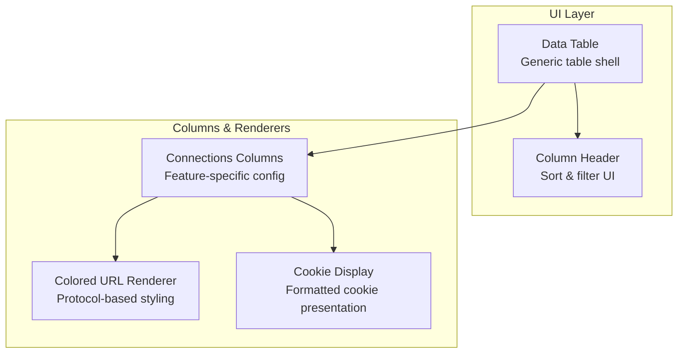
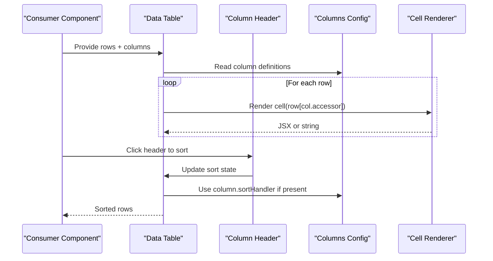
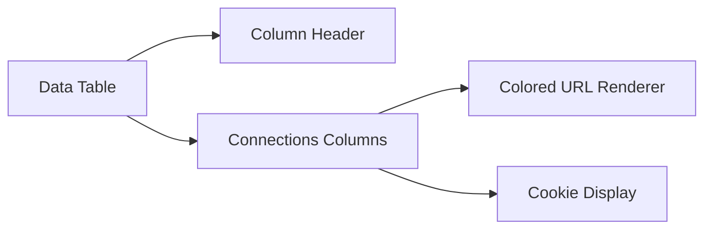

# Table Columns & Rendering

<cite>
**Referenced Files in This Document**
- [data-table.tsx](file://src/components/ui/data-table.tsx)
- [table.tsx](file://src/components/ui/table.tsx)
- [connections-columns.tsx](file://src/components/connections-columns.tsx)
- [data-table-column-header.tsx](file://src/components/data-table-column-header.tsx)
</cite>

## Table of Contents
1. [Introduction](#introduction)
2. [Project Structure](#project-structure)
3. [Core Components](#core-components)
4. [Architecture Overview](#architecture-overview)
5. [Detailed Component Analysis](#detailed-component-analysis)
6. [Dependency Analysis](#dependency-analysis)
7. [Performance Considerations](#performance-considerations)
8. [Troubleshooting Guide](#troubleshooting-guide)
9. [Conclusion](#conclusion)

## Introduction
This document explains the table columns system and custom renderers used across the application. It focuses on how column definitions are configured, how formatters and sort handlers work, and how to implement custom renderers such as a colored URL renderer and a cookie display component. You will also learn how to customize columns, add new ones, and optimize performance for complex column logic.

## Project Structure
The table columns system is implemented with a reusable data table component and a set of column-specific renderers:
- A generic data table that accepts a columns configuration and renders rows using cell renderers.
- Column header support for sorting and filtering.
- Feature-specific column sets (e.g., connections) that demonstrate conditional rendering and formatting.

**Diagram sources**
- [data-table.tsx](file://src/components/ui/data-table.tsx)
- [data-table-column-header.tsx](file://src/components/data-table-column-header.tsx)
- [connections-columns.tsx](file://src/components/connections-columns.tsx)

**Section sources**
- [data-table.tsx](file://src/components/ui/data-table.tsx)
- [table.tsx](file://src/components/ui/table.tsx)
- [data-table-column-header.tsx](file://src/components/data-table-column-header.tsx)
- [connections-columns.tsx](file://src/components/connections-columns.tsx)

## Core Components
- Data Table: A generic table component that takes a columns array and row data, then renders each cell via a renderer function or built-in formatter. It supports pagination, search, and sorting through props and callbacks.
- Column Header: Provides sortable headers with visual indicators and integrates with the table’s sorting state.
- Connections Columns: A concrete example of a feature-specific column configuration that demonstrates how to define columns, attach formatters, and implement custom renderers.

Key responsibilities:
- Columns configuration defines label, accessor, width, alignment, sortable flag, and optional formatter/renderer.
- Formatters transform raw values into display strings or simple JSX.
- Custom renderers return full JSX for complex cells (links, badges, chips, etc.).

**Section sources**
- [data-table.tsx](file://src/components/ui/data-table.tsx)
- [data-table-column-header.tsx](file://src/components/data-table-column-header.tsx)
- [connections-columns.tsx](file://src/components/connections-columns.tsx)

## Architecture Overview
The table system follows a declarative pattern:
- Consumers declare a columns array describing each column’s behavior.
- The data table iterates over rows and columns, invoking the appropriate renderer/formatter per cell.
- Sorting is handled by passing a comparator or key to the table, which delegates to the column’s sort handler if provided.

**Diagram sources**
- [data-table.tsx](file://src/components/ui/data-table.tsx)
- [data-table-column-header.tsx](file://src/components/data-table-column-header.tsx)
- [connections-columns.tsx](file://src/components/connections-columns.tsx)

## Detailed Component Analysis

### Data Table Shell
Responsibilities:
- Accepts rows, columns, and optional features like search, pagination, and sorting.
- Renders a header row using the column header component.
- Iterates rows and renders cells via a renderer lookup based on column configuration.

Important behaviors:
- If a column specifies a renderer, it is invoked; otherwise, a default formatter is used.
- Sort state is managed at the table level and delegated to column-specific comparators when available.

**Section sources**
- [data-table.tsx](file://src/components/ui/data-table.tsx)

### Column Header and Sorting
Responsibilities:
- Displays column labels and sort direction indicators.
- Emits sort events to the parent table.
- Supports ascending/descending toggling and multi-column sorting if enabled by the table.

Integration points:
- Receives sort key from the column definition.
- Updates table state via callback passed from the data table.

**Section sources**
- [data-table-column-header.tsx](file://src/components/data-table-column-header.tsx)

### Connections Columns Example
Purpose:
- Demonstrates how to define a practical set of columns for HTTP connections.
- Shows usage of formatters and custom renderers for URLs and cookies.

Highlights:
- URL column uses a renderer that applies protocol-based styling (e.g., https vs http).
- Cookie column uses a dedicated renderer to format name/value pairs and attributes.
- Additional columns may include status codes, methods, sizes, and timestamps with appropriate formatters.

Customization patterns:
- Conditional rendering based on data values (e.g., show error badge for non-2xx status).
- Reusable formatters for dates, numbers, and bytes.

**Section sources**
- [connections-columns.tsx](file://src/components/connections-columns.tsx)

### Colored URL Renderer
Behavior:
- Renders a clickable link with styling determined by the URL protocol.
- Applies distinct colors or icons for common protocols (https, http, ws, wss).
- Handles invalid or empty URLs gracefully.

Usage:
- Attach to a column’s renderer property.
- Optionally pass additional options like truncation length or tooltip content.

**Section sources**
- [connections-columns.tsx](file://src/components/connections-columns.tsx)

### Cookie Display Component
Behavior:
- Parses and formats cookie strings into a readable list.
- Highlights important attributes (secure, httponly, samesite) with badges or colors.
- Supports copying individual cookie parts or the entire formatted output.

Usage:
- Use as a column renderer for cookie fields.
- Can be extended to support filtering or searching within cookies.

**Section sources**
- [connections-columns.tsx](file://src/components/connections-columns.tsx)

### Column Customization API
How to configure a column:
- Label: Human-readable header text.
- Accessor: Key path to extract the value from each row.
- Width: Preferred width or responsive sizing hints.
- Align: Text alignment (left, center, right).
- Sortable: Enable sorting; optionally provide a comparator or sort key.
- Formatter: Transform raw value to a string or simple JSX.
- Renderer: Full JSX for complex cells; overrides formatter.

Adding a new column:
- Define a new entry in the columns array with an accessor and renderer/formatter.
- Ensure the row data contains the required field.
- Test sorting and filtering against the new accessor.

Implementing a custom formatter:
- Return a plain string or minimal JSX for lightweight formatting.
- Prefer memoization if the formatter performs expensive computations.

Implementing a custom renderer:
- Return full JSX for rich interactions (tooltips, links, badges).
- Keep renderers pure and avoid heavy computation inside render loops.

Conditional rendering examples:
- Status code coloring: Show green for success, red for errors.
- Method badges: Colorize GET, POST, PUT, DELETE differently.
- Presence checks: Hide or replace missing values with placeholders.

**Section sources**
- [connections-columns.tsx](file://src/components/connections-columns.tsx)
- [data-table.tsx](file://src/components/ui/data-table.tsx)

## Dependency Analysis
Relationships between components:
- Data Table depends on Column Header for interactive headers.
- Feature-specific column sets (like Connections Columns) depend on shared renderers (URL, Cookie).
- Renderers are decoupled and can be reused across different tables.

**Diagram sources**
- [data-table.tsx](file://src/components/ui/data-table.tsx)
- [data-table-column-header.tsx](file://src/components/data-table-column-header.tsx)
- [connections-columns.tsx](file://src/components/connections-columns.tsx)

**Section sources**
- [data-table.tsx](file://src/components/ui/data-table.tsx)
- [data-table-column-header.tsx](file://src/components/data-table-column-header.tsx)
- [connections-columns.tsx](file://src/components/connections-columns.tsx)

## Performance Considerations
Optimization techniques for complex column logic:
- Memoize renderers and formatters using stable references to avoid re-renders.
- Avoid heavy computations inside renderers; precompute derived values in selectors or hooks.
- Use virtualization for large datasets to limit DOM nodes rendered at once.
- Debounce input-heavy operations like search or live filtering.
- Prefer shallow comparisons for row objects to minimize unnecessary updates.
- Split complex renderers into smaller components to leverage React’s reconciliation.

Best practices:
- Keep renderers pure and side-effect free.
- Cache parsed data (e.g., cookie parsing) and reuse results.
- Limit re-renders by stabilizing column definitions and avoiding inline functions.

[No sources needed since this section provides general guidance]

## Troubleshooting Guide
Common issues and resolutions:
- Missing accessor: Ensure the column’s accessor matches the row data structure.
- Unstable renderer references: Hoist or memoize renderers to prevent excessive re-renders.
- Sorting not working: Verify sort keys or comparators are correctly defined in the column.
- Large dataset lag: Implement virtualization and reduce per-cell complexity.
- Formatting errors: Guard against null/undefined values and malformed inputs (e.g., invalid URLs).

Debugging tips:
- Log row samples to confirm data shape.
- Temporarily replace complex renderers with simple text to isolate performance bottlenecks.
- Use browser dev tools to profile re-renders and identify hot paths.

[No sources needed since this section provides general guidance]

## Conclusion
The table columns system provides a flexible and extensible way to define how data is displayed and interacted with. By leveraging formatters and custom renderers, you can create rich, performant, and maintainable column implementations. Follow the customization patterns outlined here to add new columns, implement conditional rendering, and optimize performance for complex scenarios.

[No sources needed since this section summarizes without analyzing specific files]