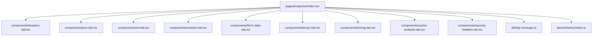
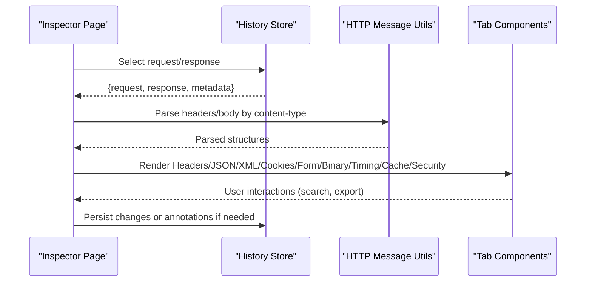
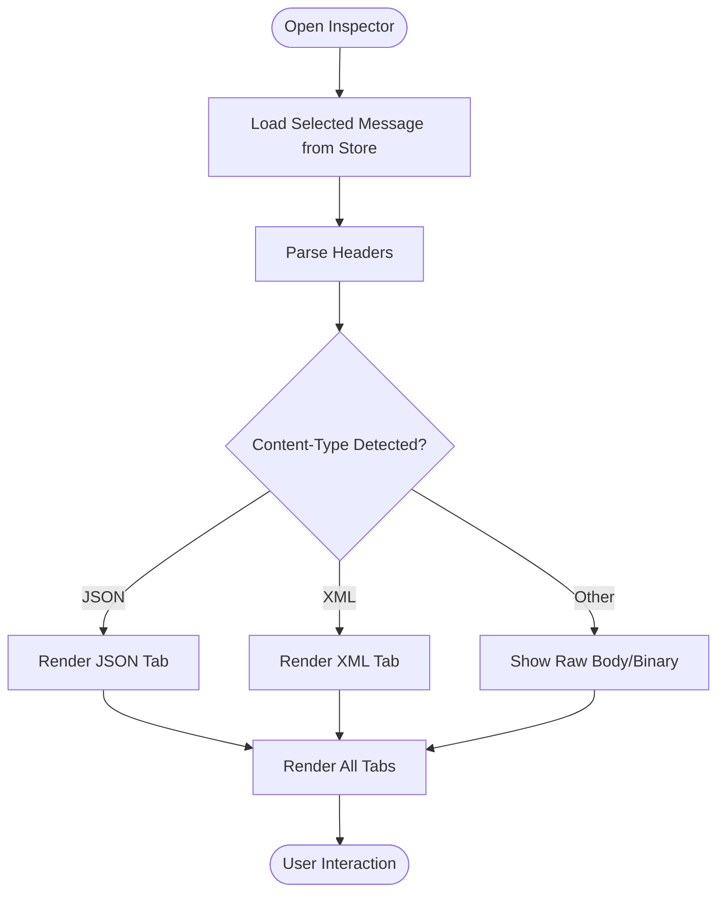
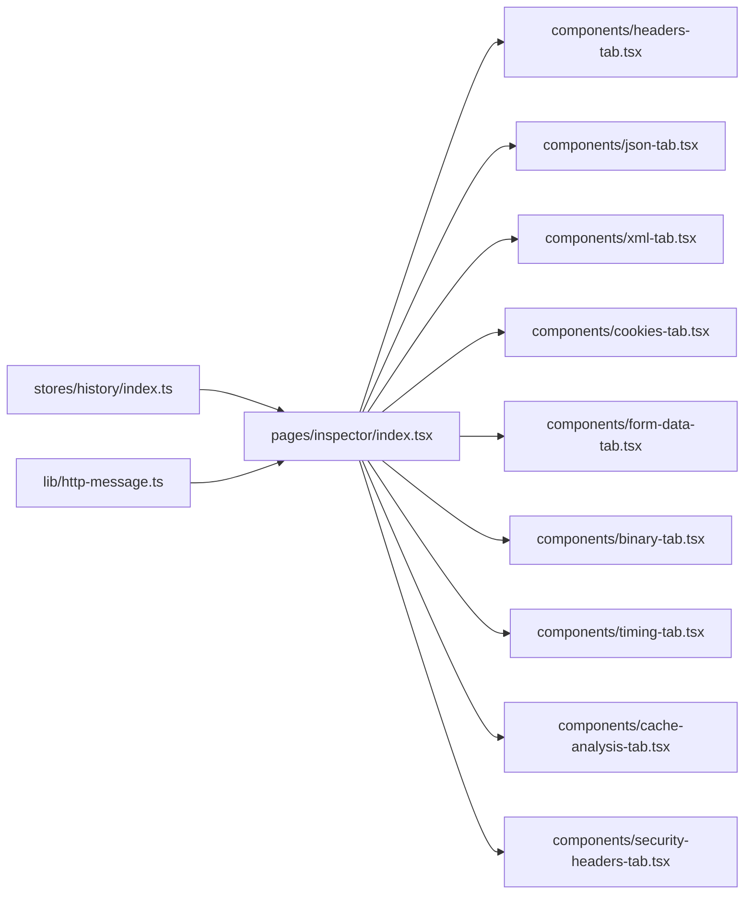

# HTTP Request/Response Inspector

<cite>
**Referenced Files in This Document**
- [index.tsx](file://src/pages/inspector/index.tsx)
- [constants.ts](file://src/pages/inspector/constants.ts)
- [types.ts](file://src/pages/inspector/types.ts)
- [api.ts](file://src/pages/inspector/api.ts)
- [components/headers-tab.tsx](file://src/pages/inspector/components/headers-tab.tsx)
- [components/json-tab.tsx](file://src/pages/inspector/components/json-tab.tsx)
- [components/xml-tab.tsx](file://src/pages/inspector/components/xml-tab.tsx)
- [components/cookies-tab.tsx](file://src/pages/inspector/components/cookies-tab.tsx)
- [components/form-data-tab.tsx](file://src/pages/inspector/components/form-data-tab.tsx)
- [components/binary-tab.tsx](file://src/pages/inspector/components/binary-tab.tsx)
- [components/timing-tab.tsx](file://src/pages/inspector/components/timing-tab.tsx)
- [components/cache-analysis-tab.tsx](file://src/pages/inspector/components/cache-analysis-tab.tsx)
- [components/security-headers-tab.tsx](file://src/pages/inspector/components/security-headers-tab.tsx)
- [lib/http-message.ts](file://src/lib/http-message.ts)
- [stores/history/index.ts](file://src/stores/history/index.ts)
</cite>

## Table of Contents
1. [Introduction](#introduction)
2. [Project Structure](#project-structure)
3. [Core Components](#core-components)
4. [Architecture Overview](#architecture-overview)
5. [Detailed Component Analysis](#detailed-component-analysis)
6. [Dependency Analysis](#dependency-analysis)
7. [Performance Considerations](#performance-considerations)
8. [Troubleshooting Guide](#troubleshooting-guide)
9. [Conclusion](#conclusion)

## Introduction
The HTTP Request/Response Inspector is a tabbed panel for deep inspection of captured HTTP requests and responses. It presents raw headers, formatted JSON/XML views, cookies, form data, and binary content. It also provides timing breakdown visualization, cache header analysis, and security-related header inspection. Users can search within content, export request/response data, and quickly identify issues such as missing security headers or suboptimal caching behavior.

## Project Structure
The inspector lives under the pages directory and is composed of:
- A page entry that wires tabs and state
- Tab components for each view (headers, JSON, XML, cookies, form data, binary, timing, cache analysis, security headers)
- Shared utilities for parsing and formatting HTTP messages
- Store integration for selected request/response data

**Diagram sources**
- [index.tsx](file://src/pages/inspector/index.tsx)
- [components/headers-tab.tsx](file://src/pages/inspector/components/headers-tab.tsx)
- [components/json-tab.tsx](file://src/pages/inspector/components/json-tab.tsx)
- [components/xml-tab.tsx](file://src/pages/inspector/components/xml-tab.tsx)
- [components/cookies-tab.tsx](file://src/pages/inspector/components/cookies-tab.tsx)
- [components/form-data-tab.tsx](file://src/pages/inspector/components/form-data-tab.tsx)
- [components/binary-tab.tsx](file://src/pages/inspector/components/binary-tab.tsx)
- [components/timing-tab.tsx](file://src/pages/inspector/components/timing-tab.tsx)
- [components/cache-analysis-tab.tsx](file://src/pages/inspector/components/cache-analysis-tab.tsx)
- [components/security-headers-tab.tsx](file://src/pages/inspector/components/security-headers-tab.tsx)
- [lib/http-message.ts](file://src/lib/http-message.ts)
- [stores/history/index.ts](file://src/stores/history/index.ts)

**Section sources**
- [index.tsx](file://src/pages/inspector/index.tsx)
- [constants.ts](file://src/pages/inspector/constants.ts)
- [types.ts](file://src/pages/inspector/types.ts)

## Core Components
- Headers Tab: Displays raw request/response headers with key-value pairs and supports searching.
- JSON Tab: Parses and pretty-prints JSON payloads with syntax highlighting and collapsible nodes.
- XML Tab: Parses and pretty-prints XML payloads with syntax highlighting and tree navigation.
- Cookies Tab: Lists cookies with attributes (name, value, domain, path, secure, httpOnly, sameSite, expiry).
- Form Data Tab: Renders multipart/form-data or application/x-www-form-urlencoded fields with values and types.
- Binary Tab: Shows binary response bodies with hex dump and size information.
- Timing Tab: Visualizes timing phases (DNS, connect, TLS handshake, TTFB, download) to diagnose latency.
- Cache Analysis Tab: Interprets cache-control, etag, last-modified, vary, and other headers to assess caching strategy.
- Security Headers Tab: Inspects security-related headers (CSP, HSTS, X-Frame-Options, etc.) and flags risks.

Key capabilities:
- Syntax highlighting for JSON/XML based on content type
- Pretty-printing with indentation controls
- Search within content with highlight and jump-to-match
- Export options for request/response payloads and headers

**Section sources**
- [components/headers-tab.tsx](file://src/pages/inspector/components/headers-tab.tsx)
- [components/json-tab.tsx](file://src/pages/inspector/components/json-tab.tsx)
- [components/xml-tab.tsx](file://src/pages/inspector/components/xml-tab.tsx)
- [components/cookies-tab.tsx](file://src/pages/inspector/components/cookies-tab.tsx)
- [components/form-data-tab.tsx](file://src/pages/inspector/components/form-data-tab.tsx)
- [components/binary-tab.tsx](file://src/pages/inspector/components/binary-tab.tsx)
- [components/timing-tab.tsx](file://src/pages/inspector/components/timing-tab.tsx)
- [components/cache-analysis-tab.tsx](file://src/pages/inspector/components/cache-analysis-tab.tsx)
- [components/security-headers-tab.tsx](file://src/pages/inspector/components/security-headers-tab.tsx)

## Architecture Overview
The inspector integrates with the application’s history store to obtain the selected HTTP message and renders it across multiple tabs. Parsing and formatting logic are centralized in shared libraries to ensure consistency.

**Diagram sources**
- [index.tsx](file://src/pages/inspector/index.tsx)
- [lib/http-message.ts](file://src/lib/http-message.ts)
- [stores/history/index.ts](file://src/stores/history/index.ts)

## Detailed Component Analysis

### Inspector Page and State Management
- Entry point coordinates tab selection and passes the selected HTTP message to child components.
- Uses constants and types to define available tabs and their labels.
- Integrates with the history store to subscribe to the currently selected request/response.

**Diagram sources**
- [index.tsx](file://src/pages/inspector/index.tsx)
- [constants.ts](file://src/pages/inspector/constants.ts)
- [types.ts](file://src/pages/inspector/types.ts)
- [lib/http-message.ts](file://src/lib/http-message.ts)

**Section sources**
- [index.tsx](file://src/pages/inspector/index.tsx)
- [constants.ts](file://src/pages/inspector/constants.ts)
- [types.ts](file://src/pages/inspector/types.ts)

### Headers Tab
- Displays all request/response headers in a searchable table.
- Highlights sensitive keys (authorization, cookies, tokens).
- Supports copying individual header values.

**Section sources**
- [components/headers-tab.tsx](file://src/pages/inspector/components/headers-tab.tsx)

### JSON Tab
- Parses JSON payloads and renders them with syntax highlighting.
- Provides pretty-printing with adjustable indentation.
- Includes search within JSON with match highlighting.

**Section sources**
- [components/json-tab.tsx](file://src/pages/inspector/components/json-tab.tsx)

### XML Tab
- Parses XML payloads and renders a tree view with syntax highlighting.
- Supports expanding/collapsing nodes and searching within XML.

**Section sources**
- [components/xml-tab.tsx](file://src/pages/inspector/components/xml-tab.tsx)

### Cookies Tab
- Lists cookies with attributes like name, value, domain, path, secure, httpOnly, sameSite, and expiry.
- Flags insecure cookies (missing Secure/HttpOnly/SameSite).

**Section sources**
- [components/cookies-tab.tsx](file://src/pages/inspector/components/cookies-tab.tsx)

### Form Data Tab
- Renders form fields for application/x-www-form-urlencoded and multipart/form-data.
- Shows field names, values, and file indicators.

**Section sources**
- [components/form-data-tab.tsx](file://src/pages/inspector/components/form-data-tab.tsx)

### Binary Tab
- Displays binary response bodies with hex dump and size metrics.
- Allows toggling between text preview and hex view when possible.

**Section sources**
- [components/binary-tab.tsx](file://src/pages/inspector/components/binary-tab.tsx)

### Timing Tab
- Visualizes timing breakdown across phases: DNS lookup, TCP connect, TLS handshake, server processing, TTFB, and download.
- Helps identify bottlenecks and slow endpoints.

**Section sources**
- [components/timing-tab.tsx](file://src/pages/inspector/components/timing-tab.tsx)

### Cache Analysis Tab
- Analyzes cache-control, etag, last-modified, vary, and related headers.
- Provides recommendations for effective caching strategies.

**Section sources**
- [components/cache-analysis-tab.tsx](file://src/pages/inspector/components/cache-analysis-tab.tsx)

### Security Headers Tab
- Inspects security-related headers such as CSP, HSTS, X-Frame-Options, X-Content-Type-Options, Referrer-Policy, Permissions-Policy.
- Flags missing or misconfigured headers and suggests improvements.

**Section sources**
- [components/security-headers-tab.tsx](file://src/pages/inspector/components/security-headers-tab.tsx)

## Dependency Analysis
The inspector depends on shared utilities for HTTP message parsing and the history store for selected data. Tabs consume parsed structures and render specialized views.

**Diagram sources**
- [stores/history/index.ts](file://src/stores/history/index.ts)
- [lib/http-message.ts](file://src/lib/http-message.ts)
- [index.tsx](file://src/pages/inspector/index.tsx)
- [components/headers-tab.tsx](file://src/pages/inspector/components/headers-tab.tsx)
- [components/json-tab.tsx](file://src/pages/inspector/components/json-tab.tsx)
- [components/xml-tab.tsx](file://src/pages/inspector/components/xml-tab.tsx)
- [components/cookies-tab.tsx](file://src/pages/inspector/components/cookies-tab.tsx)
- [components/form-data-tab.tsx](file://src/pages/inspector/components/form-data-tab.tsx)
- [components/binary-tab.tsx](file://src/pages/inspector/components/binary-tab.tsx)
- [components/timing-tab.tsx](file://src/pages/inspector/components/timing-tab.tsx)
- [components/cache-analysis-tab.tsx](file://src/pages/inspector/components/cache-analysis-tab.tsx)
- [components/security-headers-tab.tsx](file://src/pages/inspector/components/security-headers-tab.tsx)

**Section sources**
- [lib/http-message.ts](file://src/lib/http-message.ts)
- [stores/history/index.ts](file://src/stores/history/index.ts)
- [index.tsx](file://src/pages/inspector/index.tsx)

## Performance Considerations
- Large payloads: Use lazy parsing and virtualization for large JSON/XML trees to avoid UI freezes.
- Binary bodies: Limit hex dump rendering to visible ranges; paginate or chunk large binaries.
- Search performance: Debounce search input and limit matches to prevent reflows.
- Re-rendering: Memoize tab components and derived parsed structures to minimize unnecessary updates.
- Memory usage: Release parsed objects when switching between requests/responses.

[No sources needed since this section provides general guidance]

## Troubleshooting Guide
Common issues and resolutions:
- JSON parse errors: Ensure payload is valid JSON; handle malformed responses gracefully and show error hints.
- XML parse failures: Validate encoding and well-formedness; fallback to raw view when parsing fails.
- Missing headers: Verify proxy capture settings and ensure headers are not stripped.
- Timing gaps: Confirm browser/network timing APIs are enabled and not blocked by extensions.
- Cookie visibility: Check SameSite and Secure flags; some cookies may be restricted by domain/path.
- Binary display: For non-text encodings, prefer hex view; avoid forcing text decoding.

**Section sources**
- [components/json-tab.tsx](file://src/pages/inspector/components/json-tab.tsx)
- [components/xml-tab.tsx](file://src/pages/inspector/components/xml-tab.tsx)
- [components/headers-tab.tsx](file://src/pages/inspector/components/headers-tab.tsx)
- [components/timing-tab.tsx](file://src/pages/inspector/components/timing-tab.tsx)
- [components/cookies-tab.tsx](file://src/pages/inspector/components/cookies-tab.tsx)
- [components/binary-tab.tsx](file://src/pages/inspector/components/binary-tab.tsx)

## Conclusion
The HTTP Request/Response Inspector offers a comprehensive, tabbed interface for analyzing network traffic. With robust parsing, syntax highlighting, search, timing visualization, and security checks, it streamlines debugging and improves developer productivity. Export capabilities allow sharing findings and integrating with external tools.

[No sources needed since this section summarizes without analyzing specific files]