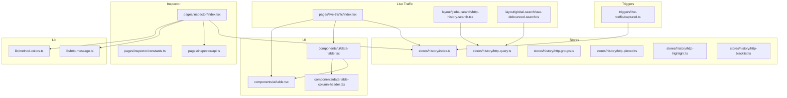
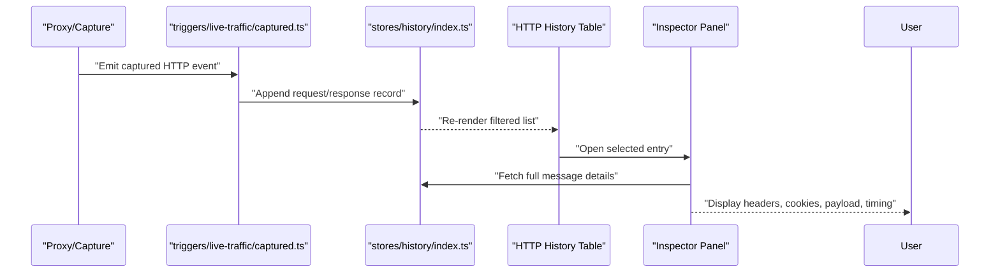
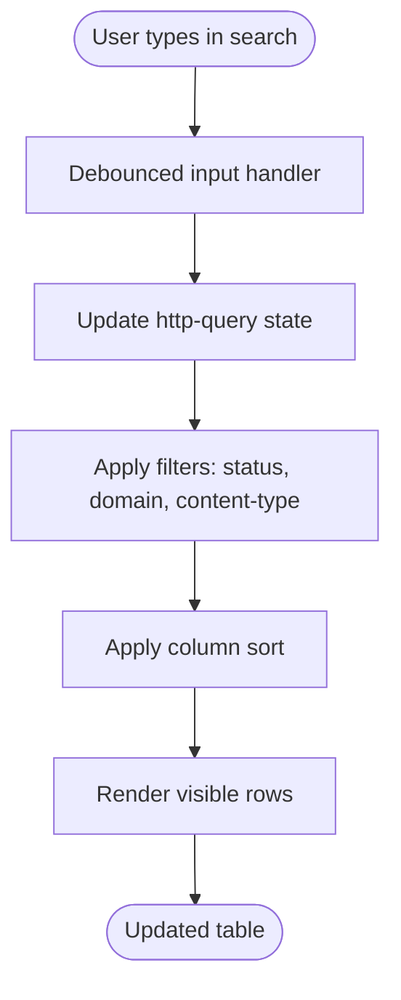
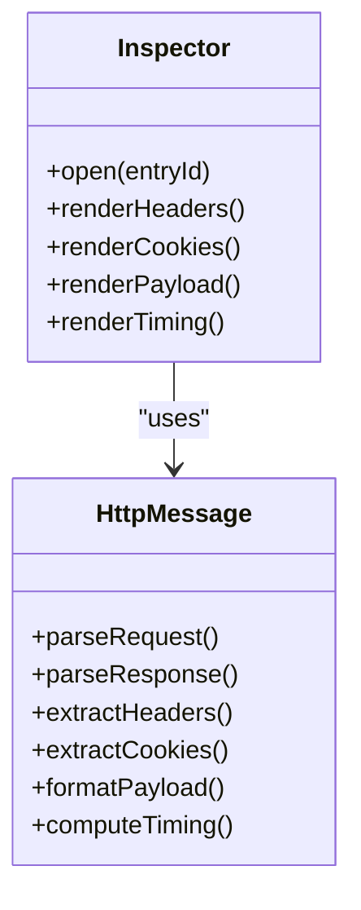
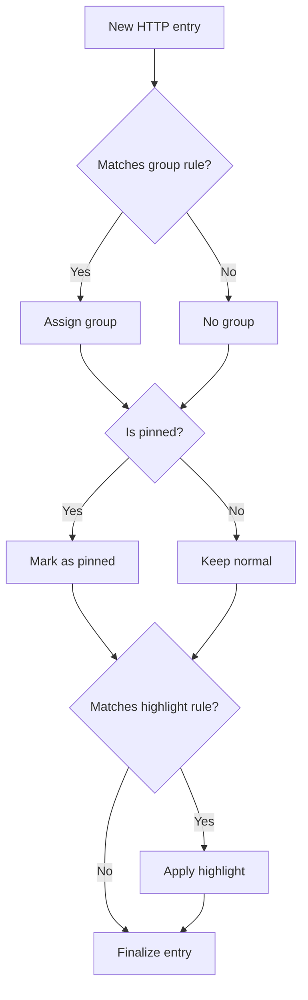
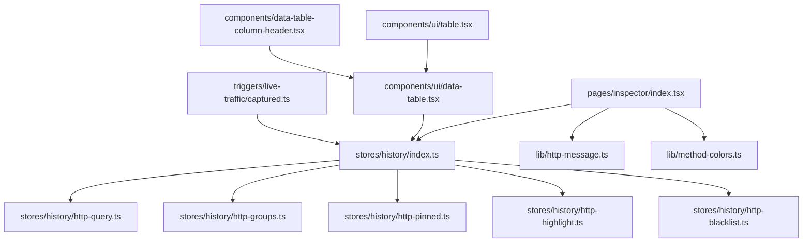

# HTTP Traffic Monitoring

<cite>
**Referenced Files in This Document**
- [index.tsx](file://src/pages/live-traffic/index.tsx)
- [http-history-search.tsx](file://src/layout/global-search/http-history-search.tsx)
- [use-debounced-search.ts](file://src/layout/global-search/use-debounced-search.ts)
- [index.ts](file://src/stores/history/index.ts)
- [http-query.ts](file://src/stores/history/http-query.ts)
- [http-groups.ts](file://src/stores/history/http-groups.ts)
- [http-pinned.ts](file://src/stores/history/http-pinned.ts)
- [http-highlight.ts](file://src/stores/history/http-highlight.ts)
- [http-blacklist.ts](file://src/stores/history/http-blacklist.ts)
- [websocket-query.ts](file://src/stores/history/websocket-query.ts)
- [captured.ts](file://src/triggers/live-traffic/captured.ts)
- [types.ts](file://src/types/index.ts)
- [constants.ts](file://src/pages/inspector/constants.ts)
- [api.ts](file://src/pages/inspector/api.ts)
- [index.tsx](file://src/pages/inspector/index.tsx)
- [http-message.ts](file://src/lib/http-message.ts)
- [method-colors.ts](file://src/lib/method-colors.ts)
- [data-table-column-header.tsx](file://src/components/data-table-column-header.tsx)
- [data-table.tsx](file://src/components/ui/data-table.tsx)
- [table.tsx](file://src/components/ui/table.tsx)
</cite>

## Table of Contents
1. [Introduction](#introduction)
2. [Project Structure](#project-structure)
3. [Core Components](#core-components)
4. [Architecture Overview](#architecture-overview)
5. [Detailed Component Analysis](#detailed-component-analysis)
6. [Dependency Analysis](#dependency-analysis)
7. [Performance Considerations](#performance-considerations)
8. [Troubleshooting Guide](#troubleshooting-guide)
9. [Conclusion](#conclusion)
10. [Appendices](#appendices)

## Introduction
This document explains Apprecon’s HTTP traffic monitoring for the live traffic viewer. It covers how HTTP requests and responses are captured, displayed in a real-time history table, filtered and searched, grouped and pinned, and inspected via the inspector panel. It also includes guidance on exporting data and optimizing performance under high-volume traffic.

## Project Structure
The HTTP traffic feature spans UI components, stores, triggers, and utilities:
- Live traffic page entry point orchestrates the HTTP history view and inspector integration.
- Global search integrates with HTTP history to filter entries across the app.
- Stores manage query state, grouping, pinning, highlighting, and blacklisting.
- Triggers receive captured HTTP events and update the store.
- Inspector provides detailed request/response inspection including headers, cookies, payload analysis, and timing.
- Utilities provide message parsing and method color mapping.

**Diagram sources**
- [index.tsx](file://src/pages/live-traffic/index.tsx)
- [http-history-search.tsx](file://src/layout/global-search/http-history-search.tsx)
- [use-debounced-search.ts](file://src/layout/global-search/use-debounced-search.ts)
- [index.ts](file://src/stores/history/index.ts)
- [http-query.ts](file://src/stores/history/http-query.ts)
- [http-groups.ts](file://src/stores/history/http-groups.ts)
- [http-pinned.ts](file://src/stores/history/http-pinned.ts)
- [http-highlight.ts](file://src/stores/history/http-highlight.ts)
- [http-blacklist.ts](file://src/stores/history/http-blacklist.ts)
- [captured.ts](file://src/triggers/live-traffic/captured.ts)
- [index.tsx](file://src/pages/inspector/index.tsx)
- [constants.ts](file://src/pages/inspector/constants.ts)
- [api.ts](file://src/pages/inspector/api.ts)
- [data-table-column-header.tsx](file://src/components/data-table-column-header.tsx)
- [data-table.tsx](file://src/components/ui/data-table.tsx)
- [table.tsx](file://src/components/ui/table.tsx)
- [http-message.ts](file://src/lib/http-message.ts)
- [method-colors.ts](file://src/lib/method-colors.ts)

**Section sources**
- [index.tsx](file://src/pages/live-traffic/index.tsx)
- [index.ts](file://src/stores/history/index.ts)
- [captured.ts](file://src/triggers/live-traffic/captured.ts)

## Core Components
- HTTP History Table: Displays captured requests/responses with columns such as method, status, domain, path, size, and time. Supports sorting by column headers and filtering by status codes, domains, and content types.
- Search: Global search integrates with HTTP history using debounced queries to reduce re-renders and improve responsiveness.
- Inspector Panel: Provides detailed inspection of selected HTTP messages, including headers, cookies, payload analysis, and timing breakdown.
- Grouping and Pinning: Group related requests (e.g., by domain or API version) and pin important entries for quick access.
- Export: Allows exporting filtered results for reporting or sharing.

Key implementation references:
- Store orchestration and state: [index.ts](file://src/stores/history/index.ts)
- Query filters and search: [http-query.ts](file://src/stores/history/http-query.ts), [http-history-search.tsx](file://src/layout/global-search/http-history-search.tsx), [use-debounced-search.ts](file://src/layout/global-search/use-debounced-search.ts)
- Grouping and pinning: [http-groups.ts](file://src/stores/history/http-groups.ts), [http-pinned.ts](file://src/stores/history/http-pinned.ts)
- Highlighting and blacklist: [http-highlight.ts](file://src/stores/history/http-highlight.ts), [http-blacklist.ts](file://src/stores/history/http-blacklist.ts)
- Inspector details: [index.tsx](file://src/pages/inspector/index.tsx), [api.ts](file://src/pages/inspector/api.ts), [constants.ts](file://src/pages/inspector/constants.ts)
- Message parsing and method colors: [http-message.ts](file://src/lib/http-message.ts), [method-colors.ts](file://src/lib/method-colors.ts)
- Table UI: [data-table.tsx](file://src/components/ui/data-table.tsx), [table.tsx](file://src/components/ui/table.tsx), [data-table-column-header.tsx](file://src/components/data-table-column-header.tsx)

**Section sources**
- [index.ts](file://src/stores/history/index.ts)
- [http-query.ts](file://src/stores/history/http-query.ts)
- [http-history-search.tsx](file://src/layout/global-search/http-history-search.tsx)
- [use-debounced-search.ts](file://src/layout/global-search/use-debounced-search.ts)
- [http-groups.ts](file://src/stores/history/http-groups.ts)
- [http-pinned.ts](file://src/stores/history/http-pinned.ts)
- [http-highlight.ts](file://src/stores/history/http-highlight.ts)
- [http-blacklist.ts](file://src/stores/history/http-blacklist.ts)
- [index.tsx](file://src/pages/inspector/index.tsx)
- [api.ts](file://src/pages/inspector/api.ts)
- [constants.ts](file://src/pages/inspector/constants.ts)
- [http-message.ts](file://src/lib/http-message.ts)
- [method-colors.ts](file://src/lib/method-colors.ts)
- [data-table.tsx](file://src/components/ui/data-table.tsx)
- [table.tsx](file://src/components/ui/table.tsx)
- [data-table-column-header.tsx](file://src/components/data-table-column-header.tsx)

## Architecture Overview
The system captures HTTP traffic through a trigger that emits captured events, updates the central history store, and renders the history table. Users interact with filters, search, grouping, and pinning. Selecting an entry opens the inspector panel for deep analysis.

**Diagram sources**
- [captured.ts](file://src/triggers/live-traffic/captured.ts)
- [index.ts](file://src/stores/history/index.ts)
- [index.tsx](file://src/pages/inspector/index.tsx)

## Detailed Component Analysis

### HTTP History Table Interface
- Real-time capture: New entries appear immediately as the store updates from captured events.
- Filtering: Status codes, domains, and content types can be combined to narrow results.
- Sorting: Column headers support ascending/descending order; multi-column sort is available where supported.
- Column customization: Columns can be toggled to show/hide fields like method, status, domain, path, size, and time.
- Search: Debounced global search reduces unnecessary re-renders while typing.

Implementation highlights:
- Table rendering and column headers: [data-table.tsx](file://src/components/ui/data-table.tsx), [data-table-column-header.tsx](file://src/components/data-table-column-header.tsx), [table.tsx](file://src/components/ui/table.tsx)
- Query state and filters: [http-query.ts](file://src/stores/history/http-query.ts)
- Debounced search hook: [use-debounced-search.ts](file://src/layout/global-search/use-debounced-search.ts)
- Global search integration: [http-history-search.tsx](file://src/layout/global-search/http-history-search.tsx)

**Diagram sources**
- [use-debounced-search.ts](file://src/layout/global-search/use-debounced-search.ts)
- [http-query.ts](file://src/stores/history/http-query.ts)
- [data-table.tsx](file://src/components/ui/data-table.tsx)

**Section sources**
- [data-table.tsx](file://src/components/ui/data-table.tsx)
- [data-table-column-header.tsx](file://src/components/data-table-column-header.tsx)
- [table.tsx](file://src/components/ui/table.tsx)
- [http-query.ts](file://src/stores/history/http-query.ts)
- [use-debounced-search.ts](file://src/layout/global-search/use-debounced-search.ts)
- [http-history-search.tsx](file://src/layout/global-search/http-history-search.tsx)

### Inspector Panel
- Headers: View request and response headers with key-value pairs.
- Cookies: Inspect cookie names, values, domains, paths, and attributes.
- Payload analysis: Parse JSON, form data, and binary payloads with formatting options.
- Timing information: Display DNS, connection, TLS handshake, server processing, and download durations.
- Navigation: Jump between request and response views and navigate related entries.

Implementation highlights:
- Inspector entry and layout: [index.tsx](file://src/pages/inspector/index.tsx)
- Constants for tabs and sections: [constants.ts](file://src/pages/inspector/constants.ts)
- API for fetching message details: [api.ts](file://src/pages/inspector/api.ts)
- Message parsing utilities: [http-message.ts](file://src/lib/http-message.ts)
- Method color mapping: [method-colors.ts](file://src/lib/method-colors.ts)

**Diagram sources**
- [index.tsx](file://src/pages/inspector/index.tsx)
- [constants.ts](file://src/pages/inspector/constants.ts)
- [api.ts](file://src/pages/inspector/api.ts)
- [http-message.ts](file://src/lib/http-message.ts)
- [method-colors.ts](file://src/lib/method-colors.ts)

**Section sources**
- [index.tsx](file://src/pages/inspector/index.tsx)
- [constants.ts](file://src/pages/inspector/constants.ts)
- [api.ts](file://src/pages/inspector/api.ts)
- [http-message.ts](file://src/lib/http-message.ts)
- [method-colors.ts](file://src/lib/method-colors.ts)

### Traffic Grouping and Pinning
- Grouping: Organize entries by domain, API version, or custom tags to simplify navigation.
- Pinning: Mark critical requests to keep them at the top or in a dedicated section.
- Highlighting: Emphasize specific entries based on patterns or rules.

Implementation highlights:
- Groups management: [http-groups.ts](file://src/stores/history/http-groups.ts)
- Pinned entries: [http-pinned.ts](file://src/stores/history/http-pinned.ts)
- Highlight rules: [http-highlight.ts](file://src/stores/history/http-highlight.ts)

**Diagram sources**
- [http-groups.ts](file://src/stores/history/http-groups.ts)
- [http-pinned.ts](file://src/stores/history/http-pinned.ts)
- [http-highlight.ts](file://src/stores/history/http-highlight.ts)

**Section sources**
- [http-groups.ts](file://src/stores/history/http-groups.ts)
- [http-pinned.ts](file://src/stores/history/http-pinned.ts)
- [http-highlight.ts](file://src/stores/history/http-highlight.ts)

### Export Capabilities
- Export filtered results to CSV or JSON for offline analysis or sharing.
- Include selected columns and metadata such as timestamps and timing.
- Batch export supports large datasets with pagination awareness.

Implementation references:
- Store orchestration for export-ready data: [index.ts](file://src/stores/history/index.ts)
- Types for structured payloads: [types.ts](file://src/types/index.ts)

**Section sources**
- [index.ts](file://src/stores/history/index.ts)
- [types.ts](file://src/types/index.ts)

## Dependency Analysis
The HTTP traffic module depends on several internal modules:
- Triggers emit captured events consumed by the history store.
- The history store coordinates query, groups, pinning, highlighting, and blacklist.
- UI components render tables and integrate with the store.
- Inspector consumes message parsing utilities and API endpoints.

**Diagram sources**
- [captured.ts](file://src/triggers/live-traffic/captured.ts)
- [index.ts](file://src/stores/history/index.ts)
- [http-query.ts](file://src/stores/history/http-query.ts)
- [http-groups.ts](file://src/stores/history/http-groups.ts)
- [http-pinned.ts](file://src/stores/history/http-pinned.ts)
- [http-highlight.ts](file://src/stores/history/http-highlight.ts)
- [http-blacklist.ts](file://src/stores/history/http-blacklist.ts)
- [data-table.tsx](file://src/components/ui/data-table.tsx)
- [data-table-column-header.tsx](file://src/components/data-table-column-header.tsx)
- [table.tsx](file://src/components/ui/table.tsx)
- [index.tsx](file://src/pages/inspector/index.tsx)
- [http-message.ts](file://src/lib/http-message.ts)
- [method-colors.ts](file://src/lib/method-colors.ts)

**Section sources**
- [captured.ts](file://src/triggers/live-traffic/captured.ts)
- [index.ts](file://src/stores/history/index.ts)
- [data-table.tsx](file://src/components/ui/data-table.tsx)
- [index.tsx](file://src/pages/inspector/index.tsx)

## Performance Considerations
- Debounced search: Reduces re-renders during rapid typing by batching updates.
- Virtualized lists: For very large histories, consider virtualization to limit DOM nodes.
- Lazy loading: Load inspector details only when needed to avoid upfront cost.
- Efficient filtering: Use indexed lookups for domain/status/content-type filters.
- Memory management: Limit retained payloads and clear old entries periodically.
- Background processing: Offload heavy parsing tasks to web workers if applicable.

[No sources needed since this section provides general guidance]

## Troubleshooting Guide
- Missing entries: Verify proxy configuration and capture permissions; ensure triggers are active.
- Slow rendering: Check filter complexity and number of visible columns; enable virtualization if necessary.
- Incorrect payload display: Confirm content-type detection and parser selection.
- Inspector not opening: Validate entry IDs and availability of message details in the store.
- Export failures: Ensure filtered dataset is accessible and serialization handles large payloads.

Common checks:
- Store state consistency: Inspect query filters and group/pin states.
- Event flow: Confirm captured events reach the store.
- Parser behavior: Validate content-type handling and payload decoding.

**Section sources**
- [index.ts](file://src/stores/history/index.ts)
- [captured.ts](file://src/triggers/live-traffic/captured.ts)
- [http-message.ts](file://src/lib/http-message.ts)

## Conclusion
Apprecon’s HTTP traffic monitoring provides a robust, real-time interface for capturing, filtering, inspecting, and exporting HTTP requests and responses. With powerful search, grouping, pinning, and inspector capabilities, it supports efficient analysis even under high traffic volumes. Applying the recommended performance techniques ensures smooth operation and scalability.

[No sources needed since this section summarizes without analyzing specific files]

## Appendices

### Common Filtering Patterns
- By status code: Filter for 4xx or 5xx errors to identify issues quickly.
- By domain: Narrow results to a specific host or subdomain.
- By content type: Focus on JSON, XML, or image responses.
- Combined filters: Use multiple criteria to isolate specific endpoints or error conditions.

[No sources needed since this section provides general guidance]

### Example Workflow
1. Start capturing traffic and observe the live history table.
2. Apply filters to focus on relevant requests.
3. Pin important entries for quick access.
4. Open the inspector to examine headers, cookies, payload, and timing.
5. Export filtered results for documentation or further analysis.

[No sources needed since this section provides general guidance]