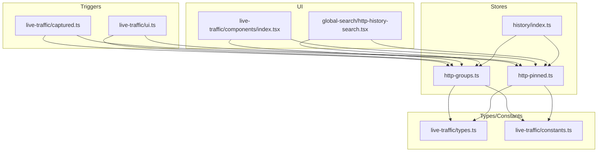
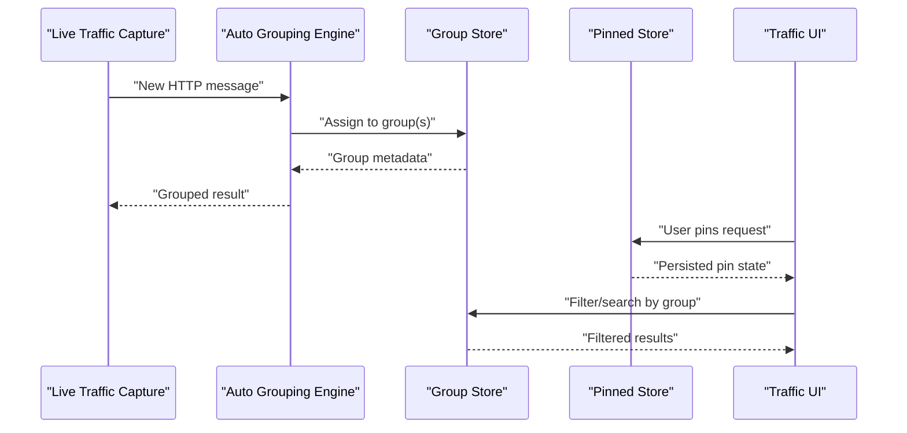
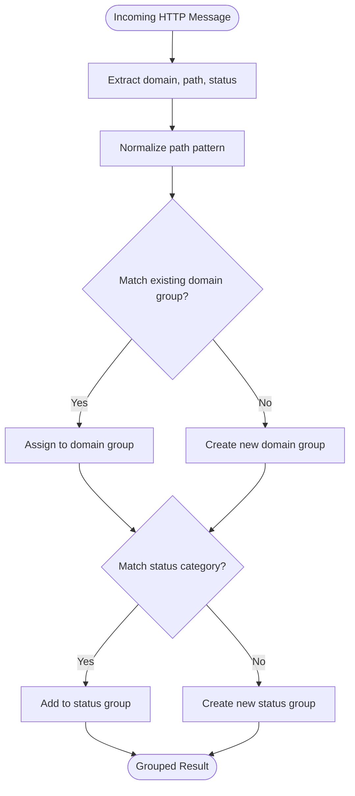
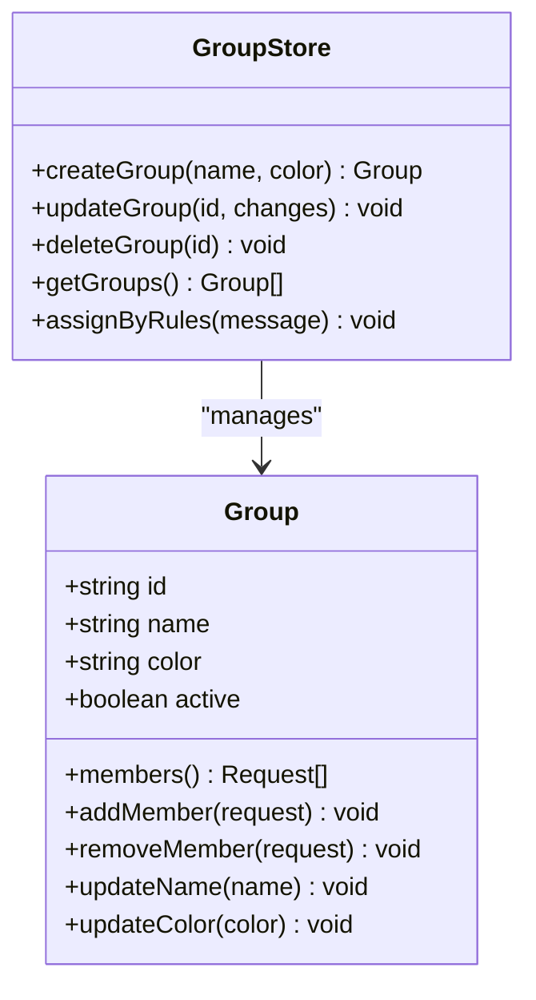
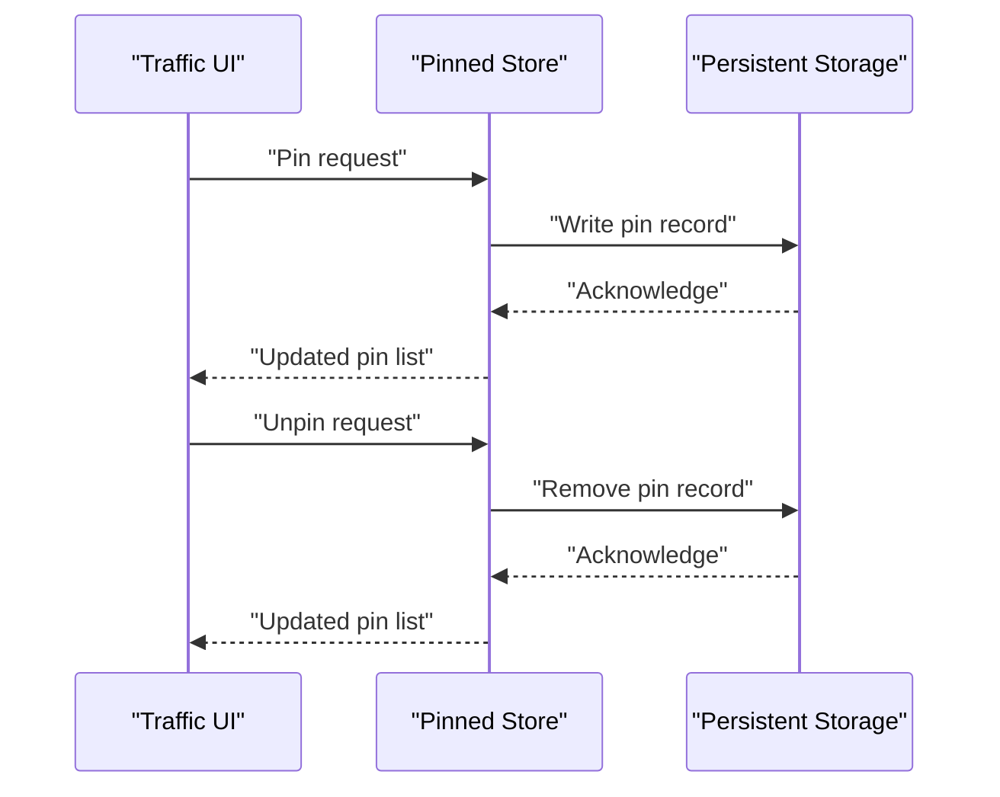
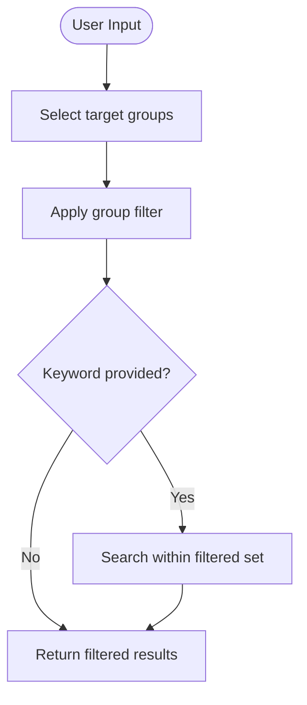
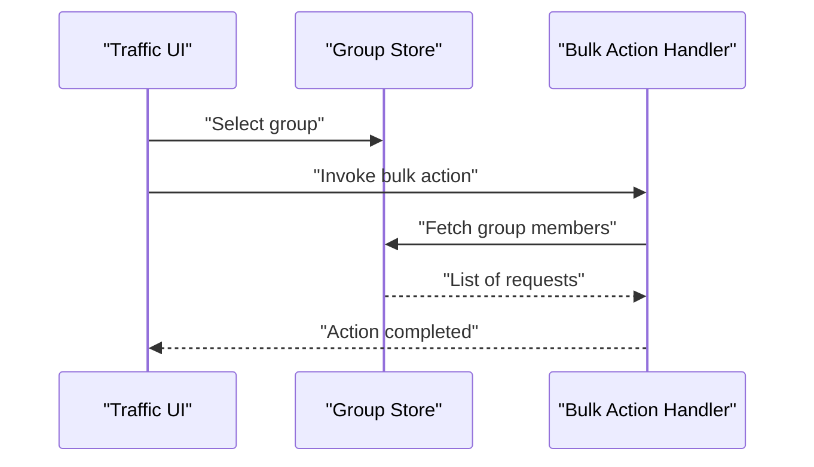
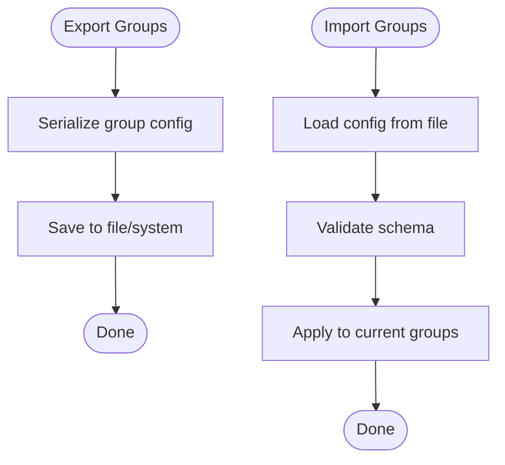
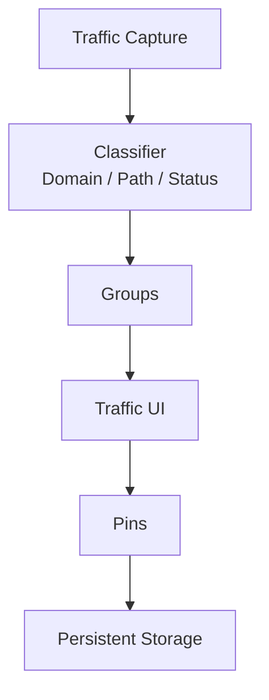
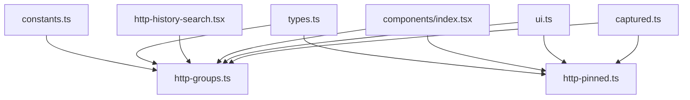

# Traffic Grouping & Pinning

<cite>
**Referenced Files in This Document**
- [http-groups.ts](file://src/stores/history/http-groups.ts)
- [http-pinned.ts](file://src/stores/history/http-pinned.ts)
- [index.ts](file://src/stores/history/index.ts)
- [live-traffic-captured.ts](file://src/triggers/live-traffic/captured.ts)
- [live-traffic-ui.ts](file://src/triggers/live-traffic/ui.ts)
- [http-history-search.tsx](file://src/layout/global-search/http-history-search.tsx)
- [constants.ts](file://src/pages/live-traffic/constants.ts)
- [types.ts](file://src/pages/live-traffic/types.ts)
- [components/index.tsx](file://src/pages/live-traffic/components/index.tsx)
- [history-store-index.ts](file://src/stores/history/index.ts)
</cite>

## Table of Contents
1. [Introduction](#introduction)
2. [Project Structure](#project-structure)
3. [Core Components](#core-components)
4. [Architecture Overview](#architecture-overview)
5. [Detailed Component Analysis](#detailed-component-analysis)
6. [Dependency Analysis](#dependency-analysis)
7. [Performance Considerations](#performance-considerations)
8. [Troubleshooting Guide](#troubleshooting-guide)
9. [Conclusion](#conclusion)
10. [Appendices](#appendices)

## Introduction
This document explains how HTTP traffic is organized through grouping and pinning features. It covers automatic grouping by domain, path patterns, and response status categories; manual group creation with custom naming and color coding; the pinning system for marking important requests across sessions with persistent storage; group-based filtering and bulk operations; and sharing group configurations. Practical workflows and best practices are included to help manage large volumes of HTTP traffic effectively.

## Project Structure
The grouping and pinning functionality spans several modules:
- Store layer for groups and pinned items
- Triggers that process captured traffic and UI events
- Pages and components that expose controls and views
- Types and constants that define data models and behavior

**Diagram sources**
- [http-groups.ts](file://src/stores/history/http-groups.ts)
- [http-pinned.ts](file://src/stores/history/http-pinned.ts)
- [index.ts](file://src/stores/history/index.ts)
- [live-traffic-captured.ts](file://src/triggers/live-traffic/captured.ts)
- [live-traffic-ui.ts](file://src/triggers/live-traffic/ui.ts)
- [components/index.tsx](file://src/pages/live-traffic/components/index.tsx)
- [http-history-search.tsx](file://src/layout/global-search/http-history-search.tsx)
- [types.ts](file://src/pages/live-traffic/types.ts)
- [constants.ts](file://src/pages/live-traffic/constants.ts)

**Section sources**
- [http-groups.ts](file://src/stores/history/http-groups.ts)
- [http-pinned.ts](file://src/stores/history/http-pinned.ts)
- [index.ts](file://src/stores/history/index.ts)
- [live-traffic-captured.ts](file://src/triggers/live-traffic/captured.ts)
- [live-traffic-ui.ts](file://src/triggers/live-traffic/ui.ts)
- [components/index.tsx](file://src/pages/live-traffic/components/index.tsx)
- [http-history-search.tsx](file://src/layout/global-search/http-history-search.tsx)
- [types.ts](file://src/pages/live-traffic/types.ts)
- [constants.ts](file://src/pages/live-traffic/constants.ts)

## Core Components
- Automatic grouping engine: Classifies incoming HTTP messages into groups based on domain, path patterns, and response status categories.
- Manual group management: Allows users to create, rename, recolor, and delete groups.
- Pinning system: Marks specific requests as pinned so they persist across sessions and appear prominently in views.
- Filtering and search: Enables filtering by group and searching within grouped results.
- Bulk operations: Supports actions applied to all members of a selected group (e.g., copy, export, delete).
- Sharing configuration: Exports and imports group definitions for collaboration or reuse.

Key responsibilities:
- http-groups.ts: Group lifecycle, rules, colors, membership updates, and persistence hooks.
- http-pinned.ts: Pin/unpin operations, persistence, and query helpers.
- live-traffic/captured.ts: Ingestion of captured traffic and auto-group assignment.
- live-traffic/ui.ts: UI-triggered group and pin operations.
- types.ts and constants.ts: Shared models and defaults for groups, statuses, and behaviors.

**Section sources**
- [http-groups.ts](file://src/stores/history/http-groups.ts)
- [http-pinned.ts](file://src/stores/history/http-pinned.ts)
- [live-traffic-captured.ts](file://src/triggers/live-traffic/captured.ts)
- [live-traffic-ui.ts](file://src/triggers/live-traffic/ui.ts)
- [types.ts](file://src/pages/live-traffic/types.ts)
- [constants.ts](file://src/pages/live-traffic/constants.ts)

## Architecture Overview
The system integrates capture triggers, stores, and UI layers to provide seamless grouping and pinning.

**Diagram sources**
- [live-traffic-captured.ts](file://src/triggers/live-traffic/captured.ts)
- [http-groups.ts](file://src/stores/history/http-groups.ts)
- [http-pinned.ts](file://src/stores/history/http-pinned.ts)
- [components/index.tsx](file://src/pages/live-traffic/components/index.tsx)

## Detailed Component Analysis

### Automatic Grouping by Domain, Path Patterns, and Status Categories
- Domain-based grouping: Requests are grouped by their host/domain to cluster related endpoints.
- Path pattern grouping: Normalizes paths (e.g., replacing IDs) to aggregate similar routes.
- Response status grouping: Categorizes by status code ranges (e.g., 2xx, 4xx, 5xx) for quick error triage.

**Diagram sources**
- [live-traffic-captured.ts](file://src/triggers/live-traffic/captured.ts)
- [http-groups.ts](file://src/stores/history/http-groups.ts)
- [constants.ts](file://src/pages/live-traffic/constants.ts)

**Section sources**
- [live-traffic-captured.ts](file://src/triggers/live-traffic/captured.ts)
- [http-groups.ts](file://src/stores/history/http-groups.ts)
- [constants.ts](file://src/pages/live-traffic/constants.ts)

### Manual Group Creation with Custom Naming and Color Coding
- Users can create groups with custom names and assign distinct colors for visual clarity.
- Groups can be edited (rename, recolor) and deleted when no longer needed.
- Membership can be updated manually to refine organization beyond automatic rules.

**Diagram sources**
- [http-groups.ts](file://src/stores/history/http-groups.ts)
- [types.ts](file://src/pages/live-traffic/types.ts)

**Section sources**
- [http-groups.ts](file://src/stores/history/http-groups.ts)
- [types.ts](file://src/pages/live-traffic/types.ts)

### Pinning System for Persistent Marking Across Sessions
- Pinning marks critical requests so they remain visible and accessible across application restarts.
- Pinned items are stored persistently and surfaced in dedicated views and filters.
- Unpinning removes the persistent marker while preserving the underlying request data.

**Diagram sources**
- [http-pinned.ts](file://src/stores/history/http-pinned.ts)
- [components/index.tsx](file://src/pages/live-traffic/components/index.tsx)

**Section sources**
- [http-pinned.ts](file://src/stores/history/http-pinned.ts)
- [components/index.tsx](file://src/pages/live-traffic/components/index.tsx)

### Group-Based Filtering and Search
- Filter traffic by selecting one or more groups to narrow down results.
- Combine group filters with keyword search to locate specific requests quickly.
- Global search integrates with grouped results to improve discoverability.

**Diagram sources**
- [http-history-search.tsx](file://src/layout/global-search/http-history-search.tsx)
- [http-groups.ts](file://src/stores/history/http-groups.ts)

**Section sources**
- [http-history-search.tsx](file://src/layout/global-search/http-history-search.tsx)
- [http-groups.ts](file://src/stores/history/http-groups.ts)

### Bulk Operations on Groups
- Perform actions on all members of a selected group, such as copying payloads, exporting logs, or deleting entries.
- Bulk operations streamline repetitive tasks and reduce manual effort.

**Diagram sources**
- [http-groups.ts](file://src/stores/history/http-groups.ts)
- [components/index.tsx](file://src/pages/live-traffic/components/index.tsx)

**Section sources**
- [http-groups.ts](file://src/stores/history/http-groups.ts)
- [components/index.tsx](file://src/pages/live-traffic/components/index.tsx)

### Sharing Group Configurations
- Export group definitions (names, colors, rules) for sharing with collaborators or reusing across environments.
- Import shared configurations to replicate organizational structures consistently.

**Diagram sources**
- [http-groups.ts](file://src/stores/history/http-groups.ts)
- [types.ts](file://src/pages/live-traffic/types.ts)

**Section sources**
- [http-groups.ts](file://src/stores/history/http-groups.ts)
- [types.ts](file://src/pages/live-traffic/types.ts)

### Conceptual Overview
The following conceptual diagram illustrates how traffic flows through capture, grouping, pinning, and UI presentation without mapping to specific files.

[No sources needed since this diagram shows conceptual workflow, not actual code structure]

## Dependency Analysis
The grouping and pinning features rely on clear separation between stores, triggers, and UI components.

**Diagram sources**
- [live-traffic-captured.ts](file://src/triggers/live-traffic/captured.ts)
- [live-traffic-ui.ts](file://src/triggers/live-traffic/ui.ts)
- [http-groups.ts](file://src/stores/history/http-groups.ts)
- [http-pinned.ts](file://src/stores/history/http-pinned.ts)
- [components/index.tsx](file://src/pages/live-traffic/components/index.tsx)
- [http-history-search.tsx](file://src/layout/global-search/http-history-search.tsx)
- [types.ts](file://src/pages/live-traffic/types.ts)
- [constants.ts](file://src/pages/live-traffic/constants.ts)

**Section sources**
- [live-traffic-captured.ts](file://src/triggers/live-traffic/captured.ts)
- [live-traffic-ui.ts](file://src/triggers/live-traffic/ui.ts)
- [http-groups.ts](file://src/stores/history/http-groups.ts)
- [http-pinned.ts](file://src/stores/history/http-pinned.ts)
- [components/index.tsx](file://src/pages/live-traffic/components/index.tsx)
- [http-history-search.tsx](file://src/layout/global-search/http-history-search.tsx)
- [types.ts](file://src/pages/live-traffic/types.ts)
- [constants.ts](file://src/pages/live-traffic/constants.ts)

## Performance Considerations
- Efficient normalization of path patterns reduces group explosion and improves lookup speed.
- Batch updates for bulk operations minimize store churn and UI re-renders.
- Lazy loading of group memberships helps maintain responsiveness under high traffic volume.
- Persist only essential pin records to keep storage lean and fast.

## Troubleshooting Guide
Common issues and resolutions:
- Requests not assigned to expected groups: Verify domain/path normalization rules and status categorization thresholds.
- Pins disappearing after restart: Ensure persistent storage writes succeed and permissions are correct.
- Slow filtering with many groups: Limit active filters and consider narrowing search scope before applying keywords.
- Color conflicts: Adjust group colors to ensure accessibility and distinguishability.

**Section sources**
- [http-groups.ts](file://src/stores/history/http-groups.ts)
- [http-pinned.ts](file://src/stores/history/http-pinned.ts)
- [http-history-search.tsx](file://src/layout/global-search/http-history-search.tsx)

## Conclusion
The traffic grouping and pinning system provides robust mechanisms to organize HTTP requests automatically and manually, persist important findings, and streamline analysis through filtering and bulk operations. By adopting consistent naming, thoughtful color schemes, and disciplined pinning practices, teams can efficiently manage large volumes of traffic and collaborate effectively using shared group configurations.

## Appendices
- Best practices:
  - Use descriptive group names aligned with service boundaries or feature areas.
  - Apply consistent color coding per domain or status category for quick recognition.
  - Pin only actionable or critical requests to avoid clutter.
  - Share group configurations to standardize workflows across team members.
- Example workflows:
  - Triage errors: Filter by 5xx status group, inspect top failures, pin recurring issues.
  - Feature validation: Create a feature-specific group, add relevant requests, export logs for review.
  - Collaboration: Export group definitions, import into teammates’ environments, align on naming conventions.