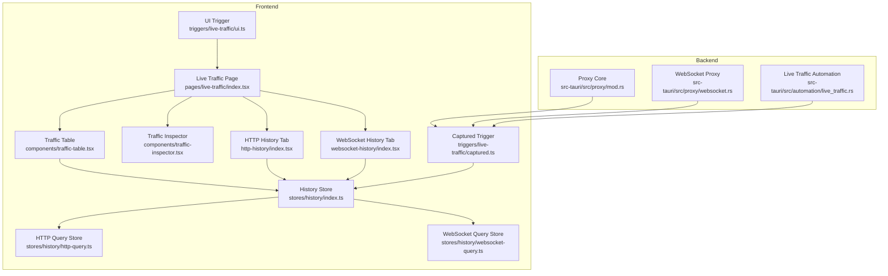
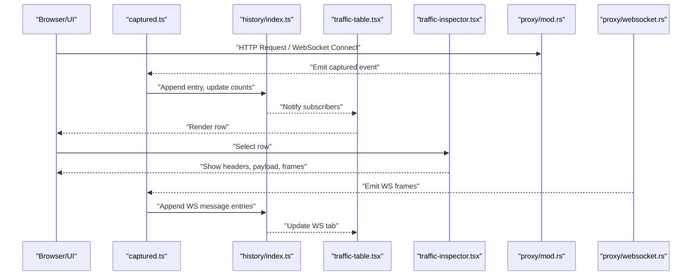
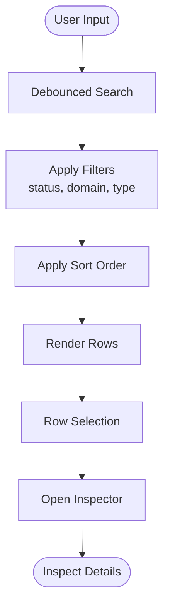
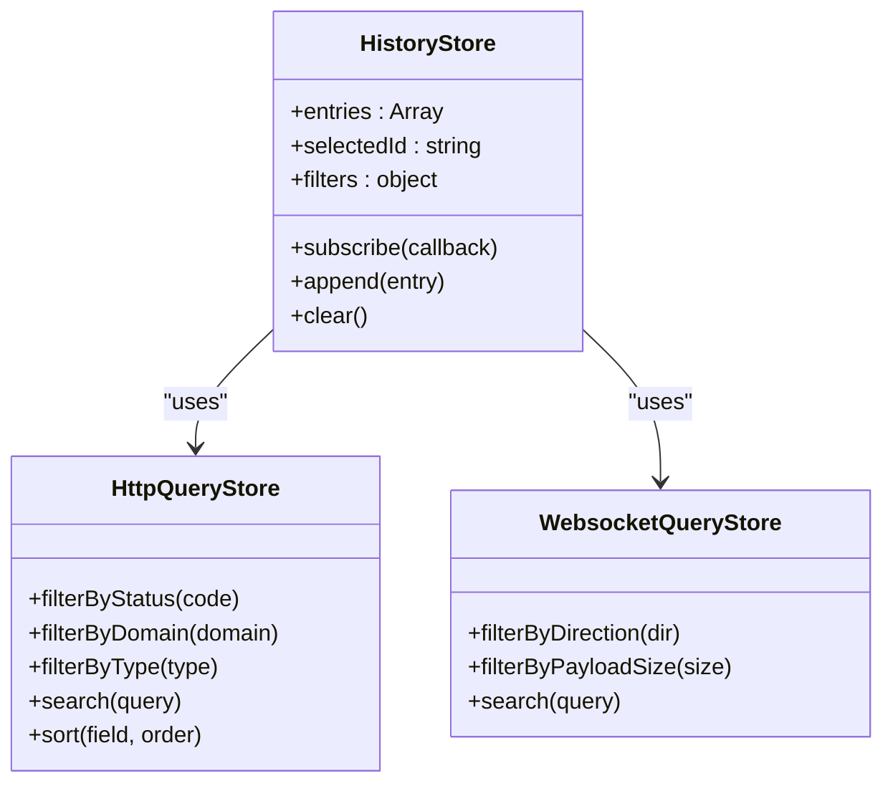
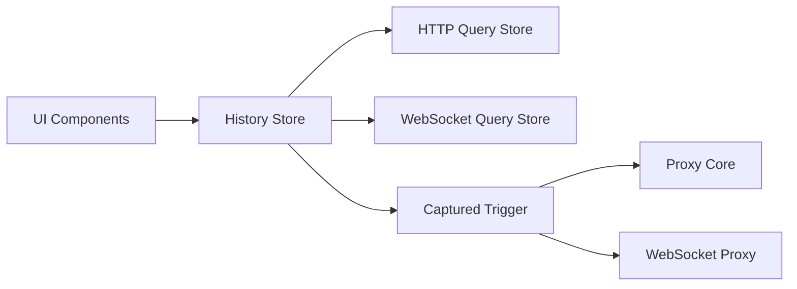

# Live Traffic Viewer

<cite>
**Referenced Files in This Document**
- [index.tsx](file://src/pages/live-traffic/index.tsx)
- [components/traffic-table.tsx](file://src/pages/live-traffic/components/traffic-table.tsx)
- [components/traffic-inspector.tsx](file://src/pages/live-traffic/components/traffic-inspector.tsx)
- [http-history/index.tsx](file://src/pages/live-traffic/http-history/index.tsx)
- [websocket-history/index.tsx](file://src/pages/live-traffic/websocket-history/index.tsx)
- [stores/history/index.ts](file://src/stores/history/index.ts)
- [stores/history/http-query.ts](file://src/stores/history/http-query.ts)
- [stores/history/websocket-query.ts](file://src/stores/history/websocket-query.ts)
- [triggers/live-traffic/captured.ts](file://src/triggers/live-traffic/captured.ts)
- [triggers/live-traffic/ui.ts](file://src/triggers/live-traffic/ui.ts)
- [lib/http-message.ts](file://src/lib/http-message.ts)
- [components/data-table-column-header.tsx](file://src/components/data-table-column-header.tsx)
- [components/status-badge.tsx](file://src/components/status-badge.tsx)
- [src-tauri/src/proxy/mod.rs](file://src-tauri/src/proxy/mod.rs)
- [src-tauri/src/proxy/websocket.rs](file://src-tauri/src/proxy/websocket.rs)
- [src-tauri/src/automation/live_traffic.rs](file://src-tauri/src/automation/live_traffic.rs)
</cite>

## Table of Contents
1. [Introduction](#introduction)
2. [Project Structure](#project-structure)
3. [Core Components](#core-components)
4. [Architecture Overview](#architecture-overview)
5. [Detailed Component Analysis](#detailed-component-analysis)
6. [Dependency Analysis](#dependency-analysis)
7. [Performance Considerations](#performance-considerations)
8. [Troubleshooting Guide](#troubleshooting-guide)
9. [Conclusion](#conclusion)

## Introduction
This document explains Apprecon’s Live Traffic Viewer, which captures and displays real-time HTTP and WebSocket traffic. It covers how connections are established, how messages stream into the UI, and how users interact with the traffic table and inspector panel. It also documents filtering, sorting, search, WebSocket frame inspection, and performance strategies for high-volume scenarios.

## Project Structure
The Live Traffic Viewer spans frontend pages, stores, triggers, and backend proxy modules:
- Frontend pages orchestrate the live view and history tabs (HTTP and WebSocket).
- Stores manage query state, filters, and persistence hooks.
- Triggers bridge captured events from the backend to the UI.
- Backend proxy modules capture HTTP and WebSocket frames and emit them to the frontend.

**Diagram sources**
- [index.tsx](file://src/pages/live-traffic/index.tsx)
- [components/traffic-table.tsx](file://src/pages/live-traffic/components/traffic-table.tsx)
- [components/traffic-inspector.tsx](file://src/pages/live-traffic/components/traffic-inspector.tsx)
- [http-history/index.tsx](file://src/pages/live-traffic/http-history/index.tsx)
- [websocket-history/index.tsx](file://src/pages/live-traffic/websocket-history/index.tsx)
- [stores/history/index.ts](file://src/stores/history/index.ts)
- [stores/history/http-query.ts](file://src/stores/history/http-query.ts)
- [stores/history/websocket-query.ts](file://src/stores/history/websocket-query.ts)
- [triggers/live-traffic/captured.ts](file://src/triggers/live-traffic/captured.ts)
- [triggers/live-traffic/ui.ts](file://src/triggers/live-traffic/ui.ts)
- [src-tauri/src/proxy/mod.rs](file://src-tauri/src/proxy/mod.rs)
- [src-tauri/src/proxy/websocket.rs](file://src-tauri/src/proxy/websocket.rs)
- [src-tauri/src/automation/live_traffic.rs](file://src-tauri/src/automation/live_traffic.rs)

**Section sources**
- [index.tsx](file://src/pages/live-traffic/index.tsx)
- [components/traffic-table.tsx](file://src/pages/live-traffic/components/traffic-table.tsx)
- [components/traffic-inspector.tsx](file://src/pages/live-traffic/components/traffic-inspector.tsx)
- [http-history/index.tsx](file://src/pages/live-traffic/http-history/index.tsx)
- [websocket-history/index.tsx](file://src/pages/live-traffic/websocket-history/index.tsx)
- [stores/history/index.ts](file://src/stores/history/index.ts)
- [stores/history/http-query.ts](file://src/stores/history/http-query.ts)
- [stores/history/websocket-query.ts](file://src/stores/history/websocket-query.ts)
- [triggers/live-traffic/captured.ts](file://src/triggers/live-traffic/captured.ts)
- [triggers/live-traffic/ui.ts](file://src/triggers/live-traffic/ui.ts)
- [src-tauri/src/proxy/mod.rs](file://src-tauri/src/proxy/mod.rs)
- [src-tauri/src/proxy/websocket.rs](file://src-tauri/src/proxy/websocket.rs)
- [src-tauri/src/automation/live_traffic.rs](file://src-tauri/src/automation/live_traffic.rs)

## Core Components
- Live Traffic Page: Orchestrates tabs for HTTP and WebSocket history, manages selection state, and renders the traffic table and inspector panels.
- Traffic Table: Displays a virtualized or paginated list of captured requests/messages with columns for method, URL, status, size, and timing. Supports filtering, sorting, and search.
- Traffic Inspector: Shows detailed request/response headers, cookies, payload previews, and WebSocket message frames. Provides tabs and panes for structured inspection.
- History Stores: Centralize query parameters, filters, and persisted selections across tabs.
- Captured Trigger: Receives backend events and updates store state efficiently.
- UI Trigger: Bridges user actions (e.g., clear, export, pin) back to backend services.

**Section sources**
- [index.tsx](file://src/pages/live-traffic/index.tsx)
- [components/traffic-table.tsx](file://src/pages/live-traffic/components/traffic-table.tsx)
- [components/traffic-inspector.tsx](file://src/pages/live-traffic/components/traffic-inspector.tsx)
- [stores/history/index.ts](file://src/stores/history/index.ts)
- [triggers/live-traffic/captured.ts](file://src/triggers/live-traffic/captured.ts)
- [triggers/live-traffic/ui.ts](file://src/triggers/live-traffic/ui.ts)

## Architecture Overview
Real-time traffic flows from the backend proxy through triggers into the frontend stores and UI components. The architecture separates concerns between capture, state management, and presentation.

**Diagram sources**
- [triggers/live-traffic/captured.ts](file://src/triggers/live-traffic/captured.ts)
- [stores/history/index.ts](file://src/stores/history/index.ts)
- [components/traffic-table.tsx](file://src/pages/live-traffic/components/traffic-table.tsx)
- [components/traffic-inspector.tsx](file://src/pages/live-traffic/components/traffic-inspector.tsx)
- [src-tauri/src/proxy/mod.rs](file://src-tauri/src/proxy/mod.rs)
- [src-tauri/src/proxy/websocket.rs](file://src-tauri/src/proxy/websocket.rs)

## Detailed Component Analysis

### Live Traffic Page
- Responsibilities:
  - Manage tab state (HTTP vs WebSocket).
  - Render the traffic table and inspector side-by-side.
  - Wire up global actions like clear, export, and pinning.
- Data flow:
  - Subscribes to history store for live updates.
  - Passes selected item to inspector for details.

**Section sources**
- [index.tsx](file://src/pages/live-traffic/index.tsx)

### Traffic Table
- Features:
  - Columns: method, domain/path, status, type, size, time.
  - Filtering by status codes, domains, content types, and text search.
  - Sorting by time, size, status, and method.
  - Pagination/virtualization for large datasets.
- Implementation highlights:
  - Uses a shared data table component with custom column headers.
  - Integrates status badges for visual cues.
  - Debounced search input to reduce re-renders.

**Diagram sources**
- [components/traffic-table.tsx](file://src/pages/live-traffic/components/traffic-table.tsx)
- [components/data-table-column-header.tsx](file://src/components/data-table-column-header.tsx)
- [components/status-badge.tsx](file://src/components/status-badge.tsx)

**Section sources**
- [components/traffic-table.tsx](file://src/pages/live-traffic/components/traffic-table.tsx)
- [components/data-table-column-header.tsx](file://src/components/data-table-column-header.tsx)
- [components/status-badge.tsx](file://src/components/status-badge.tsx)

### Traffic Inspector
- Capabilities:
  - Request/Response tabs with headers, cookies, and body preview.
  - Content-type aware rendering (JSON, HTML, images).
  - WebSocket tab showing frames with direction, timestamp, and payload.
- Interaction:
  - Copy headers/payloads.
  - Expand/collapse sections.
  - Jump to related entries (e.g., follow redirects).

**Section sources**
- [components/traffic-inspector.tsx](file://src/pages/live-traffic/components/traffic-inspector.tsx)

### HTTP History Tab
- Purpose: Dedicated view for HTTP traffic with advanced filtering and export options.
- Behavior:
  - Syncs with global filters and search.
  - Supports grouping by domain or status category.

**Section sources**
- [http-history/index.tsx](file://src/pages/live-traffic/http-history/index.tsx)

### WebSocket History Tab
- Purpose: Real-time WebSocket message log with frame-level detail.
- Behavior:
  - Streams incoming/outgoing frames.
  - Highlights errors and connection lifecycle events.

**Section sources**
- [websocket-history/index.tsx](file://src/pages/live-traffic/websocket-history/index.tsx)

### History Stores
- Responsibilities:
  - Maintain lists of HTTP and WebSocket entries.
  - Apply query filters and pagination.
  - Persist pinned items and highlight rules.
- Key modules:
  - Main store for state and subscriptions.
  - HTTP query store for filter/sort logic.
  - WebSocket query store for frame filtering.

**Diagram sources**
- [stores/history/index.ts](file://src/stores/history/index.ts)
- [stores/history/http-query.ts](file://src/stores/history/http-query.ts)
- [stores/history/websocket-query.ts](file://src/stores/history/websocket-query.ts)

**Section sources**
- [stores/history/index.ts](file://src/stores/history/index.ts)
- [stores/history/http-query.ts](file://src/stores/history/http-query.ts)
- [stores/history/websocket-query.ts](file://src/stores/history/websocket-query.ts)

### Captured Trigger
- Role: Listens to backend-captured events and updates the store without blocking the UI.
- Strategy: Batches updates and coalesces rapid emissions to avoid excessive re-renders.

**Section sources**
- [triggers/live-traffic/captured.ts](file://src/triggers/live-traffic/captured.ts)

### UI Trigger
- Role: Handles user-initiated actions such as clearing history, exporting logs, and toggling pins.
- Integration: Calls backend commands via Tauri APIs and reflects changes in the store.

**Section sources**
- [triggers/live-traffic/ui.ts](file://src/triggers/live-traffic/ui.ts)

### Backend Proxy Modules
- Proxy Core: Intercepts HTTP requests/responses and emits capture events.
- WebSocket Proxy: Captures connect frames, messages, and close events.
- Live Traffic Automation: Coordinates capture settings and routing to triggers.

**Section sources**
- [src-tauri/src/proxy/mod.rs](file://src-tauri/src/proxy/mod.rs)
- [src-tauri/src/proxy/websocket.rs](file://src-tauri/src/proxy/websocket.rs)
- [src-tauri/src/automation/live_traffic.rs](file://src-tauri/src/automation/live_traffic.rs)

## Dependency Analysis
The Live Traffic Viewer depends on shared UI primitives, stores, and backend proxies. Coupling is minimized through trigger-based messaging and store abstractions.

**Diagram sources**
- [components/traffic-table.tsx](file://src/pages/live-traffic/components/traffic-table.tsx)
- [components/traffic-inspector.tsx](file://src/pages/live-traffic/components/traffic-inspector.tsx)
- [stores/history/index.ts](file://src/stores/history/index.ts)
- [stores/history/http-query.ts](file://src/stores/history/http-query.ts)
- [stores/history/websocket-query.ts](file://src/stores/history/websocket-query.ts)
- [triggers/live-traffic/captured.ts](file://src/triggers/live-traffic/captured.ts)
- [src-tauri/src/proxy/mod.rs](file://src-tauri/src/proxy/mod.rs)
- [src-tauri/src/proxy/websocket.rs](file://src-tauri/src/proxy/websocket.rs)

**Section sources**
- [stores/history/index.ts](file://src/stores/history/index.ts)
- [stores/history/http-query.ts](file://src/stores/history/http-query.ts)
- [stores/history/websocket-query.ts](file://src/stores/history/websocket-query.ts)
- [triggers/live-traffic/captured.ts](file://src/triggers/live-traffic/captured.ts)
- [src-tauri/src/proxy/mod.rs](file://src-tauri/src/proxy/mod.rs)
- [src-tauri/src/proxy/websocket.rs](file://src-tauri/src/proxy/websocket.rs)

## Performance Considerations
- High-volume traffic handling:
  - Use virtualized lists or windowed rendering to limit DOM nodes.
  - Debounce search and filter inputs to reduce recomputation.
  - Batch store updates and throttle trigger emissions.
- Memory management:
  - Limit retained payload sizes; store references for large bodies when needed.
  - Implement ring buffers or eviction policies for long-running sessions.
  - Clear non-pinned entries after configurable retention windows.
- Rendering optimization:
  - Memoize expensive computations (e.g., payload parsing).
  - Lazy-load heavy inspectors only when rows are selected.
- Backend efficiency:
  - Avoid serializing full binary payloads unless requested.
  - Stream WebSocket frames incrementally and coalesce bursts.

[No sources needed since this section provides general guidance]

## Troubleshooting Guide
- No traffic appears:
  - Verify proxy is running and certificates are installed.
  - Check that triggers are subscribed and not blocked by filters.
- WebSocket frames missing:
  - Ensure WebSocket proxy is enabled and target URLs match scope.
  - Inspect connection lifecycle events for early closures.
- Slow UI under load:
  - Reduce payload preview size or disable auto-parse for large responses.
  - Increase debounce delay for search/filter operations.
- Export failures:
  - Confirm file permissions and available disk space.
  - Validate JSON formatting before export.

**Section sources**
- [triggers/live-traffic/captured.ts](file://src/triggers/live-traffic/captured.ts)
- [src-tauri/src/proxy/mod.rs](file://src-tauri/src/proxy/mod.rs)
- [src-tauri/src/proxy/websocket.rs](file://src-tauri/src/proxy/websocket.rs)

## Conclusion
Apprecon’s Live Traffic Viewer provides a robust, real-time interface for inspecting HTTP and WebSocket traffic. Its modular design separates capture, state, and presentation, enabling scalable performance and extensible features. By leveraging efficient stores, debounced interactions, and targeted backend streaming, it supports both casual debugging and high-throughput analysis workflows.

[No sources needed since this section summarizes without analyzing specific files]