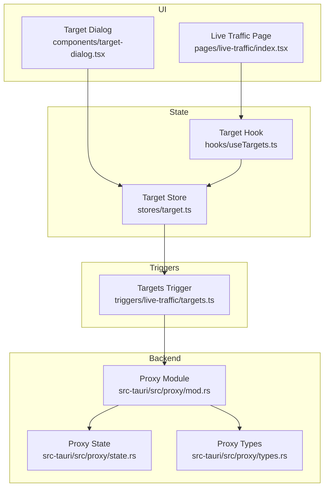
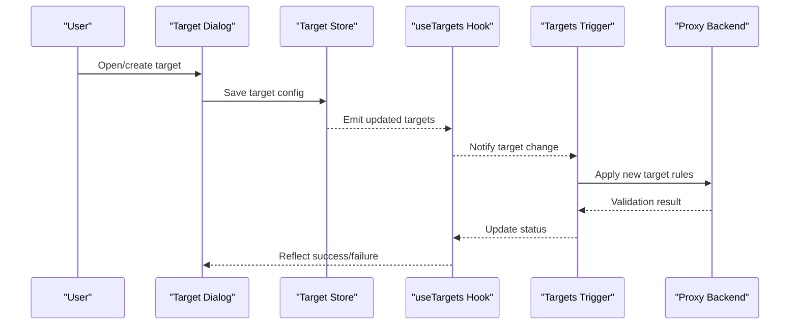
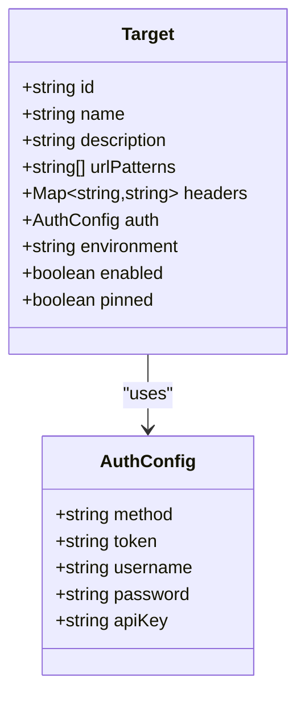
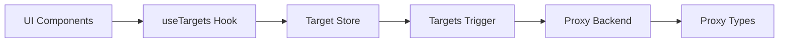

# Target Management

<cite>
**Referenced Files in This Document**
- [target.ts](file://src/stores/target.ts)
- [useTargets.ts](file://src/hooks/useTargets.ts)
- [target-dialog.tsx](file://src/components/target-dialog.tsx)
- [index.tsx](file://src/pages/live-traffic/index.tsx)
- [targets.ts](file://src/triggers/live-traffic/targets.ts)
- [types.ts](file://src/types/index.ts)
- [proxy.ts](file://src-tauri/src/proxy/mod.rs)
- [state.rs](file://src-tauri/src/proxy/state.rs)
- [types.rs](file://src-tauri/src/proxy/types.rs)
</cite>

## Table of Contents
1. [Introduction](#introduction)
2. [Project Structure](#project-structure)
3. [Core Components](#core-components)
4. [Architecture Overview](#architecture-overview)
5. [Detailed Component Analysis](#detailed-component-analysis)
6. [Dependency Analysis](#dependency-analysis)
7. [Performance Considerations](#performance-considerations)
8. [Troubleshooting Guide](#troubleshooting-guide)
9. [Conclusion](#conclusion)
10. [Appendices](#appendices)

## Introduction
This document explains the target management system used to configure which traffic Apprecon monitors. It covers how targets are created and edited, configuration options such as URL patterns, headers, and authentication, the target selector interface with search, filtering, and quick access, validation and connection testing, and troubleshooting connectivity issues. It also provides examples for setting up targets across development, staging, and production environments and managing multiple concurrent targets.

## Project Structure
The target management spans UI components, state stores, hooks, triggers, and backend proxy integration:
- UI layer: dialog for creating/editing targets and the live traffic page that lists and selects targets
- State layer: store and hook for managing target definitions and selection
- Triggers: event-driven wiring for target changes affecting live traffic behavior
- Backend: Tauri proxy module handling connection tests and runtime target application

**Diagram sources**
- [target-dialog.tsx](file://src/components/target-dialog.tsx)
- [index.tsx](file://src/pages/live-traffic/index.tsx)
- [target.ts](file://src/stores/target.ts)
- [useTargets.ts](file://src/hooks/useTargets.ts)
- [targets.ts](file://src/triggers/live-traffic/targets.ts)
- [proxy.ts](file://src-tauri/src/proxy/mod.rs)
- [state.rs](file://src-tauri/src/proxy/state.rs)
- [types.rs](file://src-tauri/src/proxy/types.rs)

**Section sources**
- [target.ts](file://src/stores/target.ts)
- [useTargets.ts](file://src/hooks/useTargets.ts)
- [target-dialog.tsx](file://src/components/target-dialog.tsx)
- [index.tsx](file://src/pages/live-traffic/index.tsx)
- [targets.ts](file://src/triggers/live-traffic/targets.ts)
- [proxy.ts](file://src-tauri/src/proxy/mod.rs)
- [state.rs](file://src-tauri/src/proxy/state.rs)
- [types.rs](file://src-tauri/src/proxy/types.rs)

## Core Components
- Target store: centralizes target definitions, selection, persistence, and updates
- Target hook: exposes reactive target data and actions to components
- Target dialog: form-based UI for creating and editing targets (URL patterns, headers, auth)
- Live traffic page: displays available targets, supports search/filter, and quick selection
- Targets trigger: reacts to target changes and applies them to the proxy pipeline
- Proxy backend: validates connections, enforces target rules, and manages runtime state

Key responsibilities:
- Create, update, delete, and select targets
- Validate URL patterns and required fields
- Test connectivity before enabling a target
- Persist user preferences and environment-specific configurations
- Apply selected targets to the proxy for traffic interception

**Section sources**
- [target.ts](file://src/stores/target.ts)
- [useTargets.ts](file://src/hooks/useTargets.ts)
- [target-dialog.tsx](file://src/components/target-dialog.tsx)
- [index.tsx](file://src/pages/live-traffic/index.tsx)
- [targets.ts](file://src/triggers/live-traffic/targets.ts)
- [proxy.ts](file://src-tauri/src/proxy/mod.rs)
- [state.rs](file://src-tauri/src/proxy/state.rs)
- [types.rs](file://src-tauri/src/proxy/types.rs)

## Architecture Overview
The target management follows a layered architecture:
- UI components interact with the target hook/store via React state
- The store persists targets and emits events when targets change
- The trigger subscribes to target changes and forwards them to the backend proxy
- The backend validates and applies target rules to the active proxy session

**Diagram sources**
- [target-dialog.tsx](file://src/components/target-dialog.tsx)
- [target.ts](file://src/stores/target.ts)
- [useTargets.ts](file://src/hooks/useTargets.ts)
- [targets.ts](file://src/triggers/live-traffic/targets.ts)
- [proxy.ts](file://src-tauri/src/proxy/mod.rs)

## Detailed Component Analysis

### Target Store and Hook
Responsibilities:
- Maintain list of targets and current selection
- Provide methods to add, edit, delete, and test targets
- Persist targets across sessions
- Expose reactive getters/setters through the hook

Complexity considerations:
- Filtering/search operations on large target lists should be O(n) per query; consider indexing by name or tags if needed
- Persistence writes should be batched to avoid excessive I/O

Error handling:
- Validation errors surfaced to UI during save
- Connection test failures captured and displayed

Optimization opportunities:
- Debounce search input
- Cache recent connection test results

**Section sources**
- [target.ts](file://src/stores/target.ts)
- [useTargets.ts](file://src/hooks/useTargets.ts)

### Target Dialog
Responsibilities:
- Form for creating/editing targets
- Input fields for URL patterns, headers, and authentication settings
- Inline validation and error messages
- Submit flow to persist and optionally test connection

Validation:
- Required fields check (e.g., name, URL pattern)
- URL pattern syntax validation
- Header key/value format checks
- Authentication method-specific validations

User experience:
- Quick-save presets for common environments
- Toggle to enable/disable target immediately after creation

**Section sources**
- [target-dialog.tsx](file://src/components/target-dialog.tsx)

### Live Traffic Page and Target Selector
Responsibilities:
- Display all configured targets
- Search by name, URL pattern, or tags
- Filter by enabled/disabled status and environment labels
- Quick access to frequently used targets via pinning or favorites

Interaction flow:
- Selecting a target updates the current selection
- Enabling/disabling toggles apply to the proxy via triggers

Accessibility:
- Keyboard navigation for list items
- Clear status indicators for active target

**Section sources**
- [index.tsx](file://src/pages/live-traffic/index.tsx)

### Targets Trigger
Responsibilities:
- Subscribe to target store changes
- Forward updates to the proxy backend
- Handle validation responses and propagate status back to UI

Event-driven design:
- Ensures decoupling between UI state and backend application
- Centralizes side effects related to target changes

**Section sources**
- [targets.ts](file://src/triggers/live-traffic/targets.ts)

### Proxy Backend Integration
Responsibilities:
- Receive target configurations from frontend
- Validate connectivity and rule correctness
- Manage runtime state of active targets
- Report errors and statuses back to the frontend

Connection testing:
- Attempt to reach endpoints defined by URL patterns
- Verify headers and authentication settings
- Return detailed error messages for troubleshooting

**Section sources**
- [proxy.ts](file://src-tauri/src/proxy/mod.rs)
- [state.rs](file://src-tauri/src/proxy/state.rs)
- [types.rs](file://src-tauri/src/proxy/types.rs)

### Data Models
Target model includes:
- Unique identifier
- Name and description
- URL patterns (supports wildcards/regex depending on implementation)
- Headers (key-value pairs)
- Authentication settings (method, credentials)
- Environment label (development, staging, production)
- Enabled flag
- Pinned/frequently used indicator

**Diagram sources**
- [types.ts](file://src/types/index.ts)

**Section sources**
- [types.ts](file://src/types/index.ts)

## Dependency Analysis
Component dependencies and relationships:
- UI components depend on the target hook/store for state
- The trigger depends on the store to react to changes
- The backend proxy depends on type definitions for validation
- No circular dependencies observed between layers

**Diagram sources**
- [target-dialog.tsx](file://src/components/target-dialog.tsx)
- [useTargets.ts](file://src/hooks/useTargets.ts)
- [target.ts](file://src/stores/target.ts)
- [targets.ts](file://src/triggers/live-traffic/targets.ts)
- [proxy.ts](file://src-tauri/src/proxy/mod.rs)
- [types.rs](file://src-tauri/src/proxy/types.rs)

**Section sources**
- [target-dialog.tsx](file://src/components/target-dialog.tsx)
- [useTargets.ts](file://src/hooks/useTargets.ts)
- [target.ts](file://src/stores/target.ts)
- [targets.ts](file://src/triggers/live-traffic/targets.ts)
- [proxy.ts](file://src-tauri/src/proxy/mod.rs)
- [types.rs](file://src-tauri/src/proxy/types.rs)

## Performance Considerations
- Debounce search input in the target selector to reduce re-renders
- Batch persistence writes when saving multiple targets
- Cache connection test results per target to avoid repeated network calls
- Use virtualized lists for large target collections
- Avoid heavy computations in render paths; offload to workers if necessary

[No sources needed since this section provides general guidance]

## Troubleshooting Guide
Common connectivity issues and resolutions:
- Invalid URL pattern: ensure correct syntax and protocol
- Header misconfiguration: verify key/value formatting and encoding
- Authentication failures: confirm method, tokens, and scopes
- Network unreachable: check proxy settings, firewall, and DNS resolution
- SSL/TLS errors: validate certificates and trust stores

Diagnostic steps:
- Use the connection test feature to isolate issues
- Review error messages returned by the proxy backend
- Temporarily disable other targets to identify conflicts
- Check browser or client logs for upstream errors

**Section sources**
- [proxy.ts](file://src-tauri/src/proxy/mod.rs)
- [state.rs](file://src-tauri/src/proxy/state.rs)
- [types.rs](file://src-tauri/src/proxy/types.rs)

## Conclusion
The target management system in Apprecon provides a robust, extensible way to configure and monitor specific traffic. By separating concerns across UI, state, triggers, and backend, it ensures maintainability and scalability. Proper validation, testing, and troubleshooting tools help users quickly set up and manage targets across multiple environments while maintaining performance and reliability.

[No sources needed since this section summarizes without analyzing specific files]

## Appendices

### Example Configurations by Environment
- Development: local URLs, minimal headers, basic auth or no auth
- Staging: internal domain, API keys, TLS enabled
- Production: external domains, strict headers, OAuth/JWT, rate limiting awareness

Management tips:
- Use environment labels to group targets
- Pin frequently used targets for quick access
- Enable only necessary targets to reduce overhead

[No sources needed since this section provides general guidance]