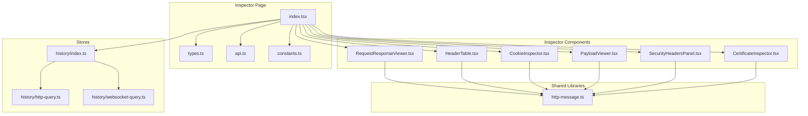
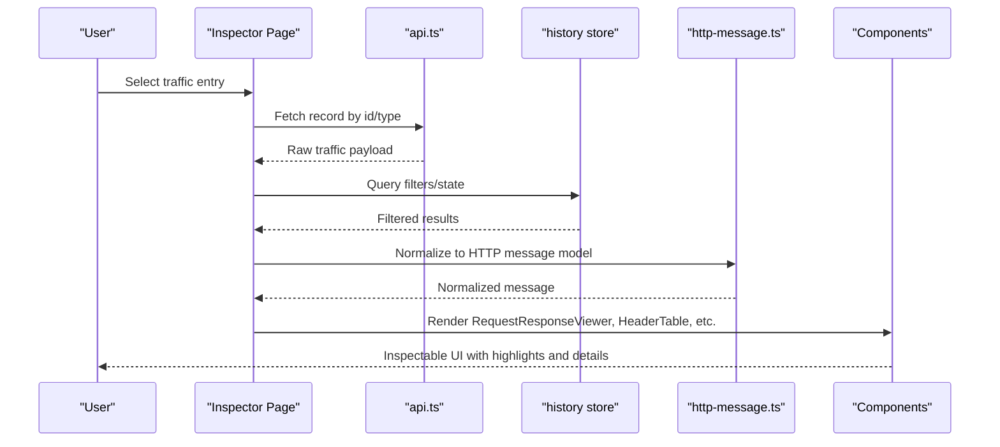
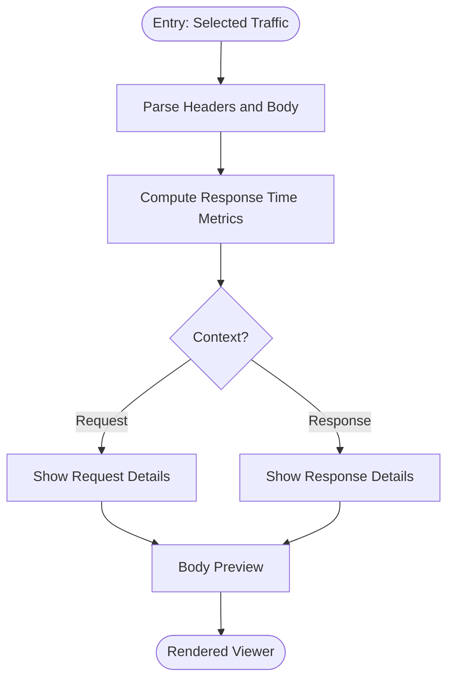
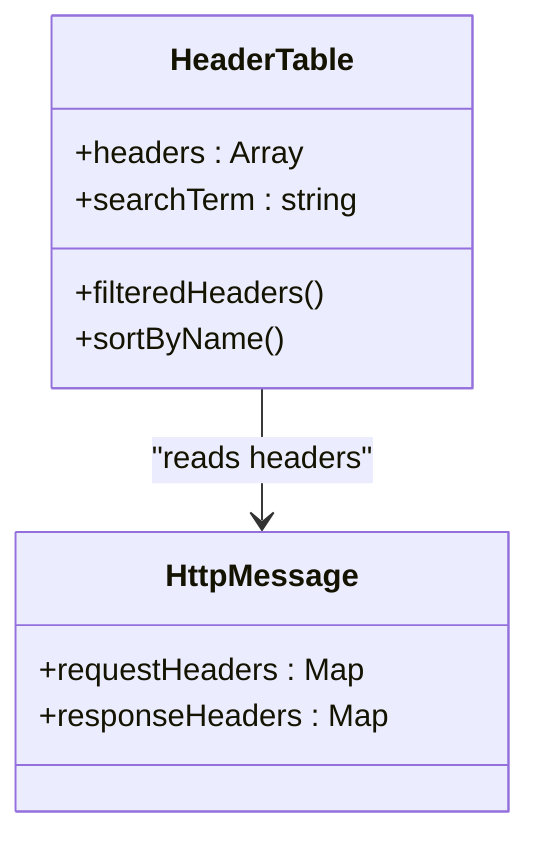
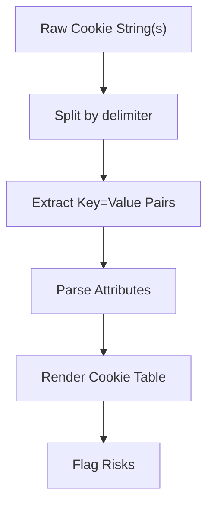
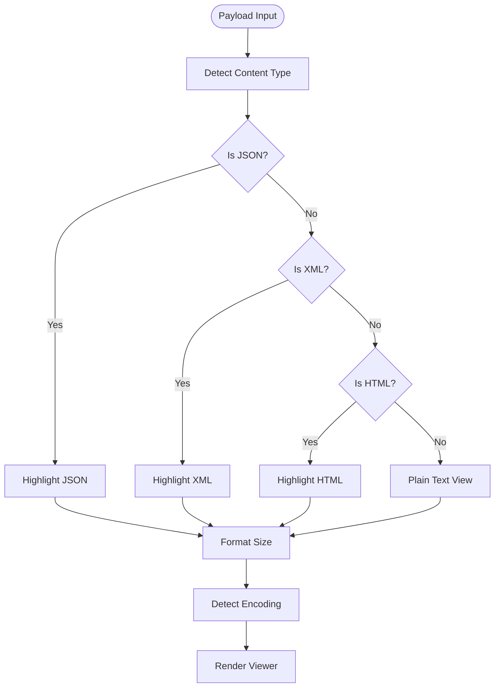
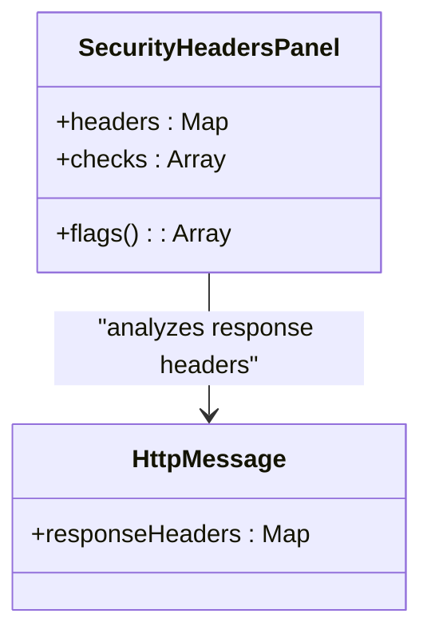
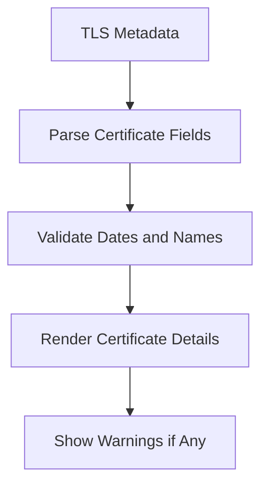
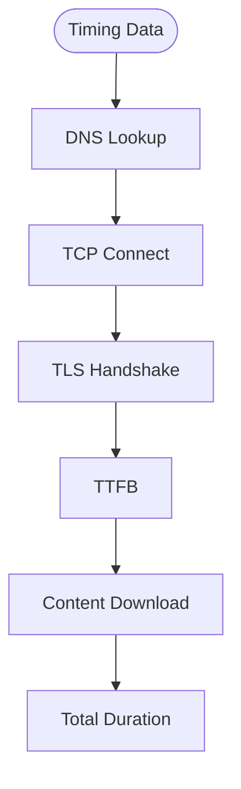
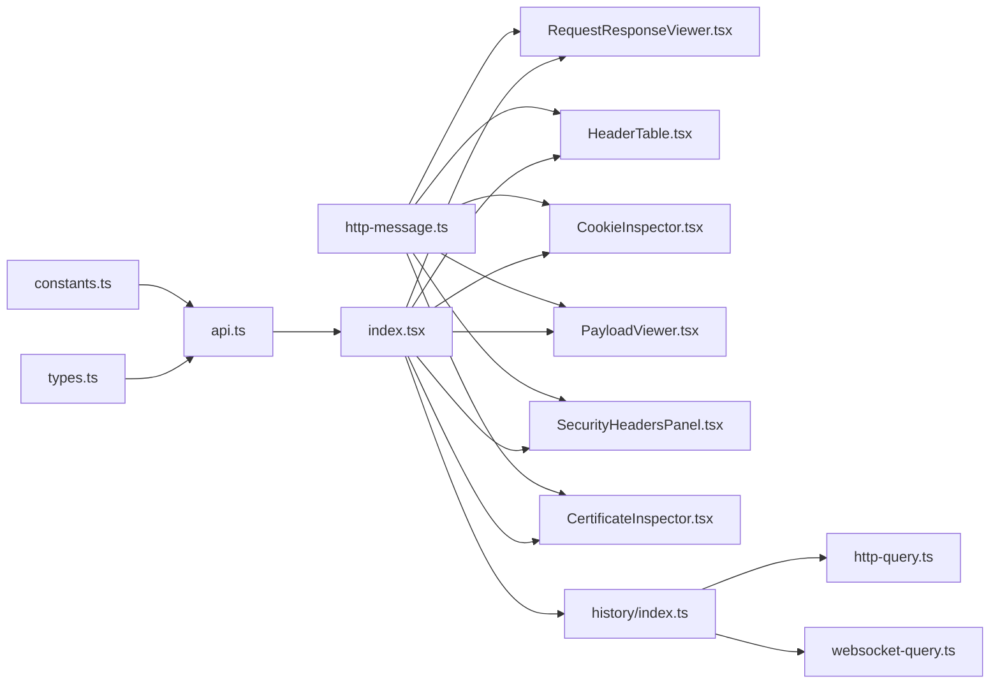

# Traffic Inspector Panel

<cite>
**Referenced Files in This Document**
- [index.tsx](file://src/pages/inspector/index.tsx)
- [types.ts](file://src/pages/inspector/types.ts)
- [api.ts](file://src/pages/inspector/api.ts)
- [constants.ts](file://src/pages/inspector/constants.ts)
- [components/RequestResponseViewer.tsx](file://src/pages/inspector/components/RequestResponseViewer.tsx)
- [components/HeaderTable.tsx](file://src/pages/inspector/components/HeaderTable.tsx)
- [components/CookieInspector.tsx](file://src/pages/inspector/components/CookieInspector.tsx)
- [components/PayloadViewer.tsx](file://src/pages/inspector/components/PayloadViewer.tsx)
- [components/SecurityHeadersPanel.tsx](file://src/pages/inspector/components/SecurityHeadersPanel.tsx)
- [components/CertificateInspector.tsx](file://src/pages/inspector/components/CertificateInspector.tsx)
- [lib/http-message.ts](file://src/lib/http-message.ts)
- [stores/history/index.ts](file://src/stores/history/index.ts)
- [stores/history/http-query.ts](file://src/stores/history/http-query.ts)
- [stores/history/websocket-query.ts](file://src/stores/history/websocket-query.ts)
</cite>

## Table of Contents
1. [Introduction](#introduction)
2. [Project Structure](#project-structure)
3. [Core Components](#core-components)
4. [Architecture Overview](#architecture-overview)
5. [Detailed Component Analysis](#detailed-component-analysis)
6. [Dependency Analysis](#dependency-analysis)
7. [Performance Considerations](#performance-considerations)
8. [Troubleshooting Guide](#troubleshooting-guide)
9. [Conclusion](#conclusion)
10. [Appendices](#appendices)

## Introduction
The Traffic Inspector Panel provides a unified interface for examining both HTTP and WebSocket traffic details. It parses requests and responses, analyzes headers and cookies, visualizes payloads with syntax highlighting, formats sizes intelligently, detects encodings, and surfaces advanced insights such as response time analysis, certificate inspection, and security-related header examination. The panel supports JSON, XML, HTML, and plain text content types, enabling rapid interpretation of complex payloads and identification of potential security issues.

## Project Structure
The inspector is implemented as a page-level component under src/pages/inspector with supporting modules for types, API calls, constants, and subcomponents that render specific aspects of the traffic data. Shared utilities for HTTP message parsing live under src/lib/http-message.ts, while history state and queries are managed via stores.

**Diagram sources**
- [index.tsx](file://src/pages/inspector/index.tsx)
- [types.ts](file://src/pages/inspector/types.ts)
- [api.ts](file://src/pages/inspector/api.ts)
- [constants.ts](file://src/pages/inspector/constants.ts)
- [components/RequestResponseViewer.tsx](file://src/pages/inspector/components/RequestResponseViewer.tsx)
- [components/HeaderTable.tsx](file://src/pages/inspector/components/HeaderTable.tsx)
- [components/CookieInspector.tsx](file://src/pages/inspector/components/CookieInspector.tsx)
- [components/PayloadViewer.tsx](file://src/pages/inspector/components/PayloadViewer.tsx)
- [components/SecurityHeadersPanel.tsx](file://src/pages/inspector/components/SecurityHeadersPanel.tsx)
- [components/CertificateInspector.tsx](file://src/pages/inspector/components/CertificateInspector.tsx)
- [lib/http-message.ts](file://src/lib/http-message.ts)
- [stores/history/index.ts](file://src/stores/history/index.ts)
- [stores/history/http-query.ts](file://src/stores/history/http-query.ts)
- [stores/history/websocket-query.ts](file://src/stores/history/websocket-query.ts)

**Section sources**
- [index.tsx](file://src/pages/inspector/index.tsx)
- [types.ts](file://src/pages/inspector/types.ts)
- [api.ts](file://src/pages/inspector/api.ts)
- [constants.ts](file://src/pages/inspector/constants.ts)
- [lib/http-message.ts](file://src/lib/http-message.ts)
- [stores/history/index.ts](file://src/stores/history/index.ts)
- [stores/history/http-query.ts](file://src/stores/history/http-query.ts)
- [stores/history/websocket-query.ts](file://src/stores/history/websocket-query.ts)

## Core Components
- RequestResponseViewer: Renders request and response sections side-by-side or tabbed, including method, URL, status, timing, and body preview.
- HeaderTable: Displays key-value pairs of headers with search and filtering capabilities.
- CookieInspector: Parses and presents cookie attributes (name, value, domain, path, flags).
- PayloadViewer: Provides syntax-highlighted views for JSON, XML, HTML, and plain text; includes size formatting and encoding detection.
- SecurityHeadersPanel: Highlights security-critical headers and flags potential misconfigurations.
- CertificateInspector: Shows TLS certificate details and validity information.

These components consume normalized HTTP message structures from http-message.ts and pull data from the inspector’s API layer and history stores.

**Section sources**
- [components/RequestResponseViewer.tsx](file://src/pages/inspector/components/RequestResponseViewer.tsx)
- [components/HeaderTable.tsx](file://src/pages/inspector/components/HeaderTable.tsx)
- [components/CookieInspector.tsx](file://src/pages/inspector/components/CookieInspector.tsx)
- [components/PayloadViewer.tsx](file://src/pages/inspector/components/PayloadViewer.tsx)
- [components/SecurityHeadersPanel.tsx](file://src/pages/inspector/components/SecurityHeadersPanel.tsx)
- [components/CertificateInspector.tsx](file://src/pages/inspector/components/CertificateInspector.tsx)
- [lib/http-message.ts](file://src/lib/http-message.ts)

## Architecture Overview
The inspector follows a clear separation of concerns:
- UI components render parsed traffic data.
- The API module fetches or exposes traffic records.
- Stores manage query state and persistence for HTTP and WebSocket histories.
- Shared libraries normalize raw messages into consistent structures used across components.

**Diagram sources**
- [index.tsx](file://src/pages/inspector/index.tsx)
- [api.ts](file://src/pages/inspector/api.ts)
- [stores/history/index.ts](file://src/stores/history/index.ts)
- [lib/http-message.ts](file://src/lib/http-message.ts)

## Detailed Component Analysis

### Unified Request/Response Viewer
- Presents method, scheme, host, path, query string, and status code.
- Shows timing metrics (e.g., start, end, duration) and protocol version.
- Switches between request and response contexts seamlessly.
- Integrates with payload viewer for body rendering.

**Diagram sources**
- [components/RequestResponseViewer.tsx](file://src/pages/inspector/components/RequestResponseViewer.tsx)
- [lib/http-message.ts](file://src/lib/http-message.ts)

**Section sources**
- [components/RequestResponseViewer.tsx](file://src/pages/inspector/components/RequestResponseViewer.tsx)
- [lib/http-message.ts](file://src/lib/http-message.ts)

### Header Analysis
- Displays all headers in a searchable table.
- Supports sorting and filtering by name/value patterns.
- Highlights security-sensitive headers when present.

**Diagram sources**
- [components/HeaderTable.tsx](file://src/pages/inspector/components/HeaderTable.tsx)
- [lib/http-message.ts](file://src/lib/http-message.ts)

**Section sources**
- [components/HeaderTable.tsx](file://src/pages/inspector/components/HeaderTable.tsx)
- [lib/http-message.ts](file://src/lib/http-message.ts)

### Cookie Inspection
- Parses Set-Cookie and Cookie headers into structured entries.
- Shows attributes like domain, path, secure, httponly, samesite, expires.
- Flags potentially risky configurations.

**Diagram sources**
- [components/CookieInspector.tsx](file://src/pages/inspector/components/CookieInspector.tsx)

**Section sources**
- [components/CookieInspector.tsx](file://src/pages/inspector/components/CookieInspector.tsx)

### Payload Visualization and Syntax Highlighting
- Detects content type from headers and content sniffing heuristics.
- Applies syntax highlighting for JSON, XML, HTML, and plain text.
- Formats payload size using human-readable units.
- Detects and displays encoding (e.g., UTF-8, base64 hints).

**Diagram sources**
- [components/PayloadViewer.tsx](file://src/pages/inspector/components/PayloadViewer.tsx)
- [lib/http-message.ts](file://src/lib/http-message.ts)

**Section sources**
- [components/PayloadViewer.tsx](file://src/pages/inspector/components/PayloadViewer.tsx)
- [lib/http-message.ts](file://src/lib/http-message.ts)

### Security Headers Examination
- Identifies critical security headers (e.g., CSP, HSTS, X-Frame-Options, Referrer-Policy).
- Highlights missing or misconfigured values.
- Suggests remediation based on best practices.

**Diagram sources**
- [components/SecurityHeadersPanel.tsx](file://src/pages/inspector/components/SecurityHeadersPanel.tsx)
- [lib/http-message.ts](file://src/lib/http-message.ts)

**Section sources**
- [components/SecurityHeadersPanel.tsx](file://src/pages/inspector/components/SecurityHeadersPanel.tsx)
- [lib/http-message.ts](file://src/lib/http-message.ts)

### Certificate Inspection
- Displays issuer, subject, validity period, SANs, and signature algorithm.
- Indicates trust status and common warnings.

**Diagram sources**
- [components/CertificateInspector.tsx](file://src/pages/inspector/components/CertificateInspector.tsx)

**Section sources**
- [components/CertificateInspector.tsx](file://src/pages/inspector/components/CertificateInspector.tsx)

### Advanced Features: Response Time Analysis
- Computes total duration, DNS, connect, TLS handshake, TTFB, and download phases where available.
- Visualizes timing breakdown to identify bottlenecks.

**Diagram sources**
- [lib/http-message.ts](file://src/lib/http-message.ts)
- [components/RequestResponseViewer.tsx](file://src/pages/inspector/components/RequestResponseViewer.tsx)

**Section sources**
- [lib/http-message.ts](file://src/lib/http-message.ts)
- [components/RequestResponseViewer.tsx](file://src/pages/inspector/components/RequestResponseViewer.tsx)

## Dependency Analysis
The inspector depends on shared HTTP message normalization and history stores for data access. Components are loosely coupled through typed interfaces defined in types.ts and constants.ts.

**Diagram sources**
- [types.ts](file://src/pages/inspector/types.ts)
- [api.ts](file://src/pages/inspector/api.ts)
- [constants.ts](file://src/pages/inspector/constants.ts)
- [index.tsx](file://src/pages/inspector/index.tsx)
- [components/RequestResponseViewer.tsx](file://src/pages/inspector/components/RequestResponseViewer.tsx)
- [components/HeaderTable.tsx](file://src/pages/inspector/components/HeaderTable.tsx)
- [components/CookieInspector.tsx](file://src/pages/inspector/components/CookieInspector.tsx)
- [components/PayloadViewer.tsx](file://src/pages/inspector/components/PayloadViewer.tsx)
- [components/SecurityHeadersPanel.tsx](file://src/pages/inspector/components/SecurityHeadersPanel.tsx)
- [components/CertificateInspector.tsx](file://src/pages/inspector/components/CertificateInspector.tsx)
- [lib/http-message.ts](file://src/lib/http-message.ts)
- [stores/history/index.ts](file://src/stores/history/index.ts)
- [stores/history/http-query.ts](file://src/stores/history/http-query.ts)
- [stores/history/websocket-query.ts](file://src/stores/history/websocket-query.ts)

**Section sources**
- [types.ts](file://src/pages/inspector/types.ts)
- [api.ts](file://src/pages/inspector/api.ts)
- [constants.ts](file://src/pages/inspector/constants.ts)
- [index.tsx](file://src/pages/inspector/index.tsx)
- [lib/http-message.ts](file://src/lib/http-message.ts)
- [stores/history/index.ts](file://src/stores/history/index.ts)
- [stores/history/http-query.ts](file://src/stores/history/http-query.ts)
- [stores/history/websocket-query.ts](file://src/stores/history/websocket-query.ts)

## Performance Considerations
- Lazy rendering: Defer heavy payload parsing until the user selects a payload tab.
- Virtualization: For large header lists or cookie arrays, consider virtual scrolling to maintain responsiveness.
- Memoization: Cache computed values like filtered headers and highlighted payloads to avoid re-renders.
- Chunked decoding: For very large bodies, stream or chunk decode to prevent UI freezes.
- Efficient searches: Use indexed lookups for header and cookie searches to keep interactions snappy.

[No sources needed since this section provides general guidance]

## Troubleshooting Guide
- Missing payload: Ensure content-type headers are present and correctly set; fallback to binary/plain text view when detection fails.
- Encoding issues: Verify charset declarations and confirm UTF-8 compatibility; inspect raw bytes if rendering appears garbled.
- Large payloads: If the viewer hangs, reduce payload size or enable streaming mode; check memory usage during parse.
- Header search not working: Confirm case-insensitive matching and whitespace trimming; reset filters if necessary.
- Cookie parsing errors: Validate Set-Cookie format; some servers send malformed cookies—display raw string alongside parsed view.
- Timing gaps: Some environments do not expose full timing metadata; rely on total duration when phase data is unavailable.

**Section sources**
- [components/PayloadViewer.tsx](file://src/pages/inspector/components/PayloadViewer.tsx)
- [components/HeaderTable.tsx](file://src/pages/inspector/components/HeaderTable.tsx)
- [components/CookieInspector.tsx](file://src/pages/inspector/components/CookieInspector.tsx)
- [lib/http-message.ts](file://src/lib/http-message.ts)

## Conclusion
The Traffic Inspector Panel offers a comprehensive, unified experience for inspecting HTTP and WebSocket traffic. With robust parsing, intelligent content-type handling, syntax highlighting, size formatting, encoding detection, and advanced security and certificate insights, it enables efficient debugging and security analysis. Its modular architecture ensures maintainability and extensibility for future enhancements.

[No sources needed since this section summarizes without analyzing specific files]

## Appendices

### Interpreting Complex Payloads
- JSON: Validate structure, check nested objects, and ensure proper escaping; use schema-like inspection to spot unexpected fields.
- XML: Validate well-formedness, check namespaces, and watch for entity injection risks.
- HTML: Inspect DOM structure, scripts, and external resources; be alert to XSS vectors.
- Binary/Base64: Decode safely and verify checksums; treat unknown binaries cautiously.

[No sources needed since this section provides general guidance]

### Identifying Potential Security Issues
- Missing or weak security headers: Flag absent HSTS, CSP, X-Frame-Options, Referrer-Policy, and others.
- Insecure cookies: Look for missing Secure/HttpOnly/SameSite flags or overly broad domains.
- Mixed content: Detect HTTP resources loaded over HTTPS.
- Excessive verbosity: Avoid leaking sensitive data in logs or error responses.
- Weak TLS: Check certificate validity, algorithms, and chain trust.

**Section sources**
- [components/SecurityHeadersPanel.tsx](file://src/pages/inspector/components/SecurityHeadersPanel.tsx)
- [components/CookieInspector.tsx](file://src/pages/inspector/components/CookieInspector.tsx)
- [components/CertificateInspector.tsx](file://src/pages/inspector/components/CertificateInspector.tsx)