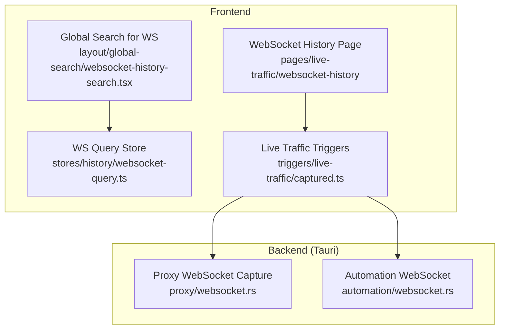
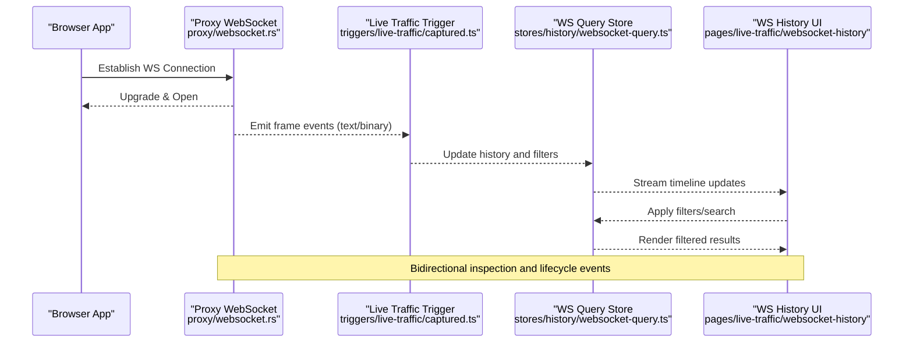
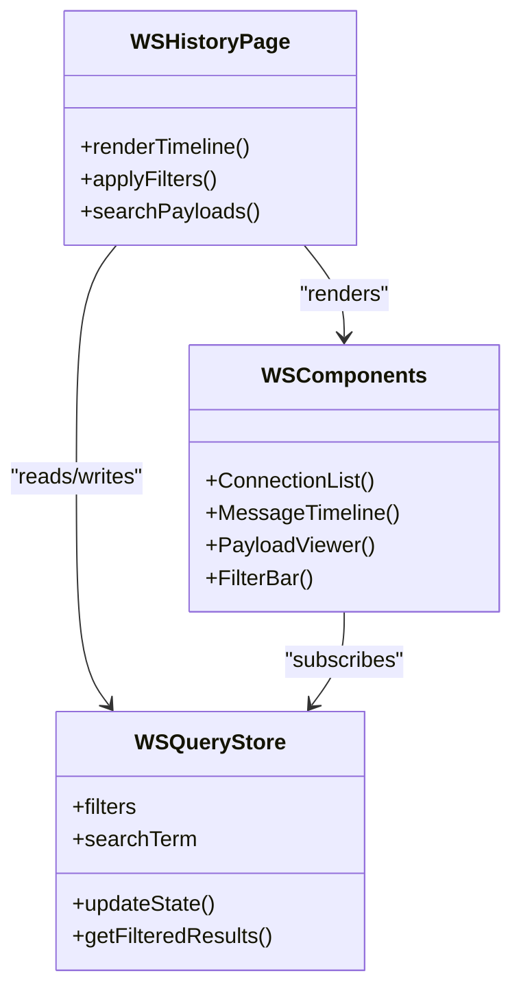
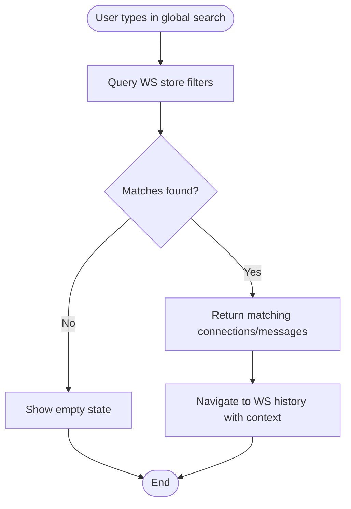
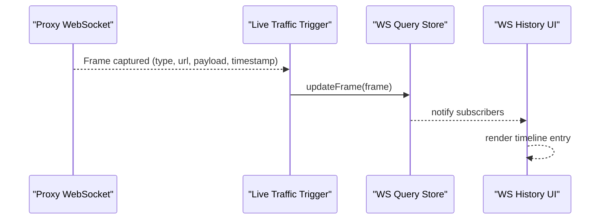
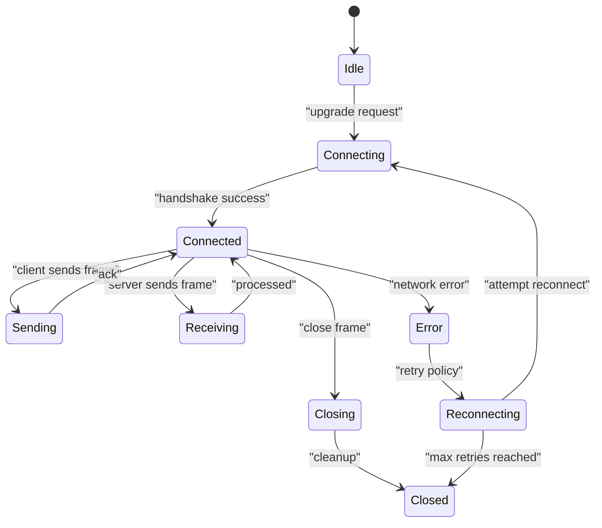
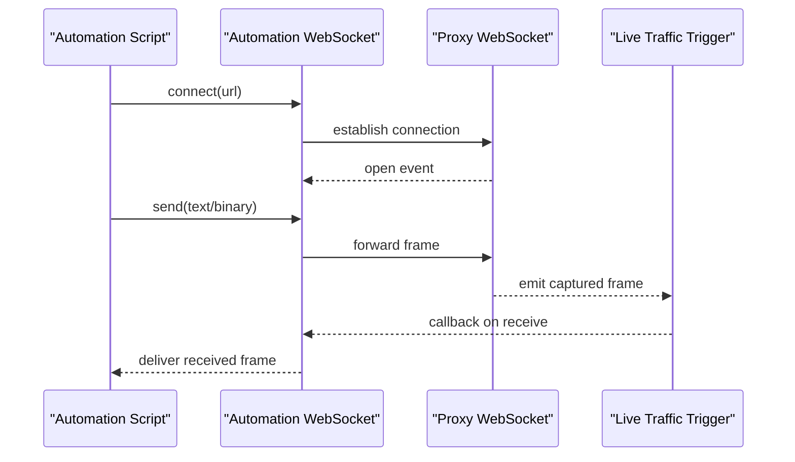
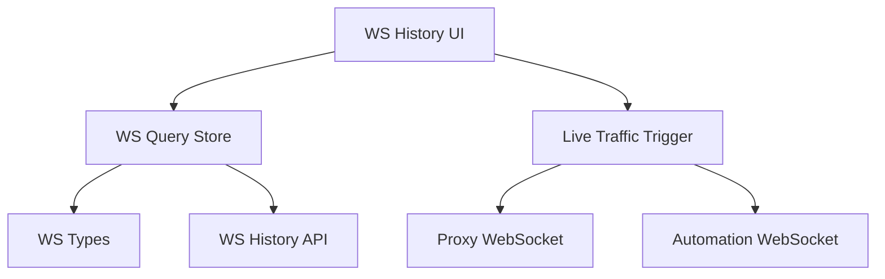

# WebSocket Traffic Monitoring

<cite>
**Referenced Files in This Document**
- [websocket-history-search.tsx](file://src/layout/global-search/websocket-history-search.tsx)
- [websocket-query.ts](file://src/stores/history/websocket-query.ts)
- [websocket.rs](file://src-tauri/src/proxy/websocket.rs)
- [automation-websocket.rs](file://src-tauri/src/automation/websocket.rs)
- [live-traffic-captured.ts](file://src/triggers/live-traffic/captured.ts)
- [index.tsx](file://src/pages/live-traffic/index.tsx)
- [websocket-history-index.tsx](file://src/pages/live-traffic/websocket-history/index.tsx)
- [websocket-history-types.ts](file://src/pages/live-traffic/websocket-history/types.ts)
- [websocket-history-api.ts](file://src/pages/live-traffic/websocket-history/api.ts)
- [websocket-history-components.tsx](file://src/pages/live-traffic/websocket-history/components/index.tsx)
</cite>

## Table of Contents
1. [Introduction](#introduction)
2. [Project Structure](#project-structure)
3. [Core Components](#core-components)
4. [Architecture Overview](#architecture-overview)
5. [Detailed Component Analysis](#detailed-component-analysis)
6. [Dependency Analysis](#dependency-analysis)
7. [Performance Considerations](#performance-considerations)
8. [Troubleshooting Guide](#troubleshooting-guide)
9. [Conclusion](#conclusion)
10. [Appendices](#appendices)

## Introduction
This document explains the WebSocket traffic monitoring capabilities implemented in the application. It covers real-time connection establishment, message streaming, and frame analysis; the WebSocket history interface with timeline visualization; bidirectional communication inspection; connection lifecycle management; filtering and search within payloads; binary and text handling; error tracking; and reconnection scenarios. Practical examples are included to help debug WebSocket applications and analyze real-time data flows.

## Project Structure
The WebSocket monitoring spans both frontend (TypeScript/React) and backend (Rust/Tauri) layers:
- Frontend pages and components for WebSocket history UI and search
- Stores for query state and filters
- Triggers that emit captured events from the proxy layer
- Backend proxy and automation modules that capture and manage WebSocket frames

**Diagram sources**
- [websocket-history-search.tsx](file://src/layout/global-search/websocket-history-search.tsx)
- [websocket-query.ts](file://src/stores/history/websocket-query.ts)
- [live-traffic-captured.ts](file://src/triggers/live-traffic/captured.ts)
- [websocket.rs](file://src-tauri/src/proxy/websocket.rs)
- [automation-websocket.rs](file://src-tauri/src/automation/websocket.rs)

**Section sources**
- [index.tsx](file://src/pages/live-traffic/index.tsx)
- [websocket-history-index.tsx](file://src/pages/live-traffic/websocket-history/index.tsx)
- [websocket-history-types.ts](file://src/pages/live-traffic/websocket-history/types.ts)
- [websocket-history-api.ts](file://src/pages/live-traffic/websocket-history/api.ts)
- [websocket-history-components.tsx](file://src/pages/live-traffic/websocket-history/components/index.tsx)
- [websocket-history-search.tsx](file://src/layout/global-search/websocket-history-search.tsx)
- [websocket-query.ts](file://src/stores/history/websocket-query.ts)
- [live-traffic-captured.ts](file://src/triggers/live-traffic/captured.ts)
- [websocket.rs](file://src-tauri/src/proxy/websocket.rs)
- [automation-websocket.rs](file://src-tauri/src/automation/websocket.rs)

## Core Components
- WebSocket History Page: Entry point for browsing connections and messages.
- WebSocket History Components: Timeline view, message inspector, filters, and controls.
- Global Search: Quick access to WebSocket entries by URL, payload content, or status.
- Query Store: Centralized state for filters, search terms, and pagination.
- Live Traffic Triggers: Bridge between backend capture and frontend updates.
- Proxy WebSocket Module: Captures frames, manages connection lifecycle, and emits events.
- Automation WebSocket Module: Supports scripted interactions and automated testing flows.

Key responsibilities:
- Real-time capture and emission of WebSocket frames
- Persistent storage and retrieval of connection history
- Bidirectional inspection (client-to-server and server-to-client)
- Filtering and searching across URLs, payloads, and metadata
- Handling binary and text frames with appropriate decoding
- Error tracking and reconnection event propagation

**Section sources**
- [websocket-history-index.tsx](file://src/pages/live-traffic/websocket-history/index.tsx)
- [websocket-history-components.tsx](file://src/pages/live-traffic/websocket-history/components/index.tsx)
- [websocket-history-search.tsx](file://src/layout/global-search/websocket-history-search.tsx)
- [websocket-query.ts](file://src/stores/history/websocket-query.ts)
- [live-traffic-captured.ts](file://src/triggers/live-traffic/captured.ts)
- [websocket.rs](file://src-tauri/src/proxy/websocket.rs)
- [automation-websocket.rs](file://src-tauri/src/automation/websocket.rs)

## Architecture Overview
The system captures WebSocket traffic at the proxy layer and streams it to the frontend via triggers. The frontend maintains a reactive store for queries and renders a timeline of connections and messages.

**Diagram sources**
- [websocket.rs](file://src-tauri/src/proxy/websocket.rs)
- [live-traffic-captured.ts](file://src/triggers/live-traffic/captured.ts)
- [websocket-query.ts](file://src/stores/history/websocket-query.ts)
- [websocket-history-index.tsx](file://src/pages/live-traffic/websocket-history/index.tsx)

## Detailed Component Analysis

### WebSocket History Page and Components
- Purpose: Provide a timeline view of WebSocket connections, allow message inspection, and support filtering/search.
- Features:
  - Connection list with status indicators
  - Message timeline with direction labels (send/receive)
  - Payload viewer supporting text and binary formats
  - Filters by URL, type, status, and time range
  - Search within payloads and metadata
- Data flow:
  - Subscribes to live events from triggers
  - Updates store state with new frames
  - Renders filtered results efficiently

**Diagram sources**
- [websocket-history-index.tsx](file://src/pages/live-traffic/websocket-history/index.tsx)
- [websocket-history-components.tsx](file://src/pages/live-traffic/websocket-history/components/index.tsx)
- [websocket-query.ts](file://src/stores/history/websocket-query.ts)

**Section sources**
- [websocket-history-index.tsx](file://src/pages/live-traffic/websocket-history/index.tsx)
- [websocket-history-components.tsx](file://src/pages/live-traffic/websocket-history/components/index.tsx)
- [websocket-history-types.ts](file://src/pages/live-traffic/websocket-history/types.ts)

### Global Search for WebSocket History
- Purpose: Enable quick discovery of WebSocket connections and messages across the app.
- Capabilities:
  - Search by URL, method-like tags, payload snippets, and status
  - Results include direct navigation to the relevant connection and message
- Integration:
  - Uses the WS query store to filter and match entries
  - Emits selection events to open the WebSocket history page

**Diagram sources**
- [websocket-history-search.tsx](file://src/layout/global-search/websocket-history-search.tsx)
- [websocket-query.ts](file://src/stores/history/websocket-query.ts)

**Section sources**
- [websocket-history-search.tsx](file://src/layout/global-search/websocket-history-search.tsx)
- [websocket-query.ts](file://src/stores/history/websocket-query.ts)

### Live Traffic Triggers
- Purpose: Bridge backend capture events to the frontend store and UI.
- Responsibilities:
  - Subscribe to proxy automation events
  - Normalize frame data into consistent structures
  - Emit updates to the store for real-time rendering

**Diagram sources**
- [live-traffic-captured.ts](file://src/triggers/live-traffic/captured.ts)
- [websocket-query.ts](file://src/stores/history/websocket-query.ts)

**Section sources**
- [live-traffic-captured.ts](file://src/triggers/live-traffic/captured.ts)
- [websocket-query.ts](file://src/stores/history/websocket-query.ts)

### Proxy WebSocket Module
- Purpose: Intercept and capture WebSocket frames during proxying.
- Key behaviors:
  - Monitor connection lifecycle (open, message, close, error)
  - Classify frames as text or binary
  - Emit structured events with metadata (URL, headers, timestamps)
  - Track errors and reconnection attempts

**Diagram sources**
- [websocket.rs](file://src-tauri/src/proxy/websocket.rs)

**Section sources**
- [websocket.rs](file://src-tauri/src/proxy/websocket.rs)

### Automation WebSocket Module
- Purpose: Support scripted interactions and automated testing of WebSocket endpoints.
- Capabilities:
  - Programmatic send/receive operations
  - Event-driven callbacks for frame processing
  - Integration with capture pipeline for visibility

**Diagram sources**
- [automation-websocket.rs](file://src-tauri/src/automation/websocket.rs)
- [websocket.rs](file://src-tauri/src/proxy/websocket.rs)
- [live-traffic-captured.ts](file://src/triggers/live-traffic/captured.ts)

**Section sources**
- [automation-websocket.rs](file://src-tauri/src/automation/websocket.rs)
- [websocket.rs](file://src-tauri/src/proxy/websocket.rs)
- [live-traffic-captured.ts](file://src/triggers/live-traffic/captured.ts)

## Dependency Analysis
The WebSocket monitoring stack has clear boundaries and dependencies:
- Frontend depends on triggers and stores for reactive updates
- Triggers depend on backend proxy and automation modules
- UI components depend on typed models and API utilities

**Diagram sources**
- [websocket-history-index.tsx](file://src/pages/live-traffic/websocket-history/index.tsx)
- [websocket-query.ts](file://src/stores/history/websocket-query.ts)
- [live-traffic-captured.ts](file://src/triggers/live-traffic/captured.ts)
- [websocket.rs](file://src-tauri/src/proxy/websocket.rs)
- [automation-websocket.rs](file://src-tauri/src/automation/websocket.rs)

**Section sources**
- [websocket-history-types.ts](file://src/pages/live-traffic/websocket-history/types.ts)
- [websocket-history-api.ts](file://src/pages/live-traffic/websocket-history/api.ts)
- [websocket-query.ts](file://src/stores/history/websocket-query.ts)
- [live-traffic-captured.ts](file://src/triggers/live-traffic/captured.ts)
- [websocket.rs](file://src-tauri/src/proxy/websocket.rs)
- [automation-websocket.rs](file://src-tauri/src/automation/websocket.rs)

## Performance Considerations
- Efficient filtering: Use indexed fields (URL, timestamp, type) to speed up searches.
- Debounced input: Apply debouncing to search inputs to reduce re-renders.
- Pagination and virtualization: For large timelines, implement virtual scrolling.
- Binary payload handling: Decode only when necessary to avoid heavy CPU usage.
- Event batching: Batch multiple frame events before updating the store to minimize churn.
- Memory management: Limit retained history size and purge old entries based on retention policies.

[No sources needed since this section provides general guidance]

## Troubleshooting Guide
Common issues and resolutions:
- Connection not captured:
  - Verify proxy is active and intercepting WebSocket upgrades
  - Check network permissions and firewall rules
- Missing messages:
  - Ensure triggers are subscribed and emitting events
  - Confirm frame classification (text vs binary) and decoding logic
- Slow UI performance:
  - Reduce history size and enable pagination
  - Optimize payload rendering and avoid unnecessary re-renders
- Frequent disconnects:
  - Inspect error events and retry policies
  - Validate server-side keep-alive settings

**Section sources**
- [websocket.rs](file://src-tauri/src/proxy/websocket.rs)
- [automation-websocket.rs](file://src-tauri/src/automation/websocket.rs)
- [live-traffic-captured.ts](file://src/triggers/live-traffic/captured.ts)
- [websocket-query.ts](file://src/stores/history/websocket-query.ts)

## Conclusion
The WebSocket traffic monitoring system provides comprehensive real-time inspection of connections and messages through a robust proxy capture mechanism and a reactive frontend interface. It supports bidirectional communication analysis, filtering and search, binary and text handling, error tracking, and reconnection scenarios. By following the architecture and best practices outlined here, developers can effectively debug WebSocket applications and analyze real-time data flows.

[No sources needed since this section summarizes without analyzing specific files]

## Appendices

### Practical Examples
- Debugging a chat application:
  - Observe message frames in the timeline
  - Filter by URL pattern for chat endpoints
  - Inspect payload structure and validate schema
- Analyzing real-time stock data:
  - Focus on high-frequency frames
  - Use binary payload viewer for compact data
  - Track latency between server pushes and client renders
- Investigating authentication flows:
  - Capture handshake headers and tokens
  - Monitor token refresh events
  - Validate security headers and CORS settings

[No sources needed since this section provides general guidance]