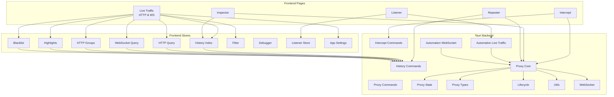
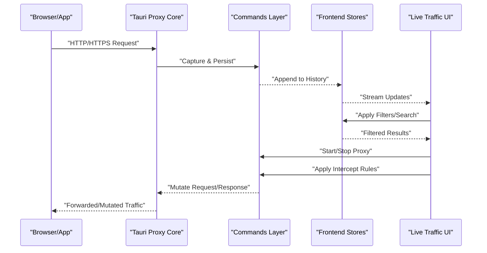
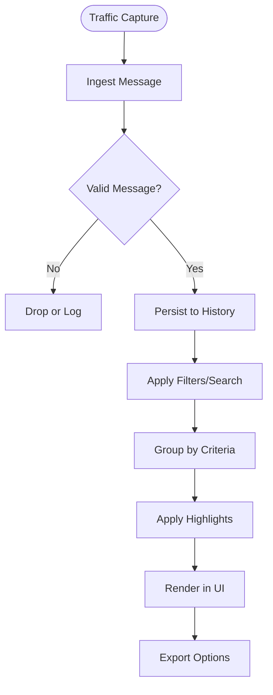
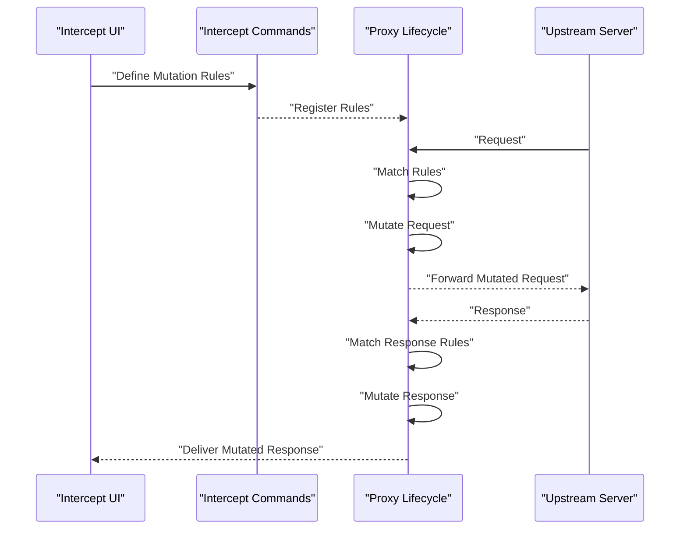
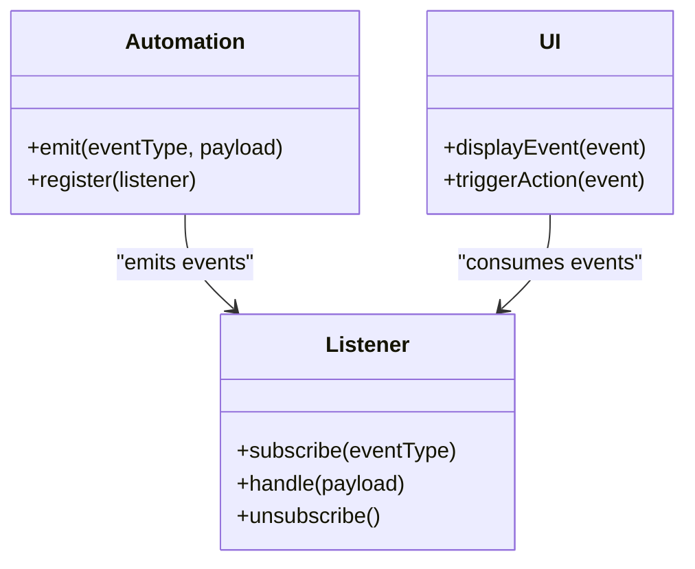
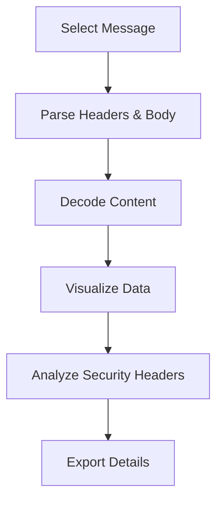
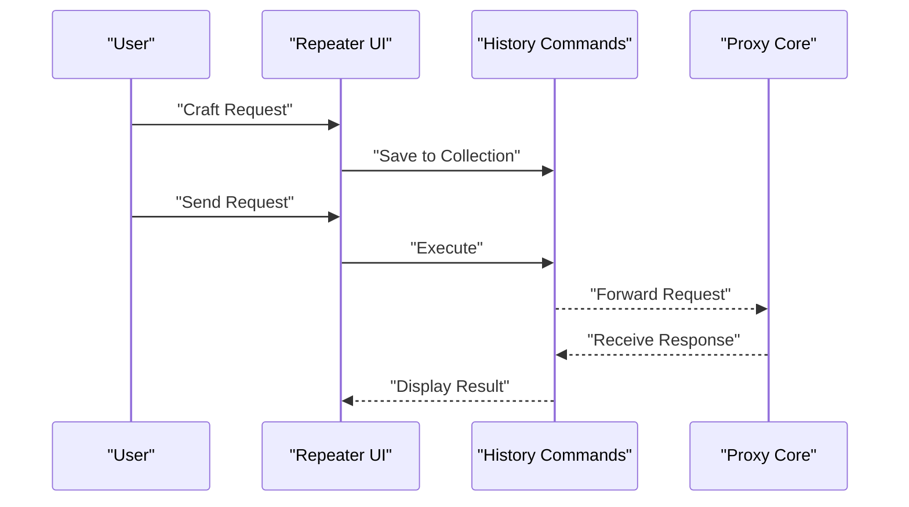
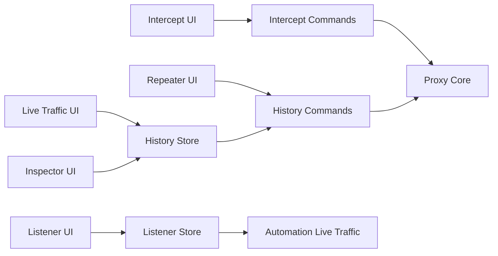

# Network Traffic Inspection

<cite>
**Referenced Files in This Document**
- [live-traffic/index.tsx](file://src/pages/live-traffic/index.tsx)
- [http-history/index.tsx](file://src/pages/live-traffic/http-history/index.tsx)
- [websocket-history/index.tsx](file://src/pages/live-traffic/websocket-history/index.tsx)
- [intercept/index.tsx](file://src/pages/intercept/index.tsx)
- [listener/index.tsx](file://src/pages/listener/index.tsx)
- [inspector/index.tsx](file://src/pages/inspector/index.tsx)
- [repeater/index.tsx](file://src/pages/repeater/index.tsx)
- [stores/history/index.ts](file://src/stores/history/index.ts)
- [stores/history/http-query.ts](file://src/stores/history/http-query.ts)
- [stores/history/http-groups.ts](file://src/stores/history/http-groups.ts)
- [stores/history/http-highlight.ts](file://src/stores/history/http-highlight.ts)
- [stores/history/http-blacklist.ts](file://src/stores/history/http-blacklist.ts)
- [stores/history/websocket-query.ts](file://src/stores/history/websocket-query.ts)
- [stores/filter.ts](file://src/stores/filter.ts)
- [stores/debugger.ts](file://src/stores/debugger.ts)
- [stores/listener.ts](file://src/stores/listener.ts)
- [stores/app-settings-store.ts](file://src/stores/app-settings-store.ts)
- [src-tauri/src/proxy/mod.rs](file://src-tauri/src/proxy/mod.rs)
- [src-tauri/src/proxy/state.rs](file://src-tauri/src/proxy/state.rs)
- [src-tauri/src/proxy/types.rs](file://src-tauri/src/proxy/types.rs)
- [src-tauri/src/proxy/lifecycle.rs](file://src-tauri/src/proxy/lifecycle.rs)
- [src-tauri/src/proxy/utils.rs](file://src-tauri/src/proxy/utils.rs)
- [src-tauri/src/proxy/websocket.rs](file://src-tauri/src/proxy/websocket.rs)
- [src-tauri/src/commands/proxy.rs](file://src-tauri/src/commands/proxy.rs)
- [src-tauri/src/commands/history.rs](file://src-tauri/src/commands/history.rs)
- [src-tauri/src/commands/intercept.rs](file://src-tauri/src/commands/intercept.rs)
- [src-tauri/src/automation/live_traffic.rs](file://src-tauri/src/automation/live_traffic.rs)
- [src-tauri/src/automation/websocket.rs](file://src-tauri/src/automation/websocket.rs)
</cite>

## Table of Contents
1. Introduction
2. Project Structure
3. Core Components
4. Architecture Overview
5. Detailed Component Analysis
6. Dependency Analysis
7. Performance Considerations
8. Troubleshooting Guide
9. Conclusion

## Introduction
This document explains Apprecon’s network traffic inspection and analysis capabilities with a focus on:
- Live traffic viewer for real-time HTTP and WebSocket monitoring
- Request interception to modify traffic on-the-fly
- Listener functionality for receiving callbacks from captured events
- Debugger tools for deep inspection of requests, responses, and state
- Filtering, search, grouping, and export features
- Advanced workflows such as traffic replay, mutation rules, and integration with security testing
- Performance considerations for high-volume traffic and troubleshooting connection issues

The goal is to help both new users and advanced practitioners understand how to capture, inspect, manipulate, and analyze network traffic effectively within Apprecon.

## Project Structure
Apprecon implements traffic inspection across the frontend (React UI and stores) and the Tauri backend (Rust proxy and commands). The key areas are:
- Live traffic pages for HTTP and WebSocket history
- Intercept page for request/response modification
- Listener page for event-driven callbacks
- Inspector for detailed message inspection
- Repeater for manual request crafting and replay
- Stores managing query, groups, highlights, blacklist, and settings
- Tauri proxy module handling TLS termination, request routing, and WebSocket upgrades
- Commands bridging frontend actions to backend operations

**Diagram sources**
- [live-traffic/index.tsx](file://src/pages/live-traffic/index.tsx)
- [http-history/index.tsx](file://src/pages/live-traffic/http-history/index.tsx)
- [websocket-history/index.tsx](file://src/pages/live-traffic/websocket-history/index.tsx)
- [intercept/index.tsx](file://src/pages/intercept/index.tsx)
- [listener/index.tsx](file://src/pages/listener/index.tsx)
- [inspector/index.tsx](file://src/pages/inspector/index.tsx)
- [repeater/index.tsx](file://src/pages/repeater/index.tsx)
- [stores/history/index.ts](file://src/stores/history/index.ts)
- [stores/history/http-query.ts](file://src/stores/history/http-query.ts)
- [stores/history/websocket-query.ts](file://src/stores/history/websocket-query.ts)
- [stores/history/http-groups.ts](file://src/stores/history/http-groups.ts)
- [stores/history/http-highlight.ts](file://src/stores/history/http-highlight.ts)
- [stores/history/http-blacklist.ts](file://src/stores/history/http-blacklist.ts)
- [stores/filter.ts](file://src/stores/filter.ts)
- [stores/debugger.ts](file://src/stores/debugger.ts)
- [stores/listener.ts](file://src/stores/listener.ts)
- [stores/app-settings-store.ts](file://src/stores/app-settings-store.ts)
- [src-tauri/src/proxy/mod.rs](file://src-tauri/src/proxy/mod.rs)
- [src-tauri/src/proxy/state.rs](file://src-tauri/src/proxy/state.rs)
- [src-tauri/src/proxy/types.rs](file://src-tauri/src/proxy/types.rs)
- [src-tauri/src/proxy/lifecycle.rs](file://src-tauri/src/proxy/lifecycle.rs)
- [src-tauri/src/proxy/utils.rs](file://src-tauri/src/proxy/utils.rs)
- [src-tauri/src/proxy/websocket.rs](file://src-tauri/src/proxy/websocket.rs)
- [src-tauri/src/commands/proxy.rs](file://src-tauri/src/commands/proxy.rs)
- [src-tauri/src/commands/history.rs](file://src-tauri/src/commands/history.rs)
- [src-tauri/src/commands/intercept.rs](file://src-tauri/src/commands/intercept.rs)
- [src-tauri/src/automation/live_traffic.rs](file://src-tauri/src/automation/live_traffic.rs)
- [src-tauri/src/automation/websocket.rs](file://src-tauri/src/automation/websocket.rs)

**Section sources**
- [live-traffic/index.tsx](file://src/pages/live-traffic/index.tsx)
- [http-history/index.tsx](file://src/pages/live-traffic/http-history/index.tsx)
- [websocket-history/index.tsx](file://src/pages/live-traffic/websocket-history/index.tsx)
- [intercept/index.tsx](file://src/pages/intercept/index.tsx)
- [listener/index.tsx](file://src/pages/listener/index.tsx)
- [inspector/index.tsx](file://src/pages/inspector/index.tsx)
- [repeater/index.tsx](file://src/pages/repeater/index.tsx)
- [stores/history/index.ts](file://src/stores/history/index.ts)
- [stores/history/http-query.ts](file://src/stores/history/http-query.ts)
- [stores/history/websocket-query.ts](file://src/stores/history/websocket-query.ts)
- [stores/history/http-groups.ts](file://src/stores/history/http-groups.ts)
- [stores/history/http-highlight.ts](file://src/stores/history/http-highlight.ts)
- [stores/history/http-blacklist.ts](file://src/stores/history/http-blacklist.ts)
- [stores/filter.ts](file://src/stores/filter.ts)
- [stores/debugger.ts](file://src/stores/debugger.ts)
- [stores/listener.ts](file://src/stores/listener.ts)
- [stores/app-settings-store.ts](file://src/stores/app-settings-store.ts)
- [src-tauri/src/proxy/mod.rs](file://src-tauri/src/proxy/mod.rs)
- [src-tauri/src/proxy/state.rs](file://src-tauri/src/proxy/state.rs)
- [src-tauri/src/proxy/types.rs](file://src-tauri/src/proxy/types.rs)
- [src-tauri/src/proxy/lifecycle.rs](file://src-tauri/src/proxy/lifecycle.rs)
- [src-tauri/src/proxy/utils.rs](file://src-tauri/src/proxy/utils.rs)
- [src-tauri/src/proxy/websocket.rs](file://src-tauri/src/proxy/websocket.rs)
- [src-tauri/src/commands/proxy.rs](file://src-tauri/src/commands/proxy.rs)
- [src-tauri/src/commands/history.rs](file://src-tauri/src/commands/history.rs)
- [src-tauri/src/commands/intercept.rs](file://src-tauri/src/commands/intercept.rs)
- [src-tauri/src/automation/live_traffic.rs](file://src-tauri/src/automation/live_traffic.rs)
- [src-tauri/src/automation/websocket.rs](file://src-tauri/src/automation/websocket.rs)

## Core Components
- Live Traffic Viewer: Captures and displays HTTP and WebSocket messages in real time, supports filtering, searching, pinning, and exporting.
- Interception Engine: Allows modifying requests and responses on-the-fly before forwarding or persisting.
- Listener System: Provides callback hooks for events emitted by captured traffic and automation flows.
- Inspector: Offers deep inspection of individual messages including headers, payloads, cookies, timing, and metadata.
- Repeater: Enables crafting, sending, and replaying requests with saved collections and environment variables.
- History Management: Centralized storage and querying for HTTP/WebSocket records, grouped and highlighted entries.
- Proxy Core: Handles TLS termination, routing, upgrade to WebSocket, and lifecycle management.

Key responsibilities:
- Real-time ingestion and persistence of traffic
- Efficient filtering and search over large datasets
- Safe mutation of traffic without breaking protocol semantics
- Event-driven extensibility via listeners
- High-performance rendering and memory management

**Section sources**
- [live-traffic/index.tsx](file://src/pages/live-traffic/index.tsx)
- [http-history/index.tsx](file://src/pages/live-traffic/http-history/index.tsx)
- [websocket-history/index.tsx](file://src/pages/live-traffic/websocket-history/index.tsx)
- [intercept/index.tsx](file://src/pages/intercept/index.tsx)
- [listener/index.tsx](file://src/pages/listener/index.tsx)
- [inspector/index.tsx](file://src/pages/inspector/index.tsx)
- [repeater/index.tsx](file://src/pages/repeater/index.tsx)
- [stores/history/index.ts](file://src/stores/history/index.ts)
- [stores/history/http-query.ts](file://src/stores/history/http-query.ts)
- [stores/history/websocket-query.ts](file://src/stores/history/websocket-query.ts)
- [stores/history/http-groups.ts](file://src/stores/history/http-groups.ts)
- [stores/history/http-highlight.ts](file://src/stores/history/http-highlight.ts)
- [stores/history/http-blacklist.ts](file://src/stores/history/http-blacklist.ts)
- [stores/filter.ts](file://src/stores/filter.ts)
- [stores/debugger.ts](file://src/stores/debugger.ts)
- [stores/listener.ts](file://src/stores/listener.ts)
- [stores/app-settings-store.ts](file://src/stores/app-settings-store.ts)
- [src-tauri/src/proxy/mod.rs](file://src-tauri/src/proxy/mod.rs)
- [src-tauri/src/proxy/state.rs](file://src-tauri/src/proxy/state.rs)
- [src-tauri/src/proxy/types.rs](file://src-tauri/src/proxy/types.rs)
- [src-tauri/src/proxy/lifecycle.rs](file://src-tauri/src/proxy/lifecycle.rs)
- [src-tauri/src/proxy/utils.rs](file://src-tauri/src/proxy/utils.rs)
- [src-tauri/src/proxy/websocket.rs](file://src-tauri/src/proxy/websocket.rs)
- [src-tauri/src/commands/proxy.rs](file://src-tauri/src/commands/proxy.rs)
- [src-tauri/src/commands/history.rs](file://src-tauri/src/commands/history.rs)
- [src-tauri/src/commands/intercept.rs](file://src-tauri/src/commands/intercept.rs)
- [src-tauri/src/automation/live_traffic.rs](file://src-tauri/src/automation/live_traffic.rs)
- [src-tauri/src/automation/websocket.rs](file://src-tauri/src/automation/websocket.rs)

## Architecture Overview
Apprecon’s architecture separates concerns between UI, state management, and the native proxy layer:
- Frontend pages render live data and provide controls for interception, inspection, and replay.
- Stores manage queries, grouping, highlighting, and blacklist logic efficiently.
- Tauri commands expose APIs to start/stop proxy, persist history, and apply intercept rules.
- Proxy core handles TLS termination, request routing, and WebSocket upgrades.
- Automation modules emit events consumed by listeners and UI components.

**Diagram sources**
- [src-tauri/src/proxy/mod.rs](file://src-tauri/src/proxy/mod.rs)
- [src-tauri/src/commands/proxy.rs](file://src-tauri/src/commands/proxy.rs)
- [src/stores/history/index.ts](file://src/stores/history/index.ts)
- [src/pages/live-traffic/index.tsx](file://src/pages/live-traffic/index.tsx)

**Section sources**
- [src-tauri/src/proxy/mod.rs](file://src-tauri/src/proxy/mod.rs)
- [src-tauri/src/commands/proxy.rs](file://src-tauri/src/commands/proxy.rs)
- [src/stores/history/index.ts](file://src/stores/history/index.ts)
- [src/pages/live-traffic/index.tsx](file://src/pages/live-traffic/index.tsx)

## Detailed Component Analysis

### Live Traffic Viewer
The Live Traffic component provides real-time monitoring of HTTP and WebSocket traffic. It integrates with stores to filter, search, group, and export captured messages.

Key capabilities:
- Real-time updates for HTTP and WebSocket messages
- Search across URLs, methods, status codes, headers, and bodies
- Grouping by domain, path, method, or custom tags
- Pinning important requests for quick access
- Exporting filtered results to JSON or other formats

**Diagram sources**
- [http-history/index.tsx](file://src/pages/live-traffic/http-history/index.tsx)
- [websocket-history/index.tsx](file://src/pages/live-traffic/websocket-history/index.tsx)
- [stores/history/http-query.ts](file://src/stores/history/http-query.ts)
- [stores/history/websocket-query.ts](file://src/stores/history/websocket-query.ts)
- [stores/history/http-groups.ts](file://src/stores/history/http-groups.ts)
- [stores/history/http-highlight.ts](file://src/stores/history/http-highlight.ts)
- [stores/history/http-blacklist.ts](file://src/stores/history/http-blacklist.ts)

**Section sources**
- [http-history/index.tsx](file://src/pages/live-traffic/http-history/index.tsx)
- [websocket-history/index.tsx](file://src/pages/live-traffic/websocket-history/index.tsx)
- [stores/history/http-query.ts](file://src/stores/history/http-query.ts)
- [stores/history/websocket-query.ts](file://src/stores/history/websocket-query.ts)
- [stores/history/http-groups.ts](file://src/stores/history/http-groups.ts)
- [stores/history/http-highlight.ts](file://src/stores/history/http-highlight.ts)
- [stores/history/http-blacklist.ts](file://src/stores/history/http-blacklist.ts)

### Interception Engine
The Interception engine allows modifying requests and responses on-the-fly. It integrates with the proxy lifecycle to mutate payloads, headers, and status codes before forwarding.

Key capabilities:
- Rule-based mutation of requests and responses
- Conditional matching by URL patterns, headers, or methods
- Safe transformation preserving protocol integrity
- Integration with automation workflows for dynamic behavior

**Diagram sources**
- [intercept/index.tsx](file://src/pages/intercept/index.tsx)
- [src-tauri/src/commands/intercept.rs](file://src-tauri/src/commands/intercept.rs)
- [src-tauri/src/proxy/lifecycle.rs](file://src-tauri/src/proxy/lifecycle.rs)

**Section sources**
- [intercept/index.tsx](file://src/pages/intercept/index.tsx)
- [src-tauri/src/commands/intercept.rs](file://src-tauri/src/commands/intercept.rs)
- [src-tauri/src/proxy/lifecycle.rs](file://src-tauri/src/proxy/lifecycle.rs)

### Listener System
Listeners receive callbacks for captured events, enabling automation and integration with external tools. They can react to HTTP requests, responses, and WebSocket frames.

Key capabilities:
- Subscribe to specific event types
- Receive structured payloads with metadata
- Chain multiple listeners for complex workflows
- Integrate with automation pipelines

**Diagram sources**
- [listener/index.tsx](file://src/pages/listener/index.tsx)
- [stores/listener.ts](file://src/stores/listener.ts)
- [src-tauri/src/automation/live_traffic.rs](file://src-tauri/src/automation/live_traffic.rs)
- [src-tauri/src/automation/websocket.rs](file://src-tauri/src/automation/websocket.rs)

**Section sources**
- [listener/index.tsx](file://src/pages/listener/index.tsx)
- [stores/listener.ts](file://src/stores/listener.ts)
- [src-tauri/src/automation/live_traffic.rs](file://src-tauri/src/automation/live_traffic.rs)
- [src-tauri/src/automation/websocket.rs](file://src-tauri/src/automation/websocket.rs)

### Inspector
The Inspector provides deep inspection of individual messages, including headers, cookies, timing, and body parsing. It supports JSON, XML, and binary content visualization.

Key capabilities:
- Detailed view of request/response structure
- Header and cookie inspection
- Body decoding and formatting
- Timing and performance metrics

**Diagram sources**
- [inspector/index.tsx](file://src/pages/inspector/index.tsx)
- [stores/history/index.ts](file://src/stores/history/index.ts)

**Section sources**
- [inspector/index.tsx](file://src/pages/inspector/index.tsx)
- [stores/history/index.ts](file://src/stores/history/index.ts)

### Repeater
The Repeater enables crafting, sending, and replaying requests with saved collections and environment variables. It supports iterative testing and automation.

Key capabilities:
- Manual request construction
- Saved collections and templates
- Environment variable substitution
- Batch execution and result comparison

**Diagram sources**
- [repeater/index.tsx](file://src/pages/repeater/index.tsx)
- [src-tauri/src/commands/history.rs](file://src-tauri/src/commands/history.rs)
- [src-tauri/src/proxy/mod.rs](file://src-tauri/src/proxy/mod.rs)

**Section sources**
- [repeater/index.tsx](file://src/pages/repeater/index.tsx)
- [src-tauri/src/commands/history.rs](file://src-tauri/src/commands/history.rs)
- [src-tauri/src/proxy/mod.rs](file://src-tauri/src/proxy/mod.rs)

## Dependency Analysis
The system exhibits clear separation between UI, state, and backend layers with well-defined interfaces:
- UI components depend on stores for data and actions
- Stores encapsulate query, grouping, and persistence logic
- Commands bridge UI actions to backend operations
- Proxy core manages low-level networking and lifecycle

**Diagram sources**
- [src/pages/live-traffic/index.tsx](file://src/pages/live-traffic/index.tsx)
- [src/pages/intercept/index.tsx](file://src/pages/intercept/index.tsx)
- [src/pages/listener/index.tsx](file://src/pages/listener/index.tsx)
- [src/pages/inspector/index.tsx](file://src/pages/inspector/index.tsx)
- [src/pages/repeater/index.tsx](file://src/pages/repeater/index.tsx)
- [src/stores/history/index.ts](file://src/stores/history/index.ts)
- [src/stores/listener.ts](file://src/stores/listener.ts)
- [src-tauri/src/commands/history.rs](file://src-tauri/src/commands/history.rs)
- [src-tauri/src/commands/intercept.rs](file://src-tauri/src/commands/intercept.rs)
- [src-tauri/src/proxy/mod.rs](file://src-tauri/src/proxy/mod.rs)
- [src-tauri/src/automation/live_traffic.rs](file://src-tauri/src/automation/live_traffic.rs)

**Section sources**
- [src/pages/live-traffic/index.tsx](file://src/pages/live-traffic/index.tsx)
- [src/pages/intercept/index.tsx](file://src/pages/intercept/index.tsx)
- [src/pages/listener/index.tsx](file://src/pages/listener/index.tsx)
- [src/pages/inspector/index.tsx](file://src/pages/inspector/index.tsx)
- [src/pages/repeater/index.tsx](file://src/pages/repeater/index.tsx)
- [src/stores/history/index.ts](file://src/stores/history/index.ts)
- [src/stores/listener.ts](file://src/stores/listener.ts)
- [src-tauri/src/commands/history.rs](file://src-tauri/src/commands/history.rs)
- [src-tauri/src/commands/intercept.rs](file://src-tauri/src/commands/intercept.rs)
- [src-tauri/src/proxy/mod.rs](file://src-tauri/src/proxy/mod.rs)
- [src-tauri/src/automation/live_traffic.rs](file://src-tauri/src/automation/live_traffic.rs)

## Performance Considerations
- High-volume traffic: Use efficient filtering and pagination to avoid UI lag
- Memory management: Limit retained messages and use virtualization for large lists
- Background processing: Offload heavy transformations to background threads
- Caching: Cache decoded payloads and computed views where appropriate
- Network efficiency: Minimize unnecessary re-renders and batch updates

[No sources needed since this section provides general guidance]

## Troubleshooting Guide
Common issues and resolutions:
- Connection problems: Verify proxy configuration, certificate installation, and firewall settings
- Missing traffic: Ensure target applications route through the configured proxy
- Slow performance: Reduce captured scope, disable unnecessary logging, and optimize filters
- Interception failures: Check rule syntax, header compatibility, and payload size limits
- WebSocket issues: Confirm upgrade handshake and frame handling

Diagnostic steps:
- Inspect proxy logs for errors and warnings
- Validate certificates and trust stores
- Test connectivity with simple requests
- Review filter and blacklist configurations

**Section sources**
- [src-tauri/src/proxy/lifecycle.rs](file://src-tauri/src/proxy/lifecycle.rs)
- [src-tauri/src/proxy/utils.rs](file://src-tauri/src/proxy/utils.rs)
- [src/stores/app-settings-store.ts](file://src/stores/app-settings-store.ts)

## Conclusion
Apprecon provides a comprehensive suite for network traffic inspection and analysis, combining real-time monitoring, powerful interception, event-driven listeners, and deep inspection tools. Its modular architecture ensures scalability and maintainability while supporting advanced workflows like traffic replay and security testing integration. By leveraging filtering, grouping, and export capabilities, users can efficiently investigate API calls, analyze security headers, and troubleshoot network issues in high-volume environments.

[No sources needed since this section summarizes without analyzing specific files]