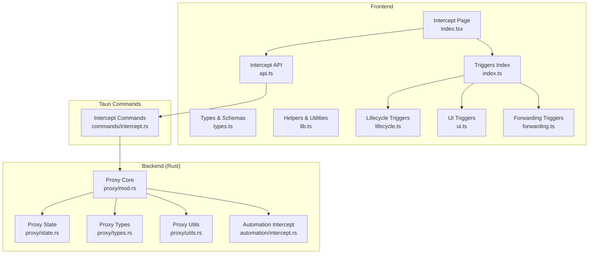
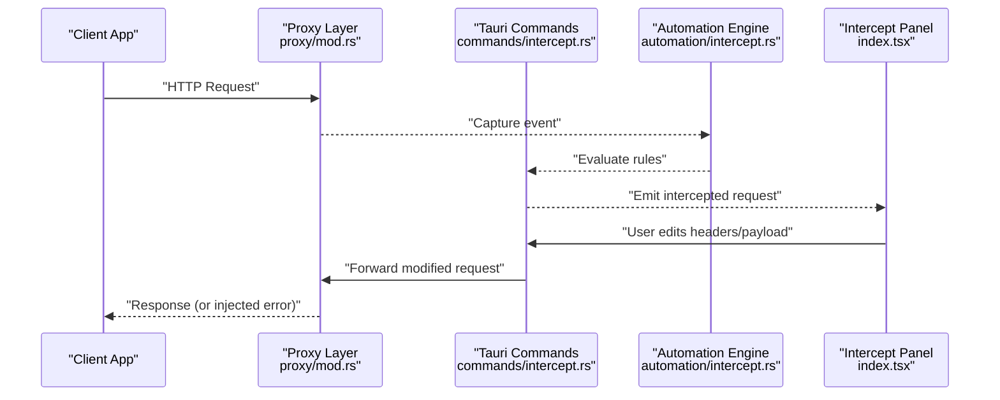
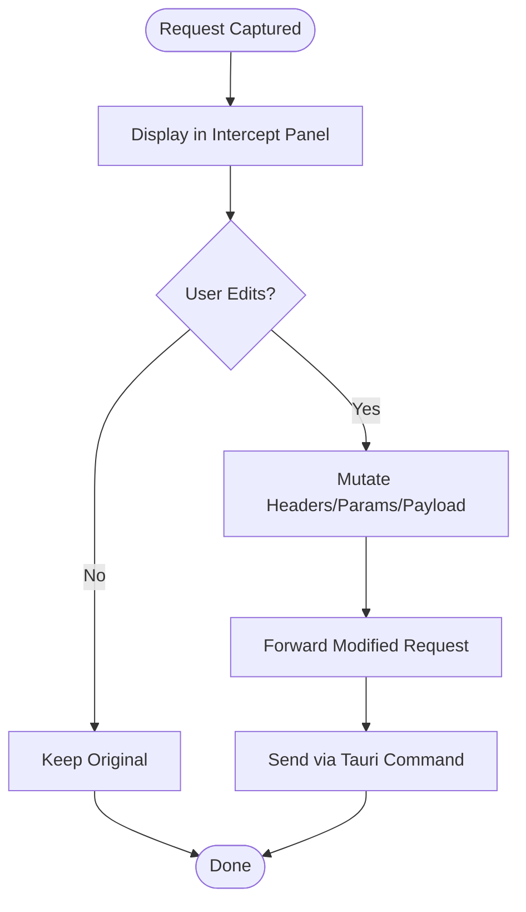
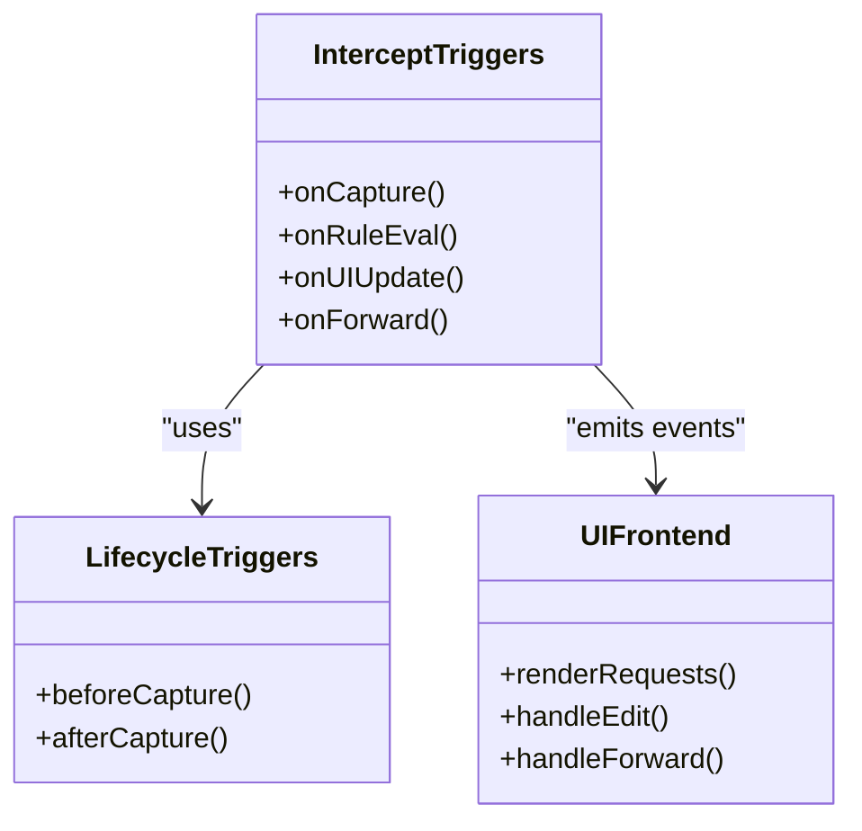
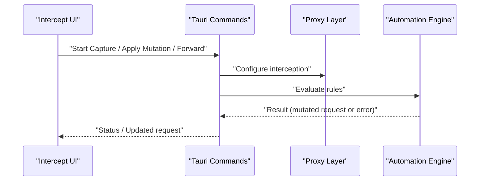
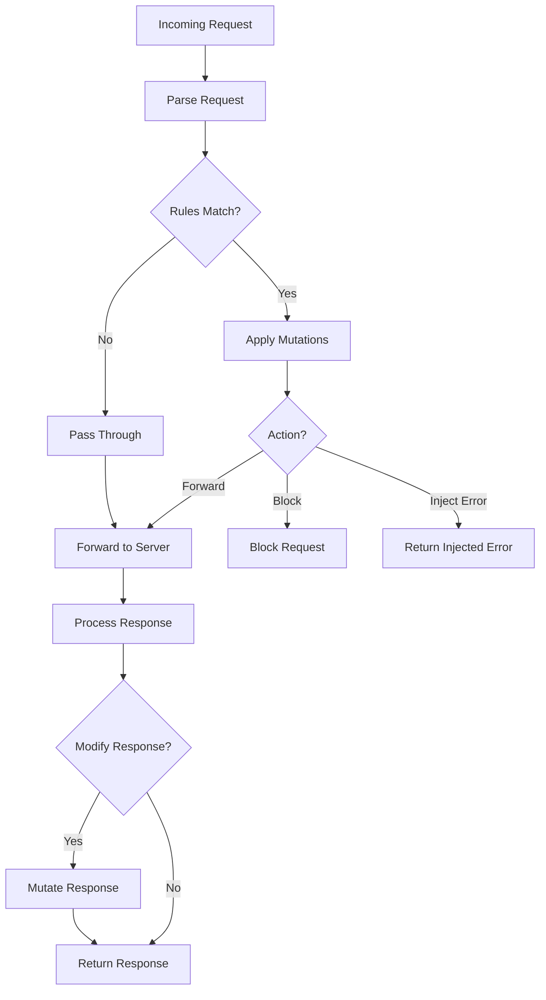
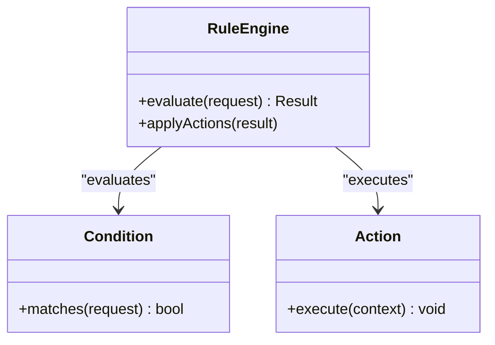
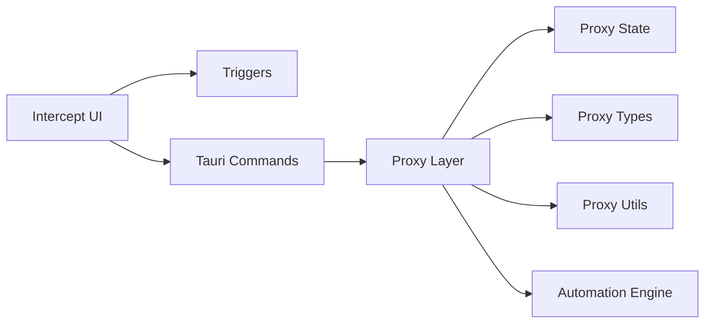

# Request Interception

<cite>
**Referenced Files in This Document**
- [src/pages/intercept/index.tsx](file://src/pages/intercept/index.tsx)
- [src/pages/intercept/api.ts](file://src/pages/intercept/api.ts)
- [src/pages/intercept/types.ts](file://src/pages/intercept/types.ts)
- [src/pages/intercept/lib.ts](file://src/pages/intercept/lib.ts)
- [src/triggers/intercept/index.ts](file://src/triggers/intercept/index.ts)
- [src/triggers/intercept/lifecycle.ts](file://src/triggers/intercept/lifecycle.ts)
- [src/triggers/intercept/ui.ts](file://src/triggers/intercept/ui.ts)
- [src/triggers/intercept/forwarding.ts](file://src/triggers/intercept/forwarding.ts)
- [src/stores/history/http-blacklist.ts](file://src/stores/history/http-blacklist.ts)
- [src/stores/history/http-groups.ts](file://src/stores/history/http-groups.ts)
- [src/stores/history/http-highlight.ts](file://src/stores/history/http-highlight.ts)
- [src/stores/history/http-pinned.ts](file://src/stores/history/http-pinned.ts)
- [src/stores/history/http-query.ts](file://src/stores/history/http-query.ts)
- [src-tauri/src/proxy/mod.rs](file://src-tauri/src/proxy/mod.rs)
- [src-tauri/src/proxy/state.rs](file://src-tauri/src/proxy/state.rs)
- [src-tauri/src/proxy/types.rs](file://src-tauri/src/proxy/types.rs)
- [src-tauri/src/proxy/utils.rs](file://src-tauri/src/proxy/utils.rs)
- [src-tauri/src/proxy/mock_forge.rs](file://src-tauri/src/proxy/mock_forge.rs)
- [src-tauri/src/automation/intercept.rs](file://src-tauri/src/automation/intercept.rs)
- [src-tauri/src/commands/intercept.rs](file://src-tauri/src/commands/intercept.rs)
- [src-tauri/src/tools/intercept.rs](file://src-tauri/src/tools/intercept.rs)
</cite>

## Table of Contents
1. [Introduction](#introduction)
2. [Project Structure](#project-structure)
3. [Core Components](#core-components)
4. [Architecture Overview](#architecture-overview)
5. [Detailed Component Analysis](#detailed-component-analysis)
6. [Dependency Analysis](#dependency-analysis)
7. [Performance Considerations](#performance-considerations)
8. [Troubleshooting Guide](#troubleshooting-guide)
9. [Conclusion](#conclusion)
10. [Appendices](#appendices)

## Introduction
This document explains Apprecon’s request interception system: how HTTP requests are captured in real-time, inspected, modified (headers, parameters, payloads), and forwarded to the target server. It also covers the interception UI for viewing and editing requests, rule creation and conditional logic, advanced features such as response modification and error injection, and best practices for performance and security testing workflows.

## Project Structure
The interception feature spans both the frontend (React/Tauri app) and the backend (Rust proxy and automation engine). Key areas include:
- Frontend intercept page and state management
- Trigger system for interception events and UI updates
- Tauri commands bridging UI actions to Rust capabilities
- Rust proxy layer that captures and mutates traffic
- Automation subsystem for rules and conditional flows

**Diagram sources**
- [src/pages/intercept/index.tsx](file://src/pages/intercept/index.tsx)
- [src/pages/intercept/api.ts](file://src/pages/intercept/api.ts)
- [src/pages/intercept/types.ts](file://src/pages/intercept/types.ts)
- [src/pages/intercept/lib.ts](file://src/pages/intercept/lib.ts)
- [src/triggers/intercept/index.ts](file://src/triggers/intercept/index.ts)
- [src/triggers/intercept/lifecycle.ts](file://src/triggers/intercept/lifecycle.ts)
- [src/triggers/intercept/ui.ts](file://src/triggers/intercept/ui.ts)
- [src/triggers/intercept/forwarding.ts](file://src/triggers/intercept/forwarding.ts)
- [src-tauri/src/commands/intercept.rs](file://src-tauri/src/commands/intercept.rs)
- [src-tauri/src/proxy/mod.rs](file://src-tauri/src/proxy/mod.rs)
- [src-tauri/src/proxy/state.rs](file://src-tauri/src/proxy/state.rs)
- [src-tauri/src/proxy/types.rs](file://src-tauri/src/proxy/types.rs)
- [src-tauri/src/proxy/utils.rs](file://src-tauri/src/proxy/utils.rs)
- [src-tauri/src/automation/intercept.rs](file://src-tauri/src/automation/intercept.rs)

**Section sources**
- [src/pages/intercept/index.tsx](file://src/pages/intercept/index.tsx)
- [src-tauri/src/proxy/mod.rs](file://src-tauri/src/proxy/mod.rs)

## Core Components
- Intercept Page: Presents live requests, allows inspection and mutation, and forwards modified requests.
- Triggers: Event-driven hooks for lifecycle, UI updates, and forwarding decisions.
- Tauri Commands: Bridge between UI and Rust capabilities for interception control.
- Proxy Layer: Captures HTTP traffic, applies rules, and performs mutations.
- Automation Engine: Executes interception rules with conditions and side effects.

Key responsibilities:
- Real-time capture and display of HTTP requests
- Editing headers, query parameters, and payloads
- Conditional rule evaluation and execution
- Forwarding or blocking requests based on user actions or rules
- Optional response modification and error injection

**Section sources**
- [src/pages/intercept/index.tsx](file://src/pages/intercept/index.tsx)
- [src/triggers/intercept/index.ts](file://src/triggers/intercept/index.ts)
- [src-tauri/src/commands/intercept.rs](file://src-tauri/src/commands/intercept.rs)
- [src-tauri/src/proxy/mod.rs](file://src-tauri/src/proxy/mod.rs)
- [src-tauri/src/automation/intercept.rs](file://src-tauri/src/automation/intercept.rs)

## Architecture Overview
The interception flow starts at the browser/app making an HTTP request. The proxy captures it, emits events through triggers, and presents the request in the Intercept panel. Users can modify the request and forward it. Rules can automatically mutate requests/responses or inject errors based on conditions.

**Diagram sources**
- [src-tauri/src/proxy/mod.rs](file://src-tauri/src/proxy/mod.rs)
- [src-tauri/src/commands/intercept.rs](file://src-tauri/src/commands/intercept.rs)
- [src-tauri/src/automation/intercept.rs](file://src-tauri/src/automation/intercept.rs)
- [src/pages/intercept/index.tsx](file://src/pages/intercept/index.tsx)

## Detailed Component Analysis

### Intercept Page and UI
The Intercept page renders a list of captured requests with details (method, URL, headers, body). Users can select a request, edit fields, and forward the modified request. The UI integrates with trigger events to update in real time and supports filtering, pinning, grouping, and highlighting.

Key behaviors:
- Live updates via trigger events
- Editable request fields (headers, params, payload)
- Forward action sends mutated request through Tauri commands
- Integration with history stores for persistence and search

**Diagram sources**
- [src/pages/intercept/index.tsx](file://src/pages/intercept/index.tsx)
- [src/pages/intercept/api.ts](file://src/pages/intercept/api.ts)
- [src/triggers/intercept/ui.ts](file://src/triggers/intercept/ui.ts)

**Section sources**
- [src/pages/intercept/index.tsx](file://src/pages/intercept/index.tsx)
- [src/pages/intercept/api.ts](file://src/pages/intercept/api.ts)
- [src/triggers/intercept/ui.ts](file://src/triggers/intercept/ui.ts)

### Triggers System
Triggers orchestrate interception lifecycle, UI updates, and forwarding logic. They emit events when requests are captured, when rules evaluate, and when UI state changes.

Responsibilities:
- Lifecycle hooks for capture and processing
- UI synchronization for real-time updates
- Forwarding coordination after edits

**Diagram sources**
- [src/triggers/intercept/index.ts](file://src/triggers/intercept/index.ts)
- [src/triggers/intercept/lifecycle.ts](file://src/triggers/intercept/lifecycle.ts)
- [src/triggers/intercept/ui.ts](file://src/triggers/intercept/ui.ts)
- [src/triggers/intercept/forwarding.ts](file://src/triggers/intercept/forwarding.ts)

**Section sources**
- [src/triggers/intercept/index.ts](file://src/triggers/intercept/index.ts)
- [src/triggers/intercept/lifecycle.ts](file://src/triggers/intercept/lifecycle.ts)
- [src/triggers/intercept/ui.ts](file://src/triggers/intercept/ui.ts)
- [src/triggers/intercept/forwarding.ts](file://src/triggers/intercept/forwarding.ts)

### Tauri Commands and Bridge
Commands expose interception controls to the UI, enabling actions like starting/stopping capture, applying mutations, and forwarding requests.

Responsibilities:
- Expose safe APIs to the frontend
- Coordinate with Rust proxy and automation layers
- Validate inputs and return results/errors

**Diagram sources**
- [src-tauri/src/commands/intercept.rs](file://src-tauri/src/commands/intercept.rs)
- [src-tauri/src/proxy/mod.rs](file://src-tauri/src/proxy/mod.rs)
- [src-tauri/src/automation/intercept.rs](file://src-tauri/src/automation/intercept.rs)

**Section sources**
- [src-tauri/src/commands/intercept.rs](file://src-tauri/src/commands/intercept.rs)

### Proxy Layer and Traffic Mutation
The proxy captures HTTP traffic, applies interception rules, and optionally modifies responses or injects errors. It maintains state and uses utilities for parsing and mutating requests/responses.

Capabilities:
- Real-time capture and emission of request events
- Rule-based mutation of headers, parameters, and payloads
- Response modification and error injection
- Integration with mock forge for custom responses

**Diagram sources**
- [src-tauri/src/proxy/mod.rs](file://src-tauri/src/proxy/mod.rs)
- [src-tauri/src/proxy/state.rs](file://src-tauri/src/proxy/state.rs)
- [src-tauri/src/proxy/types.rs](file://src-tauri/src/proxy/types.rs)
- [src-tauri/src/proxy/utils.rs](file://src-tauri/src/proxy/utils.rs)
- [src-tauri/src/proxy/mock_forge.rs](file://src-tauri/src/proxy/mock_forge.rs)

**Section sources**
- [src-tauri/src/proxy/mod.rs](file://src-tauri/src/proxy/mod.rs)
- [src-tauri/src/proxy/state.rs](file://src-tauri/src/proxy/state.rs)
- [src-tauri/src/proxy/types.rs](file://src-tauri/src/proxy/types.rs)
- [src-tauri/src/proxy/utils.rs](file://src-tauri/src/proxy/utils.rs)
- [src-tauri/src/proxy/mock_forge.rs](file://src-tauri/src/proxy/mock_forge.rs)

### Automation and Rules
The automation engine evaluates interception rules with conditions and executes actions such as mutation, forwarding, blocking, or error injection.

Key aspects:
- Condition evaluation (URL patterns, headers, methods, payloads)
- Action execution (mutate, block, inject error, modify response)
- Rule chaining and sequencing

**Diagram sources**
- [src-tauri/src/automation/intercept.rs](file://src-tauri/src/automation/intercept.rs)

**Section sources**
- [src-tauri/src/automation/intercept.rs](file://src-tauri/src/automation/intercept.rs)

### History Stores and Filtering
History stores manage pinned requests, groups, highlights, blacklist, and queries to support efficient browsing and analysis of intercepted traffic.

Responsibilities:
- Persist selected requests and metadata
- Group and categorize requests
- Highlight relevant entries
- Blacklist unwanted traffic
- Query and filter requests

**Section sources**
- [src/stores/history/http-pinned.ts](file://src/stores/history/http-pinned.ts)
- [src/stores/history/http-groups.ts](file://src/stores/history/http-groups.ts)
- [src/stores/history/http-highlight.ts](file://src/stores/history/http-highlight.ts)
- [src/stores/history/http-blacklist.ts](file://src/stores/history/http-blacklist.ts)
- [src/stores/history/http-query.ts](file://src/stores/history/http-query.ts)

## Dependency Analysis
Interception components depend on each other across frontend and backend layers. The UI relies on triggers and commands; commands coordinate with proxy and automation; proxy depends on types, state, and utilities.

**Diagram sources**
- [src/pages/intercept/index.tsx](file://src/pages/intercept/index.tsx)
- [src/triggers/intercept/index.ts](file://src/triggers/intercept/index.ts)
- [src-tauri/src/commands/intercept.rs](file://src-tauri/src/commands/intercept.rs)
- [src-tauri/src/proxy/mod.rs](file://src-tauri/src/proxy/mod.rs)
- [src-tauri/src/proxy/state.rs](file://src-tauri/src/proxy/state.rs)
- [src-tauri/src/proxy/types.rs](file://src-tauri/src/proxy/types.rs)
- [src-tauri/src/proxy/utils.rs](file://src-tauri/src/proxy/utils.rs)
- [src-tauri/src/automation/intercept.rs](file://src-tauri/src/automation/intercept.rs)

**Section sources**
- [src/pages/intercept/index.tsx](file://src/pages/intercept/index.tsx)
- [src-tauri/src/proxy/mod.rs](file://src-tauri/src/proxy/mod.rs)

## Performance Considerations
- Minimize heavy computations in triggers and UI handlers; defer to background tasks where possible.
- Use efficient filtering and querying in history stores to avoid re-rendering large lists.
- Batch mutations and apply them atomically to reduce overhead.
- Avoid unnecessary serialization/deserialization between UI and Rust layers.
- Profile rule evaluation paths to ensure condition checks are fast and targeted.

[No sources needed since this section provides general guidance]

## Troubleshooting Guide
Common issues and resolutions:
- Requests not appearing: Verify proxy is running and capturing; check blacklist and filters.
- Modifications not applied: Ensure rules match and actions are correctly configured; validate input formats.
- Forward failures: Check network connectivity and target server availability; inspect error logs from automation engine.
- UI lag: Reduce number of active rules and simplify condition expressions; optimize store updates.

**Section sources**
- [src-tauri/src/automation/intercept.rs](file://src-tauri/src/automation/intercept.rs)
- [src/stores/history/http-blacklist.ts](file://src/stores/history/http-blacklist.ts)

## Conclusion
Apprecon’s interception system provides a robust, extensible framework for real-time HTTP request inspection and mutation. By combining a reactive UI, trigger-based lifecycle, and powerful automation rules, it enables effective API testing, security workflows, and debugging of complex request flows. Following best practices ensures high performance and reliability.

[No sources needed since this section summarizes without analyzing specific files]

## Appendices

### Practical Examples
- API Testing: Create rules to inject test tokens, alter payloads, and verify server behavior under different conditions.
- Security Testing: Use error injection to simulate failures and assess resilience; mutate headers to test authorization bypass attempts.
- Debugging Flows: Pin critical requests, group by endpoint, and highlight anomalies for rapid triage.

[No sources needed since this section provides general guidance]