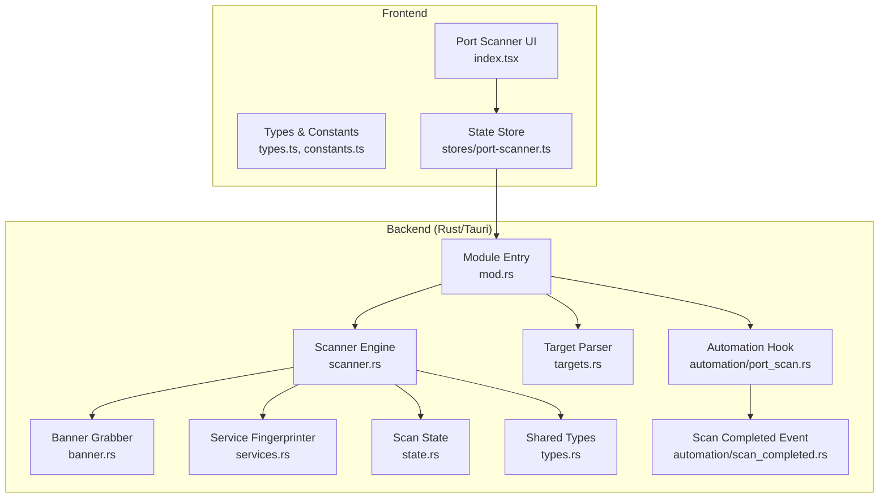
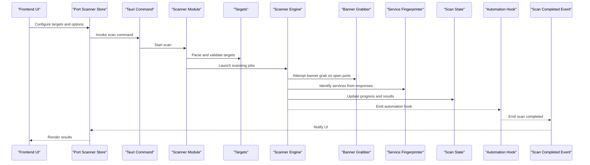
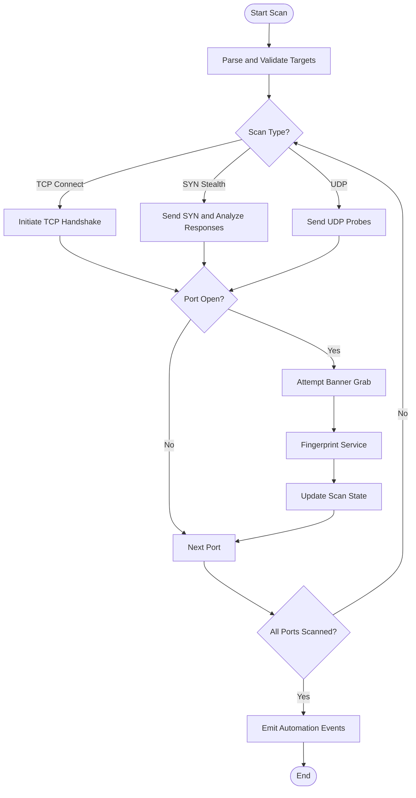
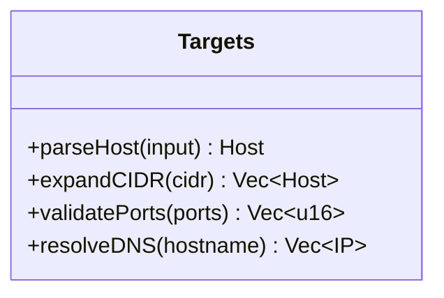
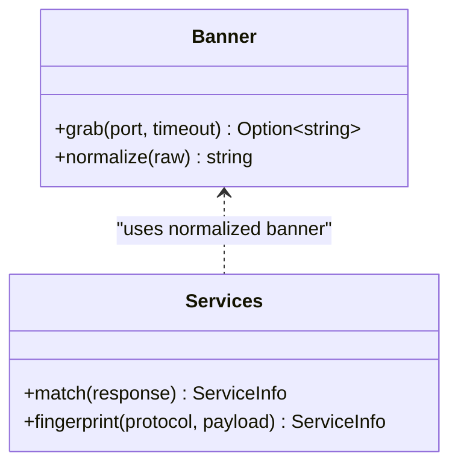
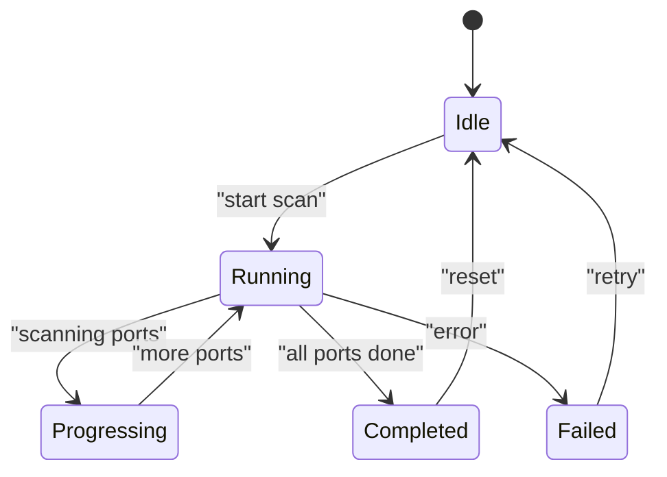
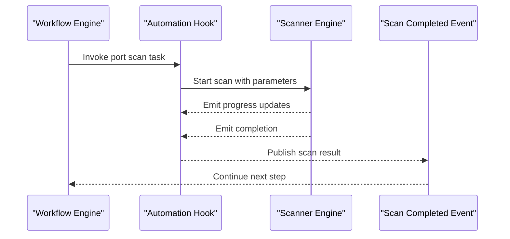
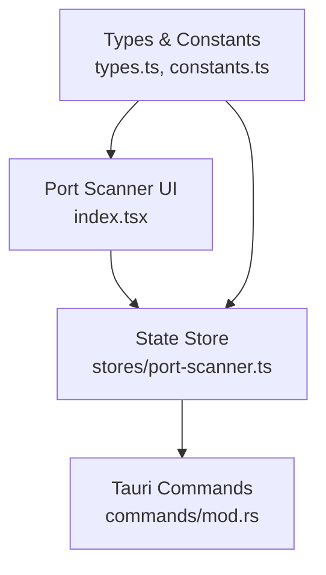
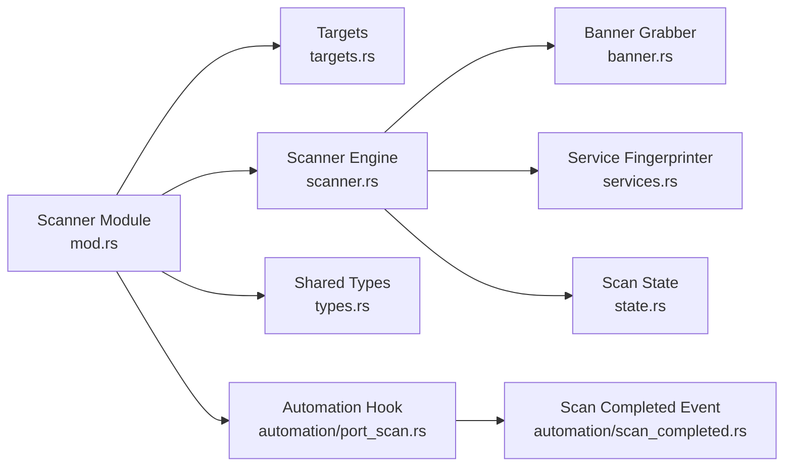

# Port Scanner & Network Reconnaissance

<cite>
**Referenced Files in This Document**
- [port-scanner/mod.rs](file://src-tauri/src/port-scanner/mod.rs)
- [port-scanner/scanner.rs](file://src-tauri/src/port-scanner/scanner.rs)
- [port-scanner/banner.rs](file://src-tauri/src/port-scanner/banner.rs)
- [port-scanner/services.rs](file://src-tauri/src/port-scanner/services.rs)
- [port-scanner/targets.rs](file://src-tauri/src/port-scanner/targets.rs)
- [port-scanner/state.rs](file://src-tauri/src/port-scanner/state.rs)
- [port-scanner/types.rs](file://src-tauri/src/port-scanner/types.rs)
- [automation/port_scan.rs](file://src-tauri/src/automation/port_scan.rs)
- [automation/scan_completed.rs](file://src-tauri/src/automation/scan_completed.rs)
- [commands/mod.rs](file://src-tauri/src/commands/mod.rs)
- [pages/port-scanner/index.tsx](file://src/pages/port-scanner/index.tsx)
- [pages/port-scanner/constants.ts](file://src/pages/port-scanner/constants.ts)
- [pages/port-scanner/types.ts](file://src/pages/port-scanner/types.ts)
- [stores/port-scanner.ts](file://src/stores/port-scanner.ts)
</cite>

## Table of Contents
1. [Introduction](#introduction)
2. [Project Structure](#project-structure)
3. [Core Components](#core-components)
4. [Architecture Overview](#architecture-overview)
5. [Detailed Component Analysis](#detailed-component-analysis)
6. [Dependency Analysis](#dependency-analysis)
7. [Performance Considerations](#performance-considerations)
8. [Troubleshooting Guide](#troubleshooting-guide)
9. [Conclusion](#conclusion)
10. [Appendices](#appendices)

## Introduction
This document explains Apprecon’s port scanning and network reconnaissance capabilities, focusing on the scanning engine, target discovery, service identification, scan types, configuration, performance tuning, and security considerations. It also covers advanced features such as banner grabbing, OS detection, and integration with external threat intelligence where applicable. The goal is to help both technical and non-technical users understand how to use the tool effectively and responsibly.

## Project Structure
Apprecon implements its port scanner primarily in Rust (Tauri backend) with a React frontend for user interaction. Key areas include:
- Backend scanning engine and state management
- Target parsing and validation
- Service fingerprinting and banner extraction
- Automation hooks and event emission
- Frontend UI and store synchronization

**Diagram sources**
- [port-scanner/mod.rs](file://src-tauri/src/port-scanner/mod.rs)
- [port-scanner/scanner.rs](file://src-tauri/src/port-scanner/scanner.rs)
- [port-scanner/banner.rs](file://src-tauri/src/port-scanner/banner.rs)
- [port-scanner/services.rs](file://src-tauri/src/port-scanner/services.rs)
- [port-scanner/targets.rs](file://src-tauri/src/port-scanner/targets.rs)
- [port-scanner/state.rs](file://src-tauri/src/port-scanner/state.rs)
- [port-scanner/types.rs](file://src-tauri/src/port-scanner/types.rs)
- [automation/port_scan.rs](file://src-tauri/src/automation/port_scan.rs)
- [automation/scan_completed.rs](file://src-tauri/src/automation/scan_completed.rs)
- [pages/port-scanner/index.tsx](file://src/pages/port-scanner/index.tsx)
- [pages/port-scanner/types.ts](file://src/pages/port-scanner/types.ts)
- [pages/port-scanner/constants.ts](file://src/pages/port-scanner/constants.ts)
- [stores/port-scanner.ts](file://src/stores/port-scanner.ts)

**Section sources**
- [port-scanner/mod.rs](file://src-tauri/src/port-scanner/mod.rs)
- [pages/port-scanner/index.tsx](file://src/pages/port-scanner/index.tsx)
- [stores/port-scanner.ts](file://src/stores/port-scanner.ts)

## Core Components
- Scanner Engine: Orchestrates connection attempts, manages concurrency, and aggregates results.
- Target Discovery: Parses hostnames, IPs, CIDR ranges, and port specifications; validates inputs.
- Service Identification: Matches known service signatures and fingerprints based on responses.
- Banner Grabbing: Retrieves application banners from open ports to enrich findings.
- Scan State: Tracks progress, status, and outcomes across scans.
- Shared Types: Defines data structures used by both frontend and backend.
- Automation Hooks: Integrates scanning into workflows and emits completion events.

**Section sources**
- [port-scanner/scanner.rs](file://src-tauri/src/port-scanner/scanner.rs)
- [port-scanner/targets.rs](file://src-tauri/src/port-scanner/targets.rs)
- [port-scanner/services.rs](file://src-tauri/src/port-scanner/services.rs)
- [port-scanner/banner.rs](file://src-tauri/src/port-scanner/banner.rs)
- [port-scanner/state.rs](file://src-tauri/src/port-scanner/state.rs)
- [port-scanner/types.rs](file://src-tauri/src/port-scanner/types.rs)
- [automation/port_scan.rs](file://src-tauri/src/automation/port_scan.rs)
- [automation/scan_completed.rs](file://src-tauri/src/automation/scan_completed.rs)

## Architecture Overview
The port scanner follows a layered architecture:
- Frontend UI collects targets and options, then invokes backend commands via Tauri.
- Backend module coordinates target parsing, scanning, banner grabbing, and service identification.
- Results are streamed or aggregated and exposed back to the frontend through stores and events.
- Automation subsystem integrates scanning into broader workflows and emits lifecycle events.

**Diagram sources**
- [pages/port-scanner/index.tsx](file://src/pages/port-scanner/index.tsx)
- [stores/port-scanner.ts](file://src/stores/port-scanner.ts)
- [commands/mod.rs](file://src-tauri/src/commands/mod.rs)
- [port-scanner/mod.rs](file://src-tauri/src/port-scanner/mod.rs)
- [port-scanner/targets.rs](file://src-tauri/src/port-scanner/targets.rs)
- [port-scanner/scanner.rs](file://src-tauri/src/port-scanner/scanner.rs)
- [port-scanner/banner.rs](file://src-tauri/src/port-scanner/banner.rs)
- [port-scanner/services.rs](file://src-tauri/src/port-scanner/services.rs)
- [port-scanner/state.rs](file://src-tauri/src/port-scanner/state.rs)
- [automation/port_scan.rs](file://src-tauri/src/automation/port_scan.rs)
- [automation/scan_completed.rs](file://src-tauri/src/automation/scan_completed.rs)

## Detailed Component Analysis

### Scanner Engine
Responsibilities:
- Execute different scan types (TCP connect, SYN stealth, UDP).
- Manage concurrency and rate limiting.
- Aggregate open/closed/filtered states per port.
- Integrate banner grabbing and service fingerprinting.

Key behaviors:
- TCP Connect: Establishes full TCP handshake to determine port state.
- SYN Stealth: Sends SYN packets and interprets responses for faster, less intrusive scans.
- UDP Scanning: Probes common UDP services using protocol-specific probes.

**Diagram sources**
- [port-scanner/scanner.rs](file://src-tauri/src/port-scanner/scanner.rs)
- [port-scanner/banner.rs](file://src-tauri/src/port-scanner/banner.rs)
- [port-scanner/services.rs](file://src-tauri/src/port-scanner/services.rs)
- [port-scanner/state.rs](file://src-tauri/src/port-scanner/state.rs)

**Section sources**
- [port-scanner/scanner.rs](file://src-tauri/src/port-scanner/scanner.rs)
- [port-scanner/state.rs](file://src-tauri/src/port-scanner/state.rs)

### Target Discovery
Responsibilities:
- Accept hostnames, IPv4/IPv6 addresses, CIDR ranges, and port lists/ranges.
- Resolve DNS names and expand CIDR ranges into individual hosts.
- Validate inputs and return structured target sets.

**Diagram sources**
- [port-scanner/targets.rs](file://src-tauri/src/port-scanner/targets.rs)

**Section sources**
- [port-scanner/targets.rs](file://src-tauri/src/port-scanner/targets.rs)

### Service Identification and Banner Grabbing
Responsibilities:
- Extract banners from open ports to identify applications and versions.
- Match response patterns to known service signatures.
- Provide enriched metadata for vulnerability correlation.

**Diagram sources**
- [port-scanner/banner.rs](file://src-tauri/src/port-scanner/banner.rs)
- [port-scanner/services.rs](file://src-tauri/src/port-scanner/services.rs)

**Section sources**
- [port-scanner/banner.rs](file://src-tauri/src/port-scanner/banner.rs)
- [port-scanner/services.rs](file://src-tauri/src/port-scanner/services.rs)

### Scan State Management
Responsibilities:
- Track current scan status, progress, and results.
- Persist intermediate findings and final outputs.
- Expose state updates to the frontend and automation subsystem.

**Diagram sources**
- [port-scanner/state.rs](file://src-tauri/src/port-scanner/state.rs)

**Section sources**
- [port-scanner/state.rs](file://src-tauri/src/port-scanner/state.rs)

### Automation Integration
Responsibilities:
- Trigger scans programmatically within workflows.
- Emit lifecycle events upon completion.
- Allow chaining with other tools and analysis steps.

**Diagram sources**
- [automation/port_scan.rs](file://src-tauri/src/automation/port_scan.rs)
- [automation/scan_completed.rs](file://src-tauri/src/automation/scan_completed.rs)

**Section sources**
- [automation/port_scan.rs](file://src-tauri/src/automation/port_scan.rs)
- [automation/scan_completed.rs](file://src-tauri/src/automation/scan_completed.rs)

### Frontend Interface and Store
Responsibilities:
- Present target input forms, scan options, and results.
- Manage local state and synchronize with backend via Tauri commands.
- Display real-time progress and detailed findings.

**Diagram sources**
- [pages/port-scanner/index.tsx](file://src/pages/port-scanner/index.tsx)
- [pages/port-scanner/types.ts](file://src/pages/port-scanner/types.ts)
- [pages/port-scanner/constants.ts](file://src/pages/port-scanner/constants.ts)
- [stores/port-scanner.ts](file://src/stores/port-scanner.ts)
- [commands/mod.rs](file://src-tauri/src/commands/mod.rs)

**Section sources**
- [pages/port-scanner/index.tsx](file://src/pages/port-scanner/index.tsx)
- [pages/port-scanner/types.ts](file://src/pages/port-scanner/types.ts)
- [pages/port-scanner/constants.ts](file://src/pages/port-scanner/constants.ts)
- [stores/port-scanner.ts](file://src/stores/port-scanner.ts)
- [commands/mod.rs](file://src-tauri/src/commands/mod.rs)

## Dependency Analysis
The port scanner module depends on several internal components and exposes interfaces to the frontend and automation subsystem.

**Diagram sources**
- [port-scanner/mod.rs](file://src-tauri/src/port-scanner/mod.rs)
- [port-scanner/targets.rs](file://src-tauri/src/port-scanner/targets.rs)
- [port-scanner/scanner.rs](file://src-tauri/src/port-scanner/scanner.rs)
- [port-scanner/banner.rs](file://src-tauri/src/port-scanner/banner.rs)
- [port-scanner/services.rs](file://src-tauri/src/port-scanner/services.rs)
- [port-scanner/state.rs](file://src-tauri/src/port-scanner/state.rs)
- [port-scanner/types.rs](file://src-tauri/src/port-scanner/types.rs)
- [automation/port_scan.rs](file://src-tauri/src/automation/port_scan.rs)
- [automation/scan_completed.rs](file://src-tauri/src/automation/scan_completed.rs)

**Section sources**
- [port-scanner/mod.rs](file://src-tauri/src/port-scanner/mod.rs)

## Performance Considerations
- Concurrency Control: Adjust worker pool size to balance throughput and resource usage.
- Rate Limiting: Implement request pacing to avoid overwhelming targets or triggering defenses.
- Timeout Tuning: Optimize timeouts per protocol to reduce latency while maintaining accuracy.
- Selective Scanning: Focus on high-value ports or specific services to minimize noise.
- Result Caching: Cache repeated lookups for DNS resolution and service signatures.

[No sources needed since this section provides general guidance]

## Troubleshooting Guide
Common issues and resolutions:
- Permission Errors: Ensure sufficient privileges for raw socket operations (e.g., SYN stealth).
- Firewall Interference: Verify firewall rules allow outbound connections and ICMP if required.
- Slow Scans: Reduce concurrency or limit port ranges; check network latency.
- Inaccurate Fingerprints: Update signature databases and refine matching logic.
- Event Not Emitted: Confirm automation hooks are registered and events are published.

**Section sources**
- [port-scanner/state.rs](file://src-tauri/src/port-scanner/state.rs)
- [automation/scan_completed.rs](file://src-tauri/src/automation/scan_completed.rs)

## Conclusion
Apprecon’s port scanner combines a robust Rust-based engine with an intuitive frontend to deliver comprehensive network reconnaissance. By supporting multiple scan types, banner grabbing, service fingerprinting, and automation integration, it enables effective mapping and analysis of network assets. Proper configuration, ethical practices, and attention to performance and security considerations ensure reliable and responsible scanning.

[No sources needed since this section summarizes without analyzing specific files]

## Appendices

### Scan Types Reference
- TCP Connect: Full handshake; reliable but more detectable.
- SYN Stealth: Half-open scan; faster and stealthier.
- UDP Scanning: Protocol-specific probes; useful for identifying UDP services.

**Section sources**
- [port-scanner/scanner.rs](file://src-tauri/src/port-scanner/scanner.rs)

### Configuration Options
- Port Range: Specify single ports, ranges, or well-known sets.
- Concurrency: Tune parallelism for speed vs. stability.
- Timeouts: Set per-operation timeouts for responsiveness.
- Output Format: Choose structured formats for downstream processing.

**Section sources**
- [pages/port-scanner/constants.ts](file://src/pages/port-scanner/constants.ts)
- [stores/port-scanner.ts](file://src/stores/port-scanner.ts)

### Ethical Scanning Practices
- Obtain explicit authorization before scanning.
- Respect rate limits and organizational policies.
- Avoid disruptive actions during production environments.
- Document scope and retain audit trails.

[No sources needed since this section provides general guidance]