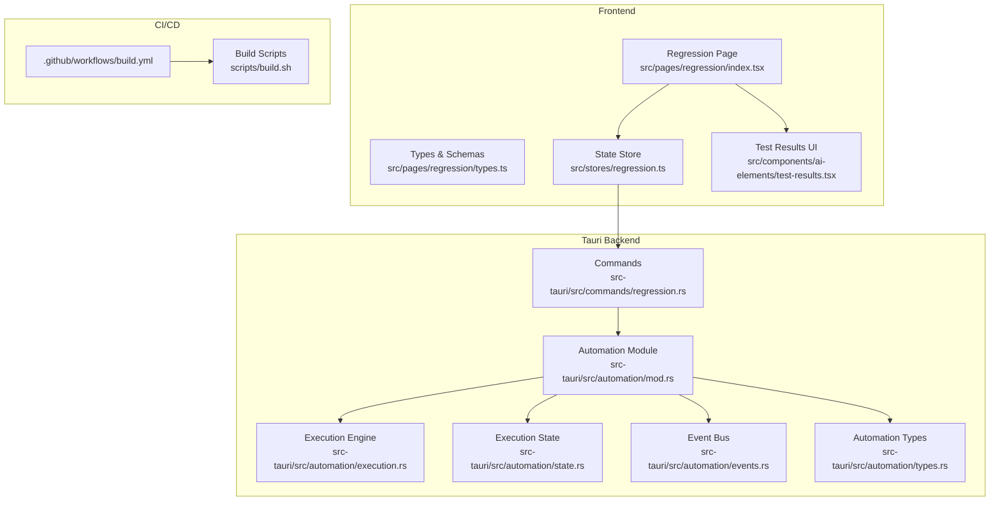
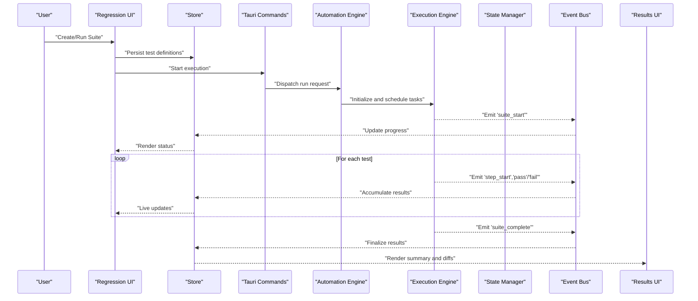
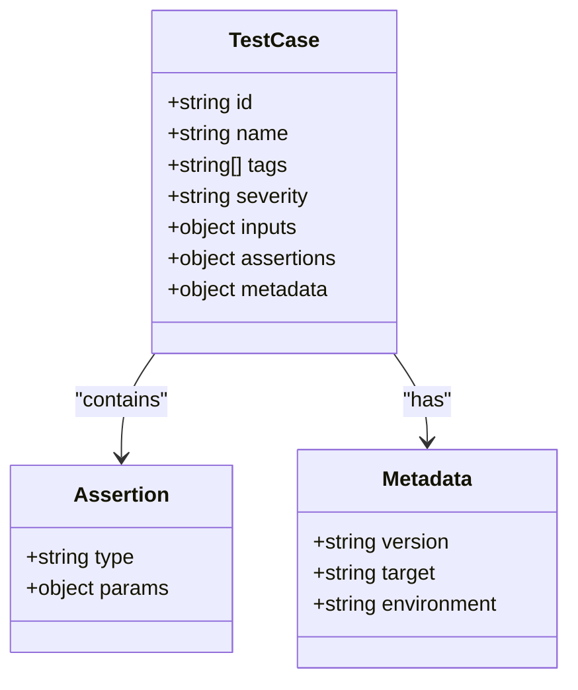
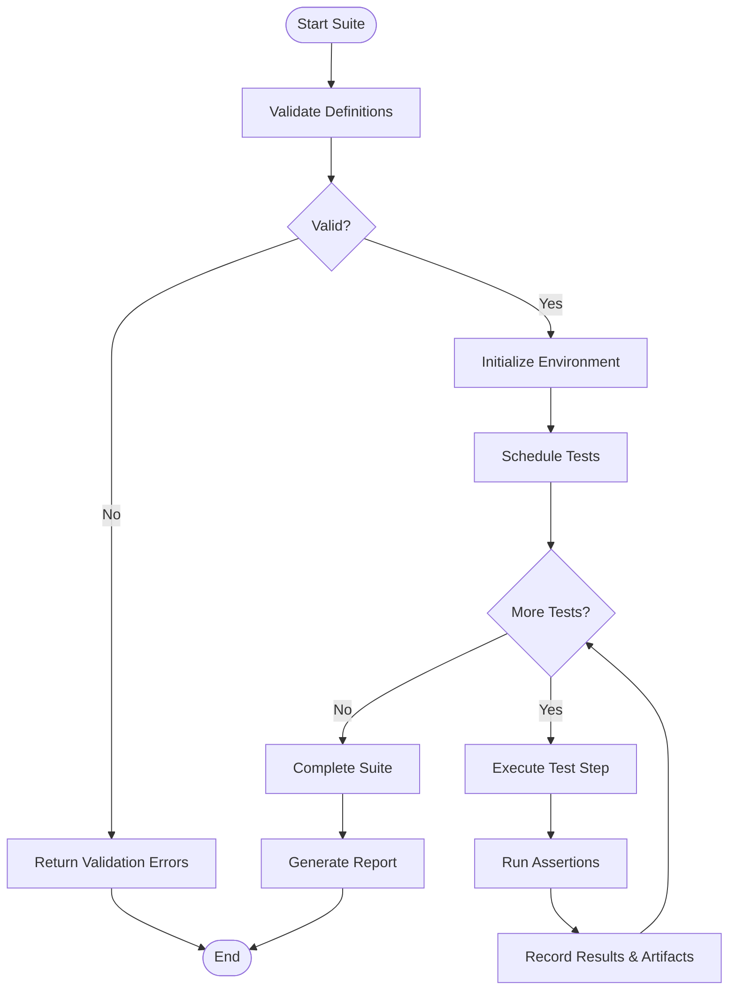
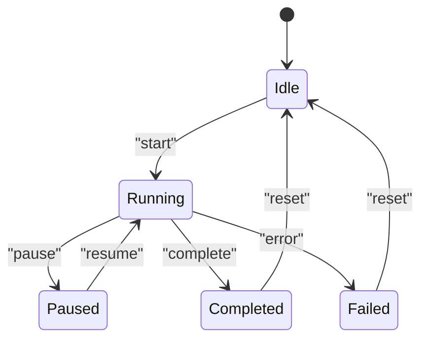
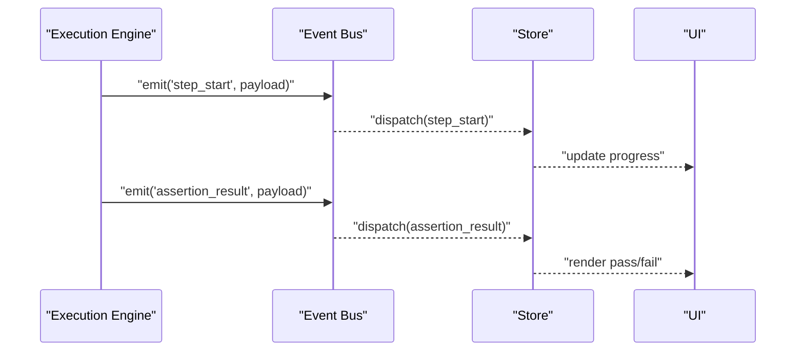
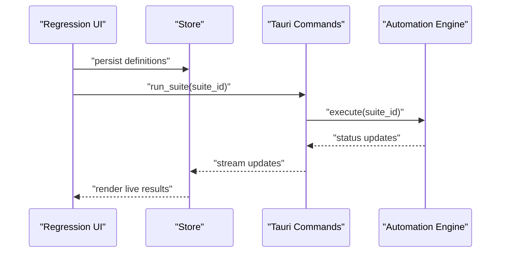
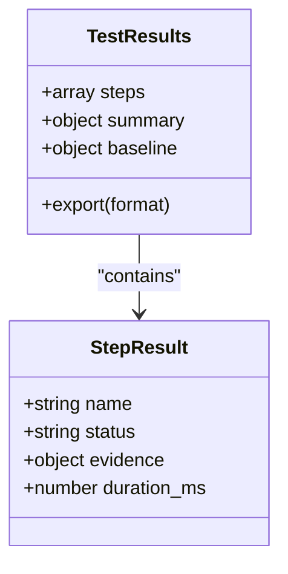
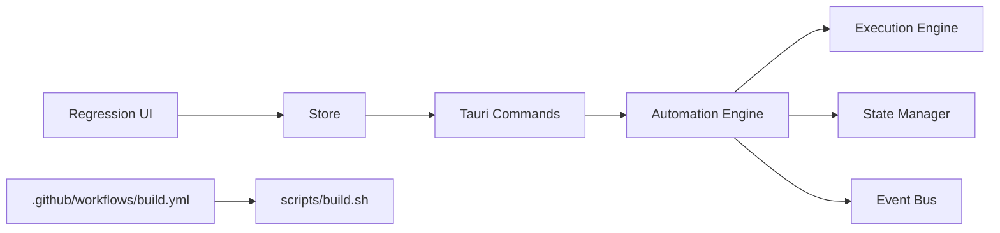
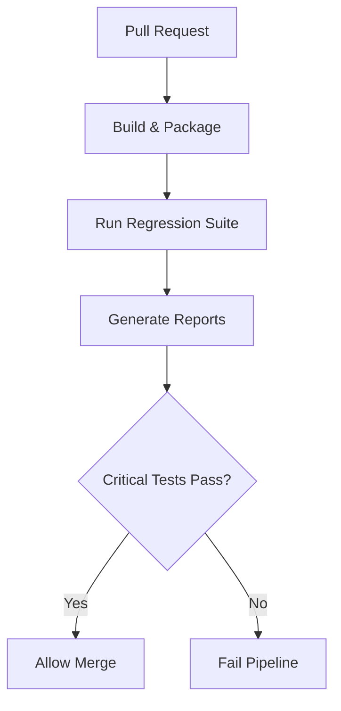

# Regression Security Testing

<cite>
**Referenced Files in This Document**
- [README.md](file://README.md)
- [src/pages/regression/index.tsx](file://src/pages/regression/index.tsx)
- [src/pages/regression/types.ts](file://src/pages/regression/types.ts)
- [src/stores/regression.ts](file://src/stores/regression.ts)
- [src-tauri/src/commands/regression.rs](file://src-tauri/src/commands/regression.rs)
- [src-tauri/src/automation/mod.rs](file://src-tauri/src/automation/mod.rs)
- [src-tauri/src/automation/execution.rs](file://src-tauri/src/automation/execution.rs)
- [src-tauri/src/automation/state.rs](file://src-tauri/src/automation/state.rs)
- [src-tauri/src/automation/events.rs](file://src-tauri/src/automation/events.rs)
- [src-tauri/src/automation/types.rs](file://src-tauri/src/automation/types.rs)
- [src/components/ai-elements/test-results.tsx](file://src/components/ai-elements/test-results.tsx)
- [scripts/build.sh](file://scripts/build.sh)
- [.github/workflows/build.yml](file://.github/workflows/build.yml)
</cite>

## Table of Contents
1. [Introduction](#introduction)
2. [Project Structure](#project-structure)
3. [Core Components](#core-components)
4. [Architecture Overview](#architecture-overview)
5. [Detailed Component Analysis](#detailed-component-analysis)
6. [Dependency Analysis](#dependency-analysis)
7. [Performance Considerations](#performance-considerations)
8. [Troubleshooting Guide](#troubleshooting-guide)
9. [Conclusion](#conclusion)
10. [Appendices](#appendices)

## Introduction
This document explains Apprecon’s regression security testing framework: how to author automated security test suites, define validation rules, execute tests, interpret results, and integrate with CI/CD pipelines. It also covers advanced capabilities such as baseline comparison, trend analysis, and automated remediation suggestions, along with maintenance strategies and environment setup guidance for integrating with existing security toolchains.

## Project Structure
Apprecon implements regression testing across a layered architecture:
- Frontend UI for defining and running tests, viewing results, and managing baselines
- State management for test definitions, execution state, and results
- Tauri backend commands bridging the UI to automation engines
- Automation engine modules for scheduling, execution, eventing, and state tracking
- Build and CI scripts for packaging and pipeline integration

**Diagram sources**
- [src/pages/regression/index.tsx](file://src/pages/regression/index.tsx)
- [src/pages/regression/types.ts](file://src/pages/regression/types.ts)
- [src/stores/regression.ts](file://src/stores/regression.ts)
- [src-tauri/src/commands/regression.rs](file://src-tauri/src/commands/regression.rs)
- [src-tauri/src/automation/mod.rs](file://src-tauri/src/automation/mod.rs)
- [src-tauri/src/automation/execution.rs](file://src-tauri/src/automation/execution.rs)
- [src-tauri/src/automation/state.rs](file://src-tauri/src/automation/state.rs)
- [src-tauri/src/automation/events.rs](file://src-tauri/src/automation/events.rs)
- [src-tauri/src/automation/types.rs](file://src-tauri/src/automation/types.rs)
- [.github/workflows/build.yml](file://.github/workflows/build.yml)
- [scripts/build.sh](file://scripts/build.sh)

**Section sources**
- [README.md](file://README.md)

## Core Components
- Test definition model: structured schema for test cases, assertions, and metadata
- Execution engine: orchestrates test runs, manages concurrency, and handles lifecycle events
- State manager: persists and synchronizes test suite state, progress, and results
- Command layer: exposes Tauri commands to start, stop, query, and export tests
- Event bus: emits granular events (start, step, pass/fail, complete) for UI updates and external integrations
- Results UI: renders outcomes, diffs against baselines, and highlights trends

Key responsibilities:
- Define tests declaratively with clear inputs, expected outputs, and severity
- Execute tests deterministically with reproducible environments
- Capture rich artifacts (logs, payloads, screenshots) for each run
- Compare current results against baselines and report deltas
- Integrate with CI/CD via CLI-friendly commands and standardized output formats

**Section sources**
- [src/pages/regression/types.ts](file://src/pages/regression/types.ts)
- [src-tauri/src/automation/types.rs](file://src-tauri/src/automation/types.rs)
- [src-tauri/src/automation/execution.rs](file://src-tauri/src/automation/execution.rs)
- [src-tauri/src/automation/state.rs](file://src-tauri/src/automation/state.rs)
- [src-tauri/src/automation/events.rs](file://src-tauri/src/automation/events.rs)
- [src/stores/regression.ts](file://src/stores/regression.ts)
- [src-tauri/src/commands/regression.rs](file://src-tauri/src/commands/regression.rs)

## Architecture Overview
The regression testing flow spans frontend orchestration, backend execution, and result reporting:

**Diagram sources**
- [src/pages/regression/index.tsx](file://src/pages/regression/index.tsx)
- [src/stores/regression.ts](file://src/stores/regression.ts)
- [src-tauri/src/commands/regression.rs](file://src-tauri/src/commands/regression.rs)
- [src-tauri/src/automation/mod.rs](file://src-tauri/src/automation/mod.rs)
- [src-tauri/src/automation/execution.rs](file://src-tauri/src/automation/execution.rs)
- [src-tauri/src/automation/state.rs](file://src/tauri/src/automation/state.rs)
- [src-tauri/src/automation/events.rs](file://src-tauri/src/automation/events.rs)

## Detailed Component Analysis

### Test Definition Model
- Purpose: Define test cases, assertions, and metadata in a structured format
- Key aspects:
  - Inputs: endpoints, payloads, headers, environment variables
  - Assertions: HTTP status, response body fields, security headers, timing thresholds
  - Metadata: tags, severity, dependencies, skip conditions
- Extensibility: pluggable assertion types and custom validators

**Diagram sources**
- [src/pages/regression/types.ts](file://src/pages/regression/types.ts)
- [src-tauri/src/automation/types.rs](file://src-tauri/src/automation/types.rs)

**Section sources**
- [src/pages/regression/types.ts](file://src/pages/regression/types.ts)
- [src-tauri/src/automation/types.rs](file://src-tauri/src/automation/types.rs)

### Execution Engine
- Responsibilities:
  - Parse and validate test definitions
  - Schedule and execute tests with concurrency control
  - Capture logs, artifacts, and metrics per step
  - Handle timeouts, retries, and error propagation
- Concurrency model:
  - Parallel execution within constraints (e.g., rate limits, resource quotas)
  - Dependency-aware ordering when required
- Lifecycle hooks:
  - Pre/post actions for environment setup and teardown
  - Step-level hooks for instrumentation

**Diagram sources**
- [src-tauri/src/automation/execution.rs](file://src-tauri/src/automation/execution.rs)
- [src-tauri/src/automation/state.rs](file://src-tauri/src/automation/state.rs)

**Section sources**
- [src-tauri/src/automation/execution.rs](file://src-tauri/src/automation/execution.rs)
- [src-tauri/src/automation/state.rs](file://src-tauri/src/automation/state.rs)

### State Management
- Tracks suite progress, active steps, and accumulated results
- Persists snapshots for resuming interrupted runs
- Exposes APIs for querying current state and exporting results

**Diagram sources**
- [src-tauri/src/automation/state.rs](file://src-tauri/src/automation/state.rs)

**Section sources**
- [src/stores/regression.ts](file://src/stores/regression.ts)
- [src-tauri/src/automation/state.rs](file://src-tauri/src/automation/state.rs)

### Event Bus
- Emits granular events for real-time UI updates and external listeners
- Event types include suite start/complete, step start/end, pass/fail, and errors
- Supports filtering and subscription patterns for decoupled consumers

**Diagram sources**
- [src-tauri/src/automation/events.rs](file://src-tauri/src/automation/events.rs)

**Section sources**
- [src-tauri/src/automation/events.rs](file://src-tauri/src/automation/events.rs)

### Command Layer (Tauri)
- Exposes commands to start/stop suites, query status, and export reports
- Bridges frontend calls to backend automation modules
- Handles serialization/deserialization between JS and Rust types

**Diagram sources**
- [src-tauri/src/commands/regression.rs](file://src-tauri/src/commands/regression.rs)
- [src-tauri/src/automation/mod.rs](file://src-tauri/src/automation/mod.rs)

**Section sources**
- [src-tauri/src/commands/regression.rs](file://src-tauri/src/commands/regression.rs)
- [src-tauri/src/automation/mod.rs](file://src-tauri/src/automation/mod.rs)

### Results UI and Reporting
- Displays pass/fail summaries, step details, and evidence artifacts
- Highlights differences from baseline runs
- Provides export options (JSON, HTML, SARIF-compatible)

**Diagram sources**
- [src/components/ai-elements/test-results.tsx](file://src/components/ai-elements/test-results.tsx)

**Section sources**
- [src/components/ai-elements/test-results.tsx](file://src/components/ai-elements/test-results.tsx)

## Dependency Analysis
High-level dependency relationships:
- Frontend depends on store for state synchronization
- Store invokes Tauri commands for backend operations
- Commands delegate to automation modules
- Automation modules coordinate execution, state, and events
- CI/CD triggers build and packaging workflows

**Diagram sources**
- [src/pages/regression/index.tsx](file://src/pages/regression/index.tsx)
- [src/stores/regression.ts](file://src/stores/regression.ts)
- [src-tauri/src/commands/regression.rs](file://src-tauri/src/commands/regression.rs)
- [src-tauri/src/automation/mod.rs](file://src-tauri/src/automation/mod.rs)
- [src-tauri/src/automation/execution.rs](file://src-tauri/src/automation/execution.rs)
- [src-tauri/src/automation/state.rs](file://src-tauri/src/automation/state.rs)
- [src-tauri/src/automation/events.rs](file://src-tauri/src/automation/events.rs)
- [.github/workflows/build.yml](file://.github/workflows/build.yml)
- [scripts/build.sh](file://scripts/build.sh)

**Section sources**
- [src/stores/regression.ts](file://src/stores/regression.ts)
- [src-tauri/src/commands/regression.rs](file://src-tauri/src/commands/regression.rs)
- [src-tauri/src/automation/mod.rs](file://src-tauri/src/automation/mod.rs)

## Performance Considerations
- Concurrency tuning: adjust parallelism based on target capacity and resource constraints
- Caching: cache static assets and reusable responses where safe
- Artifact management: compress or offload large artifacts to storage backends
- Streaming updates: use incremental event processing to avoid UI bottlenecks
- Timeouts and retries: configure sensible defaults to prevent hangs and flaky runs

[No sources needed since this section provides general guidance]

## Troubleshooting Guide
Common issues and resolutions:
- Validation failures: ensure test definitions conform to schema; check required fields and types
- Execution timeouts: increase timeout thresholds or optimize slow assertions
- Missing artifacts: verify file permissions and paths; confirm environment variables
- Event stream interruptions: reinitialize event subscriptions; check network stability
- Baseline mismatches: review assertion sensitivity and normalize dynamic values

**Section sources**
- [src-tauri/src/automation/execution.rs](file://src-tauri/src/automation/execution.rs)
- [src-tauri/src/automation/state.rs](file://src-tauri/src/automation/state.rs)
- [src-tauri/src/automation/events.rs](file://src-tauri/src/automation/events.rs)

## Conclusion
Apprecon’s regression security testing framework provides a robust, extensible foundation for building automated security test suites. With clear test definitions, a powerful execution engine, rich eventing, and comprehensive reporting, teams can integrate security regression testing into their development workflow and CI/CD pipelines effectively. Advanced features like baseline comparison and trend analysis enable proactive risk management and continuous improvement.

[No sources needed since this section summarizes without analyzing specific files]

## Appendices

### Creating Automated Security Test Suites
- Define test cases with explicit inputs, assertions, and metadata
- Group related tests into suites with shared configuration
- Use tags and severities to prioritize and filter runs
- Version test definitions alongside application code

**Section sources**
- [src/pages/regression/types.ts](file://src/pages/regression/types.ts)
- [src-tauri/src/automation/types.rs](file://src-tauri/src/automation/types.rs)

### Defining Validation Rules
- Implement assertion types for HTTP responses, headers, and payloads
- Add custom validators for domain-specific checks
- Support conditional assertions based on environment or context

**Section sources**
- [src-tauri/src/automation/execution.rs](file://src-tauri/src/automation/execution.rs)
- [src-tauri/src/automation/types.rs](file://src-tauri/src/automation/types.rs)

### Integrating with CI/CD Pipelines
- Trigger test runs on pull requests and scheduled jobs
- Export results in standard formats for downstream tools
- Gate merges on passing critical security tests

**Diagram sources**
- [.github/workflows/build.yml](file://.github/workflows/build.yml)
- [scripts/build.sh](file://scripts/build.sh)

**Section sources**
- [.github/workflows/build.yml](file://.github/workflows/build.yml)
- [scripts/build.sh](file://scripts/build.sh)

### Interpreting Results and Reporting
- Review pass/fail summaries and step-level details
- Inspect evidence artifacts for failed assertions
- Compare against baselines to identify regressions

**Section sources**
- [src/components/ai-elements/test-results.tsx](file://src/components/ai-elements/test-results.tsx)

### Advanced Features
- Baseline comparison: snapshot expected behavior and detect deviations
- Trend analysis: track metric changes over time to identify drift
- Automated remediation suggestions: generate actionable fixes based on failure patterns

**Section sources**
- [src-tauri/src/automation/execution.rs](file://src-tauri/src/automation/execution.rs)
- [src-tauri/src/automation/state.rs](file://src-tauri/src/automation/state.rs)

### Test Maintenance Strategies
- Regularly update assertions to reflect legitimate behavior changes
- De-duplicate overlapping tests and consolidate coverage
- Maintain environment configurations and secrets securely

**Section sources**
- [src/stores/regression.ts](file://src/stores/regression.ts)
- [src-tauri/src/commands/regression.rs](file://src-tauri/src/commands/regression.rs)

### Environment Setup and Toolchain Integration
- Configure targets, proxies, and credentials for test execution
- Integrate with existing scanners and validators via plugins
- Standardize output formats for unified dashboards

**Section sources**
- [src-tauri/src/automation/types.rs](file://src-tauri/src/automation/types.rs)
- [src-tauri/src/automation/mod.rs](file://src-tauri/src/automation/mod.rs)