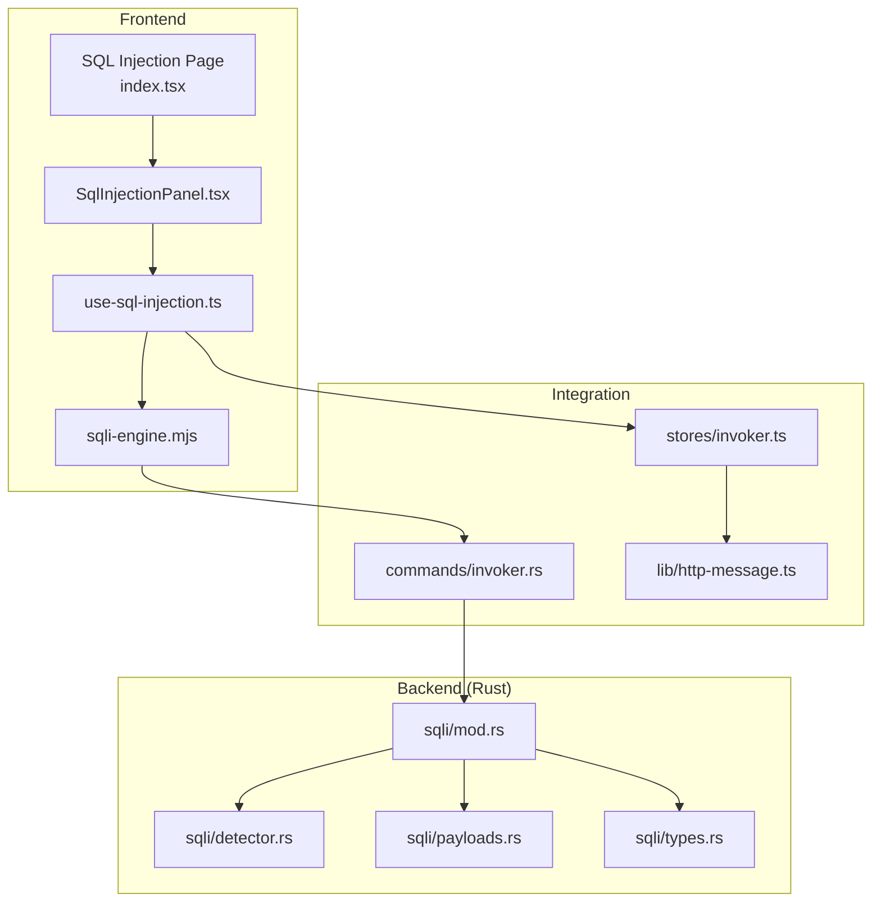
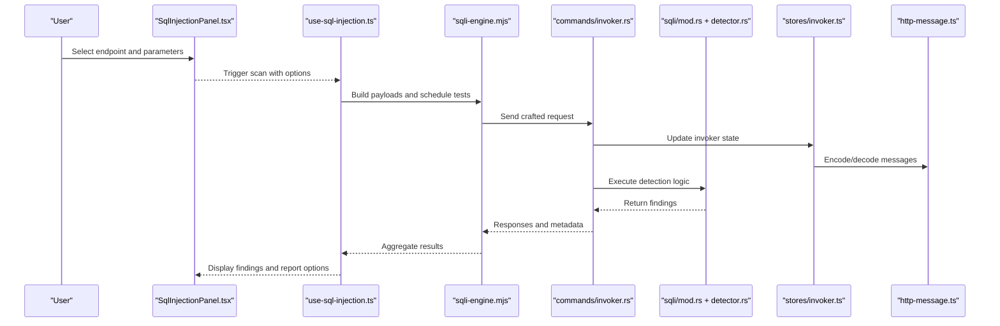
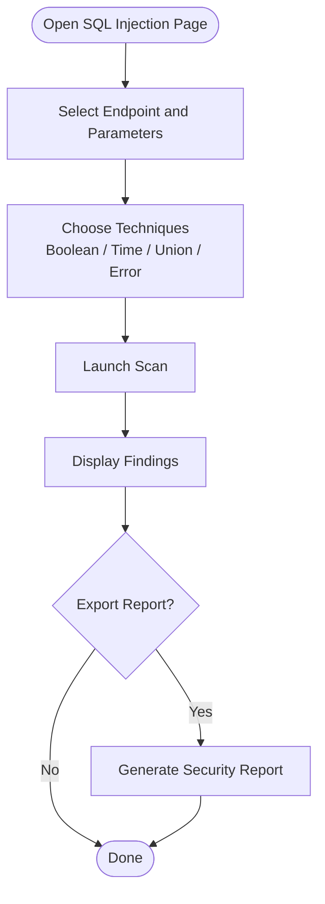
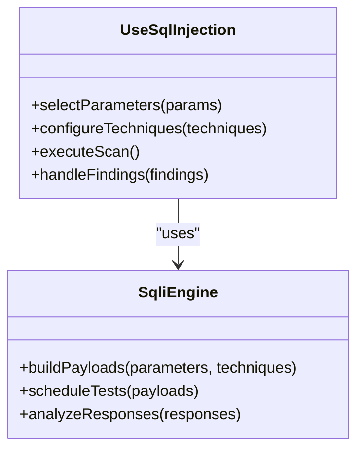
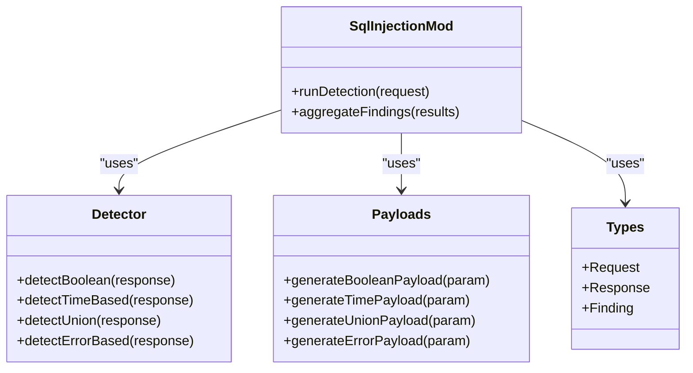
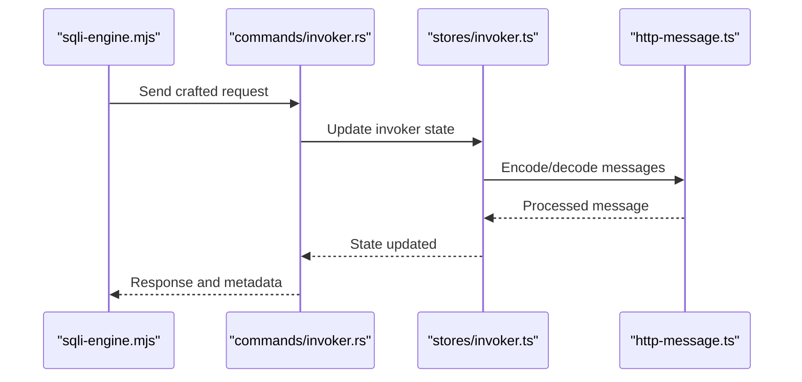
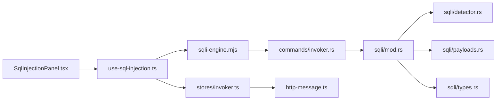

# SQL Injection Testing

<cite>
**Referenced Files in This Document**
- [src/pages/sql-injection/index.tsx](file://src/pages/sql-injection/index.tsx)
- [src/pages/sql-injection/types.ts](file://src/pages/sql-injection/types.ts)
- [src/pages/sql-injection/constants.ts](file://src/pages/sql-injection/constants.ts)
- [src/pages/sql-injection/hooks/use-sql-injection.ts](file://src/pages/sql-injection/hooks/use-sql-injection.ts)
- [src/pages/sql-injection/components/SqlInjectionPanel.tsx](file://src/pages/sql-injection/components/SqlInjectionPanel.tsx)
- [src/pages/sql-injection/lib/sqli-engine.mjs](file://src/pages/sql-injection/lib/sqli-engine.mjs)
- [src-tauri/src/sqli/mod.rs](file://src-tauri/src/sqli/mod.rs)
- [src-tauri/src/sqli/detector.rs](file://src-tauri/src/sqli/detector.rs)
- [src-tauri/src/sqli/payloads.rs](file://src-tauri/src/sqli/payloads.rs)
- [src-tauri/src/sqli/types.rs](file://src-tauri/src/sqli/types.rs)
- [src-tauri/src/commands/invoker.rs](file://src-tauri/src/commands/invoker.rs)
- [src/stores/invoker.ts](file://src/stores/invoker.ts)
- [src/lib/http-message.ts](file://src/lib/http-message.ts)
</cite>

## Table of Contents
1. [Introduction](#introduction)
2. [Project Structure](#project-structure)
3. [Core Components](#core-components)
4. [Architecture Overview](#architecture-overview)
5. [Detailed Component Analysis](#detailed-component-analysis)
6. [Dependency Analysis](#dependency-analysis)
7. [Performance Considerations](#performance-considerations)
8. [Troubleshooting Guide](#troubleshooting-guide)
9. [Conclusion](#conclusion)
10. [Appendices](#appendices)

## Introduction
This document explains Apprecon’s SQL injection testing capabilities, including the automated vulnerability detection engine, parameter analysis tools, and payload generation system. It covers how to identify vulnerable endpoints, test different SQL injection techniques (boolean-based, time-based, union-based), extract database information, create custom payloads, interpret results, and generate security reports. Advanced features such as blind SQL injection detection, error-based extraction, and integration with database schemas are also addressed. Best practices for safe testing, avoiding data corruption, and handling false positives are included.

## Project Structure
Apprecon implements SQL injection testing across both the frontend UI and a Rust backend:
- Frontend page and hooks manage user interactions, parameter selection, and result visualization.
- A lightweight engine orchestrates payload execution and response analysis.
- The Rust backend provides robust detection logic, payload sets, and type definitions.
- Integration with the Invoker module enables sending crafted requests through Apprecon’s HTTP pipeline.

**Diagram sources**
- [src/pages/sql-injection/index.tsx](file://src/pages/sql-injection/index.tsx)
- [src/pages/sql-injection/components/SqlInjectionPanel.tsx](file://src/pages/sql-injection/components/SqlInjectionPanel.tsx)
- [src/pages/sql-injection/hooks/use-sql-injection.ts](file://src/pages/sql-injection/hooks/use-sql-injection.ts)
- [src/pages/sql-injection/lib/sqli-engine.mjs](file://src/pages/sql-injection/lib/sqli-engine.mjs)
- [src-tauri/src/sqli/mod.rs](file://src-tauri/src/sqli/mod.rs)
- [src-tauri/src/sqli/detector.rs](file://src-tauri/src/sqli/detector.rs)
- [src-tauri/src/sqli/payloads.rs](file://src-tauri/src/sqli/payloads.rs)
- [src-tauri/src/sqli/types.rs](file://src-tauri/src/sqli/types.rs)
- [src-tauri/src/commands/invoker.rs](file://src-tauri/src/commands/invoker.rs)
- [src/stores/invoker.ts](file://src/stores/invoker.ts)
- [src/lib/http-message.ts](file://src/lib/http-message.ts)

**Section sources**
- [src/pages/sql-injection/index.tsx](file://src/pages/sql-injection/index.tsx)
- [src/pages/sql-injection/types.ts](file://src/pages/sql-injection/types.ts)
- [src/pages/sql-injection/constants.ts](file://src/pages/sql-injection/constants.ts)
- [src/pages/sql-injection/hooks/use-sql-injection.ts](file://src/pages/sql-injection/hooks/use-sql-injection.ts)
- [src/pages/sql-injection/components/SqlInjectionPanel.tsx](file://src/pages/sql-injection/components/SqlInjectionPanel.tsx)
- [src/pages/sql-injection/lib/sqli-engine.mjs](file://src/pages/sql-injection/lib/sqli-engine.mjs)
- [src-tauri/src/sqli/mod.rs](file://src-tauri/src/sqli/mod.rs)
- [src-tauri/src/sqli/detector.rs](file://src-tauri/src/sqli/detector.rs)
- [src-tauri/src/sqli/payloads.rs](file://src-tauri/src/sqli/payloads.rs)
- [src-tauri/src/sqli/types.rs](file://src-tauri/src/sqli/types.rs)
- [src-tauri/src/commands/invoker.rs](file://src-tauri/src/commands/invoker.rs)
- [src/stores/invoker.ts](file://src/stores/invoker.ts)
- [src/lib/http-message.ts](file://src/lib/http-message.ts)

## Core Components
- SQL Injection Page and Panel: Provide the UI for selecting parameters, choosing techniques, launching scans, and viewing results.
- Hook and Engine: Orchestrate scanning workflows, manage state, and coordinate request/response processing.
- Rust Backend Modules: Implement detection logic, payload generation, and type contracts for consistent communication between frontend and backend.
- Invoker Integration: Sends crafted requests via Apprecon’s HTTP pipeline and captures responses for analysis.

Key responsibilities:
- Parameter discovery and selection from captured traffic or manual input.
- Automated payload generation and execution for multiple SQL injection techniques.
- Response analysis to detect vulnerabilities and classify findings.
- Reporting and export of results for further review.

**Section sources**
- [src/pages/sql-injection/index.tsx](file://src/pages/sql-injection/index.tsx)
- [src/pages/sql-injection/components/SqlInjectionPanel.tsx](file://src/pages/sql-injection/components/SqlInjectionPanel.tsx)
- [src/pages/sql-injection/hooks/use-sql-injection.ts](file://src/pages/sql-injection/hooks/use-sql-injection.ts)
- [src/pages/sql-injection/lib/sqli-engine.mjs](file://src/pages/sql-injection/lib/sqli-engine.mjs)
- [src-tauri/src/sqli/mod.rs](file://src-tauri/src/sqli/mod.rs)
- [src-tauri/src/sqli/detector.rs](file://src-tauri/src/sqli/detector.rs)
- [src-tauri/src/sqli/payloads.rs](file://src-tauri/src/sqli/payloads.rs)
- [src-tauri/src/sqli/types.rs](file://src-tauri/src/sqli/types.rs)
- [src-tauri/src/commands/invoker.rs](file://src-tauri/src/commands/invoker.rs)
- [src/stores/invoker.ts](file://src/stores/invoker.ts)
- [src/lib/http-message.ts](file://src/lib/http-message.ts)

## Architecture Overview
The SQL injection testing flow integrates frontend orchestration with backend detection:
- The UI selects target parameters and techniques.
- The hook/engine prepares payloads and dispatches requests through the Invoker.
- The Rust backend applies detection rules against responses and returns structured findings.
- Results are visualized and can be exported as reports.

**Diagram sources**
- [src/pages/sql-injection/components/SqlInjectionPanel.tsx](file://src/pages/sql-injection/components/SqlInjectionPanel.tsx)
- [src/pages/sql-injection/hooks/use-sql-injection.ts](file://src/pages/sql-injection/hooks/use-sql-injection.ts)
- [src/pages/sql-injection/lib/sqli-engine.mjs](file://src/pages/sql-injection/lib/sqli-engine.mjs)
- [src-tauri/src/commands/invoker.rs](file://src-tauri/src/commands/invoker.rs)
- [src-tauri/src/sqli/mod.rs](file://src-tauri/src/sqli/mod.rs)
- [src-tauri/src/sqli/detector.rs](file://src-tauri/src/sqli/detector.rs)
- [src/stores/invoker.ts](file://src/stores/invoker.ts)
- [src/lib/http-message.ts](file://src/lib/http-message.ts)

## Detailed Component Analysis

### SQL Injection Page and Panel
- Purpose: Present controls for selecting endpoints, parameters, and techniques; display results and allow exporting reports.
- Behavior: Validates inputs, triggers scanning workflows, and updates UI state based on findings.

**Diagram sources**
- [src/pages/sql-injection/index.tsx](file://src/pages/sql-injection/index.tsx)
- [src/pages/sql-injection/components/SqlInjectionPanel.tsx](file://src/pages/sql-injection/components/SqlInjectionPanel.tsx)

**Section sources**
- [src/pages/sql-injection/index.tsx](file://src/pages/sql-injection/index.tsx)
- [src/pages/sql-injection/components/SqlInjectionPanel.tsx](file://src/pages/sql-injection/components/SqlInjectionPanel.tsx)

### Hook and Engine Orchestration
- Purpose: Manage scanning lifecycle, payload generation, and result aggregation.
- Behavior: Coordinates with the Invoker store and HTTP message utilities to send requests and parse responses.

**Diagram sources**
- [src/pages/sql-injection/hooks/use-sql-injection.ts](file://src/pages/sql-injection/hooks/use-sql-injection.ts)
- [src/pages/sql-injection/lib/sqli-engine.mjs](file://src/pages/sql-injection/lib/sqli-engine.mjs)

**Section sources**
- [src/pages/sql-injection/hooks/use-sql-injection.ts](file://src/pages/sql-injection/hooks/use-sql-injection.ts)
- [src/pages/sql-injection/lib/sqli-engine.mjs](file://src/pages/sql-injection/lib/sqli-engine.mjs)

### Rust Backend: Detection, Payloads, and Types
- sqli/mod.rs: Entry point coordinating detection and payload modules.
- sqli/detector.rs: Implements detection logic for boolean-based, time-based, union-based, and error-based techniques.
- sqli/payloads.rs: Generates payloads tailored to different databases and contexts.
- sqli/types.rs: Defines shared types for requests, responses, and findings.

**Diagram sources**
- [src-tauri/src/sqli/mod.rs](file://src-tauri/src/sqli/mod.rs)
- [src-tauri/src/sqli/detector.rs](file://src-tauri/src/sqli/detector.rs)
- [src-tauri/src/sqli/payloads.rs](file://src-tauri/src/sqli/payloads.rs)
- [src-tauri/src/sqli/types.rs](file://src-tauri/src/sqli/types.rs)

**Section sources**
- [src-tauri/src/sqli/mod.rs](file://src-tauri/src/sqli/mod.rs)
- [src-tauri/src/sqli/detector.rs](file://src-tauri/src/sqli/detector.rs)
- [src-tauri/src/sqli/payloads.rs](file://src-tauri/src/sqli/payloads.rs)
- [src-tauri/src/sqli/types.rs](file://src-tauri/src/sqli/types.rs)

### Invoker Integration and HTTP Message Handling
- Purpose: Send crafted requests through Apprecon’s HTTP pipeline and capture responses for analysis.
- Behavior: Updates invoker state, encodes/decodes HTTP messages, and ensures consistent request formatting.

**Diagram sources**
- [src-tauri/src/commands/invoker.rs](file://src-tauri/src/commands/invoker.rs)
- [src/stores/invoker.ts](file://src/stores/invoker.ts)
- [src/lib/http-message.ts](file://src/lib/http-message.ts)

**Section sources**
- [src-tauri/src/commands/invoker.rs](file://src-tauri/src/commands/invoker.rs)
- [src/stores/invoker.ts](file://src/stores/invoker.ts)
- [src/lib/http-message.ts](file://src/lib/http-message.ts)

## Dependency Analysis
The SQL injection testing feature depends on several modules:
- Frontend components rely on hooks and engines for orchestration.
- Engines integrate with the Invoker store and HTTP message utilities.
- Rust backend modules provide core detection and payload generation.
- Shared types ensure consistent communication between frontend and backend.

**Diagram sources**
- [src/pages/sql-injection/components/SqlInjectionPanel.tsx](file://src/pages/sql-injection/components/SqlInjectionPanel.tsx)
- [src/pages/sql-injection/hooks/use-sql-injection.ts](file://src/pages/sql-injection/hooks/use-sql-injection.ts)
- [src/pages/sql-injection/lib/sqli-engine.mjs](file://src/pages/sql-injection/lib/sqli-engine.mjs)
- [src-tauri/src/commands/invoker.rs](file://src-tauri/src/commands/invoker.rs)
- [src-tauri/src/sqli/mod.rs](file://src-tauri/src/sqli/mod.rs)
- [src-tauri/src/sqli/detector.rs](file://src-tauri/src/sqli/detector.rs)
- [src-tauri/src/sqli/payloads.rs](file://src-tauri/src/sqli/payloads.rs)
- [src-tauri/src/sqli/types.rs](file://src-tauri/src/sqli/types.rs)
- [src/stores/invoker.ts](file://src/stores/invoker.ts)
- [src/lib/http-message.ts](file://src/lib/http-message.ts)

**Section sources**
- [src/pages/sql-injection/components/SqlInjectionPanel.tsx](file://src/pages/sql-injection/components/SqlInjectionPanel.tsx)
- [src/pages/sql-injection/hooks/use-sql-injection.ts](file://src/pages/sql-injection/hooks/use-sql-injection.ts)
- [src/pages/sql-injection/lib/sqli-engine.mjs](file://src/pages/sql-injection/lib/sqli-engine.mjs)
- [src-tauri/src/commands/invoker.rs](file://src-tauri/src/commands/invoker.rs)
- [src-tauri/src/sqli/mod.rs](file://src-tauri/src/sqli/mod.rs)
- [src-tauri/src/sqli/detector.rs](file://src-tauri/src/sqli/detector.rs)
- [src-tauri/src/sqli/payloads.rs](file://src-tauri/src/sqli/payloads.rs)
- [src-tauri/src/sqli/types.rs](file://src-tauri/src/sqli/types.rs)
- [src/stores/invoker.ts](file://src/stores/invoker.ts)
- [src/lib/http-message.ts](file://src/lib/http-message.ts)

## Performance Considerations
- Limit concurrent scans to avoid overwhelming targets.
- Use targeted payloads per technique to reduce noise.
- Cache repeated responses where appropriate to speed up iterative testing.
- Prioritize low-impact techniques first (e.g., boolean-based) before time-based probes.
- Monitor response times and adjust timeouts dynamically.

[No sources needed since this section provides general guidance]

## Troubleshooting Guide
Common issues and resolutions:
- False positives: Adjust detection thresholds and refine payload sets.
- No results: Verify parameter selection and ensure correct encoding.
- Slow scans: Reduce concurrency and limit payload sets.
- Data corruption risks: Use read-only payloads and avoid destructive operations.

Best practices:
- Test in isolated environments when possible.
- Validate payloads against known-safe endpoints first.
- Review findings manually to confirm vulnerabilities.
- Export detailed logs and reports for audit trails.

**Section sources**
- [src-tauri/src/sqli/detector.rs](file://src-tauri/src/sqli/detector.rs)
- [src-tauri/src/sqli/payloads.rs](file://src-tauri/src/sqli/payloads.rs)
- [src/pages/sql-injection/lib/sqli-engine.mjs](file://src/pages/sql-injection/lib/sqli-engine.mjs)

## Conclusion
Apprecon’s SQL injection testing combines a user-friendly interface with robust backend detection and payload generation. By leveraging boolean-based, time-based, union-based, and error-based techniques, users can efficiently identify vulnerabilities, extract database information, and generate comprehensive security reports. Following best practices ensures safe and effective testing while minimizing risks and false positives.

[No sources needed since this section summarizes without analyzing specific files]

## Appendices

### Techniques Overview
- Boolean-based: Exploits differences in application behavior based on true/false conditions.
- Time-based: Uses delays to infer truthfulness of conditions.
- Union-based: Injects UNION SELECT statements to retrieve data.
- Error-based: Triggers database errors to extract information.

[No sources needed since this section provides general guidance]

### Custom Payload Creation
- Define context-aware payloads for specific parameters.
- Use encoding and obfuscation techniques to bypass filters.
- Validate payloads against safe targets before full scans.

[No sources needed since this section provides general guidance]

### Database Schema Integration
- Leverage schema introspection queries to map tables and columns.
- Correlate findings with schema metadata for precise exploitation paths.

[No sources needed since this section provides general guidance]