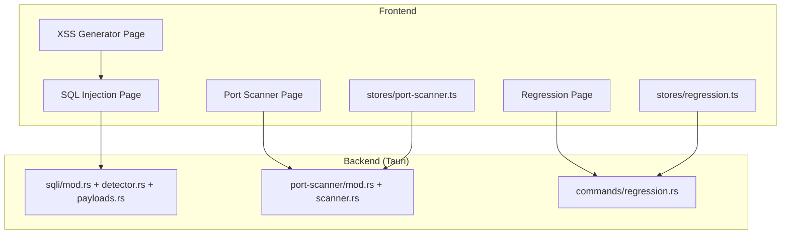
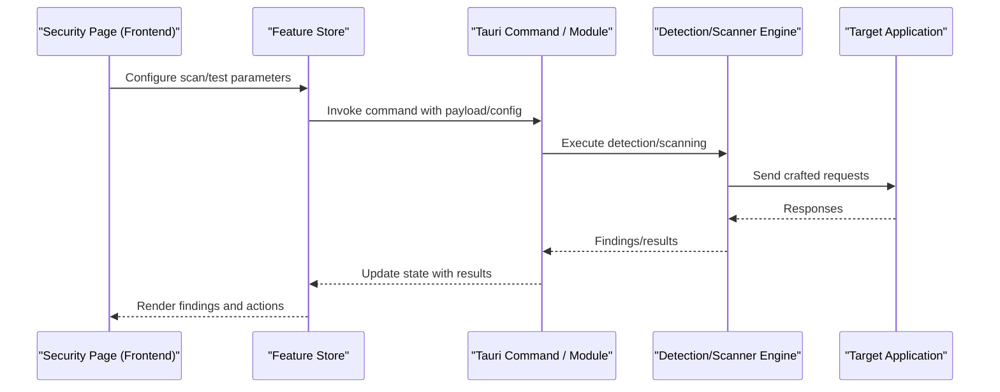
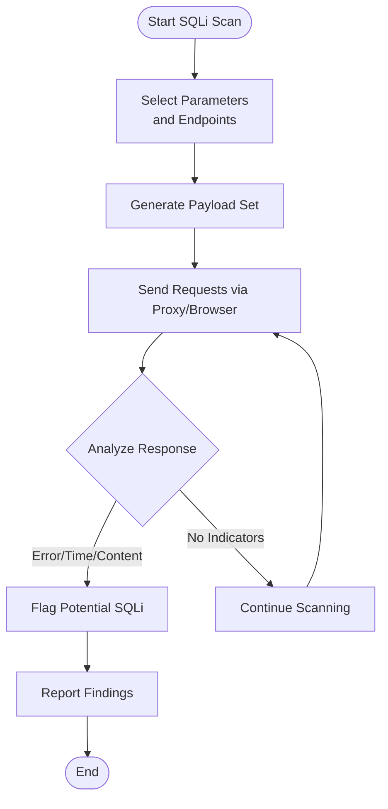
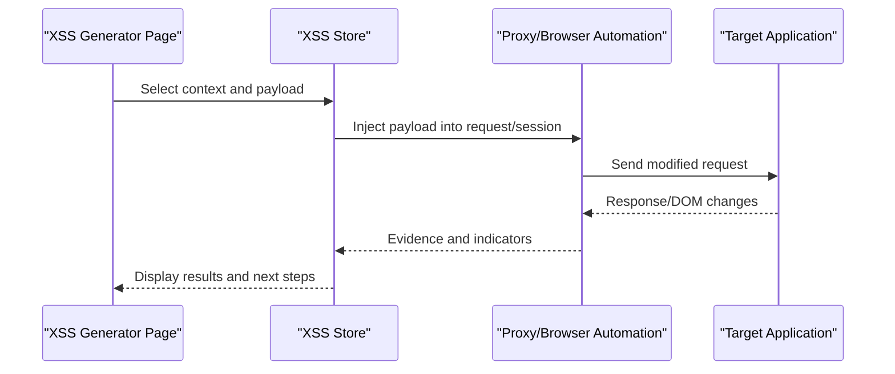
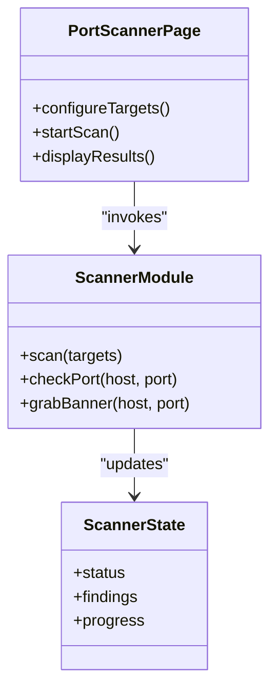
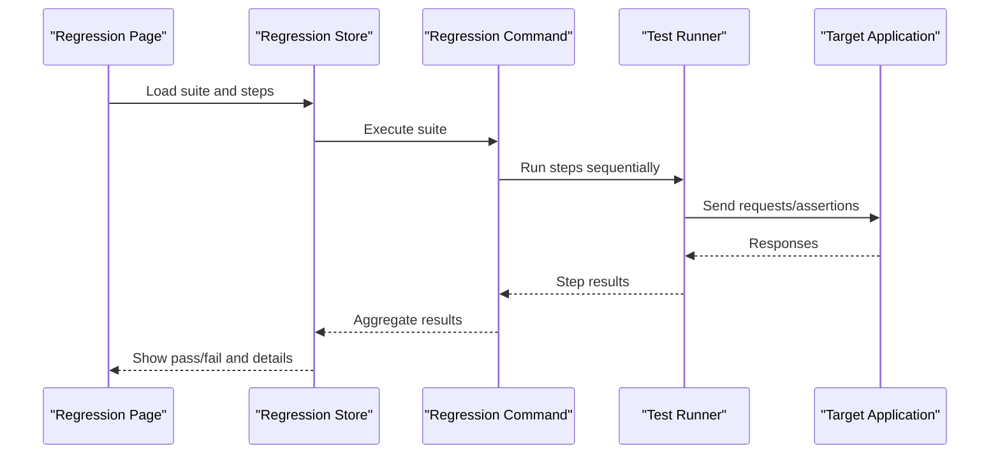
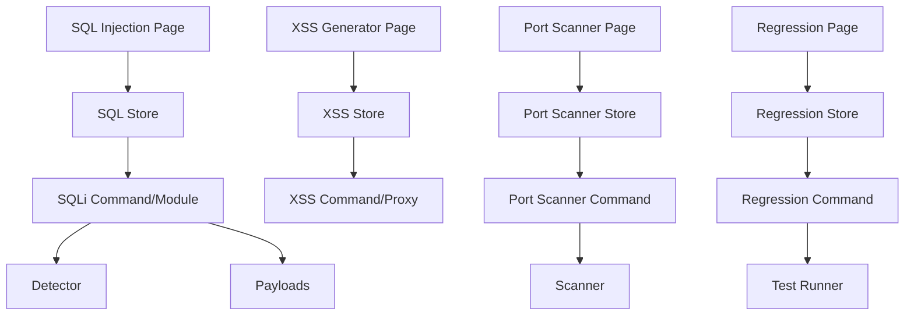

# Security Testing Suite

<cite>
**Referenced Files in This Document**
- [README.md](file://README.md)
- [src/pages/sql-injection/index.tsx](file://src/pages/sql-injection/index.tsx)
- [src/pages/xss-generator/index.tsx](file://src/pages/xss-generator/index.tsx)
- [src/pages/port-scanner/index.tsx](file://src/pages/port-scanner/index.tsx)
- [src/pages/regression/index.tsx](file://src/pages/regression/index.tsx)
- [src-tauri/src/sqli/mod.rs](file://src-tauri/src/sqli/mod.rs)
- [src-tauri/src/sqli/detector.rs](file://src-tauri/src/sqli/detector.rs)
- [src-tauri/src/sqli/payloads.rs](file://src-tauri/src/sqli/payloads.rs)
- [src-tauri/src/port-scanner/mod.rs](file://src-tauri/src/port-scanner/mod.rs)
- [src-tauri/src/port-scanner/scanner.rs](file://src-tauri/src/port-scanner/scanner.rs)
- [src-tauri/src/commands/regression.rs](file://src-tauri/src/commands/regression.rs)
- [src/stores/regression.ts](file://src/stores/regression.ts)
- [src/stores/port-scanner.ts](file://src/stores/port-scanner.ts)
</cite>

## Table of Contents
1. [Introduction](#introduction)
2. [Project Structure](#project-structure)
3. [Core Components](#core-components)
4. [Architecture Overview](#architecture-overview)
5. [Detailed Component Analysis](#detailed-component-analysis)
6. [Dependency Analysis](#dependency-analysis)
7. [Performance Considerations](#performance-considerations)
8. [Troubleshooting Guide](#troubleshooting-guide)
9. [Conclusion](#conclusion)
10. [Appendices](#appendices)

## Introduction
This document explains Apprecon’s comprehensive security testing capabilities with a focus on SQL injection detection and exploitation, XSS payload generation and testing, port scanning for network reconnaissance, and regression testing for security validation. It covers automated vulnerability scanning, manual testing workflows, and integration points with development processes. You will find guidance on creating security test suites, interpreting results, generating reports, and leveraging advanced features such as custom payloads, rule-based detection, and automated remediation suggestions. Best practices for security testing, false positive handling, and integration with existing toolchains are also included.

## Project Structure
Apprecon is a desktop application built with Tauri (Rust backend) and a React frontend. Security testing features are implemented across both layers:
- Frontend pages provide interactive UIs for SQL Injection, XSS Generator, Port Scanner, and Regression testing.
- Backend modules implement core logic for SQL injection detection and payload handling, port scanning, and regression test orchestration.
- Stores manage state for each feature and integrate with the Tauri commands to execute operations.

**Diagram sources**
- [src/pages/sql-injection/index.tsx](file://src/pages/sql-injection/index.tsx)
- [src/pages/xss-generator/index.tsx](file://src/pages/xss-generator/index.tsx)
- [src/pages/port-scanner/index.tsx](file://src/pages/port-scanner/index.tsx)
- [src/pages/regression/index.tsx](file://src/pages/regression/index.tsx)
- [src-tauri/src/sqli/mod.rs](file://src-tauri/src/sqli/mod.rs)
- [src-tauri/src/sqli/detector.rs](file://src-tauri/src/sqli/detector.rs)
- [src-tauri/src/sqli/payloads.rs](file://src-tauri/src/sqli/payloads.rs)
- [src-tauri/src/port-scanner/mod.rs](file://src-tauri/src/port-scanner/mod.rs)
- [src-tauri/src/port-scanner/scanner.rs](file://src-tauri/src/port-scanner/scanner.rs)
- [src-tauri/src/commands/regression.rs](file://src-tauri/src/commands/regression.rs)
- [src/stores/regression.ts](file://src/stores/regression.ts)
- [src/stores/port-scanner.ts](file://src/stores/port-scanner.ts)

**Section sources**
- [README.md](file://README.md)

## Core Components
- SQL Injection Detection and Exploitation:
  - Frontend page orchestrates user inputs and displays findings.
  - Backend module provides detection logic and payload sets.
- XSS Payload Generation and Testing:
  - Frontend page generates and tests payloads against targets via proxy or browser automation.
- Port Scanning for Network Reconnaissance:
  - Frontend page configures scans; backend scanner performs connection checks and service identification.
- Regression Testing for Security Validation:
  - Frontend manages test suites; backend executes sequences and aggregates results.

**Section sources**
- [src/pages/sql-injection/index.tsx](file://src/pages/sql-injection/index.tsx)
- [src-tauri/src/sqli/mod.rs](file://src-tauri/src/sqli/mod.rs)
- [src-tauri/src/sqli/detector.rs](file://src-tauri/src/sqli/detector.rs)
- [src-tauri/src/sqli/payloads.rs](file://src-tauri/src/sqli/payloads.rs)
- [src/pages/xss-generator/index.tsx](file://src/pages/xss-generator/index.tsx)
- [src/pages/port-scanner/index.tsx](file://src/pages/port-scanner/index.tsx)
- [src-tauri/src/port-scanner/mod.rs](file://src-tauri/src/port-scanner/mod.rs)
- [src-tauri/src/port-scanner/scanner.rs](file://src-tauri/src/port-scanner/scanner.rs)
- [src/pages/regression/index.tsx](file://src/pages/regression/index.tsx)
- [src-tauri/src/commands/regression.rs](file://src-tauri/src/commands/regression.rs)
- [src/stores/regression.ts](file://src/stores/regression.ts)
- [src/stores/port-scanner.ts](file://src/stores/port-scanner.ts)

## Architecture Overview
The security testing suite integrates frontend pages with backend modules through Tauri commands and stores. The flow typically involves:
- User interaction on the frontend page.
- State updates in corresponding stores.
- Invocation of backend commands or modules.
- Execution of detection, scanning, or regression logic.
- Aggregation and display of results back in the UI.

[No sources needed since this diagram shows conceptual workflow, not actual code structure]

## Detailed Component Analysis

### SQL Injection Detection and Exploitation
- Purpose: Detect SQL injection vulnerabilities by sending crafted payloads and analyzing responses.
- Key elements:
  - Frontend page collects target endpoints and parameters.
  - Backend detector applies rules and heuristics to identify errors, time-based behavior, or content differences.
  - Payloads include common patterns and context-aware variants.
- Workflow:
  - Select parameter(s), choose payload set, run detection.
  - Review findings, confirm with targeted payloads if needed.
  - Export results or add to regression suite.

**Diagram sources**
- [src/pages/sql-injection/index.tsx](file://src/pages/sql-injection/index.tsx)
- [src-tauri/src/sqli/detector.rs](file://src-tauri/src/sqli/detector.rs)
- [src-tauri/src/sqli/payloads.rs](file://src-tauri/src/sqli/payloads.rs)

**Section sources**
- [src/pages/sql-injection/index.tsx](file://src/pages/sql-injection/index.tsx)
- [src-tauri/src/sqli/mod.rs](file://src-tauri/src/sqli/mod.rs)
- [src-tauri/src/sqli/detector.rs](file://src-tauri/src/sqli/detector.rs)
- [src-tauri/src/sqli/payloads.rs](file://src-tauri/src/sqli/payloads.rs)

### XSS Payload Generation and Testing
- Purpose: Generate and test cross-site scripting payloads across contexts (HTML, JS, attributes, events).
- Key elements:
  - Frontend page provides payload templates and encoding options.
  - Integration with proxy or browser automation to inject payloads into live sessions.
  - Result interpretation includes DOM inspection and response analysis.
- Workflow:
  - Choose context and payload type, generate variants, send via proxy/browser.
  - Inspect execution indicators and record evidence.

**Diagram sources**
- [src/pages/xss-generator/index.tsx](file://src/pages/xss-generator/index.tsx)

**Section sources**
- [src/pages/xss-generator/index.tsx](file://src/pages/xss-generator/index.tsx)

### Port Scanning for Network Reconnaissance
- Purpose: Discover open ports and identify services to map attack surface.
- Key elements:
  - Frontend page defines target ranges and scan profiles.
  - Backend scanner performs TCP connect checks and optional banner grabbing.
  - Results include port status, service hints, and metadata.
- Workflow:
  - Configure targets and concurrency, start scan, monitor progress.
  - Review findings and export for further analysis.

**Diagram sources**
- [src/pages/port-scanner/index.tsx](file://src/pages/port-scanner/index.tsx)
- [src-tauri/src/port-scanner/mod.rs](file://src-tauri/src/port-scanner/mod.rs)
- [src-tauri/src/port-scanner/scanner.rs](file://src-tauri/src/port-scanner/scanner.rs)
- [src/stores/port-scanner.ts](file://src/stores/port-scanner.ts)

**Section sources**
- [src/pages/port-scanner/index.tsx](file://src/pages/port-scanner/index.tsx)
- [src-tauri/src/port-scanner/mod.rs](file://src-tauri/src/port-scanner/mod.rs)
- [src-tauri/src/port-scanner/scanner.rs](file://src-tauri/src/port-scanner/scanner.rs)
- [src/stores/port-scanner.ts](file://src/stores/port-scanner.ts)

### Regression Testing for Security Validation
- Purpose: Automate repeated security validations to ensure fixes persist and new issues are caught early.
- Key elements:
  - Frontend page manages test suites, steps, and scheduling.
  - Backend command executes sequences and aggregates outcomes.
  - Supports importing/exporting suites and integrating with CI pipelines.
- Workflow:
  - Create or import a suite, define steps (requests, assertions), run, review results.
  - Schedule recurring runs and publish reports.

**Diagram sources**
- [src/pages/regression/index.tsx](file://src/pages/regression/index.tsx)
- [src-tauri/src/commands/regression.rs](file://src-tauri/src/commands/regression.rs)
- [src/stores/regression.ts](file://src/stores/regression.ts)

**Section sources**
- [src/pages/regression/index.tsx](file://src/pages/regression/index.tsx)
- [src-tauri/src/commands/regression.rs](file://src-tauri/src/commands/regression.rs)
- [src/stores/regression.ts](file://src/stores/regression.ts)

## Dependency Analysis
- Frontend dependencies:
  - Pages depend on stores for state management and UI interactions.
  - XSS and SQL Injection pages may rely on proxy/browser automation for live testing.
- Backend dependencies:
  - SQL injection module depends on detector and payload definitions.
  - Port scanner module encapsulates scanning logic and state.
  - Regression command orchestrates test execution and result aggregation.
- Coupling and cohesion:
  - Each feature is modularized with clear boundaries between UI, state, and backend logic.
  - Commands act as entry points for backend operations invoked from frontend stores.

**Diagram sources**
- [src/pages/sql-injection/index.tsx](file://src/pages/sql-injection/index.tsx)
- [src/pages/xss-generator/index.tsx](file://src/pages/xss-generator/index.tsx)
- [src/pages/port-scanner/index.tsx](file://src/pages/port-scanner/index.tsx)
- [src/pages/regression/index.tsx](file://src/pages/regression/index.tsx)
- [src/stores/port-scanner.ts](file://src/stores/port-scanner.ts)
- [src/stores/regression.ts](file://src/stores/regression.ts)
- [src-tauri/src/sqli/mod.rs](file://src-tauri/src/sqli/mod.rs)
- [src-tauri/src/sqli/detector.rs](file://src-tauri/src/sqli/detector.rs)
- [src-tauri/src/sqli/payloads.rs](file://src-tauri/src/sqli/payloads.rs)
- [src-tauri/src/port-scanner/mod.rs](file://src-tauri/src/port-scanner/mod.rs)
- [src-tauri/src/port-scanner/scanner.rs](file://src-tauri/src/port-scanner/scanner.rs)
- [src-tauri/src/commands/regression.rs](file://src-tauri/src/commands/regression.rs)

**Section sources**
- [src/stores/port-scanner.ts](file://src/stores/port-scanner.ts)
- [src/stores/regression.ts](file://src/stores/regression.ts)
- [src-tauri/src/sqli/mod.rs](file://src-tauri/src/sqli/mod.rs)
- [src-tauri/src/port-scanner/mod.rs](file://src-tauri/src/port-scanner/mod.rs)
- [src-tauri/src/commands/regression.rs](file://src-tauri/src/commands/regression.rs)

## Performance Considerations
- Concurrency control:
  - Port scanning should limit concurrent connections to avoid overwhelming targets or local resources.
  - SQL injection scanning should throttle requests to reduce noise and server load.
- Caching and reuse:
  - Cache known safe responses to speed up comparisons during detection.
  - Reuse session tokens and cookies across related requests to minimize overhead.
- Resource management:
  - Monitor memory usage when processing large payloads or extensive scan results.
  - Implement timeouts and retries with exponential backoff for robustness.

[No sources needed since this section provides general guidance]

## Troubleshooting Guide
- Common issues:
  - False positives in SQL injection detection due to generic error messages.
  - XSS payloads blocked by CSP or sanitization libraries.
  - Port scans failing due to firewall rules or rate limiting.
  - Regression tests flaky because of non-deterministic responses.
- Mitigations:
  - Tune detection rules and thresholds; validate with manual confirmation.
  - Adjust payload encodings and contexts; inspect CSP headers.
  - Use allowlists for trusted hosts; configure retry policies.
  - Stabilize test data and mock external dependencies where possible.

**Section sources**
- [src-tauri/src/sqli/detector.rs](file://src-tauri/src/sqli/detector.rs)
- [src-tauri/src/port-scanner/scanner.rs](file://src-tauri/src/port-scanner/scanner.rs)
- [src-tauri/src/commands/regression.rs](file://src-tauri/src/commands/regression.rs)

## Conclusion
Apprecon’s security testing suite provides integrated tools for SQL injection detection, XSS payload generation, port scanning, and regression testing. By combining interactive frontends with robust backend modules, it supports both manual exploration and automated validation. Following best practices—such as careful payload design, rule tuning, and CI integration—helps maintain high accuracy and reliability while minimizing false positives and operational overhead.

[No sources needed since this section summarizes without analyzing specific files]

## Appendices

### Creating Security Test Suites
- Steps:
  - Define endpoints and parameters to test.
  - Add payloads and assertions for expected behaviors.
  - Save suites for reuse and schedule recurring runs.
- Tips:
  - Keep suites focused and incremental.
  - Version control your suites alongside application code.

**Section sources**
- [src/pages/regression/index.tsx](file://src/pages/regression/index.tsx)
- [src/stores/regression.ts](file://src/stores/regression.ts)
- [src-tauri/src/commands/regression.rs](file://src-tauri/src/commands/regression.rs)

### Interpreting Results and Generating Reports
- Interpretation:
  - Review flagged items with contextual evidence (request/response snippets, DOM states).
  - Prioritize findings based on severity and exploitability.
- Reporting:
  - Export findings in structured formats for sharing and tracking.
  - Integrate with issue trackers and dashboards.

**Section sources**
- [src/pages/sql-injection/index.tsx](file://src/pages/sql-injection/index.tsx)
- [src/pages/port-scanner/index.tsx](file://src/pages/port-scanner/index.tsx)
- [src/pages/regression/index.tsx](file://src/pages/regression/index.tsx)

### Advanced Features
- Custom payload creation:
  - Extend payload sets with domain-specific variants.
  - Use encoders and context-aware transformations.
- Rule-based detection:
  - Customize detection rules to match application quirks.
  - Combine multiple signals (errors, timing, content diffs).
- Automated remediation suggestions:
  - Leverage AI-assisted insights to propose fixes.
  - Validate suggestions with regression tests before deployment.

**Section sources**
- [src-tauri/src/sqli/payloads.rs](file://src-tauri/src/sqli/payloads.rs)
- [src-tauri/src/sqli/detector.rs](file://src-tauri/src/sqli/detector.rs)
- [src/pages/xss-generator/index.tsx](file://src/pages/xss-generator/index.tsx)

### Best Practices
- Scope definition:
  - Clearly define targets and authorized testing windows.
- False positive handling:
  - Validate findings manually; refine rules iteratively.
- Toolchain integration:
  - Embed scans in CI/CD pipelines; gate releases on regression results.
- Documentation and training:
  - Maintain playbooks for common scenarios and escalation paths.

[No sources needed since this section provides general guidance]