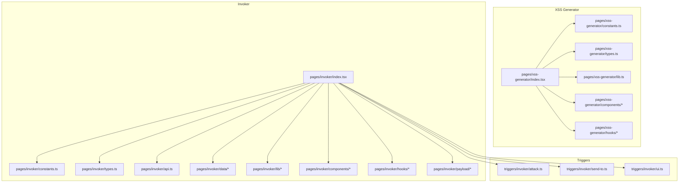
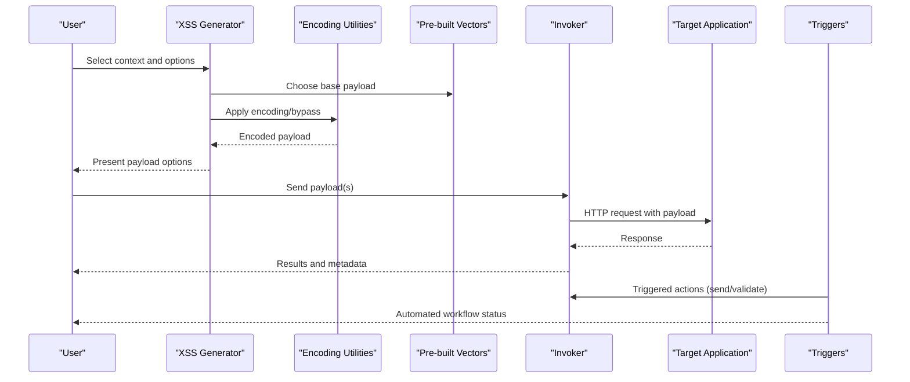
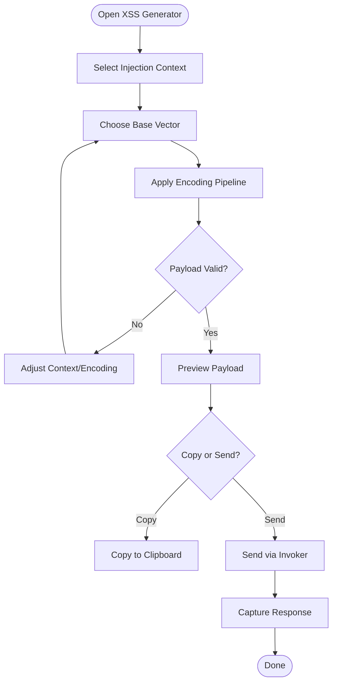
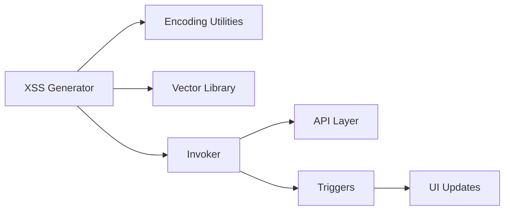

# XSS Payload Generator & Testing

<cite>
**Referenced Files in This Document**
- [index.tsx](file://src/pages/xss-generator/index.tsx)
- [constants.ts](file://src/pages/xss-generator/constants.ts)
- [types.ts](file://src/pages/xss-generator/types.ts)
- [lib.ts](file://src/pages/xss-generator/lib.ts)
- [components/](file://src/pages/xss-generator/components/)
- [hooks/](file://src/pages/xss-generator/hooks/)
- [payload/](file://src/pages/invoker/payload/)
- [attack.ts](file://src/triggers/invoker/attack.ts)
- [send-to.ts](file://src/triggers/invoker/send-to.ts)
- [ui.ts](file://src/triggers/invoker/ui.ts)
- [index.tsx](file://src/pages/invoker/index.tsx)
- [constants.ts](file://src/pages/invoker/constants.ts)
- [types.ts](file://src/pages/invoker/types.ts)
- [api.ts](file://src/pages/invoker/api.ts)
- [data/](file://src/pages/invoker/data/)
- [lib/](file://src/pages/invoker/lib/)
- [components/](file://src/pages/invoker/components/)
- [hooks/](file://src/pages/invoker/hooks/)
</cite>

## Table of Contents
1. [Introduction](#introduction)
2. [Project Structure](#project-structure)
3. [Core Components](#core-components)
4. [Architecture Overview](#architecture-overview)
5. [Detailed Component Analysis](#detailed-component-analysis)
6. [Dependency Analysis](#dependency-analysis)
7. [Performance Considerations](#performance-considerations)
8. [Troubleshooting Guide](#troubleshooting-guide)
9. [Conclusion](#conclusion)
10. [Appendices](#appendices)

## Introduction
This document explains Apprecon’s XSS payload generation and testing toolkit, focusing on the XSS generator page, the Invoker integration for sending payloads, and the trigger system that orchestrates attack workflows. It covers:
- The payload builder interface and how context-aware payloads are generated
- Encoding utilities and pre-built vector libraries
- Reflected, stored, and DOM-based XSS vectors
- Encoding bypass techniques and WAF evasion strategies
- Automated testing workflows using the Invoker and triggers
- Modern browser security features and CSP considerations

The goal is to help both new and experienced users understand how to craft, encode, send, and validate XSS payloads within Apprecon safely and effectively.

## Project Structure
Apprecon organizes XSS-related functionality primarily under the XSS generator page and the Invoker module, with supporting triggers that automate attack flows.

**Diagram sources**
- [index.tsx](file://src/pages/xss-generator/index.tsx)
- [constants.ts](file://src/pages/xss-generator/constants.ts)
- [types.ts](file://src/pages/xss-generator/types.ts)
- [lib.ts](file://src/pages/xss-generator/lib.ts)
- [index.tsx](file://src/pages/invoker/index.tsx)
- [constants.ts](file://src/pages/invoker/constants.ts)
- [types.ts](file://src/pages/invoker/types.ts)
- [api.ts](file://src/pages/invoker/api.ts)
- [attack.ts](file://src/triggers/invoker/attack.ts)
- [send-to.ts](file://src/triggers/invoker/send-to.ts)
- [ui.ts](file://src/triggers/invoker/ui.ts)

**Section sources**
- [index.tsx](file://src/pages/xss-generator/index.tsx)
- [index.tsx](file://src/pages/invoker/index.tsx)

## Core Components
- XSS Generator Page: Provides a UI to select contexts (HTML, JavaScript, attributes, events), choose encodings, and generate payloads tailored to the target context. It integrates with encoding utilities and a library of pre-built vectors.
- Invoker Module: Sends crafted payloads to targets via HTTP or other channels, supports collections, automation, and result tracking.
- Triggers: Orchestrate automated workflows such as sending payloads, collecting responses, and validating outcomes.

Key responsibilities:
- Context detection and payload selection
- Encoding transformations and bypass strategies
- Sending payloads and capturing results
- Automation and validation of exploitation

**Section sources**
- [index.tsx](file://src/pages/xss-generator/index.tsx)
- [index.tsx](file://src/pages/invoker/index.tsx)
- [attack.ts](file://src/triggers/invoker/attack.ts)
- [send-to.ts](file://src/triggers/invoker/send-to.ts)
- [ui.ts](file://src/triggers/invoker/ui.ts)

## Architecture Overview
The XSS workflow spans three layers:
- Generation Layer: XSS generator constructs payloads based on selected context and encoding options.
- Delivery Layer: Invoker sends payloads to targets and records responses.
- Automation Layer: Triggers coordinate multi-step attacks, including sending, waiting, and validating.

**Diagram sources**
- [index.tsx](file://src/pages/xss-generator/index.tsx)
- [lib.ts](file://src/pages/xss-generator/lib.ts)
- [index.tsx](file://src/pages/invoker/index.tsx)
- [attack.ts](file://src/triggers/invoker/attack.ts)
- [send-to.ts](file://src/triggers/invoker/send-to.ts)

## Detailed Component Analysis

### XSS Generator Interface
The XSS generator provides:
- Context selection: HTML body, attribute values, JavaScript strings, event handlers
- Encoding options: URL, HTML entities, Unicode, hex, base64, and custom transforms
- Pre-built vector library: Common XSS patterns for different contexts
- Preview and copy: Visual preview and one-click copy to clipboard

Implementation highlights:
- Context-aware payload selection ensures correct escaping and injection points
- Encoding pipeline applies multiple transformations to bypass filters
- Integration with Invoker allows direct sending from the generator

**Diagram sources**
- [index.tsx](file://src/pages/xss-generator/index.tsx)
- [lib.ts](file://src/pages/xss-generator/lib.ts)

**Section sources**
- [index.tsx](file://src/pages/xss-generator/index.tsx)
- [constants.ts](file://src/pages/xss-generator/constants.ts)
- [types.ts](file://src/pages/xss-generator/types.ts)
- [lib.ts](file://src/pages/xss-generator/lib.ts)

### Encoding Utilities
Encoding utilities transform payloads to evade filters and match target contexts:
- URL encoding for query parameters and path segments
- HTML entity encoding for attribute and text contexts
- Unicode and hex escapes for JavaScript string contexts
- Custom regex-based replacements for specific WAF rules

Best practices:
- Chain multiple encodings when necessary
- Preserve functional characters while obfuscating others
- Test against target-specific filters and sanitizers

**Section sources**
- [lib.ts](file://src/pages/xss-generator/lib.ts)

### Pre-built XSS Vectors Library
The library includes:
- Reflected XSS vectors: Query params, headers, form inputs
- Stored XSS vectors: Comments, profiles, message boards
- DOM-based XSS vectors: document.write, innerHTML, location manipulation
- Event handler vectors: onload, onerror, onmouseover
- Attribute injection vectors: href, src, style, data-*

Usage:
- Select vector by context
- Combine with encoding pipeline
- Validate behavior in target environment

**Section sources**
- [constants.ts](file://src/pages/xss-generator/constants.ts)
- [types.ts](file://src/pages/xss-generator/types.ts)

### Invoker Integration
The Invoker module enables:
- Sending payloads to single or multiple targets
- Managing collections of requests and responses
- Tracking success/failure and response characteristics
- Integrating with triggers for automated workflows

Workflow:
- Construct request with payload
- Send via HTTP or other transport
- Capture and analyze response
- Store results for review and reporting

**Section sources**
- [index.tsx](file://src/pages/invoker/index.tsx)
- [api.ts](file://src/pages/invoker/api.ts)
- [types.ts](file://src/pages/invoker/types.ts)
- [constants.ts](file://src/pages/invoker/constants.ts)

### Triggers and Automation
Triggers automate attack sequences:
- Attack trigger: Executes payload delivery and validation steps
- Send-to trigger: Routes payloads to specific endpoints or collections
- UI trigger: Updates interface state and notifications

Automation benefits:
- Repeatable testing across environments
- Consistent validation criteria
- Reduced manual effort and errors

**Section sources**
- [attack.ts](file://src/triggers/invoker/attack.ts)
- [send-to.ts](file://src/triggers/invoker/send-to.ts)
- [ui.ts](file://src/triggers/invoker/ui.ts)

## Dependency Analysis
The XSS toolkit components have clear dependencies:
- XSS Generator depends on encoding utilities and vector libraries
- Invoker depends on API modules and trigger system
- Triggers depend on Invoker for execution and UI for feedback

**Diagram sources**
- [index.tsx](file://src/pages/xss-generator/index.tsx)
- [lib.ts](file://src/pages/xss-generator/lib.ts)
- [index.tsx](file://src/pages/invoker/index.tsx)
- [api.ts](file://src/pages/invoker/api.ts)
- [attack.ts](file://src/triggers/invoker/attack.ts)
- [ui.ts](file://src/triggers/invoker/ui.ts)

**Section sources**
- [index.tsx](file://src/pages/xss-generator/index.tsx)
- [index.tsx](file://src/pages/invoker/index.tsx)

## Performance Considerations
- Minimize payload permutations to reduce processing time
- Cache frequently used encoded payloads
- Use asynchronous operations for network requests
- Implement rate limiting to avoid overwhelming targets
- Optimize encoding pipelines for common use cases

[No sources needed since this section provides general guidance]

## Troubleshooting Guide
Common issues and solutions:
- Payload not executing: Verify context selection and encoding choices
- WAF blocking: Try alternative encodings or vector variations
- Invalid responses: Check target application error logs
- Automation failures: Review trigger configurations and timing

Debugging tips:
- Use preview mode to validate payload syntax
- Inspect network traffic for request/response details
- Test payloads manually before automating
- Log intermediate states in trigger workflows

**Section sources**
- [index.tsx](file://src/pages/xss-generator/index.tsx)
- [index.tsx](file://src/pages/invoker/index.tsx)

## Conclusion
Apprecon’s XSS toolkit provides a comprehensive solution for generating, encoding, and testing XSS payloads. The modular architecture separates concerns between generation, delivery, and automation, enabling flexible and repeatable security testing workflows. By leveraging context-aware generation, robust encoding utilities, and automated triggers, users can efficiently identify and validate XSS vulnerabilities while accounting for modern browser security features and WAF protections.

[No sources needed since this section summarizes without analyzing specific files]

## Appendices

### XSS Attack Vectors Reference
- Reflected XSS: Immediate execution via URL parameters or form submissions
- Stored XSS: Persistent execution through database-stored content
- DOM-based XSS: Client-side execution via JavaScript manipulation
- Event-driven XSS: Execution through HTML event handlers
- Attribute injection: Bypassing context restrictions in attribute values

### Encoding Bypass Techniques
- Double encoding for parameter parsing bypasses
- Unicode normalization tricks for filter evasion
- Fragment identifier abuse for client-side only execution
- Protocol-relative URLs for cross-origin exploits
- CSS expression injection for legacy browser support

### CSP Bypass Strategies
- Inline script execution via unsafe-inline policies
- Dynamic script loading from trusted domains
- JSONP callback exploitation
- WebSocket connection hijacking
- Worker script injection

[No sources needed since this section provides general guidance]