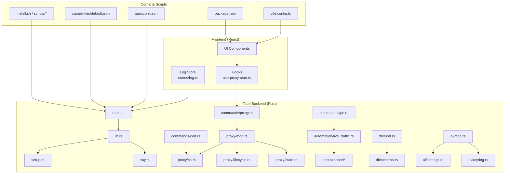
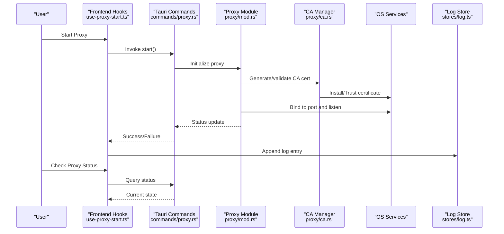
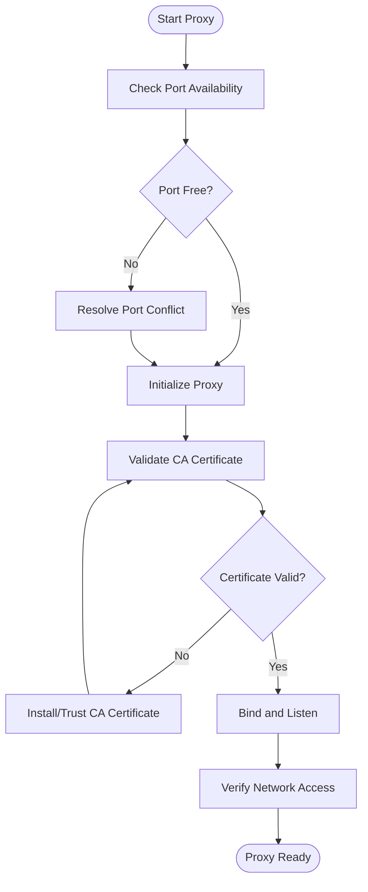
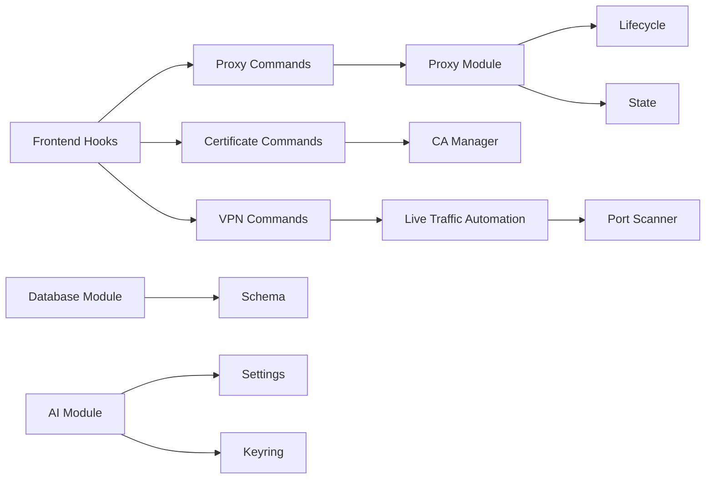

# Troubleshooting & FAQ

<cite>
**Referenced Files in This Document**
- [README.md](file://README.md)
- [install.sh](file://install.sh)
- [scripts/install.sh](file://scripts/install.sh)
- [scripts/setup-linux-deps.sh](file://scripts/setup-linux-deps.sh)
- [scripts/fix-packet-capture-permissions.sh](file://scripts/fix-packet-capture-permissions.sh)
- [src-tauri/src/main.rs](file://src-tauri/src/main.rs)
- [src-tauri/src/lib.rs](file://src-tauri/src/lib.rs)
- [src-tauri/src/setup.rs](file://src-tauri/src/setup.rs)
- [src-tauri/src/tray.rs](file://src-tauri/src/tray.rs)
- [src-tauri/src/commands/proxy.rs](file://src-tauri/src/commands/proxy.rs)
- [src-tauri/src/proxy/mod.rs](file://src-tauri/src/proxy/mod.rs)
- [src-tauri/src/proxy/ca.rs](file://src-tauri/src/proxy/ca.rs)
- [src-tauri/src/proxy/lifecycle.rs](file://src-tauri/src/proxy/lifecycle.rs)
- [src-tauri/src/proxy/state.rs](file://src-tauri/src/proxy/state.rs)
- [src-tauri/src/proxy/utils.rs](file://src-tauri/src/proxy/utils.rs)
- [src-tauri/src/commands/cert.rs](file://src-tauri/src/commands/cert.rs)
- [src-tauri/src/commands/vpn.rs](file://src-tauri/src/commands/vpn.rs)
- [src-tauri/src/automation/live_traffic.rs](file://src-tauri/src/automation/live_traffic.rs)
- [src-tauri/src/port-scanner/mod.rs](file://src-tauri/src/port-scanner/mod.rs)
- [src-tauri/src/port-scanner/scanner.rs](file://src-tauri/src/port-scanner/scanner.rs)
- [src-tauri/src/db/mod.rs](file://src-tauri/src/db/mod.rs)
- [src-tauri/src/db/schema.rs](file://src-tauri/src/db/schema.rs)
- [src-tauri/src/ai/mod.rs](file://src-tauri/src/ai/mod.rs)
- [src-tauri/src/ai/settings.rs](file://src-tauri/src/ai/settings.rs)
- [src-tauri/src/ai/keyring.rs](file://src-tauri/src/ai/keyring.rs)
- [src-tauri/capabilities/default.json](file://src-tauri/capabilities/default.json)
- [src-tauri/tauri.conf.json](file://src-tauri/tauri.conf.json)
- [package.json](file://package.json)
- [vite.config.ts](file://vite.config.ts)
- [src/hooks/use-proxy-start.ts](file://src/hooks/use-proxy-start.ts)
- [src/layout/footer/proxy-status.tsx](file://src/layout/footer/proxy-status.tsx)
- [src/stores/log.ts](file://src/stores/log.ts)
- [src/lib/resize-observer-errors.ts](file://src/lib/resize-observer-errors.ts)
</cite>

## Table of Contents
1. [Introduction](#introduction)
2. [Project Structure](#project-structure)
3. [Core Components](#core-components)
4. [Architecture Overview](#architecture-overview)
5. [Detailed Component Analysis](#detailed-component-analysis)
6. [Dependency Analysis](#dependency-analysis)
7. [Performance Considerations](#performance-considerations)
8. [Troubleshooting Guide](#troubleshooting-guide)
9. [Conclusion](#conclusion)
10. [Appendices](#appendices)

## Introduction
This document provides comprehensive troubleshooting guidance and frequently asked questions for Apprecon. It focuses on installation, permissions, network connectivity, performance tuning, diagnostics, logging, crash reporting, recovery procedures, platform-specific issues, proxy configuration, certificate errors, memory optimization, security and privacy considerations, and best practices for safe usage. The content is organized to help both new users and advanced troubleshooters quickly identify and resolve common problems.

## Project Structure
Apprecon is a Tauri-based desktop application with a React frontend and Rust backend. Key areas relevant to troubleshooting include:
- Installation scripts and setup utilities
- Tauri configuration and capabilities
- Proxy and CA management
- Network automation and port scanning
- Database schema and storage
- AI settings and keyring integration
- Frontend hooks and UI status indicators
- Logging stores and error handling utilities

**Diagram sources**
- [src-tauri/src/main.rs](file://src-tauri/src/main.rs)
- [src-tauri/src/lib.rs](file://src-tauri/src/lib.rs)
- [src-tauri/src/setup.rs](file://src-tauri/src/setup.rs)
- [src-tauri/src/tray.rs](file://src-tauri/src/tray.rs)
- [src-tauri/src/commands/proxy.rs](file://src-tauri/src/commands/proxy.rs)
- [src-tauri/src/proxy/mod.rs](file://src-tauri/src/proxy/mod.rs)
- [src-tauri/src/proxy/ca.rs](file://src-tauri/src/proxy/ca.rs)
- [src-tauri/src/proxy/lifecycle.rs](file://src-tauri/src/proxy/lifecycle.rs)
- [src-tauri/src/proxy/state.rs](file://src-tauri/src/proxy/state.rs)
- [src-tauri/src/commands/cert.rs](file://src-tauri/src/commands/cert.rs)
- [src-tauri/src/commands/vpn.rs](file://src-tauri/src/commands/vpn.rs)
- [src-tauri/src/automation/live_traffic.rs](file://src-tauri/src/automation/live_traffic.rs)
- [src-tauri/src/port-scanner/mod.rs](file://src-tauri/src/port-scanner/mod.rs)
- [src-tauri/src/port-scanner/scanner.rs](file://src-tauri/src/port-scanner/scanner.rs)
- [src-tauri/src/db/mod.rs](file://src-tauri/src/db/mod.rs)
- [src-tauri/src/db/schema.rs](file://src-tauri/src/db/schema.rs)
- [src-tauri/src/ai/mod.rs](file://src-tauri/src/ai/mod.rs)
- [src-tauri/src/ai/settings.rs](file://src-tauri/src/ai/settings.rs)
- [src-tauri/src/ai/keyring.rs](file://src-tauri/src/ai/keyring.rs)
- [src-tauri/capabilities/default.json](file://src-tauri/capabilities/default.json)
- [src-tauri/tauri.conf.json](file://src-tauri/tauri.conf.json)
- [package.json](file://package.json)
- [vite.config.ts](file://vite.config.ts)
- [src/hooks/use-proxy-start.ts](file://src/hooks/use-proxy-start.ts)
- [src/stores/log.ts](file://src/stores/log.ts)

**Section sources**
- [README.md](file://README.md)
- [package.json](file://package.json)
- [vite.config.ts](file://vite.config.ts)
- [src-tauri/tauri.conf.json](file://src-tauri/tauri.conf.json)
- [src-tauri/capabilities/default.json](file://src-tauri/capabilities/default.json)

## Core Components
- Installation and Setup:
  - Root install script and helper scripts manage dependencies and permissions.
  - Linux dependency setup script ensures required system packages are present.
  - Packet capture permission fix script addresses OS-level restrictions.
- Tauri Runtime:
  - Main entrypoint initializes the app, registers commands, and manages lifecycle.
  - Tray integration provides quick access to core features.
  - Capabilities define allowed operations for the frontend.
- Proxy and Certificate Management:
  - Proxy command handlers coordinate start/stop and configuration.
  - CA module handles certificate generation and trust store integration.
  - Lifecycle and state modules manage proxy runtime behavior.
- Network Automation:
  - Live traffic automation orchestrates packet capture and processing.
  - Port scanner performs service discovery and banner grabbing.
- Storage and Data:
  - Database module manages persistence and schema migrations.
- AI Integration:
  - Settings and keyring modules handle secure storage of credentials and preferences.

**Section sources**
- [install.sh](file://install.sh)
- [scripts/install.sh](file://scripts/install.sh)
- [scripts/setup-linux-deps.sh](file://scripts/setup-linux-deps.sh)
- [scripts/fix-packet-capture-permissions.sh](file://scripts/fix-packet-capture-permissions.sh)
- [src-tauri/src/main.rs](file://src-tauri/src/main.rs)
- [src-tauri/src/tray.rs](file://src-tauri/src/tray.rs)
- [src-tauri/capabilities/default.json](file://src-tauri/capabilities/default.json)
- [src-tauri/src/commands/proxy.rs](file://src-tauri/src/commands/proxy.rs)
- [src-tauri/src/proxy/mod.rs](file://src-tauri/src/proxy/mod.rs)
- [src-tauri/src/proxy/ca.rs](file://src-tauri/src/proxy/ca.rs)
- [src-tauri/src/proxy/lifecycle.rs](file://src-tauri/src/proxy/lifecycle.rs)
- [src-tauri/src/proxy/state.rs](file://src-tauri/src/proxy/state.rs)
- [src-tauri/src/automation/live_traffic.rs](file://src-tauri/src/automation/live_traffic.rs)
- [src-tauri/src/port-scanner/mod.rs](file://src-tauri/src/port-scanner/mod.rs)
- [src-tauri/src/port-scanner/scanner.rs](file://src-tauri/src/port-scanner/scanner.rs)
- [src-tauri/src/db/mod.rs](file://src-tauri/src/db/mod.rs)
- [src-tauri/src/db/schema.rs](file://src-tauri/src/db/schema.rs)
- [src-tauri/src/ai/mod.rs](file://src-tauri/src/ai/mod.rs)
- [src-tauri/src/ai/settings.rs](file://src-tauri/src/ai/settings.rs)
- [src-tauri/src/ai/keyring.rs](file://src-tauri/src/ai/keyring.rs)

## Architecture Overview
The following diagram illustrates how the frontend interacts with Tauri commands to control the proxy, certificates, VPN, and other features. It also shows how logs and errors are surfaced to the UI.

**Diagram sources**
- [src/hooks/use-proxy-start.ts](file://src/hooks/use-proxy-start.ts)
- [src-tauri/src/commands/proxy.rs](file://src-tauri/src/commands/proxy.rs)
- [src-tauri/src/proxy/mod.rs](file://src-tauri/src/proxy/mod.rs)
- [src-tauri/src/proxy/ca.rs](file://src-tauri/src/proxy/ca.rs)
- [src/stores/log.ts](file://src/stores/log.ts)

## Detailed Component Analysis

### Installation and Permissions
- Common Issues:
  - Missing system dependencies on Linux.
  - Insufficient permissions for packet capture or installing certificates.
  - Script execution failures due to environment variables or PATH.
- Resolution Steps:
  - Run the Linux dependency setup script before installation.
  - Use the packet capture permission fix script to adjust OS-level policies.
  - Ensure the installer has execute permissions and runs with appropriate privileges.
- Verification:
  - Confirm that required binaries are installed and accessible.
  - Validate that packet capture interfaces are available and not blocked by firewall rules.

**Section sources**
- [scripts/setup-linux-deps.sh](file://scripts/setup-linux-deps.sh)
- [scripts/fix-packet-capture-permissions.sh](file://scripts/fix-packet-capture-permissions.sh)
- [install.sh](file://install.sh)
- [scripts/install.sh](file://scripts/install.sh)

### Proxy Configuration and Connectivity
- Common Issues:
  - Proxy fails to bind to the configured port.
  - Certificate errors when intercepting HTTPS traffic.
  - Proxy cannot reach external services due to proxy/firewall settings.
- Resolution Steps:
  - Verify port availability and ensure no conflicting processes.
  - Reinstall or trust the CA certificate using the provided commands.
  - Configure upstream proxy settings if required by your network.
- Diagnostics:
  - Check proxy status via the UI footer indicator.
  - Review logs for binding errors and certificate validation failures.

**Diagram sources**
- [src-tauri/src/commands/proxy.rs](file://src-tauri/src/commands/proxy.rs)
- [src-tauri/src/proxy/mod.rs](file://src-tauri/src/proxy/mod.rs)
- [src-tauri/src/proxy/ca.rs](file://src-tauri/src/proxy/ca.rs)
- [src-tauri/src/proxy/lifecycle.rs](file://src-tauri/src/proxy/lifecycle.rs)
- [src-tauri/src/proxy/state.rs](file://src-tauri/src/proxy/state.rs)

**Section sources**
- [src-tauri/src/commands/proxy.rs](file://src-tauri/src/commands/proxy.rs)
- [src-tauri/src/proxy/mod.rs](file://src-tauri/src/proxy/mod.rs)
- [src-tauri/src/proxy/ca.rs](file://src-tauri/src/proxy/ca.rs)
- [src-tauri/src/proxy/lifecycle.rs](file://src-tauri/src/proxy/lifecycle.rs)
- [src-tauri/src/proxy/state.rs](file://src-tauri/src/proxy/state.rs)
- [src-tauri/src/commands/cert.rs](file://src-tauri/src/commands/cert.rs)
- [src/layout/footer/proxy-status.tsx](file://src/layout/footer/proxy-status.tsx)

### Network Automation and Port Scanning
- Common Issues:
  - Live traffic capture fails due to missing privileges or interface selection.
  - Port scans time out or miss services due to firewall rules.
- Resolution Steps:
  - Grant necessary permissions for packet capture.
  - Adjust scan timeouts and concurrency settings.
  - Whitelist Apprecon in firewall configurations.
- Diagnostics:
  - Monitor live traffic events and scan progress.
  - Inspect logs for interface errors and timeout messages.

**Section sources**
- [src-tauri/src/automation/live_traffic.rs](file://src-tauri/src/automation/live_traffic.rs)
- [src-tauri/src/port-scanner/mod.rs](file://src-tauri/src/port-scanner/mod.rs)
- [src-tauri/src/port-scanner/scanner.rs](file://src-tauri/src/port-scanner/scanner.rs)

### Database and Storage
- Common Issues:
  - Schema migration failures or corrupted database files.
  - Permission errors writing to the data directory.
- Resolution Steps:
  - Back up existing data before running migrations.
  - Ensure write permissions for the application’s data path.
  - Reinitialize the database if corruption is detected.
- Diagnostics:
  - Review database logs for migration errors.
  - Validate schema version against expected versions.

**Section sources**
- [src-tauri/src/db/mod.rs](file://src-tauri/src/db/mod.rs)
- [src-tauri/src/db/schema.rs](file://src-tauri/src/db/schema.rs)

### AI Settings and Keyring
- Common Issues:
  - Credentials not found or inaccessible in the system keyring.
  - AI provider settings misconfigured causing authentication failures.
- Resolution Steps:
  - Re-enter credentials and ensure keyring access is granted.
  - Validate provider endpoints and API keys.
- Diagnostics:
  - Check AI settings for correct values.
  - Review logs for authentication errors.

**Section sources**
- [src-tauri/src/ai/mod.rs](file://src-tauri/src/ai/mod.rs)
- [src-tauri/src/ai/settings.rs](file://src-tauri/src/ai/settings.rs)
- [src-tauri/src/ai/keyring.rs](file://src-tauri/src/ai/keyring.rs)

## Dependency Analysis
Apprecon’s components have clear separation between frontend hooks, Tauri commands, and backend modules. Dependencies are primarily driven by Tauri’s capability model and explicit command registrations.

**Diagram sources**
- [src/hooks/use-proxy-start.ts](file://src/hooks/use-proxy-start.ts)
- [src-tauri/src/commands/proxy.rs](file://src-tauri/src/commands/proxy.rs)
- [src-tauri/src/commands/cert.rs](file://src-tauri/src/commands/cert.rs)
- [src-tauri/src/commands/vpn.rs](file://src-tauri/src/commands/vpn.rs)
- [src-tauri/src/proxy/mod.rs](file://src-tauri/src/proxy/mod.rs)
- [src-tauri/src/proxy/ca.rs](file://src-tauri/src/proxy/ca.rs)
- [src-tauri/src/proxy/lifecycle.rs](file://src-tauri/src/proxy/lifecycle.rs)
- [src-tauri/src/proxy/state.rs](file://src-tauri/src/proxy/state.rs)
- [src-tauri/src/automation/live_traffic.rs](file://src-tauri/src/automation/live_traffic.rs)
- [src-tauri/src/port-scanner/mod.rs](file://src-tauri/src/port-scanner/mod.rs)
- [src-tauri/src/db/mod.rs](file://src-tauri/src/db/mod.rs)
- [src-tauri/src/db/schema.rs](file://src-tauri/src/db/schema.rs)
- [src-tauri/src/ai/mod.rs](file://src-tauri/src/ai/mod.rs)
- [src-tauri/src/ai/settings.rs](file://src-tauri/src/ai/settings.rs)
- [src-tauri/src/ai/keyring.rs](file://src-tauri/src/ai/keyring.rs)

**Section sources**
- [src-tauri/capabilities/default.json](file://src-tauri/capabilities/default.json)
- [src-tauri/tauri.conf.json](file://src-tauri/tauri.conf.json)

## Performance Considerations
- Memory Usage Optimization:
  - Limit concurrent scans and live traffic processing to reduce memory pressure.
  - Clear caches and unused sessions periodically.
  - Monitor heap usage and adjust worker thread counts if needed.
- I/O and Disk:
  - Avoid excessive logging to disk; use rotation or rate limiting.
  - Ensure sufficient disk space for captures and artifacts.
- Network Throughput:
  - Tune buffer sizes and timeouts for high-volume traffic.
  - Use efficient filtering to reduce processing overhead.
- UI Responsiveness:
  - Debounce heavy operations and offload work to background threads.
  - Avoid blocking the main thread during long-running tasks.

[No sources needed since this section provides general guidance]

## Troubleshooting Guide

### Installation Issues
- Symptom: Installer fails or dependencies are missing.
- Actions:
  - Run the Linux dependency setup script.
  - Verify package manager availability and network connectivity.
  - Re-run the installer with elevated privileges if required.
- Evidence:
  - Check terminal output for missing libraries or permission errors.

**Section sources**
- [scripts/setup-linux-deps.sh](file://scripts/setup-linux-deps.sh)
- [scripts/install.sh](file://scripts/install.sh)
- [install.sh](file://install.sh)

### Permission Problems
- Symptom: Packet capture fails or certificate installation is denied.
- Actions:
  - Execute the packet capture permission fix script.
  - Trust the CA certificate through OS settings.
  - Ensure Apprecon has necessary capabilities enabled.
- Evidence:
  - OS prompts for authorization or denial messages in logs.

**Section sources**
- [scripts/fix-packet-capture-permissions.sh](file://scripts/fix-packet-capture-permissions.sh)
- [src-tauri/src/commands/cert.rs](file://src-tauri/src/commands/cert.rs)
- [src-tauri/capabilities/default.json](file://src-tauri/capabilities/default.json)

### Network Connectivity Issues
- Symptom: Proxy cannot connect or traffic is not captured.
- Actions:
  - Verify proxy port is free and not blocked by firewall.
  - Test upstream proxy settings and DNS resolution.
  - Restart the proxy and re-check status.
- Evidence:
  - Proxy status indicator and log entries showing connection attempts.

**Section sources**
- [src-tauri/src/commands/proxy.rs](file://src-tauri/src/commands/proxy.rs)
- [src-tauri/src/proxy/lifecycle.rs](file://src-tauri/src/proxy/lifecycle.rs)
- [src/layout/footer/proxy-status.tsx](file://src/layout/footer/proxy-status.tsx)

### Certificate Errors
- Symptom: HTTPS interception fails with certificate validation errors.
- Actions:
  - Reinstall the CA certificate and trust it in the OS/browser.
  - Clear browser cache and reload pages.
  - Verify certificate paths and permissions.
- Evidence:
  - Error messages indicating invalid or untrusted certificates.

**Section sources**
- [src-tauri/src/commands/cert.rs](file://src-tauri/src/commands/cert.rs)
- [src-tauri/src/proxy/ca.rs](file://src-tauri/src/proxy/ca.rs)

### Proxy Configuration Problems
- Symptom: Proxy starts but does not route traffic correctly.
- Actions:
  - Confirm proxy mode (system vs. application).
  - Check whitelist/blacklist filters.
  - Validate environment variables for proxy settings.
- Evidence:
  - Proxy logs showing filter matches and routing decisions.

**Section sources**
- [src-tauri/src/proxy/mod.rs](file://src-tauri/src/proxy/mod.rs)
- [src-tauri/src/proxy/state.rs](file://src-tauri/src/proxy/state.rs)

### Platform-Specific Issues
- macOS:
  - Ensure keychain access is granted for storing credentials.
  - Verify system extensions for network capture if required.
- Windows:
  - Run installer as administrator for certificate installation.
  - Disable antivirus interference with packet capture.
- Linux:
  - Install required kernel modules for packet capture.
  - Adjust udev rules for interface permissions.

**Section sources**
- [src-tauri/src/ai/keyring.rs](file://src-tauri/src/ai/keyring.rs)
- [scripts/setup-linux-deps.sh](file://scripts/setup-linux-deps.sh)

### Diagnostic Tools and Log Analysis
- Tools:
  - Built-in log store for capturing runtime events.
  - Proxy status indicator for quick health checks.
- Techniques:
  - Filter logs by severity and component.
  - Export logs for analysis and support requests.
- Recovery:
  - Reset proxy state and restart services.
  - Clear temporary files and caches.

**Section sources**
- [src/stores/log.ts](file://src/stores/log.ts)
- [src/layout/footer/proxy-status.tsx](file://src/layout/footer/proxy-status.tsx)

### Crash Reporting and Recovery
- Reporting:
  - Capture stack traces and environment details.
  - Submit logs and reproduction steps to support.
- Recovery:
  - Restore from backups if database corruption occurs.
  - Reinstall dependencies and rebuild if necessary.

**Section sources**
- [src/lib/resize-observer-errors.ts](file://src/lib/resize-observer-errors.ts)
- [src-tauri/src/main.rs](file://src-tauri/src/main.rs)

### Security Concerns and Privacy Considerations
- Best Practices:
  - Limit proxy scope to trusted targets only.
  - Rotate and securely store API keys and tokens.
  - Avoid logging sensitive data in plaintext.
- Privacy:
  - Minimize data retention and purge captures regularly.
  - Use encrypted storage for sensitive information.

**Section sources**
- [src-tauri/src/ai/keyring.rs](file://src-tauri/src/ai/keyring.rs)
- [src-tauri/src/proxy/ca.rs](file://src-tauri/src/proxy/ca.rs)

### When to Seek Additional Support
- Indicators:
  - Recurring crashes despite following troubleshooting steps.
  - Inability to install or trust certificates across platforms.
  - Persistent network connectivity issues after verifying configurations.
- Preparation:
  - Gather logs, screenshots, and environment details.
  - Document steps to reproduce the issue.

[No sources needed since this section summarizes without analyzing specific files]

## Conclusion
This guide consolidates common issues and resolutions for Apprecon, focusing on installation, permissions, networking, performance, diagnostics, and security. By following the structured troubleshooting steps and leveraging built-in diagnostic tools, most problems can be resolved efficiently. For complex or persistent issues, consult support with detailed logs and context.

[No sources needed since this section summarizes without analyzing specific files]

## Appendices

### Frequently Asked Questions
- Why does the proxy fail to start?
  - Check port conflicts, permissions, and certificate trust.
- How do I reset the proxy state?
  - Stop the proxy, clear state files, and restart.
- Where are logs stored?
  - Logs are managed by the log store and can be exported from the UI.
- How do I configure an upstream proxy?
  - Set environment variables or proxy settings in the application.
- What should I do if the CA certificate is invalid?
  - Reinstall and trust the certificate, then clear browser cache.

[No sources needed since this section provides general guidance]