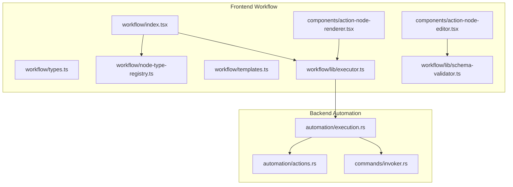
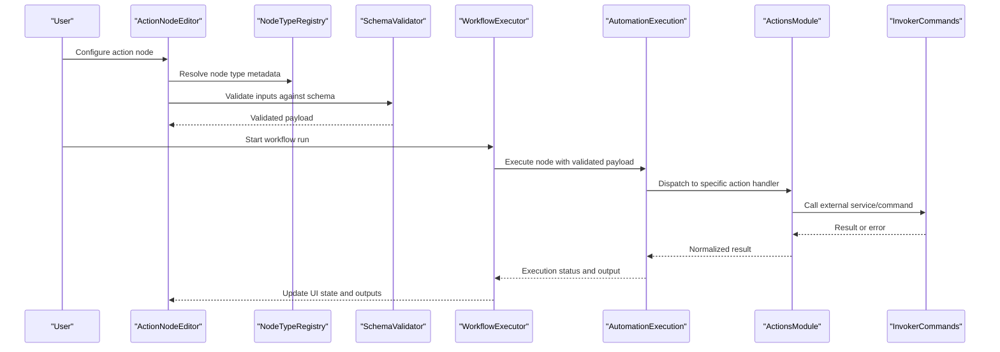
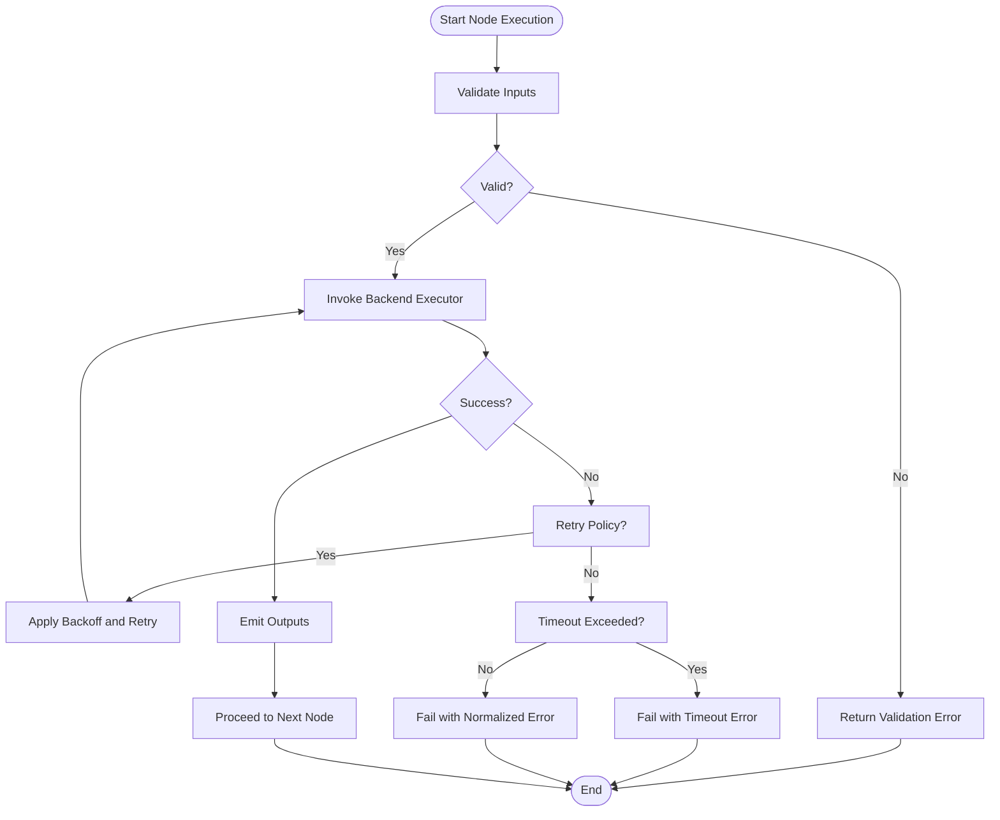
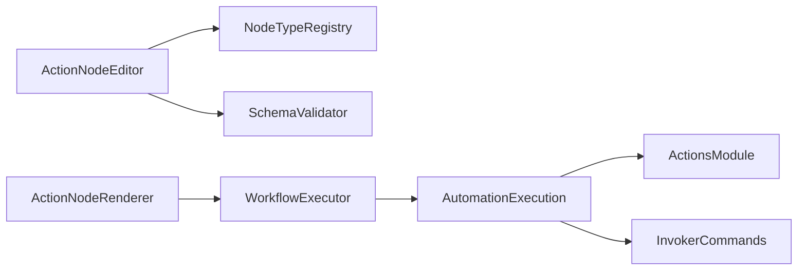

# Action Nodes

<cite>
**Referenced Files in This Document**
- [workflow/index.tsx](file://src/pages/workflow/index.tsx)
- [workflow/types.ts](file://src/pages/workflow/types.ts)
- [workflow/node-type-registry.ts](file://src/pages/workflow/node-type-registry.ts)
- [workflow/templates.ts](file://src/pages/workflow/templates.ts)
- [workflow/lib/executor.ts](file://src/pages/workflow/lib/executor.ts)
- [workflow/lib/schema-validator.ts](file://src/pages/workflow/lib/schema-validator.ts)
- [workflow/components/action-node-editor.tsx](file://src/pages/workflow/components/action-node-editor.tsx)
- [workflow/components/action-node-renderer.tsx](file://src/pages/workflow/components/action-node-renderer.tsx)
- [automation/actions.rs](file://src-tauri/src/automation/actions.rs)
- [automation/execution.rs](file://src-tauri/src/automation/execution.rs)
- [commands/invoker.rs](file://src-tauri/src/commands/invoker.rs)
</cite>

## Table of Contents
1. [Introduction](#introduction)
2. [Project Structure](#project-structure)
3. [Core Components](#core-components)
4. [Architecture Overview](#architecture-overview)
5. [Detailed Component Analysis](#detailed-component-analysis)
6. [Dependency Analysis](#dependency-analysis)
7. [Performance Considerations](#performance-considerations)
8. [Troubleshooting Guide](#troubleshooting-guide)
9. [Conclusion](#conclusion)

## Introduction
This document explains Apprecon’s action nodes within the workflow system. Action nodes are the building blocks that execute operations such as HTTP requests, database queries, file processing, and AI model invocations. They receive inputs from upstream nodes, perform work (synchronously or asynchronously), and emit outputs to downstream nodes. The documentation covers configuration, input/output schemas, parameter validation, built-in action types, asynchronous execution, retry logic, timeouts, and error propagation patterns.

## Project Structure
The workflow subsystem is implemented across TypeScript/React UI code and Rust backend services:
- Frontend workflow editor and runtime orchestration live under src/pages/workflow.
- Backend execution primitives and external integrations live under src-tauri/src/automation and src-tauri/src/commands.

**Diagram sources**
- [workflow/index.tsx](file://src/pages/workflow/index.tsx)
- [workflow/types.ts](file://src/pages/workflow/types.ts)
- [workflow/node-type-registry.ts](file://src/pages/workflow/node-type-registry.ts)
- [workflow/templates.ts](file://src/pages/workflow/templates.ts)
- [workflow/lib/executor.ts](file://src/pages/workflow/lib/executor.ts)
- [workflow/lib/schema-validator.ts](file://src/pages/workflow/lib/schema-validator.ts)
- [workflow/components/action-node-editor.tsx](file://src/pages/workflow/components/action-node-editor.tsx)
- [workflow/components/action-node-renderer.tsx](file://src/pages/workflow/components/action-node-renderer.tsx)
- [automation/actions.rs](file://src-tauri/src/automation/actions.rs)
- [automation/execution.rs](file://src-tauri/src/automation/execution.rs)
- [commands/invoker.rs](file://src-tauri/src/commands/invoker.rs)

**Section sources**
- [workflow/index.tsx](file://src/pages/workflow/index.tsx)
- [workflow/types.ts](file://src/pages/workflow/types.ts)
- [workflow/node-type-registry.ts](file://src/pages/workflow/node-type-registry.ts)
- [workflow/templates.ts](file://src/pages/workflow/templates.ts)
- [workflow/lib/executor.ts](file://src/pages/workflow/lib/executor.ts)
- [workflow/lib/schema-validator.ts](file://src/pages/workflow/lib/schema-validator.ts)
- [workflow/components/action-node-editor.tsx](file://src/pages/workflow/components/action-node-editor.tsx)
- [workflow/components/action-node-renderer.tsx](file://src/pages/workflow/components/action-node-renderer.tsx)
- [automation/actions.rs](file://src-tauri/src/automation/actions.rs)
- [automation/execution.rs](file://src-tauri/src/automation/execution.rs)
- [commands/invoker.rs](file://src-tauri/src/commands/invoker.rs)

## Core Components
- Node type registry: Declares available action node types and their metadata (labels, icons, default configs).
- Templates: Provide preconfigured JSON payloads for common actions (HTTP, DB, file, AI).
- Executor: Orchestrates node execution, manages async flows, retries, timeouts, and error handling.
- Schema validator: Validates node inputs against declared schemas before execution.
- Editor and renderer: UI components for configuring and visualizing action nodes.
- Backend automation: Rust modules implementing actual operations (HTTP, DB, file, AI) and invocation commands.

Key responsibilities:
- Input schema definition per action type.
- Parameter validation with user-friendly errors.
- Asynchronous execution with progress and cancellation support.
- Retry policies and timeout enforcement.
- Error normalization and propagation to the UI.

**Section sources**
- [workflow/node-type-registry.ts](file://src/pages/workflow/node-type-registry.ts)
- [workflow/templates.ts](file://src/pages/workflow/templates.ts)
- [workflow/lib/executor.ts](file://src/pages/workflow/lib/executor.ts)
- [workflow/lib/schema-validator.ts](file://src/pages/workflow/lib/schema-validator.ts)
- [workflow/components/action-node-editor.tsx](file://src/pages/workflow/components/action-node-editor.tsx)
- [workflow/components/action-node-renderer.tsx](file://src/pages/workflow/components/action-node-renderer.tsx)
- [automation/actions.rs](file://src-tauri/src/automation/actions.rs)
- [automation/execution.rs](file://src-tauri/src/automation/execution.rs)
- [commands/invoker.rs](file://src-tauri/src/commands/invoker.rs)

## Architecture Overview
Action nodes follow a layered architecture:
- UI layer: Editor and renderer manage configuration and visualization.
- Orchestration layer: Executor coordinates execution, concurrency, retries, and timeouts.
- Validation layer: Schema validator ensures correctness of inputs.
- Execution layer: Rust automation modules implement concrete actions and integrate with external systems.

**Diagram sources**
- [workflow/components/action-node-editor.tsx](file://src/pages/workflow/components/action-node-editor.tsx)
- [workflow/node-type-registry.ts](file://src/pages/workflow/node-type-registry.ts)
- [workflow/lib/schema-validator.ts](file://src/pages/workflow/lib/schema-validator.ts)
- [workflow/lib/executor.ts](file://src/pages/workflow/lib/executor.ts)
- [automation/execution.rs](file://src-tauri/src/automation/execution.rs)
- [automation/actions.rs](file://src-tauri/src/automation/actions.rs)
- [commands/invoker.rs](file://src-tauri/src/commands/invoker.rs)

## Detailed Component Analysis

### Node Type Registry and Templates
- Registry defines each action type’s identity, display name, icon, and default configuration template.
- Templates provide ready-to-use configurations for common scenarios (e.g., HTTP GET/POST, SQL query, file read/write, AI prompt).

Implementation highlights:
- Centralized mapping from node type IDs to metadata.
- Default payload generation to reduce setup friction.
- Extensibility points for adding new action types without changing core logic.

**Section sources**
- [workflow/node-type-registry.ts](file://src/pages/workflow/node-type-registry.ts)
- [workflow/templates.ts](file://src/pages/workflow/templates.ts)

### Schema Validator and Parameter Validation
- Each action type declares an input schema describing required fields, types, constraints, and defaults.
- The validator checks incoming node inputs against the schema and returns structured errors.
- Supports nested objects, arrays, enums, ranges, and custom validators.

Validation flow:
- Load schema for selected action type.
- Traverse input object and validate each field.
- Aggregate errors and present them in the editor.

**Section sources**
- [workflow/lib/schema-validator.ts](file://src/pages/workflow/lib/schema-validator.ts)
- [workflow/components/action-node-editor.tsx](file://src/pages/workflow/components/action-node-editor.tsx)

### Executor: Async Operations, Retries, Timeouts, and Errors
- Executes nodes sequentially or in parallel based on workflow graph topology.
- Manages timeouts per node and overall runs.
- Implements retry policies with exponential backoff and jitter.
- Normalizes errors into a consistent format for UI consumption.

Execution flow:
- Build execution plan from workflow graph.
- For each node:
  - Validate inputs via schema validator.
  - Invoke backend executor with payload.
  - Apply retry policy on transient failures.
  - Enforce timeout; abort if exceeded.
  - Capture outputs and propagate to downstream nodes.
- On failure:
  - Record error context and stack trace.
  - Optionally continue or stop based on workflow settings.

**Diagram sources**
- [workflow/lib/executor.ts](file://src/pages/workflow/lib/executor.ts)
- [automation/execution.rs](file://src-tauri/src/automation/execution.rs)

**Section sources**
- [workflow/lib/executor.ts](file://src/pages/workflow/lib/executor.ts)
- [automation/execution.rs](file://src-tauri/src/automation/execution.rs)

### Action Node Editor and Renderer
- Editor provides a form-based interface bound to the action’s schema.
- Renderer displays node status, logs, and outputs during execution.
- Integrates with the executor to trigger runs and update UI state.

Features:
- Dynamic form generation from schema.
- Real-time validation feedback.
- Progress indicators and error messages.
- Output inspection and copy/export.

**Section sources**
- [workflow/components/action-node-editor.tsx](file://src/pages/workflow/components/action-node-editor.tsx)
- [workflow/components/action-node-renderer.tsx](file://src/pages/workflow/components/action-node-renderer.tsx)

### Built-in Action Types
Common action types include:
- HTTP Requests: Send GET/POST/PUT/DELETE with headers, body, auth, and response parsing.
- Database Queries: Execute SQL or NoSQL queries with parameter binding and result mapping.
- File Processing: Read/write files, parse formats (JSON, CSV), and transform content.
- AI Model Invocations: Call LLM endpoints with prompts, temperature, and streaming responses.

Each action type has:
- A schema defining parameters.
- A template for quick setup.
- An executor implementation in the backend.

Examples:
- HTTP request action: configure URL, method, headers, body, and expected response schema.
- Database query action: specify connection, query text, and parameter values.
- File processing action: define path, operation (read/write/parse), and output format.
- AI invocation action: select provider, model, prompt template, and output extraction rules.

**Section sources**
- [workflow/templates.ts](file://src/pages/workflow/templates.ts)
- [automation/actions.rs](file://src-tauri/src/automation/actions.rs)
- [commands/invoker.rs](file://src-tauri/src/commands/invoker.rs)

### Backend Automation and Invocation Commands
- Actions module implements handlers for each action type.
- Execution module coordinates concurrency, retries, timeouts, and error normalization.
- Invoker commands encapsulate external calls (HTTP clients, DB drivers, file I/O, AI SDKs).

Responsibilities:
- Secure credential handling and environment variable resolution.
- Robust error classification (network, auth, validation, rate limit).
- Structured logging and tracing for debugging.

**Section sources**
- [automation/actions.rs](file://src-tauri/src/automation/actions.rs)
- [automation/execution.rs](file://src-tauri/src/automation/execution.rs)
- [commands/invoker.rs](file://src-tauri/src/commands/invoker.rs)

## Dependency Analysis
Action nodes depend on several layers:
- UI depends on registry, templates, validator, and executor.
- Executor depends on backend automation modules.
- Backend automation depends on invoker commands for external integrations.

**Diagram sources**
- [workflow/components/action-node-editor.tsx](file://src/pages/workflow/components/action-node-editor.tsx)
- [workflow/node-type-registry.ts](file://src/pages/workflow/node-type-registry.ts)
- [workflow/lib/schema-validator.ts](file://src/pages/workflow/lib/schema-validator.ts)
- [workflow/components/action-node-renderer.tsx](file://src/pages/workflow/components/action-node-renderer.tsx)
- [workflow/lib/executor.ts](file://src/pages/workflow/lib/executor.ts)
- [automation/execution.rs](file://src-tauri/src/automation/execution.rs)
- [automation/actions.rs](file://src-tauri/src/automation/actions.rs)
- [commands/invoker.rs](file://src-tauri/src/commands/invoker.rs)

**Section sources**
- [workflow/components/action-node-editor.tsx](file://src/pages/workflow/components/action-node-editor.tsx)
- [workflow/node-type-registry.ts](file://src/pages/workflow/node-type-registry.ts)
- [workflow/lib/schema-validator.ts](file://src/pages/workflow/lib/schema-validator.ts)
- [workflow/components/action-node-renderer.tsx](file://src/pages/workflow/components/action-node-renderer.tsx)
- [workflow/lib/executor.ts](file://src/pages/workflow/lib/executor.ts)
- [automation/execution.rs](file://src-tauri/src/automation/execution.rs)
- [automation/actions.rs](file://src-tauri/src/automation/actions.rs)
- [commands/invoker.rs](file://src-tauri/src/commands/invoker.rs)

## Performance Considerations
- Concurrency control: Limit parallel node executions to avoid resource exhaustion.
- Caching: Cache repeated HTTP responses or DB results when safe.
- Streaming: Use streaming for large payloads and AI responses to reduce memory usage.
- Timeouts: Set appropriate per-node timeouts to prevent hangs.
- Retry tuning: Adjust backoff strategies based on external service behavior.
- Payload sizing: Minimize data transfer by selecting only needed fields.

[No sources needed since this section provides general guidance]

## Troubleshooting Guide
Common issues and resolutions:
- Validation errors: Check schema definitions and ensure all required fields are provided.
- Network failures: Verify connectivity, proxies, and authentication credentials.
- Rate limits: Increase retry intervals or implement adaptive backoff.
- Timeouts: Extend timeouts for slow endpoints or optimize payloads.
- Error propagation: Inspect normalized error structures and logs for root causes.

Debugging steps:
- Enable detailed logging in executor and backend modules.
- Inspect node outputs and intermediate states in the renderer.
- Use templates to isolate failing configurations.
- Test actions independently via invoker commands.

**Section sources**
- [workflow/lib/executor.ts](file://src/pages/workflow/lib/executor.ts)
- [automation/execution.rs](file://src-tauri/src/automation/execution.rs)
- [commands/invoker.rs](file://src-tauri/src/commands/invoker.rs)

## Conclusion
Apprecon’s action nodes provide a robust, extensible framework for orchestrating diverse operations within workflows. With clear schemas, strong validation, flexible execution policies, and comprehensive backend integrations, they enable reliable automation of API calls, data transformations, file operations, and AI interactions. Proper configuration, performance tuning, and troubleshooting practices ensure efficient and resilient workflows.

[No sources needed since this section summarizes without analyzing specific files]