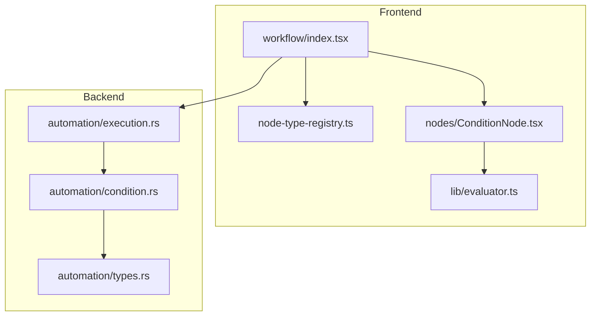
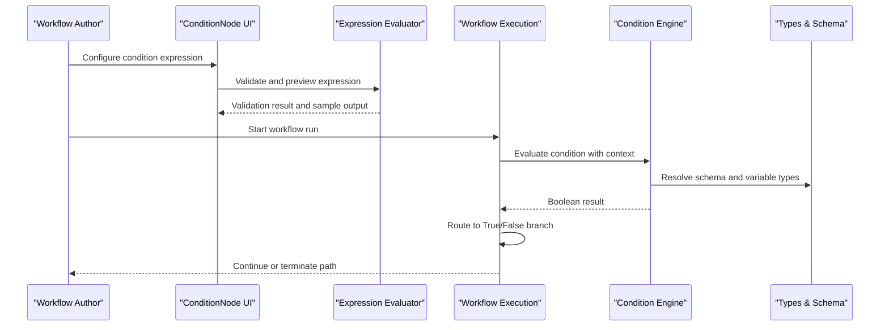
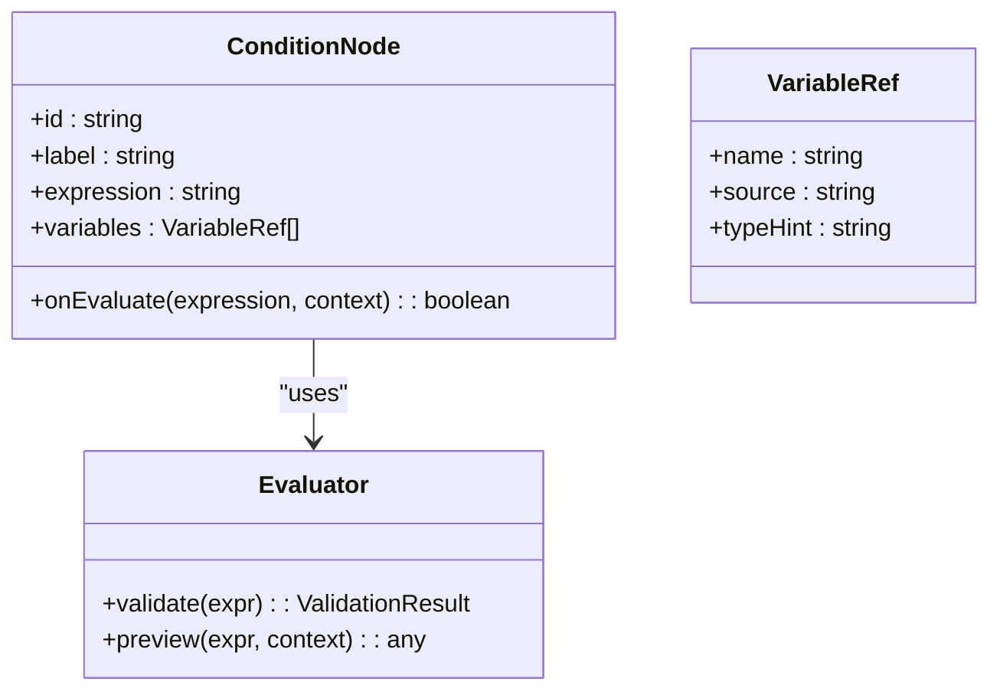
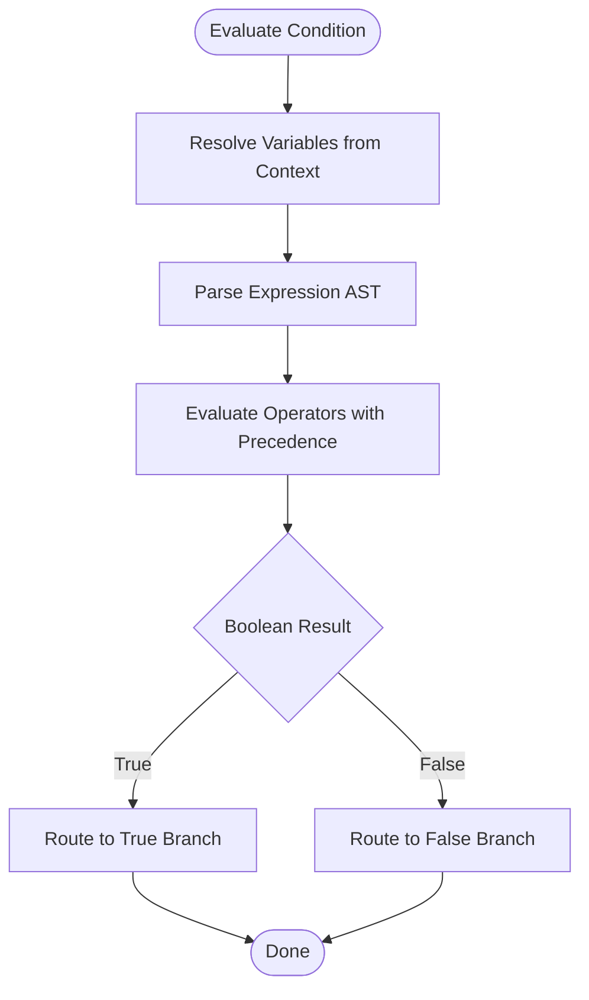
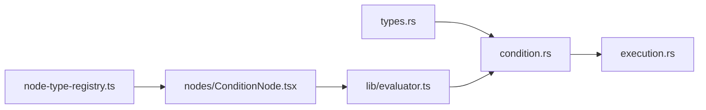

# Condition Nodes

<cite>
**Referenced Files in This Document**
- [condition.rs](file://src-tauri/src/automation/condition.rs)
- [execution.rs](file://src-tauri/src/automation/execution.rs)
- [types.rs](file://src-tauri/src/automation/types.rs)
- [node-type-registry.ts](file://src/pages/workflow/node-type-registry.ts)
- [workflow/index.tsx](file://src/pages/workflow/index.tsx)
- [workflow/lib/evaluator.ts](file://src/pages/workflow/lib/evaluator.ts)
- [workflow/nodes/ConditionNode.tsx](file://src/pages/workflow/nodes/ConditionNode.tsx)
</cite>

## Table of Contents
1. [Introduction](#introduction)
2. [Project Structure](#project-structure)
3. [Core Components](#core-components)
4. [Architecture Overview](#architecture-overview)
5. [Detailed Component Analysis](#detailed-component-analysis)
6. [Dependency Analysis](#dependency-analysis)
7. [Performance Considerations](#performance-considerations)
8. [Troubleshooting Guide](#troubleshooting-guide)
9. [Conclusion](#conclusion)

## Introduction
This document explains how condition nodes implement decision logic in Apprecon’s workflow system. It covers the expression and comparison model, supported operators, evaluation engine behavior, and practical examples for branching on data values, timestamps, API responses, and complex boolean expressions. It also includes performance optimization guidance, caching strategies, and debugging techniques to help you build reliable and efficient workflows.

## Project Structure
Condition nodes are implemented across both the Rust backend (for execution and evaluation) and the TypeScript frontend (for authoring and visualization). The key files include:
- Backend evaluation and types for conditions
- Workflow runtime that executes nodes and routes based on outcomes
- Frontend node registry and UI components for editing conditions
- Expression evaluator utilities used by the workflow editor

**Diagram sources**
- [workflow/index.tsx](file://src/pages/workflow/index.tsx)
- [node-type-registry.ts](file://src/pages/workflow/node-type-registry.ts)
- [nodes/ConditionNode.tsx](file://src/pages/workflow/nodes/ConditionNode.tsx)
- [lib/evaluator.ts](file://src/pages/workflow/lib/evaluator.ts)
- [execution.rs](file://src-tauri/src/automation/execution.rs)
- [condition.rs](file://src-tauri/src/automation/condition.rs)
- [types.rs](file://src-tauri/src/automation/types.rs)

**Section sources**
- [execution.rs](file://src-tauri/src/automation/execution.rs)
- [condition.rs](file://src-tauri/src/automation/condition.rs)
- [types.rs](file://src-tauri/src/automation/types.rs)
- [node-type-registry.ts](file://src/pages/workflow/node-type-registry.ts)
- [workflow/index.tsx](file://src/pages/workflow/index.tsx)
- [nodes/ConditionNode.tsx](file://src/pages/workflow/nodes/ConditionNode.tsx)
- [lib/evaluator.ts](file://src/pages/workflow/lib/evaluator.ts)

## Core Components
- Condition Node Definition: Declares the node type, schema, and default configuration for condition nodes in the workflow editor.
- Expression Model: Defines how expressions are structured, including variables, operators, and value references.
- Evaluation Engine: Evaluates expressions against runtime context (data payloads, environment variables, previous node outputs).
- Execution Router: Routes workflow execution to “true” or “false” branches based on evaluated results.

Key responsibilities:
- Parse and validate condition expressions authored in the UI.
- Resolve variable references from workflow context.
- Evaluate comparisons and boolean combinations safely and efficiently.
- Provide deterministic routing decisions with clear error reporting.

**Section sources**
- [types.rs](file://src-tauri/src/automation/types.rs)
- [condition.rs](file://src-tauri/src/automation/condition.rs)
- [execution.rs](file://src-tauri/src/automation/execution.rs)
- [node-type-registry.ts](file://src/pages/workflow/node-type-registry.ts)
- [nodes/ConditionNode.tsx](file://src/pages/workflow/nodes/ConditionNode.tsx)
- [lib/evaluator.ts](file://src/pages/workflow/lib/evaluator.ts)

## Architecture Overview
The condition evaluation flow spans the frontend editor and the backend executor:

**Diagram sources**
- [nodes/ConditionNode.tsx](file://src/pages/workflow/nodes/ConditionNode.tsx)
- [lib/evaluator.ts](file://src/pages/workflow/lib/evaluator.ts)
- [execution.rs](file://src-tauri/src/automation/execution.rs)
- [condition.rs](file://src-tauri/src/automation/condition.rs)
- [types.rs](file://src-tauri/src/automation/types.rs)

## Detailed Component Analysis

### Condition Node Definition and UI
- Node Type Registration: Registers the condition node type with metadata and default configuration.
- UI Editing: Provides a form for authors to write expressions, select variables, and preview outcomes.
- Validation: Offers immediate feedback on syntax and type mismatches during authoring.

**Diagram sources**
- [node-type-registry.ts](file://src/pages/workflow/node-type-registry.ts)
- [nodes/ConditionNode.tsx](file://src/pages/workflow/nodes/ConditionNode.tsx)
- [lib/evaluator.ts](file://src/pages/workflow/lib/evaluator.ts)

**Section sources**
- [node-type-registry.ts](file://src/pages/workflow/node-type-registry.ts)
- [nodes/ConditionNode.tsx](file://src/pages/workflow/nodes/ConditionNode.tsx)
- [lib/evaluator.ts](file://src/pages/workflow/lib/evaluator.ts)

### Expression Model and Supported Operators
- Variables and References: Expressions reference workflow-scoped variables such as payload fields, environment variables, and outputs from previous nodes.
- Comparison Operators: Supports equality, inequality, greater-than, less-than, and pattern matching where applicable.
- Boolean Operators: Supports logical AND, OR, NOT with short-circuit evaluation.
- Type Handling: Coercion rules ensure consistent comparisons between numbers, strings, booleans, and null/undefined.

Examples of conditional branching:
- Data Values: Branch when a field equals a specific status code or contains a substring.
- Timestamps: Branch based on time windows or date comparisons.
- API Responses: Branch depending on response headers, body fields, or HTTP status codes.
- Complex Boolean Expressions: Combine multiple conditions using AND/OR/NOT with parentheses for grouping.

Note: For exact operator lists and precedence, consult the expression schema and validation rules defined in the types and evaluator modules.

**Section sources**
- [types.rs](file://src-tauri/src/automation/types.rs)
- [condition.rs](file://src-tauri/src/automation/condition.rs)
- [lib/evaluator.ts](file://src/pages/workflow/lib/evaluator.ts)

### Evaluation Engine and Execution Routing
- Context Resolution: Resolves variable names to concrete values from the current workflow context.
- Expression Parsing: Parses expressions into an internal representation for safe and efficient evaluation.
- Evaluation Strategy: Applies operators in order of precedence, handling type coercion and null safety.
- Routing Decision: Returns a boolean result; the execution engine routes to the appropriate branch.

**Diagram sources**
- [condition.rs](file://src-tauri/src/automation/condition.rs)
- [execution.rs](file://src-tauri/src/automation/execution.rs)
- [types.rs](file://src-tauri/src/automation/types.rs)

**Section sources**
- [condition.rs](file://src-tauri/src/automation/condition.rs)
- [execution.rs](file://src-tauri/src/automation/execution.rs)
- [types.rs](file://src-tauri/src/automation/types.rs)

### Practical Examples
- Data Value Branching: Use equality or containment checks on payload fields to decide next steps.
- Timestamp Branching: Compare timestamps to thresholds or ranges to trigger time-based actions.
- API Response Branching: Inspect status codes or JSON fields to determine success/failure paths.
- Complex Boolean Expressions: Combine multiple checks with AND/OR/NOT and parentheses to express nuanced business rules.

For precise syntax and supported functions, refer to the evaluator and types definitions.

**Section sources**
- [lib/evaluator.ts](file://src/pages/workflow/lib/evaluator.ts)
- [condition.rs](file://src-tauri/src/automation/condition.rs)
- [types.rs](file://src-tauri/src/automation/types.rs)

## Dependency Analysis
Condition nodes depend on:
- Types and schemas for expression structure and variable references
- Evaluator for parsing, validation, and preview capabilities
- Execution engine for running workflows and routing based on condition outcomes

**Diagram sources**
- [types.rs](file://src-tauri/src/automation/types.rs)
- [condition.rs](file://src-tauri/src/automation/condition.rs)
- [execution.rs](file://src-tauri/src/automation/execution.rs)
- [lib/evaluator.ts](file://src/pages/workflow/lib/evaluator.ts)
- [nodes/ConditionNode.tsx](file://src/pages/workflow/nodes/ConditionNode.tsx)
- [node-type-registry.ts](file://src/pages/workflow/node-type-registry.ts)

**Section sources**
- [types.rs](file://src-tauri/src/automation/types.rs)
- [condition.rs](file://src-tauri/src/automation/condition.rs)
- [execution.rs](file://src-tauri/src/automation/execution.rs)
- [lib/evaluator.ts](file://src/pages/workflow/lib/evaluator.ts)
- [nodes/ConditionNode.tsx](file://src/pages/workflow/nodes/ConditionNode.tsx)
- [node-type-registry.ts](file://src/pages/workflow/node-type-registry.ts)

## Performance Considerations
- Short-Circuit Evaluation: Leverage AND/OR short-circuiting to avoid unnecessary computations.
- Caching Strategies: Cache resolved variable lookups and frequently reused sub-expressions within a single run to reduce repeated work.
- Expression Complexity: Prefer simpler expressions and decompose complex rules into multiple smaller conditions for clarity and speed.
- Avoid Heavy Operations: Do not perform I/O or expensive computations inside condition expressions; precompute values in prior nodes.
- Batch Evaluations: When evaluating many conditions in tight loops, minimize object allocations and reuse buffers where possible.

[No sources needed since this section provides general guidance]

## Troubleshooting Guide
Common issues and resolutions:
- Undefined Variables: Ensure all referenced variables exist in the workflow context and are correctly scoped.
- Type Mismatches: Verify that operands have compatible types; use explicit conversions if necessary.
- Syntax Errors: Use the editor’s validation and preview features to catch errors early.
- Unexpected Branching: Add logging around condition evaluation to inspect resolved values and intermediate results.
- Performance Degradation: Profile condition expressions and simplify where possible; consider caching repeated lookups.

Debugging tips:
- Preview expressions with sample context to verify expected outcomes.
- Log variable resolution and operator evaluation steps for complex expressions.
- Isolate failing conditions by breaking them into smaller parts.

**Section sources**
- [lib/evaluator.ts](file://src/pages/workflow/lib/evaluator.ts)
- [condition.rs](file://src-tauri/src/automation/condition.rs)
- [execution.rs](file://src-tauri/src/automation/execution.rs)

## Conclusion
Condition nodes enable robust decision-making in Apprecon workflows through a well-defined expression model, a safe evaluation engine, and clear execution routing. By following best practices for expression design, leveraging caching and short-circuit evaluation, and using the provided debugging tools, you can build efficient, maintainable, and predictable conditional logic across your automation flows.