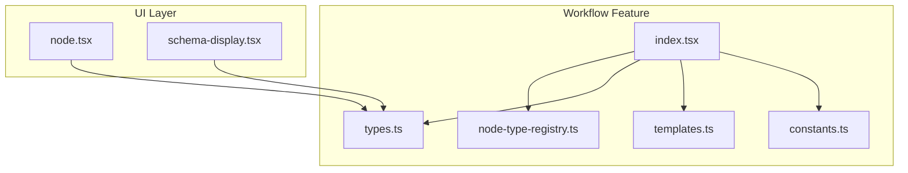
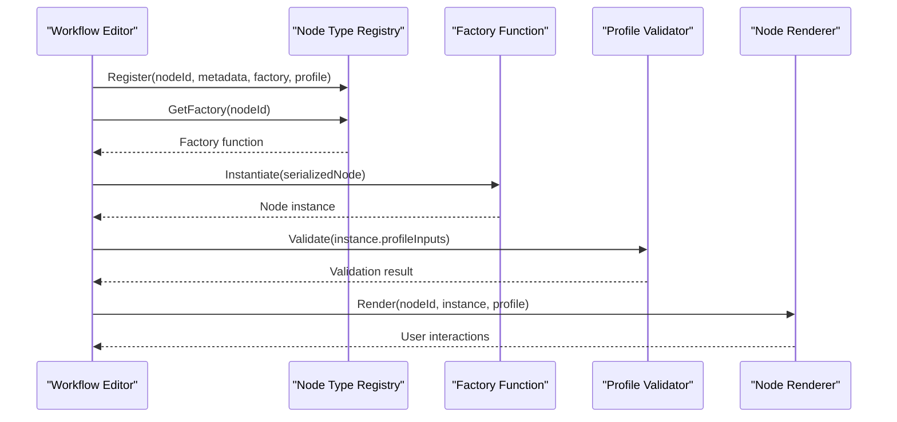
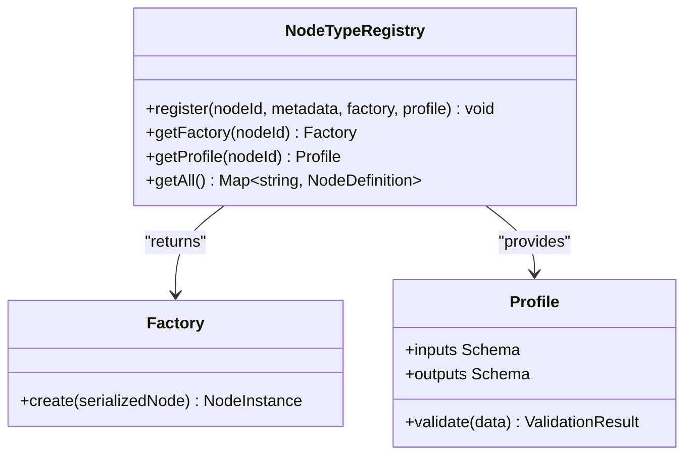
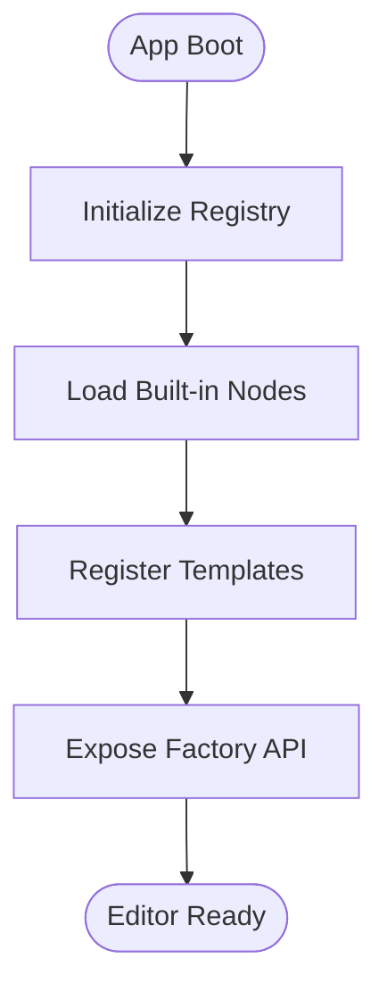
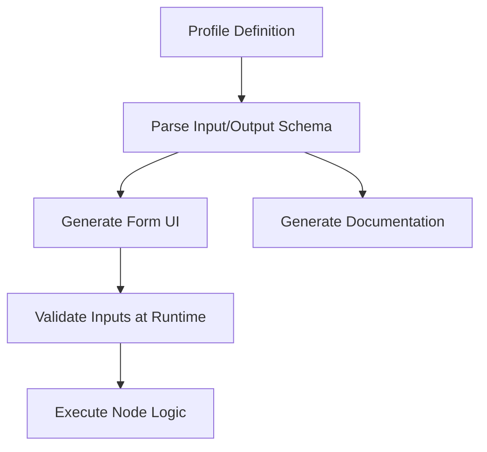
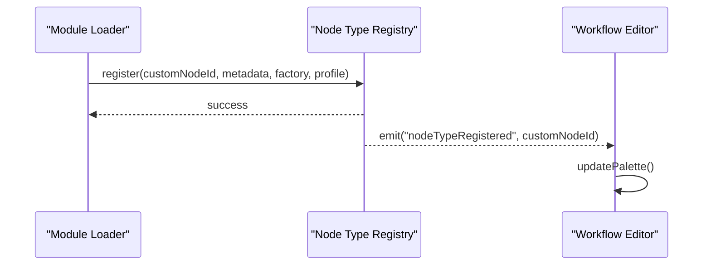
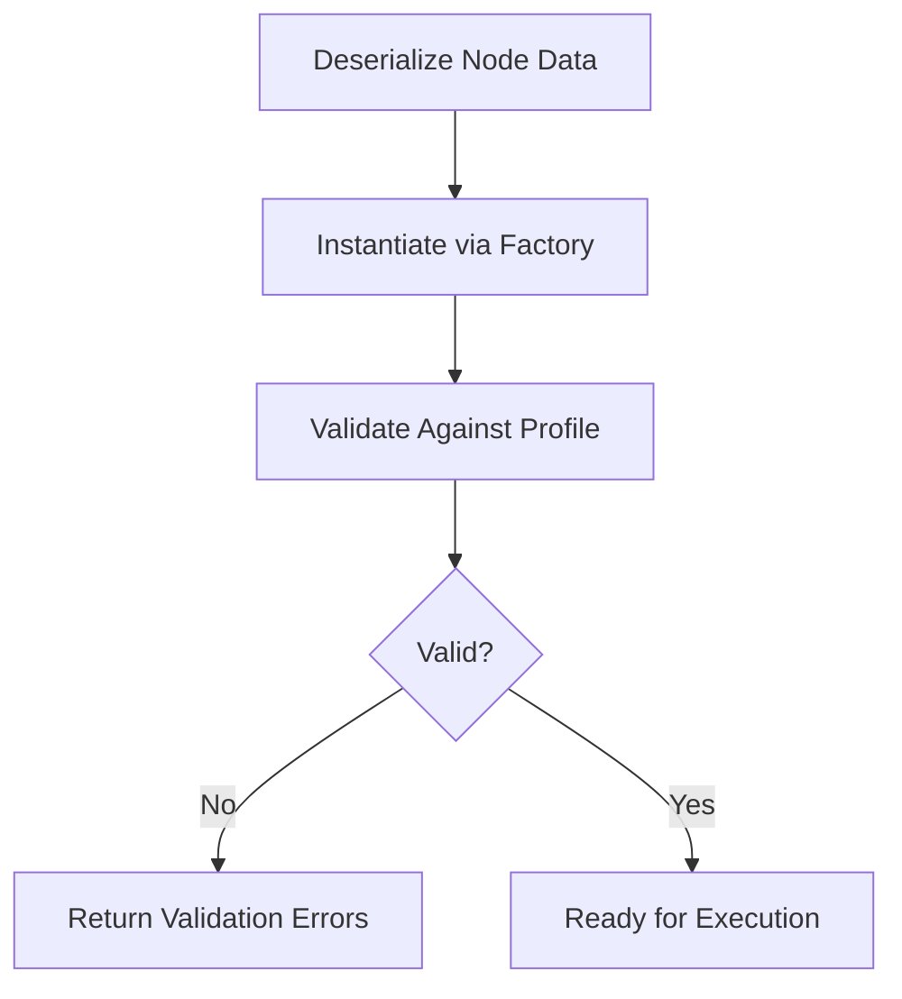
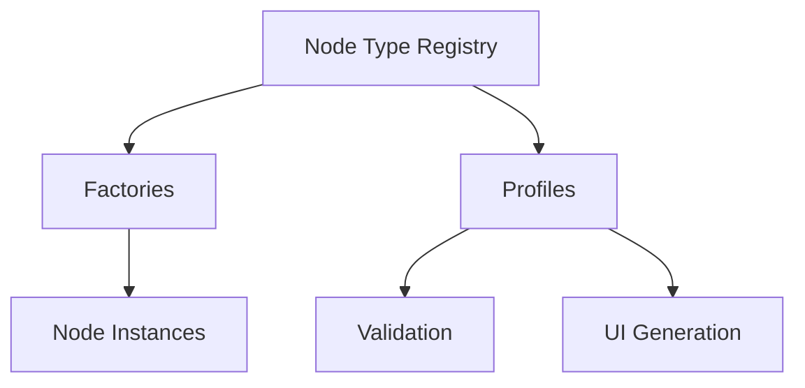
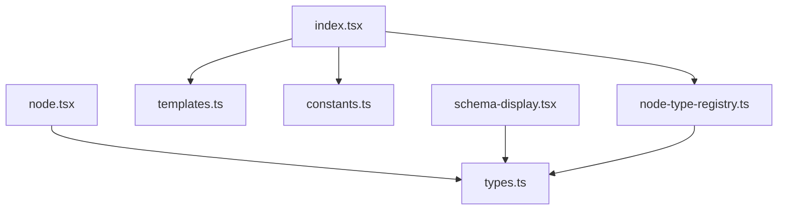

# Node Factory & Registration

<cite>
**Referenced Files in This Document**
- [node-type-registry.ts](file://src/pages/workflow/node-type-registry.ts)
- [index.tsx](file://src/pages/workflow/index.tsx)
- [types.ts](file://src/pages/workflow/types.ts)
- [templates.ts](file://src/pages/workflow/templates.ts)
- [constants.ts](file://src/pages/workflow/constants.ts)
- [node.tsx](file://src/components/ai-elements/node.tsx)
- [schema-display.tsx](file://src/components/ai-elements/schema-display.tsx)
</cite>

## Table of Contents
1. [Introduction](#introduction)
2. [Project Structure](#project-structure)
3. [Core Components](#core-components)
4. [Architecture Overview](#architecture-overview)
5. [Detailed Component Analysis](#detailed-component-analysis)
6. [Dependency Analysis](#dependency-analysis)
7. [Performance Considerations](#performance-considerations)
8. [Troubleshooting Guide](#troubleshooting-guide)
9. [Conclusion](#conclusion)
10. [Appendices](#appendices)

## Introduction
This document explains Apprecon’s node factory and registration system used by the workflow engine. It covers how new node types are registered, configured, and instantiated at runtime; how profile mapping drives behavior and UI generation; and how dynamic loading integrates with the editor and execution pipeline. The goal is to enable developers to create custom nodes, register them with the factory, define their profiles (inputs/outputs/validation), and understand validation, schema generation, and instantiation flows.

## Project Structure
The node factory and registration system lives under the workflow feature area. Key files include:
- Node type registry and factory logic
- Workflow page entry that wires up the registry and editor
- Shared types for nodes, edges, and profiles
- Templates for scaffolding new nodes
- Constants for default behaviors and metadata
- UI components for rendering nodes and displaying schemas

**Diagram sources**
- [node-type-registry.ts](file://src/pages/workflow/node-type-registry.ts)
- [index.tsx](file://src/pages/workflow/index.tsx)
- [types.ts](file://src/pages/workflow/types.ts)
- [templates.ts](file://src/pages/workflow/templates.ts)
- [constants.ts](file://src/pages/workflow/constants.ts)
- [node.tsx](file://src/components/ai-elements/node.tsx)
- [schema-display.tsx](file://src/components/ai-elements/schema-display.tsx)

**Section sources**
- [node-type-registry.ts](file://src/pages/workflow/node-type-registry.ts)
- [index.tsx](file://src/pages/workflow/index.tsx)
- [types.ts](file://src/pages/workflow/types.ts)
- [templates.ts](file://src/pages/workflow/templates.ts)
- [constants.ts](file://src/pages/workflow/constants.ts)
- [node.tsx](file://src/components/ai-elements/node.tsx)
- [schema-display.tsx](file://src/components/ai-elements/schema-display.tsx)

## Core Components
- Node Type Registry: Central map of node identifiers to factories/profiles. Provides registration APIs and lookup methods for dynamic instantiation.
- Workflow Entry: Initializes the registry, loads built-in nodes, and exposes a factory API to the editor and execution engine.
- Types: Defines node descriptors, profiles, input/output schemas, and lifecycle hooks.
- Templates: Scaffolds new node implementations with consistent structure and defaults.
- Constants: Default values, labels, categories, and metadata for nodes.
- UI Components: Render nodes on the canvas and display generated schemas based on profiles.

Key responsibilities:
- Registration: Add new node types with metadata and factory functions.
- Profile Mapping: Associate JSON Schema-like definitions with nodes for validation and UI generation.
- Instantiation: Create node instances from serialized data using the registry.
- Validation: Validate node inputs against profiles before execution.
- Schema Generation: Derive UI forms and documentation from profiles.

**Section sources**
- [node-type-registry.ts](file://src/pages/workflow/node-type-registry.ts)
- [index.tsx](file://src/pages/workflow/index.tsx)
- [types.ts](file://src/pages/workflow/types.ts)
- [templates.ts](file://src/pages/workflow/templates.ts)
- [constants.ts](file://src/pages/workflow/constants.ts)
- [node.tsx](file://src/components/ai-elements/node.tsx)
- [schema-display.tsx](file://src/components/ai-elements/schema-display.tsx)

## Architecture Overview
The node factory pattern decouples node definitions from their usage. The registry holds mappings from node IDs to factory functions and profiles. The workflow entry initializes the registry and provides an API for adding nodes and creating instances. UI components consume the registry to render nodes and generate forms from profiles.

**Diagram sources**
- [node-type-registry.ts](file://src/pages/workflow/node-type-registry.ts)
- [index.tsx](file://src/pages/workflow/index.tsx)
- [types.ts](file://src/pages/workflow/types.ts)
- [schema-display.tsx](file://src/components/ai-elements/schema-display.tsx)

## Detailed Component Analysis

### Node Type Registry
Responsibilities:
- Maintain a registry map keyed by node ID.
- Provide registration methods for node metadata, factory functions, and profiles.
- Offer lookup methods to retrieve factories and profiles by ID.
- Support optional pre/post hooks for lifecycle management.

Design patterns:
- Singleton registry accessible via the workflow entry.
- Factory pattern for node instantiation.
- Strategy pattern for profile-driven behavior.

Runtime flow:
- On startup, the workflow entry registers built-in nodes.
- Custom modules can call registration APIs to add new node types.
- When a node is added to the graph, the editor requests its factory and creates an instance.
- Profiles drive validation and schema generation.

**Diagram sources**
- [node-type-registry.ts](file://src/pages/workflow/node-type-registry.ts)
- [types.ts](file://src/pages/workflow/types.ts)

**Section sources**
- [node-type-registry.ts](file://src/pages/workflow/node-type-registry.ts)
- [types.ts](file://src/pages/workflow/types.ts)

### Workflow Entry and Initialization
Responsibilities:
- Initialize the registry and load built-in nodes.
- Expose factory APIs to the editor and execution engine.
- Wire up templates and constants for consistent node creation.

Initialization steps:
- Create or import the registry instance.
- Register core node types with metadata, factories, and profiles.
- Make the registry available to the editor component tree.

**Diagram sources**
- [index.tsx](file://src/pages/workflow/index.tsx)
- [templates.ts](file://src/pages/workflow/templates.ts)
- [constants.ts](file://src/pages/workflow/constants.ts)

**Section sources**
- [index.tsx](file://src/pages/workflow/index.tsx)
- [templates.ts](file://src/pages/workflow/templates.ts)
- [constants.ts](file://src/pages/workflow/constants.ts)

### Profile Mapping and Schema Generation
Profiles define:
- Input schema: fields, types, constraints, defaults.
- Output schema: expected results and shape.
- Validation rules: required fields, format checks, business constraints.

Schema generation:
- Convert profiles into UI forms automatically.
- Generate documentation and tooltips from field descriptions.
- Enable runtime validation before execution.

**Diagram sources**
- [types.ts](file://src/pages/workflow/types.ts)
- [schema-display.tsx](file://src/components/ai-elements/schema-display.tsx)

**Section sources**
- [types.ts](file://src/pages/workflow/types.ts)
- [schema-display.tsx](file://src/components/ai-elements/schema-display.tsx)

### Dynamic Node Loading Mechanisms
Dynamic loading allows:
- Adding new node types without restarting the app.
- Hot-reloading during development.
- Pluggable architecture for third-party extensions.

Mechanism overview:
- Registry supports late registration via APIs.
- Editor listens for registration events and updates the palette.
- Instances are created on-demand from serialized representations.

**Diagram sources**
- [node-type-registry.ts](file://src/pages/workflow/node-type-registry.ts)
- [index.tsx](file://src/pages/workflow/index.tsx)

**Section sources**
- [node-type-registry.ts](file://src/pages/workflow/node-type-registry.ts)
- [index.tsx](file://src/pages/workflow/index.tsx)

### Creating Custom Node Types
Steps to create a custom node:
1. Define the node implementation following the template structure.
2. Create a profile with input/output schemas and validation rules.
3. Implement a factory function to instantiate the node from serialized data.
4. Register the node with the registry using the provided API.
5. Ensure metadata includes label, category, and description for UI.

Best practices:
- Keep profiles minimal and explicit for reliable validation.
- Use defaults to reduce boilerplate in serialized nodes.
- Provide clear error messages in validation failures.

**Section sources**
- [templates.ts](file://src/pages/workflow/templates.ts)
- [constants.ts](file://src/pages/workflow/constants.ts)
- [node-type-registry.ts](file://src/pages/workflow/node-type-registry.ts)

### Node Validation, Schema Generation, and Runtime Instantiation
Validation:
- Run profile-based validation before executing node logic.
- Fail fast with descriptive errors when inputs are invalid.

Schema generation:
- Automatically generate forms from input schemas.
- Display output schemas for debugging and documentation.

Instantiation:
- Use factory functions to create instances from serialized node data.
- Preserve state and configuration across sessions.

**Diagram sources**
- [types.ts](file://src/pages/workflow/types.ts)
- [node-type-registry.ts](file://src/pages/workflow/node-type-registry.ts)

**Section sources**
- [types.ts](file://src/pages/workflow/types.ts)
- [node-type-registry.ts](file://src/pages/workflow/node-type-registry.ts)

### Conceptual Overview
The node factory pattern enables extensibility and separation of concerns. Profiles abstract behavior and UI generation, while the registry centralizes discovery and instantiation. This design supports both built-in and custom nodes seamlessly.

[No sources needed since this diagram shows conceptual workflow, not actual code structure]

## Dependency Analysis
Dependencies between components:
- Workflow entry depends on registry, templates, and constants.
- UI components depend on types and schema definitions.
- Registry depends on factory functions and profile validators.

**Diagram sources**
- [index.tsx](file://src/pages/workflow/index.tsx)
- [node-type-registry.ts](file://src/pages/workflow/node-type-registry.ts)
- [templates.ts](file://src/pages/workflow/templates.ts)
- [constants.ts](file://src/pages/workflow/constants.ts)
- [node.tsx](file://src/components/ai-elements/node.tsx)
- [schema-display.tsx](file://src/components/ai-elements/schema-display.tsx)
- [types.ts](file://src/pages/workflow/types.ts)

**Section sources**
- [index.tsx](file://src/pages/workflow/index.tsx)
- [node-type-registry.ts](file://src/pages/workflow/node-type-registry.ts)
- [templates.ts](file://src/pages/workflow/templates.ts)
- [constants.ts](file://src/pages/workflow/constants.ts)
- [node.tsx](file://src/components/ai-elements/node.tsx)
- [schema-display.tsx](file://src/components/ai-elements/schema-display.tsx)
- [types.ts](file://src/pages/workflow/types.ts)

## Performance Considerations
- Lazy registration: Register nodes only when needed to reduce startup time.
- Memoization: Cache validated profiles and generated schemas.
- Batch updates: Update the editor UI in batches after multiple registrations.
- Avoid heavy computations in factories; defer to async initialization if necessary.

[No sources needed since this section provides general guidance]

## Troubleshooting Guide
Common issues and resolutions:
- Node not appearing in palette: Ensure registration occurs before editor initialization.
- Validation errors: Check profile schemas and input data shapes.
- Instance creation fails: Verify factory function handles all serialized fields.
- Schema mismatch: Align profile definitions with actual node implementation.

Debugging tips:
- Log registration calls and factory invocations.
- Inspect generated schemas in the UI for correctness.
- Use console logs in validation functions to trace failures.

**Section sources**
- [node-type-registry.ts](file://src/pages/workflow/node-type-registry.ts)
- [schema-display.tsx](file://src/components/ai-elements/schema-display.tsx)

## Conclusion
Apprecon’s node factory and registration system provides a robust foundation for building extensible workflows. By leveraging the registry, profiles, and factory pattern, developers can create custom nodes with consistent behavior, validation, and UI generation. The modular design supports dynamic loading and hot-reloading, enabling rapid iteration and third-party extensions.

[No sources needed since this section summarizes without analyzing specific files]

## Appendices
- Example registration sequence: See workflow entry initialization.
- Profile definition guidelines: Refer to types and schema-display components.
- Template usage: Follow the scaffolded structure for consistency.

[No sources needed since this section provides general guidance]