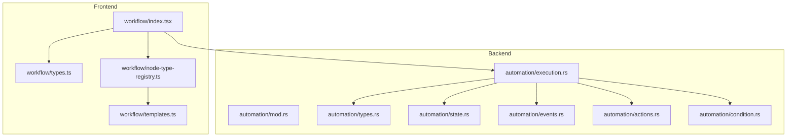
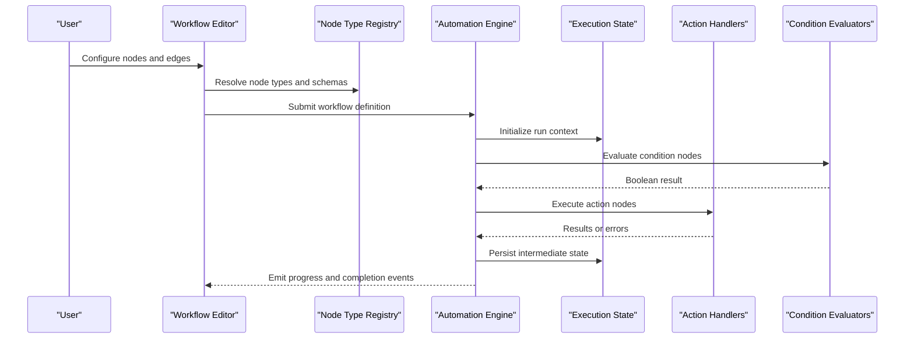
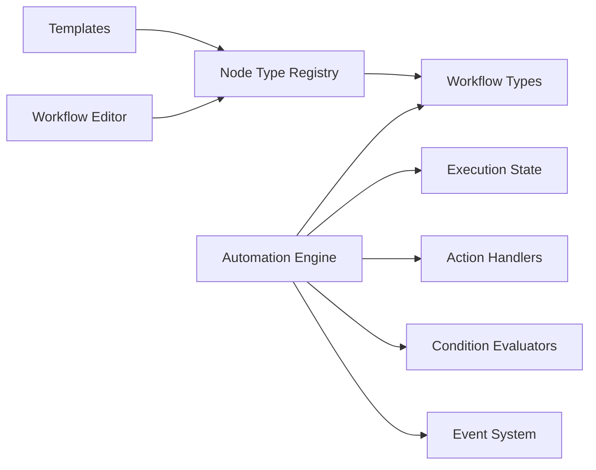

# Node System & Types

<cite>
**Referenced Files in This Document**
- [workflow/index.tsx](file://src/pages/workflow/index.tsx)
- [workflow/types.ts](file://src/pages/workflow/types.ts)
- [workflow/node-type-registry.ts](file://src/pages/workflow/node-type-registry.ts)
- [workflow/templates.ts](file://src/pages/workflow/templates.ts)
- [automation/mod.rs](file://src-tauri/src/automation/mod.rs)
- [automation/types.rs](file://src-tauri/src/automation/types.rs)
- [automation/state.rs](file://src-tauri/src/automation/state.rs)
- [automation/execution.rs](file://src-tauri/src/automation/execution.rs)
- [automation/events.rs](file://src-tauri/src/automation/events.rs)
- [automation/actions.rs](file://src-tauri/src/automation/actions.rs)
- [automation/condition.rs](file://src-tauri/src/automation/condition.rs)
</cite>

## Table of Contents
1. [Introduction](#introduction)
2. [Project Structure](#project-structure)
3. [Core Components](#core-components)
4. [Architecture Overview](#architecture-overview)
5. [Detailed Component Analysis](#detailed-component-analysis)
6. [Dependency Analysis](#dependency-analysis)
7. [Performance Considerations](#performance-considerations)
8. [Troubleshooting Guide](#troubleshooting-guide)
9. [Conclusion](#conclusion)
10. [Appendices](#appendices)

## Introduction
This document explains Apprecon’s node-based programming model used to build workflows. It covers the three primary node types:
- Trigger nodes: event initiators that start a workflow execution
- Action nodes: operations executors that perform work (e.g., HTTP calls, browser actions)
- Condition nodes: decision logic that routes execution based on runtime data

It also documents configuration schemas, data flow between nodes, input/output handling, error propagation, lifecycle management, state persistence, and debugging techniques. Guidance is provided for creating custom nodes, extending existing node types, and implementing complex business logic within nodes.

## Project Structure
The node system spans both the frontend (TypeScript/React) and backend (Rust/Tauri):
- Frontend workflow editor and runtime orchestration live under src/pages/workflow
- Backend automation engine and execution pipeline live under src-tauri/src/automation

**Diagram sources**
- [workflow/index.tsx](file://src/pages/workflow/index.tsx)
- [workflow/types.ts](file://src/pages/workflow/types.ts)
- [workflow/node-type-registry.ts](file://src/pages/workflow/node-type-registry.ts)
- [workflow/templates.ts](file://src/pages/workflow/templates.ts)
- [automation/mod.rs](file://src-tauri/src/automation/mod.rs)
- [automation/types.rs](file://src-tauri/src/automation/types.rs)
- [automation/state.rs](file://src-tauri/src/automation/state.rs)
- [automation/execution.rs](file://src-tauri/src/automation/execution.rs)
- [automation/events.rs](file://src-tauri/src/automation/events.rs)
- [automation/actions.rs](file://src-tauri/src/automation/actions.rs)
- [automation/condition.rs](file://src-tauri/src/automation/condition.rs)

**Section sources**
- [workflow/index.tsx](file://src/pages/workflow/index.tsx)
- [automation/mod.rs](file://src-tauri/src/automation/mod.rs)

## Core Components
- Node type registry: centralizes definitions of available node types and their metadata
- Workflow types: defines node schema, edges, inputs/outputs, and execution context
- Templates: provides starter configurations for common trigger/action/condition patterns
- Automation engine: executes workflows, manages state, handles events, conditions, and actions

Key responsibilities:
- Registration and discovery of node types
- Validation of node configurations against schemas
- Execution scheduling and routing based on edges and conditions
- State persistence and recovery across runs
- Event-driven triggers and inter-node communication

**Section sources**
- [workflow/node-type-registry.ts](file://src/pages/workflow/node-type-registry.ts)
- [workflow/types.ts](file://src/pages/workflow/types.ts)
- [workflow/templates.ts](file://src/pages/workflow/templates.ts)
- [automation/mod.rs](file://src-tauri/src/automation/mod.rs)

## Architecture Overview
The workflow system follows an event-driven architecture with clear separation between UI/editor and execution engine:

**Diagram sources**
- [workflow/node-type-registry.ts](file://src/pages/workflow/node-type-registry.ts)
- [automation/execution.rs](file://src-tauri/src/automation/execution.rs)
- [automation/state.rs](file://src-tauri/src/automation/state.rs)
- [automation/actions.rs](file://src-tauri/src/automation/actions.rs)
- [automation/condition.rs](file://src-tauri/src/automation/condition.rs)

## Detailed Component Analysis

### Node Types and Schemas
Apprecon supports three core node types:
- Trigger nodes: initiate workflows from external events (e.g., HTTP request, browser event, scheduled time)
- Action nodes: execute operations (e.g., send HTTP requests, manipulate browser, write files)
- Condition nodes: evaluate expressions to route execution paths

Configuration schema elements typically include:
- Node metadata: id, label, type, version
- Inputs: typed parameters bound to upstream outputs or static values
- Outputs: named results consumed by downstream nodes
- Configuration: node-specific settings validated at design time
- Error behavior: retry policy, timeout, failure routing

Data flow between nodes:
- Edges connect output ports to input ports
- Data is passed as structured payloads defined by node schemas
- Conditional branches determine which downstream nodes receive data

Error propagation:
- Failures can be propagated to parent contexts
- Optional error branches allow graceful degradation
- Retries and timeouts are configurable per node

Examples of creating custom nodes:
- Define a new node type in the registry with schema validation
- Implement input/output mappings and execution logic
- Provide templates for quick setup

Extending existing node types:
- Override default behaviors via composition or subclassing
- Add additional configuration fields and validations

Implementing complex business logic:
- Use condition nodes for branching
- Chain multiple action nodes for multi-step processes
- Leverage state persistence for long-running workflows

**Section sources**
- [workflow/types.ts](file://src/pages/workflow/types.ts)
- [workflow/node-type-registry.ts](file://src/pages/workflow/node-type-registry.ts)
- [workflow/templates.ts](file://src/pages/workflow/templates.ts)

### Lifecycle Management and State Persistence
Lifecycle phases:
- Initialization: validate configuration, resolve dependencies
- Execution: schedule nodes, manage concurrency, handle events
- Completion: finalize outputs, clean up resources
- Recovery: resume from persisted state after interruptions

State persistence:
- Intermediate results stored per node execution
- Checkpoints enable resuming partial workflows
- Versioned schemas ensure compatibility across updates

Debugging techniques:
- Step-through execution with breakpoints
- Inspect node inputs/outputs and internal state
- Log aggregation and trace correlation across nodes

**Section sources**
- [automation/state.rs](file://src-tauri/src/automation/state.rs)
- [automation/execution.rs](file://src-tauri/src/automation/execution.rs)

### Event Handling and Triggers
Trigger nodes respond to various event sources:
- HTTP endpoints receiving requests
- Browser events (clicks, navigation, page loads)
- Scheduled timers and cron expressions
- External system webhooks

Event processing:
- Events are normalized into standard format
- Trigger nodes validate and transform incoming data
- Workflows start when trigger conditions are met

**Section sources**
- [automation/events.rs](file://src-tauri/src/automation/events.rs)

### Action Execution and Condition Evaluation
Action nodes:
- Encapsulate specific operations (API calls, file I/O, browser automation)
- Support parameter binding from node inputs
- Handle retries, timeouts, and error responses

Condition nodes:
- Evaluate boolean expressions against runtime data
- Support logical operators and comparisons
- Enable dynamic routing based on data content

**Section sources**
- [automation/actions.rs](file://src-tauri/src/automation/actions.rs)
- [automation/condition.rs](file://src-tauri/src/automation/condition.rs)

## Dependency Analysis
The workflow system has clear dependency boundaries:

**Diagram sources**
- [workflow/node-type-registry.ts](file://src/pages/workflow/node-type-registry.ts)
- [workflow/types.ts](file://src/pages/workflow/types.ts)
- [workflow/templates.ts](file://src/pages/workflow/templates.ts)
- [automation/execution.rs](file://src-tauri/src/automation/execution.rs)
- [automation/state.rs](file://src-tauri/src/automation/state.rs)
- [automation/actions.rs](file://src-tauri/src/automation/actions.rs)
- [automation/condition.rs](file://src-tauri/src/automation/condition.rs)
- [automation/events.rs](file://src-tauri/src/automation/events.rs)

**Section sources**
- [automation/mod.rs](file://src-tauri/src/automation/mod.rs)

## Performance Considerations
- Optimize node execution with async operations where possible
- Use connection pooling for external API calls
- Implement caching for repeated computations
- Monitor memory usage in long-running workflows
- Batch operations when processing large datasets
- Configure appropriate timeouts and retry policies

## Troubleshooting Guide
Common issues and solutions:
- Node configuration errors: validate schemas before deployment
- Data flow problems: check input/output port mappings
- Performance bottlenecks: profile slow nodes and optimize
- Memory leaks: monitor resource cleanup in long-running workflows
- Network failures: implement proper error handling and retries

Debugging strategies:
- Enable detailed logging for problematic nodes
- Use step-through debugging in development mode
- Inspect execution state at checkpoints
- Analyze error traces and stack dumps

**Section sources**
- [automation/execution.rs](file://src-tauri/src/automation/execution.rs)
- [automation/state.rs](file://src-tauri/src/automation/state.rs)

## Conclusion
Apprecon’s node-based programming model provides a flexible and powerful framework for building automated workflows. The separation between trigger, action, and condition nodes enables clear organization of business logic. With comprehensive schema validation, robust error handling, and persistent state management, developers can create reliable and maintainable automation pipelines. The extensible architecture allows for easy addition of custom nodes and integration with external systems.

## Appendices

### Creating Custom Nodes - Quick Reference
1. Register new node type in the registry
2. Define input/output schemas
3. Implement execution logic
4. Add validation rules
5. Provide template configurations
6. Test with sample workflows

### Best Practices
- Keep nodes focused on single responsibilities
- Use meaningful names for inputs and outputs
- Implement proper error handling and logging
- Validate all user inputs
- Consider performance implications
- Document node behavior thoroughly

[No sources needed since this section provides general guidance]