# Trigger Nodes

<cite>
**Referenced Files in This Document**
- [src/triggers/index.ts](file://src/triggers/index.ts)
- [src/triggers/browser/index.ts](file://src/triggers/browser/index.ts)
- [src/triggers/intercept/index.ts](file://src/triggers/intercept/index.ts)
- [src/triggers/live-traffic/index.ts](file://src/triggers/live-traffic/index.ts)
- [src/triggers/repeater/index.ts](file://src/triggers/repeater/index.ts)
- [src/triggers/invoker/index.ts](file://src/triggers/invoker/index.ts)
- [src/triggers/documents/index.ts](file://src/triggers/documents/index.ts)
- [src/triggers/terminal/index.ts](file://src/triggers/terminal/index.ts)
- [src/pages/workflow/nodes/index.tsx](file://src/pages/workflow/nodes/index.tsx)
- [src/pages/workflow/node-type-registry.ts](file://src/pages/workflow/node-type-registry.ts)
- [src-tauri/src/automation/events.rs](file://src-tauri/src/automation/events.rs)
- [src-tauri/src/automation/scheduled.rs](file://src-tauri/src/automation/scheduled.rs)
- [src-tauri/src/automation/websocket.rs](file://src-tauri/src/automation/websocket.rs)
- [src-tauri/src/automation/page_crawled.rs](file://src-tauri/src/automation/page_crawled.rs)
- [src-tauri/src/automation/state.rs](file://src-tauri/src/automation/state.rs)
</cite>

## Table of Contents
1. [Introduction](#introduction)
2. [Project Structure](#project-structure)
3. [Core Components](#core-components)
4. [Architecture Overview](#architecture-overview)
5. [Detailed Component Analysis](#detailed-component-analysis)
6. [Dependency Analysis](#dependency-analysis)
7. [Performance Considerations](#performance-considerations)
8. [Troubleshooting Guide](#troubleshooting-guide)
9. [Conclusion](#conclusion)

## Introduction
This document explains trigger nodes in Apprecon’s workflow system. Trigger nodes are the entry points that start a workflow execution when an event occurs. Events can come from HTTP requests, scheduled tasks, browser interactions, live traffic captures, file changes, and external webhooks. The documentation covers configuration schemas, event binding mechanisms, parameter passing, lifecycle, error handling, and debugging techniques. It also provides examples for common trigger types such as HTTP endpoints, cron schedules, file watchers, and custom event listeners.

## Project Structure
Trigger nodes are implemented across two layers:
- Frontend trigger definitions and UI integrations under src/triggers and src/pages/workflow
- Backend event sources and scheduling under src-tauri/src/automation

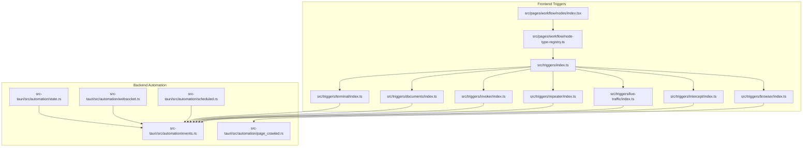

**Diagram sources**
- [src/triggers/index.ts](file://src/triggers/index.ts)
- [src/triggers/browser/index.ts](file://src/triggers/browser/index.ts)
- [src/triggers/intercept/index.ts](file://src/triggers/intercept/index.ts)
- [src/triggers/live-traffic/index.ts](file://src/triggers/live-traffic/index.ts)
- [src/triggers/repeater/index.ts](file://src/triggers/repeater/index.ts)
- [src/triggers/invoker/index.ts](file://src/triggers/invoker/index.ts)
- [src/triggers/documents/index.ts](file://src/triggers/documents/index.ts)
- [src/triggers/terminal/index.ts](file://src/triggers/terminal/index.ts)
- [src/pages/workflow/nodes/index.tsx](file://src/pages/workflow/nodes/index.tsx)
- [src/pages/workflow/node-type-registry.ts](file://src/pages/workflow/node-type-registry.ts)
- [src-tauri/src/automation/events.rs](file://src-tauri/src/automation/events.rs)
- [src-tauri/src/automation/scheduled.rs](file://src-tauri/src/automation/scheduled.rs)
- [src-tauri/src/automation/websocket.rs](file://src-tauri/src/automation/websocket.rs)
- [src-tauri/src/automation/page_crawled.rs](file://src-tauri/src/automation/page_crawled.rs)
- [src-tauri/src/automation/state.rs](file://src-tauri/src/automation/state.rs)

**Section sources**
- [src/triggers/index.ts](file://src/triggers/index.ts)
- [src/pages/workflow/node-type-registry.ts](file://src/pages/workflow/node-type-registry.ts)
- [src-tauri/src/automation/events.rs](file://src-tauri/src/automation/events.rs)

## Core Components
- Trigger registry and index: Centralizes all trigger modules and exposes a unified interface to the workflow engine.
- Node type registry: Maps node IDs to their implementations and metadata (UI, schema, handlers).
- Event bus and state: Bridges frontend triggers with backend automation events and maintains runtime state.

Key responsibilities:
- Define trigger schemas for validation and UI generation
- Bind events from various sources to workflow executions
- Pass parameters from events into subsequent nodes
- Manage lifecycle and error propagation

**Section sources**
- [src/triggers/index.ts](file://src/triggers/index.ts)
- [src/pages/workflow/node-type-registry.ts](file://src/pages/workflow/node-type-registry.ts)
- [src-tauri/src/automation/state.rs](file://src-tauri/src/automation/state.rs)

## Architecture Overview
The trigger architecture spans frontend and backend:
- Frontend defines trigger modules per feature area (browser, intercept, live-traffic, repeater, invoker, documents, terminal)
- Backend emits automation events (scheduled, websocket, page crawled, generic events)
- Workflow engine subscribes to these events and executes corresponding workflows

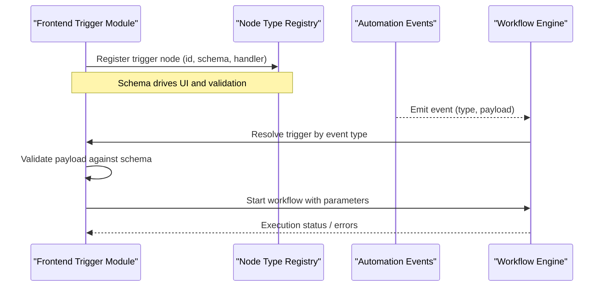

**Diagram sources**
- [src/triggers/index.ts](file://src/triggers/index.ts)
- [src/pages/workflow/node-type-registry.ts](file://src/pages/workflow/node-type-registry.ts)
- [src-tauri/src/automation/events.rs](file://src-tauri/src/automation/events.rs)

## Detailed Component Analysis

### Browser Triggers
Browser triggers initiate workflows based on browser actions or crawl results. They integrate with the page crawler and expose UI controls for configuring conditions and payloads.

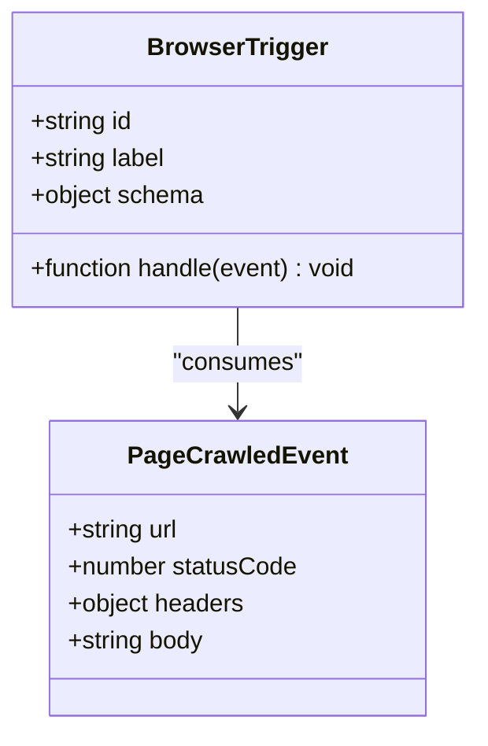

**Diagram sources**
- [src/triggers/browser/index.ts](file://src/triggers/browser/index.ts)
- [src-tauri/src/automation/page_crawled.rs](file://src-tauri/src/automation/page_crawled.rs)

**Section sources**
- [src/triggers/browser/index.ts](file://src/triggers/browser/index.ts)
- [src-tauri/src/automation/page_crawled.rs](file://src-tauri/src/automation/page_crawled.rs)

### Intercept Triggers
Intercept triggers react to intercepted HTTP requests/responses. They allow filtering by method, path, headers, and response codes, then pass captured data into workflows.

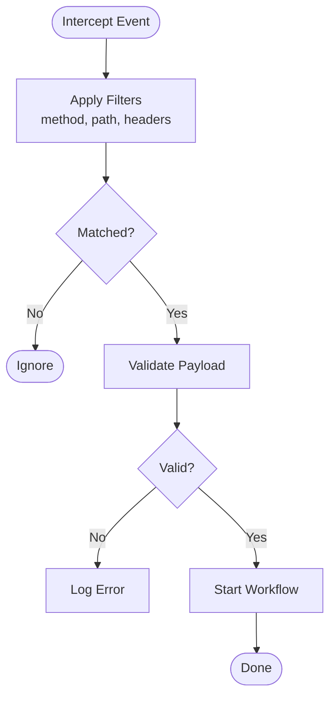

**Diagram sources**
- [src/triggers/intercept/index.ts](file://src/triggers/intercept/index.ts)
- [src-tauri/src/automation/events.rs](file://src-tauri/src/automation/events.rs)

**Section sources**
- [src/triggers/intercept/index.ts](file://src/triggers/intercept/index.ts)
- [src-tauri/src/automation/events.rs](file://src-tauri/src/automation/events.rs)

### Live Traffic Triggers
Live traffic triggers subscribe to real-time network events and forward them to workflows. They support target-based routing and payload transformation.

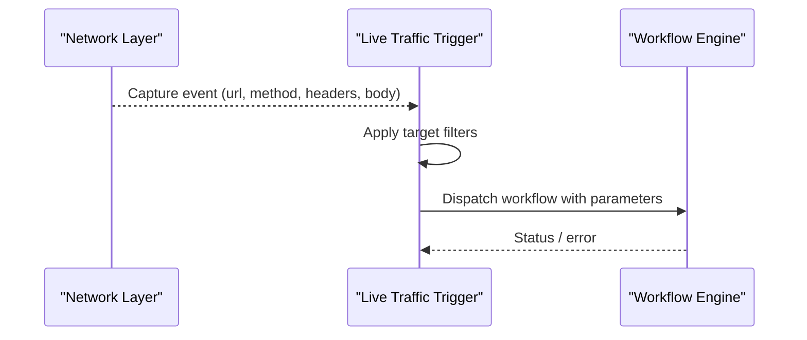

**Diagram sources**
- [src/triggers/live-traffic/index.ts](file://src/triggers/live-traffic/index.ts)
- [src-tauri/src/automation/events.rs](file://src-tauri/src/automation/events.rs)

**Section sources**
- [src/triggers/live-traffic/index.ts](file://src/triggers/live-traffic/index.ts)
- [src-tauri/src/automation/events.rs](file://src-tauri/src/automation/events.rs)

### Repeater Triggers
Repeater triggers enable workflow execution based on repeated API calls or collection runs. They support batch processing and result aggregation.

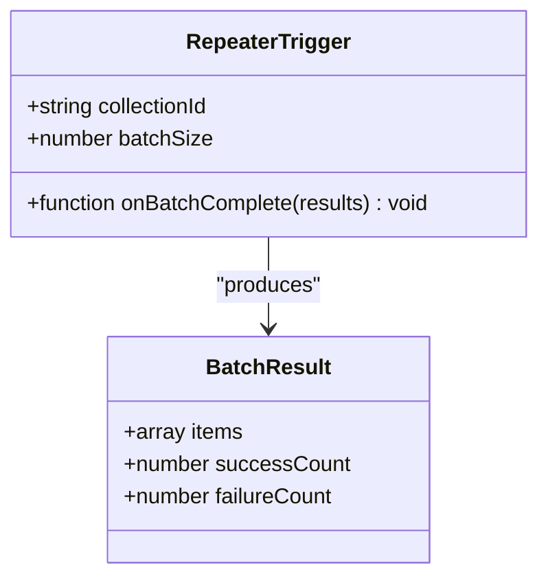

**Diagram sources**
- [src/triggers/repeater/index.ts](file://src/triggers/repeater/index.ts)
- [src-tauri/src/automation/events.rs](file://src-tauri/src/automation/events.rs)

**Section sources**
- [src/triggers/repeater/index.ts](file://src/triggers/repeater/index.ts)
- [src-tauri/src/automation/events.rs](file://src-tauri/src/automation/events.rs)

### Invoker Triggers
Invoker triggers call external functions or services and propagate their results to workflows. They support async execution and error propagation.

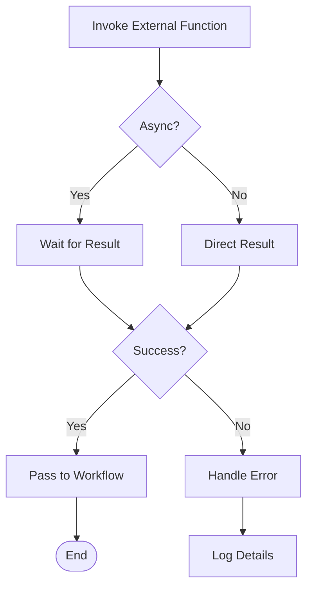

**Diagram sources**
- [src/triggers/invoker/index.ts](file://src/triggers/invoker/index.ts)
- [src-tauri/src/automation/events.rs](file://src-tauri/src/automation/events.rs)

**Section sources**
- [src/triggers/invoker/index.ts](file://src/triggers/invoker/index.ts)
- [src-tauri/src/automation/events.rs](file://src-tauri/src/automation/events.rs)

### Document Triggers
Document triggers respond to changes in document sections or content updates. They enable workflow automation based on document editing activities.

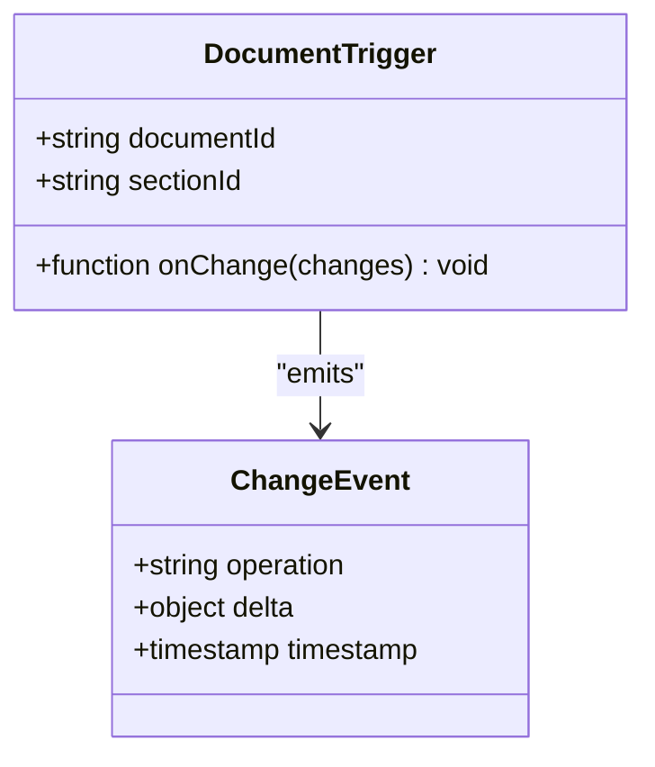

**Diagram sources**
- [src/triggers/documents/index.ts](file://src/triggers/documents/index.ts)
- [src-tauri/src/automation/events.rs](file://src-tauri/src/automation/events.rs)

**Section sources**
- [src/triggers/documents/index.ts](file://src/triggers/documents/index.ts)
- [src-tauri/src/automation/events.rs](file://src-tauri/src/automation/events.rs)

### Terminal Triggers
Terminal triggers execute workflows based on terminal command outputs or shell events. They capture stdout/stderr and environment context.

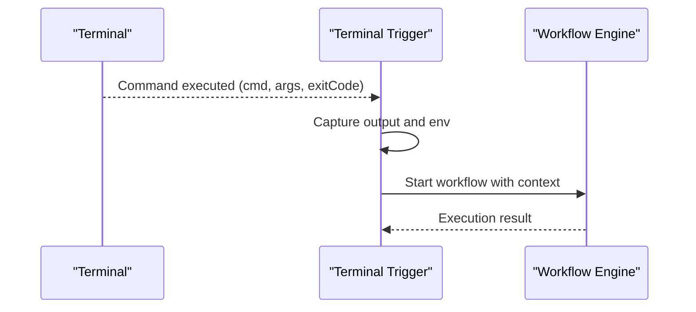

**Diagram sources**
- [src/triggers/terminal/index.ts](file://src/triggers/terminal/index.ts)
- [src-tauri/src/automation/events.rs](file://src-tauri/src/automation/events.rs)

**Section sources**
- [src/triggers/terminal/index.ts](file://src/triggers/terminal/index.ts)
- [src-tauri/src/automation/events.rs](file://src-tauri/src/automation/events.rs)

### Conceptual Overview
Common trigger patterns include:
- HTTP endpoints: REST/WebSocket triggers for external integrations
- Cron schedules: Time-based triggers for periodic tasks
- File watchers: FileSystem change triggers for document/code monitoring
- Custom event listeners: Domain-specific event triggers for specialized workflows

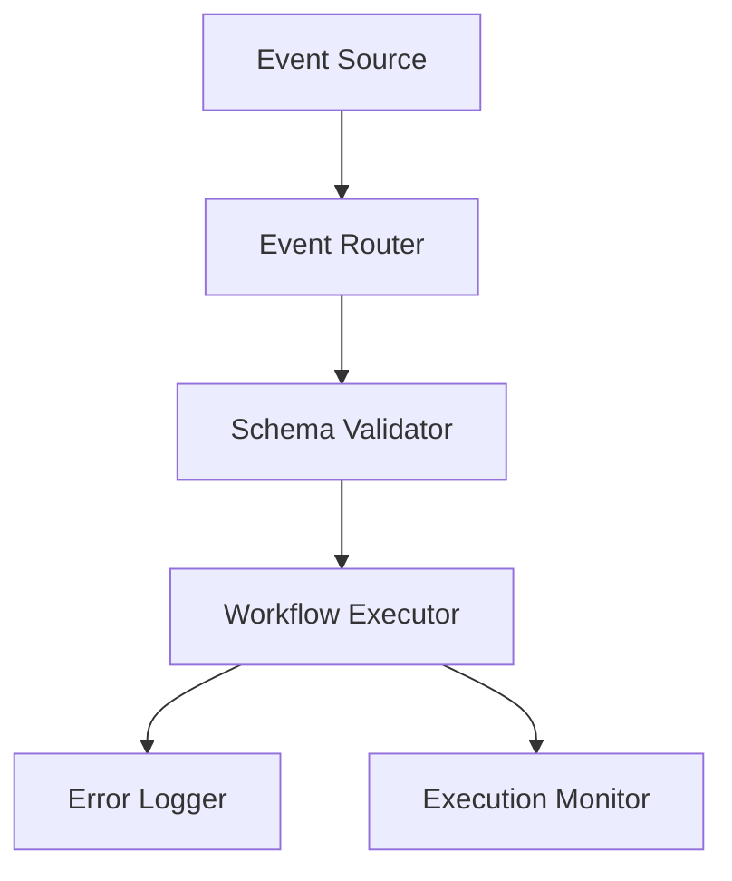

[No sources needed since this diagram shows conceptual workflow, not actual code structure]

## Dependency Analysis
Trigger nodes depend on:
- Node type registry for registration and lookup
- Automation events for backend communication
- State management for runtime context

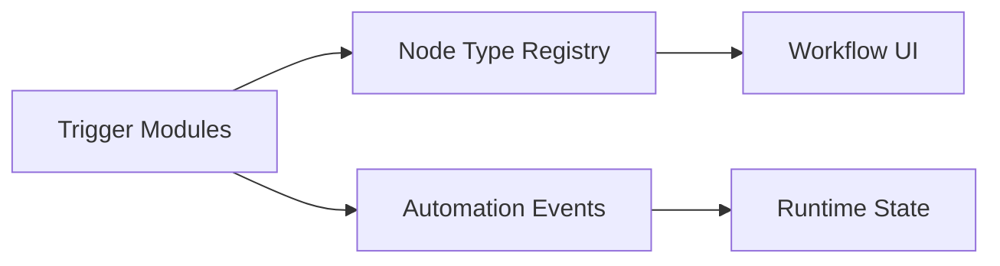

**Diagram sources**
- [src/triggers/index.ts](file://src/triggers/index.ts)
- [src/pages/workflow/node-type-registry.ts](file://src/pages/workflow/node-type-registry.ts)
- [src-tauri/src/automation/events.rs](file://src-tauri/src/automation/events.rs)
- [src-tauri/src/automation/state.rs](file://src-tauri/src/automation/state.rs)

**Section sources**
- [src/triggers/index.ts](file://src/triggers/index.ts)
- [src/pages/workflow/node-type-registry.ts](file://src/pages/workflow/node-type-registry.ts)
- [src-tauri/src/automation/events.rs](file://src-tauri/src/automation/events.rs)
- [src-tauri/src/automation/state.rs](file://src-tauri/src/automation/state.rs)

## Performance Considerations
- Event filtering: Implement efficient filters to reduce unnecessary workflow executions
- Batch processing: Use batching for high-frequency events like live traffic
- Asynchronous handling: Avoid blocking operations in trigger handlers
- Memory management: Clean up event subscriptions and temporary data
- Rate limiting: Implement throttling for external API calls and scheduled tasks

## Troubleshooting Guide
Common issues and solutions:
- Trigger not firing: Verify event source is active and filters match incoming events
- Parameter validation errors: Check schema definitions and input data formats
- Workflow execution failures: Review error logs and stack traces in the debugger
- Performance degradation: Monitor event volume and optimize filters/batching
- State inconsistencies: Ensure proper cleanup of subscriptions and timers

Debugging techniques:
- Enable detailed logging in trigger modules
- Use workflow execution history to trace parameter flows
- Inspect event payloads using developer tools
- Test triggers with sample data before production deployment

**Section sources**
- [src-tauri/src/automation/events.rs](file://src-tauri/src/automation/events.rs)
- [src-tauri/src/automation/state.rs](file://src-tauri/src/automation/state.rs)

## Conclusion
Trigger nodes form the foundation of Apprecon's workflow automation system. By understanding their configuration, event binding mechanisms, and lifecycle management, developers can create robust and efficient automated workflows. The modular architecture allows easy extension with new trigger types while maintaining consistency across different event sources. Proper error handling, performance optimization, and debugging practices ensure reliable operation in production environments.