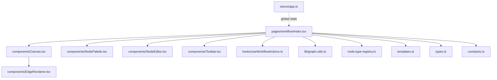
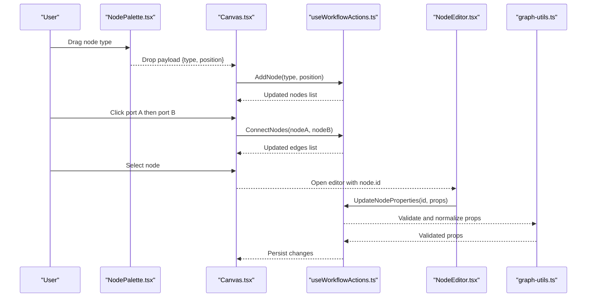
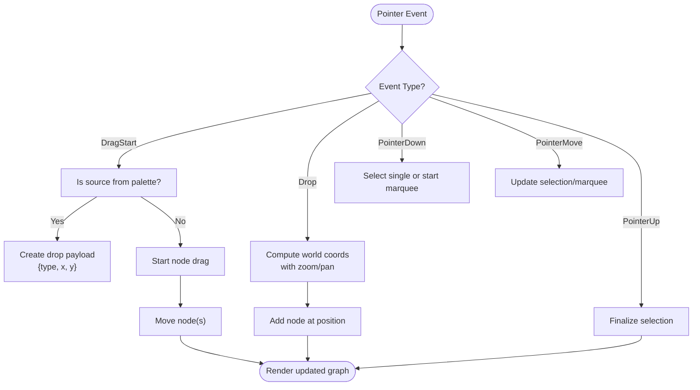
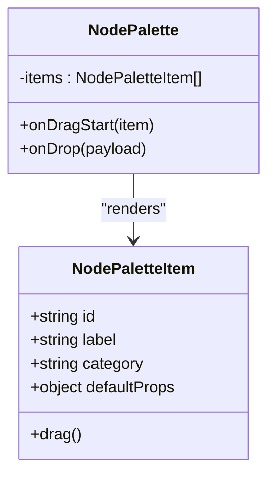
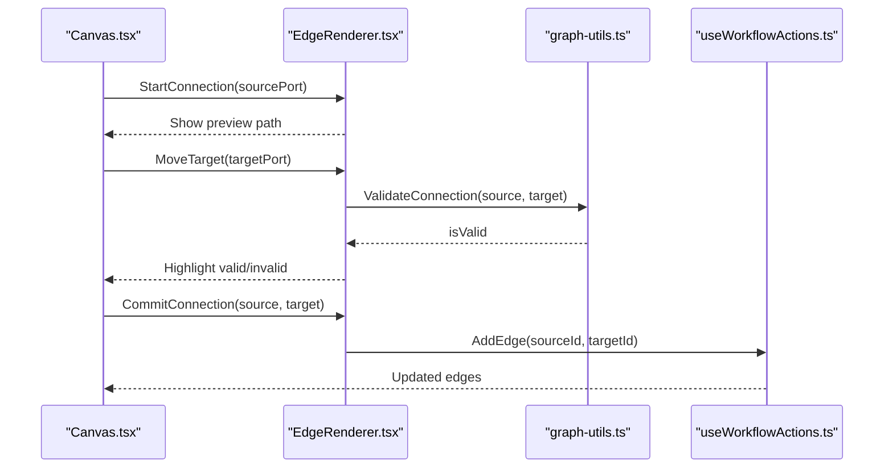
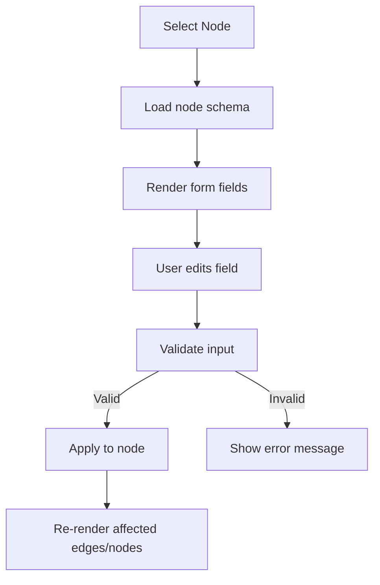
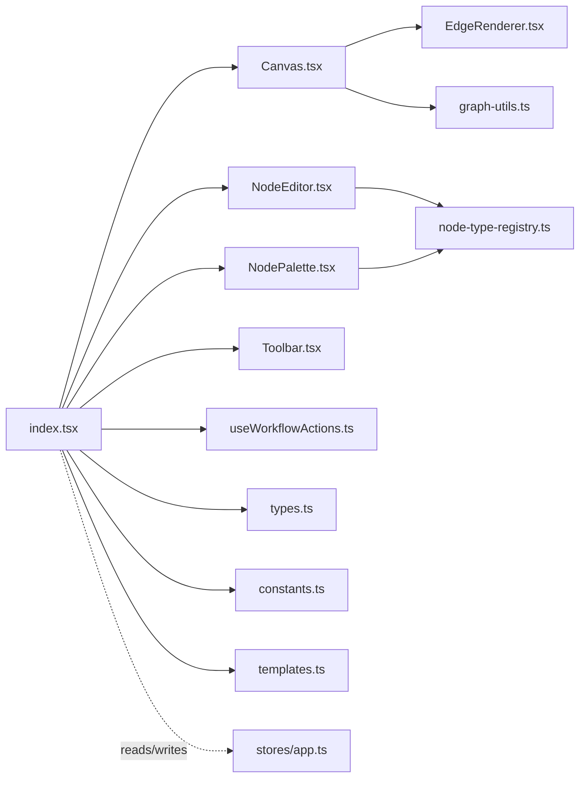

# Visual Workflow Builder

<cite>
**Referenced Files in This Document**
- [workflow/index.tsx](file://src/pages/workflow/index.tsx)
- [workflow/types.ts](file://src/pages/workflow/types.ts)
- [workflow/constants.ts](file://src/pages/workflow/constants.ts)
- [workflow/templates.ts](file://src/pages/workflow/templates.ts)
- [workflow/node-type-registry.ts](file://src/pages/workflow/node-type-registry.ts)
- [workflow/components/NodePalette.tsx](file://src/pages/workflow/components/NodePalette.tsx)
- [workflow/components/Canvas.tsx](file://src/pages/workflow/components/Canvas.tsx)
- [workflow/components/EdgeRenderer.tsx](file://src/pages/workflow/components/EdgeRenderer.tsx)
- [workflow/components/NodeEditor.tsx](file://src/pages/workflow/components/NodeEditor.tsx)
- [workflow/components/Toolbar.tsx](file://src/pages/workflow/components/Toolbar.tsx)
- [workflow/hooks/useWorkflowActions.ts](file://src/pages/workflow/hooks/useWorkflowActions.ts)
- [workflow/lib/graph-utils.ts](file://src/pages/workflow/lib/graph-utils.ts)
- [stores/app.ts](file://src/stores/app.ts)
- [components/ui/button.tsx](file://src/components/ui/button.tsx)
</cite>

## Table of Contents
1. [Introduction](#introduction)
2. [Project Structure](#project-structure)
3. [Core Components](#core-components)
4. [Architecture Overview](#architecture-overview)
5. [Detailed Component Analysis](#detailed-component-analysis)
6. [Dependency Analysis](#dependency-analysis)
7. [Performance Considerations](#performance-considerations)
8. [Troubleshooting Guide](#troubleshooting-guide)
9. [Conclusion](#conclusion)
10. [Appendices](#appendices)

## Introduction
This document explains Apprecon’s visual workflow builder: a drag-and-drop canvas for designing automation workflows with nodes and edges. It covers the node palette, canvas operations (zoom, pan, selection), connecting nodes, configuring node properties via UI, and organizing complex workflows. It also provides examples for common patterns such as API testing sequences, security scanning pipelines, and development task automations.

## Project Structure
The workflow builder is implemented under src/pages/workflow with supporting components, hooks, utilities, and type definitions. Key areas include:
- Entry point and page orchestration
- Node registry and templates
- Canvas rendering and interaction
- Edge drawing and connection logic
- Node property editor
- Toolbar and actions
- Graph utilities for layout and manipulation

**Diagram sources**
- [workflow/index.tsx](file://src/pages/workflow/index.tsx)
- [workflow/components/Canvas.tsx](file://src/pages/workflow/components/Canvas.tsx)
- [workflow/components/NodePalette.tsx](file://src/pages/workflow/components/NodePalette.tsx)
- [workflow/components/NodeEditor.tsx](file://src/pages/workflow/components/NodeEditor.tsx)
- [workflow/components/Toolbar.tsx](file://src/pages/workflow/components/Toolbar.tsx)
- [workflow/components/EdgeRenderer.tsx](file://src/pages/workflow/components/EdgeRenderer.tsx)
- [workflow/hooks/useWorkflowActions.ts](file://src/pages/workflow/hooks/useWorkflowActions.ts)
- [workflow/lib/graph-utils.ts](file://src/pages/workflow/lib/graph-utils.ts)
- [workflow/node-type-registry.ts](file://src/pages/workflow/node-type-registry.ts)
- [workflow/templates.ts](file://src/pages/workflow/templates.ts)
- [workflow/types.ts](file://src/pages/workflow/types.ts)
- [workflow/constants.ts](file://src/pages/workflow/constants.ts)
- [stores/app.ts](file://src/stores/app.ts)

**Section sources**
- [workflow/index.tsx](file://src/pages/workflow/index.tsx)
- [workflow/types.ts](file://src/pages/workflow/types.ts)
- [workflow/constants.ts](file://src/pages/workflow/constants.ts)
- [workflow/templates.ts](file://src/pages/workflow/templates.ts)
- [workflow/node-type-registry.ts](file://src/pages/workflow/node-type-registry.ts)

## Core Components
- Canvas: The interactive surface where nodes are placed, moved, selected, zoomed, and panned. It handles mouse/touch events and renders edges between connected nodes.
- NodePalette: A panel listing available node types. Users drag items from the palette onto the canvas to create new nodes.
- NodeEditor: A side panel or modal that appears when a node is selected, allowing configuration of its properties through typed inputs and controls.
- EdgeRenderer: Draws and updates connections (edges) between nodes, including validation and visual feedback during creation.
- Toolbar: Provides global actions like save, run, undo/redo, zoom controls, grid toggle, and template insertion.
- useWorkflowActions: Centralized hook exposing functions to add/remove nodes, connect/disconnect edges, update positions, and manage selection.
- graph-utils: Helper functions for geometry, collision detection, snapping, and batch operations on the graph.
- node-type-registry: Registry of supported node types and their metadata (icons, labels, default properties).
- templates: Predefined workflow templates to bootstrap common patterns quickly.

**Section sources**
- [workflow/components/Canvas.tsx](file://src/pages/workflow/components/Canvas.tsx)
- [workflow/components/NodePalette.tsx](file://src/pages/workflow/components/NodePalette.tsx)
- [workflow/components/NodeEditor.tsx](file://src/pages/workflow/components/NodeEditor.tsx)
- [workflow/components/EdgeRenderer.tsx](file://src/pages/workflow/components/EdgeRenderer.tsx)
- [workflow/components/Toolbar.tsx](file://src/pages/workflow/components/Toolbar.tsx)
- [workflow/hooks/useWorkflowActions.ts](file://src/pages/workflow/hooks/useWorkflowActions.ts)
- [workflow/lib/graph-utils.ts](file://src/pages/workflow/lib/graph-utils.ts)
- [workflow/node-type-registry.ts](file://src/pages/workflow/node-type-registry.ts)
- [workflow/templates.ts](file://src/pages/workflow/templates.ts)

## Architecture Overview
The workflow builder follows a component-driven architecture with clear separation of concerns:
- UI layer: Canvas, Palette, Editor, Toolbar render user interactions and state.
- State layer: Actions and stores manage nodes, edges, selection, and history.
- Utilities: Graph helpers encapsulate math and layout logic.
- Registry and Templates: Provide extensibility and quick-starts.

**Diagram sources**
- [workflow/components/NodePalette.tsx](file://src/pages/workflow/components/NodePalette.tsx)
- [workflow/components/Canvas.tsx](file://src/pages/workflow/components/Canvas.tsx)
- [workflow/components/NodeEditor.tsx](file://src/pages/workflow/components/NodeEditor.tsx)
- [workflow/hooks/useWorkflowActions.ts](file://src/pages/workflow/hooks/useWorkflowActions.ts)
- [workflow/lib/graph-utils.ts](file://src/pages/workflow/lib/graph-utils.ts)

## Detailed Component Analysis

### Canvas: Drag-and-Drop and Interaction
Responsibilities:
- Render nodes and edges
- Handle drag-and-drop from palette
- Support panning and zooming
- Multi-selection with shift-click or marquee
- Keyboard shortcuts (delete, copy/paste, undo/redo)
- Snap-to-grid and alignment guides

Key behaviors:
- On drop, compute world coordinates using current transform (zoom/pan) and add a node at the target position.
- On pointer events, track selection state and update node positions while dragging.
- When an edge is being created, draw a temporary curve until the target port is released.

**Diagram sources**
- [workflow/components/Canvas.tsx](file://src/pages/workflow/components/Canvas.tsx)
- [workflow/lib/graph-utils.ts](file://src/pages/workflow/lib/graph-utils.ts)

**Section sources**
- [workflow/components/Canvas.tsx](file://src/pages/workflow/components/Canvas.tsx)
- [workflow/lib/graph-utils.ts](file://src/pages/workflow/lib/graph-utils.ts)

### NodePalette: Node Discovery and Creation
Responsibilities:
- Display available node types with icons and descriptions
- Enable drag-and-drop to the canvas
- Group nodes by category (e.g., HTTP, Security, DevOps)

Behavior:
- Each palette item carries metadata (id, label, icon, defaultProps) used to instantiate nodes.
- Dragging starts a transfer object; dropping triggers node creation.

**Diagram sources**
- [workflow/components/NodePalette.tsx](file://src/pages/workflow/components/NodePalette.tsx)
- [workflow/node-type-registry.ts](file://src/pages/workflow/node-type-registry.ts)

**Section sources**
- [workflow/components/NodePalette.tsx](file://src/pages/workflow/components/NodePalette.tsx)
- [workflow/node-type-registry.ts](file://src/pages/workflow/node-type-registry.ts)

### EdgeRenderer: Connecting Nodes
Responsibilities:
- Draw edges between ports
- Validate connections (type compatibility, cycles)
- Provide live preview while dragging a new connection

Behavior:
- Computes bezier curves based on port positions.
- Highlights valid targets and invalid attempts.
- Commits connections upon successful drop.

**Diagram sources**
- [workflow/components/EdgeRenderer.tsx](file://src/pages/workflow/components/EdgeRenderer.tsx)
- [workflow/lib/graph-utils.ts](file://src/pages/workflow/lib/graph-utils.ts)
- [workflow/hooks/useWorkflowActions.ts](file://src/pages/workflow/hooks/useWorkflowActions.ts)

**Section sources**
- [workflow/components/EdgeRenderer.tsx](file://src/pages/workflow/components/EdgeRenderer.tsx)
- [workflow/lib/graph-utils.ts](file://src/pages/workflow/lib/graph-utils.ts)

### NodeEditor: Configuring Node Properties
Responsibilities:
- Present typed fields for each node type
- Validate inputs and show errors
- Apply changes to the selected node

Behavior:
- Reads node schema from registry/template.
- Supports dynamic sections based on node configuration.
- Persists changes via actions and updates the canvas.

**Diagram sources**
- [workflow/components/NodeEditor.tsx](file://src/pages/workflow/components/NodeEditor.tsx)
- [workflow/node-type-registry.ts](file://src/pages/workflow/node-type-registry.ts)

**Section sources**
- [workflow/components/NodeEditor.tsx](file://src/pages/workflow/components/NodeEditor.tsx)

### Toolbar: Global Actions and Layout Controls
Responsibilities:
- Save/Export workflow
- Run/Preview execution
- Undo/Redo history
- Zoom in/out, fit-to-screen, reset view
- Toggle grid and snap-to-grid
- Insert templates

Behavior:
- Dispatches commands to actions store.
- Updates view transforms and layout options.

**Section sources**
- [workflow/components/Toolbar.tsx](file://src/pages/workflow/components/Toolbar.tsx)

### useWorkflowActions: State and Operations
Responsibilities:
- Add/remove nodes and edges
- Update node positions and properties
- Manage selection and history
- Batch operations for performance

Behavior:
- Encapsulates mutations and emits updates to subscribers.
- Integrates with graph utilities for validation and layout.

**Section sources**
- [workflow/hooks/useWorkflowActions.ts](file://src/pages/workflow/hooks/useWorkflowActions.ts)

### graph-utils: Geometry and Layout Helpers
Responsibilities:
- Coordinate transforms (world/screen)
- Bezier curve calculations
- Collision and overlap checks
- Snapping and alignment
- Batch updates and diffing

**Section sources**
- [workflow/lib/graph-utils.ts](file://src/pages/workflow/lib/graph-utils.ts)

### Node Type Registry and Templates
Responsibilities:
- Define supported node types and metadata
- Provide default properties and schemas
- Offer starter templates for common workflows

Usage:
- Palette reads from registry to populate items.
- Editor uses schemas to render forms.
- Templates inject preconfigured graphs.

**Section sources**
- [workflow/node-type-registry.ts](file://src/pages/workflow/node-type-registry.ts)
- [workflow/templates.ts](file://src/pages/workflow/templates.ts)
- [workflow/types.ts](file://src/pages/workflow/types.ts)
- [workflow/constants.ts](file://src/pages/workflow/constants.ts)

## Dependency Analysis
The workflow module composes several internal modules and integrates with global app state.

**Diagram sources**
- [workflow/index.tsx](file://src/pages/workflow/index.tsx)
- [workflow/components/Canvas.tsx](file://src/pages/workflow/components/Canvas.tsx)
- [workflow/components/NodePalette.tsx](file://src/pages/workflow/components/NodePalette.tsx)
- [workflow/components/NodeEditor.tsx](file://src/pages/workflow/components/NodeEditor.tsx)
- [workflow/components/Toolbar.tsx](file://src/pages/workflow/components/Toolbar.tsx)
- [workflow/components/EdgeRenderer.tsx](file://src/pages/workflow/components/EdgeRenderer.tsx)
- [workflow/lib/graph-utils.ts](file://src/pages/workflow/lib/graph-utils.ts)
- [workflow/node-type-registry.ts](file://src/pages/workflow/node-type-registry.ts)
- [workflow/templates.ts](file://src/pages/workflow/templates.ts)
- [workflow/types.ts](file://src/pages/workflow/types.ts)
- [workflow/constants.ts](file://src/pages/workflow/constants.ts)
- [stores/app.ts](file://src/stores/app.ts)

**Section sources**
- [workflow/index.tsx](file://src/pages/workflow/index.tsx)
- [stores/app.ts](file://src/stores/app.ts)

## Performance Considerations
- Virtualization: For large graphs, consider virtualizing visible nodes and edges to reduce re-renders.
- Debounce heavy operations: Throttle property updates and auto-layout recalculations.
- Batch mutations: Use batched actions to minimize state churn and redraws.
- Memoization: Memoize computed values like edge paths and visibility filters.
- Efficient transforms: Cache zoom/pan transforms and avoid recomputing screen/world conversions unnecessarily.
- Selection optimization: Use spatial indexes for hit-testing and marquee selection.

[No sources needed since this section provides general guidance]

## Troubleshooting Guide
Common issues and resolutions:
- Nodes not appearing after drag-and-drop: Ensure drop coordinates are transformed correctly with current zoom/pan. Verify the node type exists in the registry and has required default properties.
- Edges not connecting: Confirm port compatibility and that endpoints are valid. Check cycle detection rules if applicable.
- Editor not saving changes: Validate schema constraints and ensure the action dispatch is triggered on change.
- Slow performance with many nodes: Reduce render frequency, enable grid off, and limit simultaneous animations.
- Selection not working: Verify event propagation and pointer capture. Ensure multi-select modifier keys are handled.

**Section sources**
- [workflow/components/Canvas.tsx](file://src/pages/workflow/components/Canvas.tsx)
- [workflow/components/EdgeRenderer.tsx](file://src/pages/workflow/components/EdgeRenderer.tsx)
- [workflow/components/NodeEditor.tsx](file://src/pages/workflow/components/NodeEditor.tsx)
- [workflow/lib/graph-utils.ts](file://src/pages/workflow/lib/graph-utils.ts)

## Conclusion
Apprecon’s visual workflow builder provides an intuitive, extensible interface for designing automation flows. With a robust canvas, flexible node palette, powerful edge system, and a configurable editor, users can rapidly assemble complex workflows. Templates accelerate common scenarios, while utilities and actions keep performance smooth and interactions responsive.

[No sources needed since this section summarizes without analyzing specific files]

## Appendices

### Building Common Automation Patterns

#### API Testing Sequence
Steps:
- Add a trigger node (e.g., schedule or manual).
- Add HTTP request nodes for each endpoint.
- Chain responses into validation nodes.
- Add assertions and reporting nodes.
- Connect nodes sequentially; configure headers, payloads, and expected statuses in the editor.

Tips:
- Use templates to pre-wire common request-response patterns.
- Leverage environment variables for base URLs and tokens.

**Section sources**
- [workflow/templates.ts](file://src/pages/workflow/templates.ts)
- [workflow/node-type-registry.ts](file://src/pages/workflow/node-type-registry.ts)

#### Security Scanning Pipeline
Steps:
- Start with a target discovery node.
- Add port scan and vulnerability check nodes.
- Integrate results into a report generator.
- Optionally branch based on severity thresholds.

Tips:
- Configure thresholds and output formats in node editors.
- Use parallel branches to speed up scans.

**Section sources**
- [workflow/templates.ts](file://src/pages/workflow/templates.ts)
- [workflow/lib/graph-utils.ts](file://src/pages/workflow/lib/graph-utils.ts)

#### Development Task Automation
Steps:
- Trigger on file changes or PR events.
- Add lint, test, build, and deploy steps.
- Include notifications and artifact uploads.

Tips:
- Organize tasks into groups using subgraphs or folders.
- Reuse shared configurations across environments.

**Section sources**
- [workflow/templates.ts](file://src/pages/workflow/templates.ts)
- [workflow/components/NodePalette.tsx](file://src/pages/workflow/components/NodePalette.tsx)

### Canvas Operations Reference
- Zoom: Mouse wheel or toolbar buttons; pinch on touch devices.
- Pan: Middle-mouse drag or space+drag; two-finger swipe on touch.
- Select: Click to select; Shift+click for multiple; marquee for area selection.
- Move: Drag selected nodes; hold Alt to duplicate.
- Connect: Drag from output port to input port; preview highlights valid targets.
- Delete: Delete key removes selected nodes/edges.
- Undo/Redo: Ctrl/Cmd+Z and Ctrl/Cmd+Shift+Z.
- Grid/Snap: Toggle grid and snap-to-grid for alignment.

**Section sources**
- [workflow/components/Toolbar.tsx](file://src/pages/workflow/components/Toolbar.tsx)
- [workflow/components/Canvas.tsx](file://src/pages/workflow/components/Canvas.tsx)

### Node Property Configuration
- Access the editor by selecting a node.
- Fields are dynamically generated from the node schema.
- Validation errors appear inline; fix before applying.
- Changes propagate immediately to the canvas and connected edges.

**Section sources**
- [workflow/components/NodeEditor.tsx](file://src/pages/workflow/components/NodeEditor.tsx)
- [workflow/node-type-registry.ts](file://src/pages/workflow/node-type-registry.ts)