# Workflow Automation & Orchestration

<cite>
**Referenced Files in This Document**
- [workflow/index.tsx](file://src/pages/workflow/index.tsx)
- [workflow/types.ts](file://src/pages/workflow/types.ts)
- [workflow/node-type-registry.ts](file://src/pages/workflow/node-type-registry.ts)
- [workflow/templates.ts](file://src/pages/workflow/templates.ts)
- [automation/mod.rs](file://src-tauri/src/automation/mod.rs)
- [automation/execution.rs](file://src-tauri/src/automation/execution.rs)
- [automation/state.rs](file://src-tauri/src/automation/state.rs)
- [automation/events.rs](file://src-tauri/src/automation/events.rs)
- [automation/actions.rs](file://src-tauri/src/automation/actions.rs)
- [automation/condition.rs](file://src-tauri/src/automation/condition.rs)
- [triggers/index.ts](file://src/triggers/index.ts)
- [triggers/browser/index.ts](file://src/triggers/browser/index.ts)
- [triggers/intercept/index.ts](file://src/triggers/intercept/index.ts)
- [triggers/invoker/index.ts](file://src/triggers/invoker/index.ts)
- [triggers/live-traffic/index.ts](file://src/triggers/live-traffic/index.ts)
- [collaborator/mod.rs](file://src-tauri/src/collaborator/mod.rs)
- [commands/regression.ts](file://src-tauri/src/commands/regression.ts)
</cite>

## Table of Contents
1. [Introduction](#introduction)
2. [Project Structure](#project-structure)
3. [Core Components](#core-components)
4. [Architecture Overview](#architecture-overview)
5. [Detailed Component Analysis](#detailed-component-analysis)
6. [Dependency Analysis](#dependency-analysis)
7. [Performance Considerations](#performance-considerations)
8. [Troubleshooting Guide](#troubleshooting-guide)
9. [Conclusion](#conclusion)
10. [Appendices](#appendices)

## Introduction
This document explains Apprecon’s workflow automation and orchestration engine. It covers the visual workflow builder, node-based programming model, and execution runtime. You will learn how to create workflows using trigger nodes (event-driven), action nodes (operations), and condition nodes (decision logic). The guide includes practical examples for security testing pipelines, API testing workflows, and development automation sequences. Advanced topics include error handling, data passing between nodes, parallel execution, external integrations, versioning, collaboration, and production deployment strategies.

## Project Structure
Apprecon implements workflows across a frontend UI layer and a Tauri-backed runtime:
- Frontend workflow editor and runtime state live under src/pages/workflow with types, templates, and node registry.
- Triggers are defined in src/triggers and organized by feature area (browser, intercept, invoker, live-traffic).
- Backend orchestration and execution live in src-tauri/src/automation with modules for actions, conditions, events, state, and execution.
- Collaboration features are implemented under src-tauri/src/collaborator.

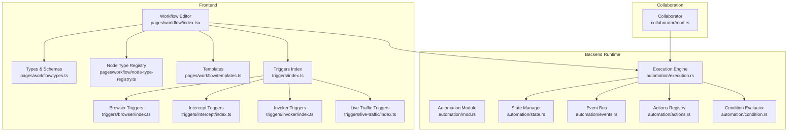

**Diagram sources**
- [workflow/index.tsx](file://src/pages/workflow/index.tsx)
- [workflow/types.ts](file://src/pages/workflow/types.ts)
- [workflow/node-type-registry.ts](file://src/pages/workflow/node-type-registry.ts)
- [workflow/templates.ts](file://src/pages/workflow/templates.ts)
- [triggers/index.ts](file://src/triggers/index.ts)
- [triggers/browser/index.ts](file://src/triggers/browser/index.ts)
- [triggers/intercept/index.ts](file://src/triggers/intercept/index.ts)
- [triggers/invoker/index.ts](file://src/triggers/invoker/index.ts)
- [triggers/live-traffic/index.ts](file://src/triggers/live-traffic/index.ts)
- [automation/mod.rs](file://src-tauri/src/automation/mod.rs)
- [automation/execution.rs](file://src-tauri/src/automation/execution.rs)
- [automation/state.rs](file://src-tauri/src/automation/state.rs)
- [automation/events.rs](file://src-tauri/src/automation/events.rs)
- [automation/actions.rs](file://src-tauri/src/automation/actions.rs)
- [automation/condition.rs](file://src-tauri/src/automation/condition.rs)
- [collaborator/mod.rs](file://src-tauri/src/collaborator/mod.rs)

**Section sources**
- [workflow/index.tsx](file://src/pages/workflow/index.tsx)
- [workflow/types.ts](file://src/pages/workflow/types.ts)
- [workflow/node-type-registry.ts](file://src/pages/workflow/node-type-registry.ts)
- [workflow/templates.ts](file://src/pages/workflow/templates.ts)
- [triggers/index.ts](file://src/triggers/index.ts)
- [automation/mod.rs](file://src-tauri/src/automation/mod.rs)
- [automation/execution.rs](file://src-tauri/src/automation/execution.rs)
- [automation/state.rs](file://src-tauri/src/automation/state.rs)
- [automation/events.rs](file://src-tauri/src/automation/events.rs)
- [automation/actions.rs](file://src-tauri/src/automation/actions.rs)
- [automation/condition.rs](file://src-tauri/src/automation/condition.rs)
- [collaborator/mod.rs](file://src-tauri/src/collaborator/mod.rs)

## Core Components
- Visual Workflow Builder: A drag-and-drop canvas where users compose workflows from nodes and edges. It renders nodes, manages connections, and persists workflow definitions.
- Node-Based Programming Model: Workflows are graphs of typed nodes (trigger, action, condition) with configurable inputs/outputs and edge routing.
- Execution Runtime: A backend engine that subscribes to triggers, evaluates conditions, executes actions, and maintains workflow state. It supports event-driven flows and parallel execution.
- Trigger System: Feature-scoped trigger modules expose events such as browser interactions, HTTP interception, invocations, and live traffic captures.
- Action and Condition Modules: Actions perform operations (e.g., send requests, run tools), while conditions evaluate expressions to route flow.

Key responsibilities:
- Types and schemas define node shapes, properties, and validation rules.
- Templates provide prebuilt workflows for common scenarios.
- Node type registry maps node IDs to implementations and UI configs.
- Execution engine orchestrates lifecycle, concurrency, and error propagation.
- State manager tracks per-run context and shared variables.
- Event bus decouples components and enables reactive flows.

**Section sources**
- [workflow/types.ts](file://src/pages/workflow/types.ts)
- [workflow/node-type-registry.ts](file://src/pages/workflow/node-type-registry.ts)
- [workflow/templates.ts](file://src/pages/workflow/templates.ts)
- [automation/execution.rs](file://src-tauri/src/automation/execution.rs)
- [automation/state.rs](file://src-tauri/src/automation/state.rs)
- [automation/events.rs](file://src-tauri/src/automation/events.rs)
- [automation/actions.rs](file://src-tauri/src/automation/actions.rs)
- [automation/condition.rs](file://src-tauri/src/automation/condition.rs)

## Architecture Overview
The system follows an event-driven architecture:
- Frontend composes workflows and dispatches runs.
- Backend subscribes to triggers, evaluates conditions, and executes actions.
- State is persisted per run; events propagate changes across components.
- Collaboration allows multiple users to edit and sync workflows.

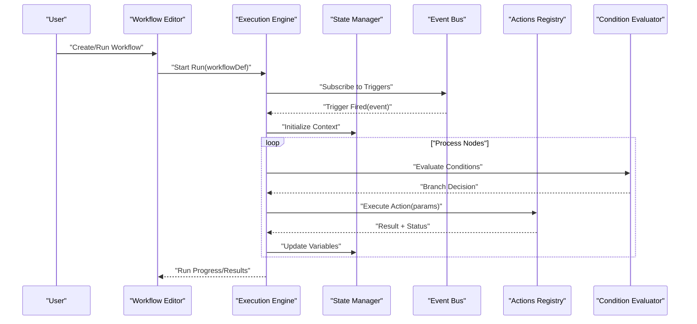

**Diagram sources**
- [workflow/index.tsx](file://src/pages/workflow/index.tsx)
- [automation/execution.rs](file://src-tauri/src/automation/execution.rs)
- [automation/state.rs](file://src-tauri/src/automation/state.rs)
- [automation/events.rs](file://src-tauri/src/automation/events.rs)
- [automation/actions.rs](file://src-tauri/src/automation/actions.rs)
- [automation/condition.rs](file://src-tauri/src/automation/condition.rs)

## Detailed Component Analysis

### Visual Workflow Builder
- Canvas and Node Rendering: Renders draggable nodes and interactive edges. Supports pan/zoom and selection.
- Node Properties Panel: Edits node configuration based on schema defined in types.
- Validation and Versioning: Enforces schema constraints; snapshots versions for rollback and sharing.
- Templates: One-click creation of predefined workflows for common tasks.

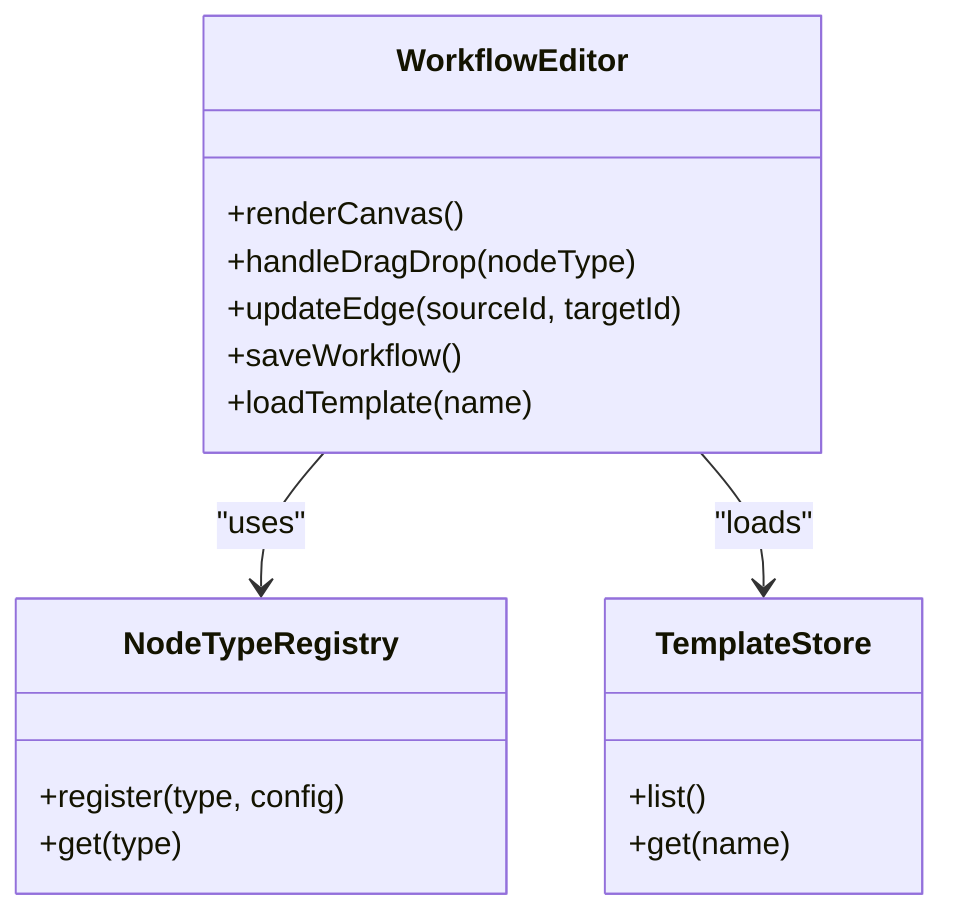

**Diagram sources**
- [workflow/index.tsx](file://src/pages/workflow/index.tsx)
- [workflow/node-type-registry.ts](file://src/pages/workflow/node-type-registry.ts)
- [workflow/templates.ts](file://src/pages/workflow/templates.ts)

**Section sources**
- [workflow/index.tsx](file://src/pages/workflow/index.tsx)
- [workflow/node-type-registry.ts](file://src/pages/workflow/node-type-registry.ts)
- [workflow/templates.ts](file://src/pages/workflow/templates.ts)

### Node-Based Programming Model
- Node Types: Trigger, Action, Condition. Each has input/output ports and configuration schema.
- Data Passing: Variables and outputs flow through edges; state manager provides scoped variables.
- Parallel Execution: Independent branches execute concurrently; results merge at join points.
- Error Handling: Failures bubble up; retry policies and fallbacks can be configured per node.

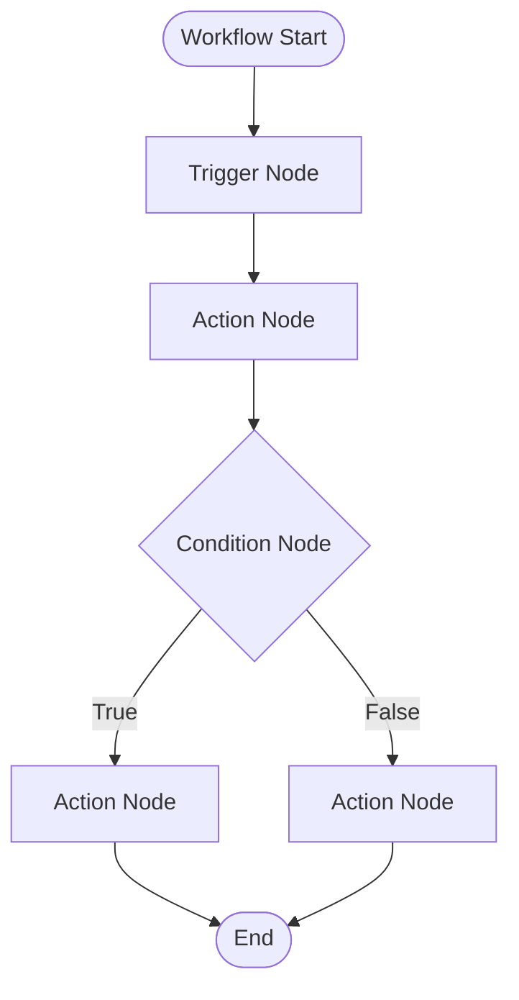

**Diagram sources**
- [workflow/types.ts](file://src/pages/workflow/types.ts)
- [automation/execution.rs](file://src-tauri/src/automation/execution.rs)
- [automation/state.rs](file://src-tauri/src/automation/state.rs)

**Section sources**
- [workflow/types.ts](file://src/pages/workflow/types.ts)
- [automation/execution.rs](file://src-tauri/src/automation/execution.rs)
- [automation/state.rs](file://src-tauri/src/automation/state.rs)

### Execution Runtime
- Lifecycle: Initializes context, subscribes to triggers, processes nodes, updates state, and emits completion events.
- Concurrency: Manages parallel branches with resource limits and backpressure.
- Observability: Emits progress and error events; integrates with logs and UI feedback.

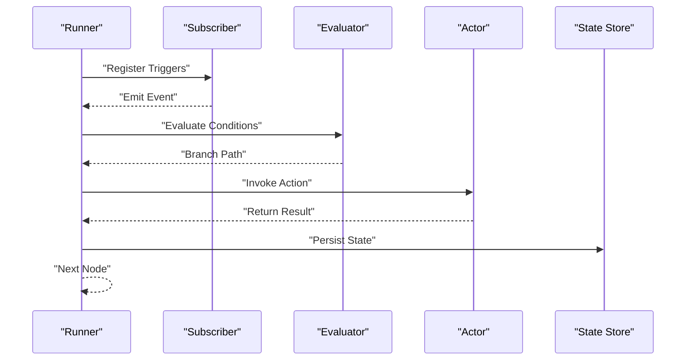

**Diagram sources**
- [automation/execution.rs](file://src-tauri/src/automation/execution.rs)
- [automation/events.rs](file://src-tauri/src/automation/events.rs)
- [automation/state.rs](file://src-tauri/src/automation/state.rs)

**Section sources**
- [automation/execution.rs](file://src-tauri/src/automation/execution.rs)
- [automation/events.rs](file://src-tauri/src/automation/events.rs)
- [automation/state.rs](file://src-tauri/src/automation/state.rs)

### Trigger Nodes (Event-Driven Automation)
- Browser Triggers: Page navigations, DOM events, crawl completions.
- Intercept Triggers: HTTP request/response lifecycle hooks.
- Invoker Triggers: Tool invocation callbacks and attack payloads.
- Live Traffic Triggers: Captured network events and targets.

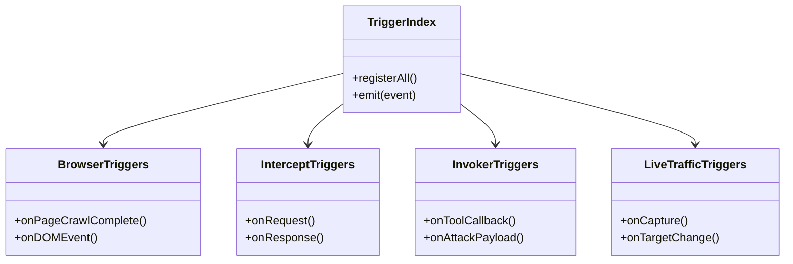

**Diagram sources**
- [triggers/index.ts](file://src/triggers/index.ts)
- [triggers/browser/index.ts](file://src/triggers/browser/index.ts)
- [triggers/intercept/index.ts](file://src/triggers/intercept/index.ts)
- [triggers/invoker/index.ts](file://src/triggers/invoker/index.ts)
- [triggers/live-traffic/index.ts](file://src/triggers/live-traffic/index.ts)

**Section sources**
- [triggers/index.ts](file://src/triggers/index.ts)
- [triggers/browser/index.ts](file://src/triggers/browser/index.ts)
- [triggers/intercept/index.ts](file://src/triggers/intercept/index.ts)
- [triggers/invoker/index.ts](file://src/triggers/invoker/index.ts)
- [triggers/live-traffic/index.ts](file://src/triggers/live-traffic/index.ts)

### Action Nodes (Performing Operations)
- HTTP Actions: Send requests, transform payloads, parse responses.
- Tool Actions: Invoke scanners, parsers, or custom scripts.
- File and System Actions: Read/write files, manage artifacts.
- Integration Actions: Call external APIs, publish results.

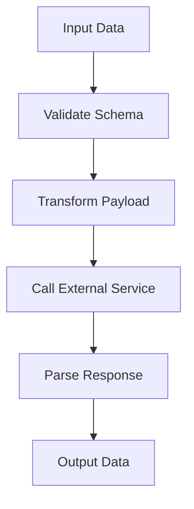

**Diagram sources**
- [automation/actions.rs](file://src-tauri/src/automation/actions.rs)

**Section sources**
- [automation/actions.rs](file://src-tauri/src/automation/actions.rs)

### Condition Nodes (Decision Logic)
- Expression Evaluation: Boolean expressions over variables and node outputs.
- Routing: True/false branches determine next nodes.
- Chaining: Multiple conditions can be composed for complex decisions.

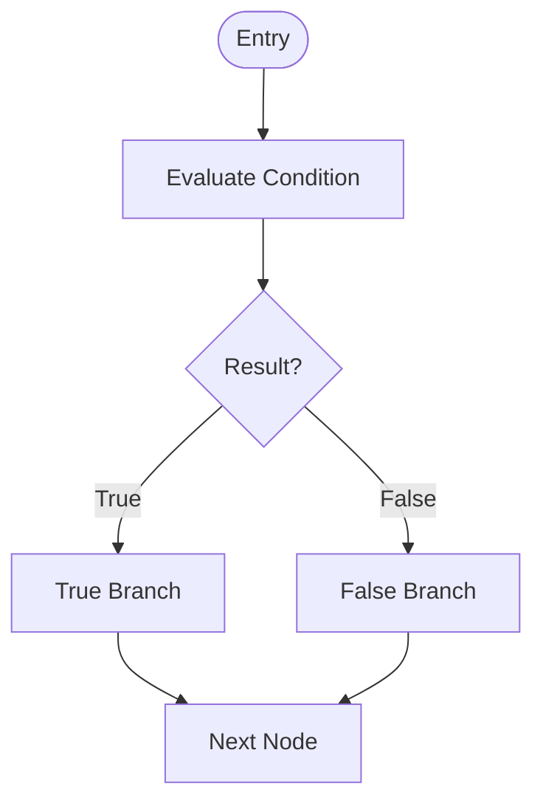

**Diagram sources**
- [automation/condition.rs](file://src-tauri/src/automation/condition.rs)

**Section sources**
- [automation/condition.rs](file://src-tauri/src/automation/condition.rs)

### Examples

#### Automated Security Testing Pipeline
- Trigger: Intercept HTTP request lifecycle.
- Actions: Build payload, invoke scanner, collect findings.
- Conditions: Filter findings by severity; branch remediation steps.
- Output: Generate report and notify channels.

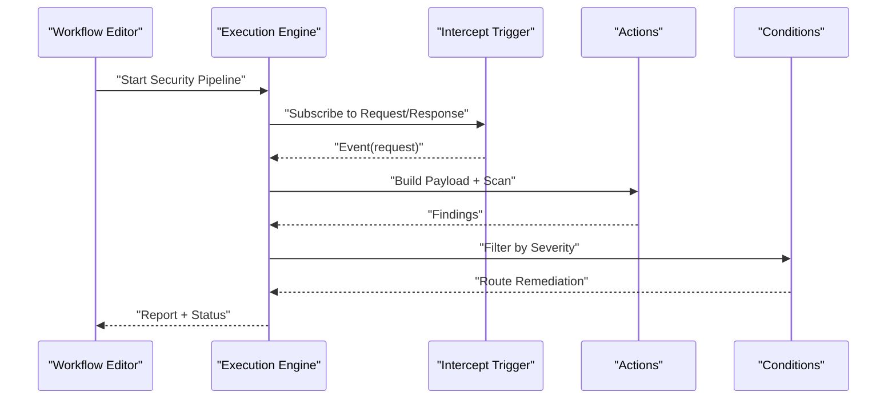

**Diagram sources**
- [triggers/intercept/index.ts](file://src/triggers/intercept/index.ts)
- [automation/actions.rs](file://src-tauri/src/automation/actions.rs)
- [automation/condition.rs](file://src-tauri/src/automation/condition.rs)

#### API Testing Workflow
- Trigger: Manual run or scheduled interval.
- Actions: Compose requests, assert responses, store results.
- Conditions: Pass/fail branching; generate diffs.
- Output: Test summary and artifacts.

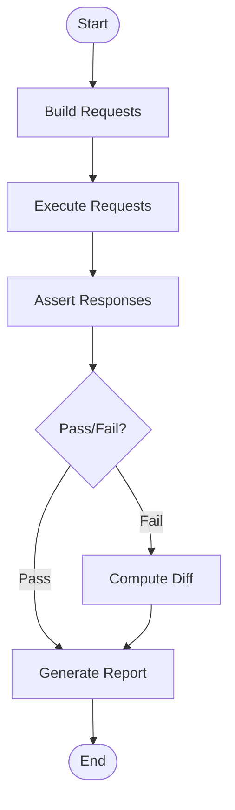

**Diagram sources**
- [automation/actions.rs](file://src-tauri/src/automation/actions.rs)
- [automation/condition.rs](file://src-tauri/src/automation/condition.rs)

#### Development Automation Sequence
- Trigger: File change or commit hook.
- Actions: Lint, build, test, deploy artifacts.
- Conditions: Skip steps based on file paths or labels.
- Output: CI-like status and notifications.

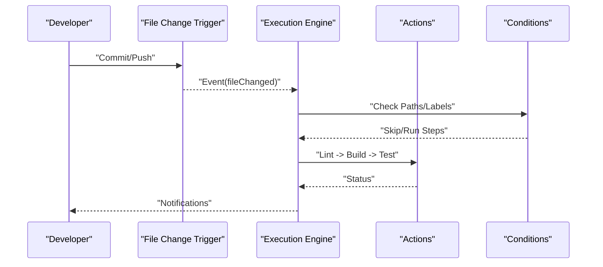

**Diagram sources**
- [triggers/index.ts](file://src/triggers/index.ts)
- [automation/actions.rs](file://src-tauri/src/automation/actions.rs)
- [automation/condition.rs](file://src-tauri/src/automation/condition.rs)

## Dependency Analysis
- Coupling: Frontend depends on types and registry; runtime depends on actions, conditions, events, and state.
- Cohesion: Each module encapsulates specific concerns (triggers, actions, conditions).
- External Integrations: Actions call external services; triggers integrate with browser, proxy, and traffic capture.

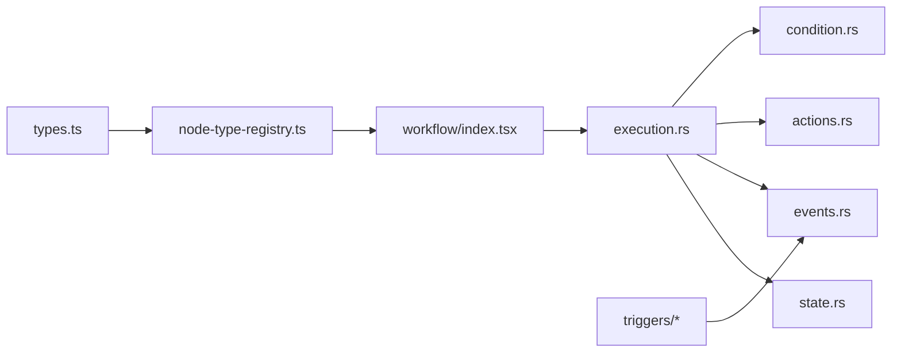

**Diagram sources**
- [workflow/types.ts](file://src/pages/workflow/types.ts)
- [workflow/node-type-registry.ts](file://src/pages/workflow/node-type-registry.ts)
- [workflow/index.tsx](file://src/pages/workflow/index.tsx)
- [automation/execution.rs](file://src-tauri/src/automation/execution.rs)
- [automation/state.rs](file://src-tauri/src/automation/state.rs)
- [automation/events.rs](file://src-tauri/src/automation/events.rs)
- [automation/actions.rs](file://src-tauri/src/automation/actions.rs)
- [automation/condition.rs](file://src-tauri/src/automation/condition.rs)
- [triggers/index.ts](file://src/triggers/index.ts)

**Section sources**
- [workflow/types.ts](file://src/pages/workflow/types.ts)
- [workflow/node-type-registry.ts](file://src/pages/workflow/node-type-registry.ts)
- [workflow/index.tsx](file://src/pages/workflow/index.tsx)
- [automation/execution.rs](file://src-tauri/src/automation/execution.rs)
- [automation/state.rs](file://src-tauri/src/automation/state.rs)
- [automation/events.rs](file://src-tauri/src/automation/events.rs)
- [automation/actions.rs](file://src-tauri/src/automation/actions.rs)
- [automation/condition.rs](file://src-tauri/src/automation/condition.rs)
- [triggers/index.ts](file://src/triggers/index.ts)

## Performance Considerations
- Parallelism: Use independent branches to maximize throughput; limit concurrency to avoid resource exhaustion.
- Backpressure: Throttle high-frequency triggers (e.g., live traffic) to prevent overload.
- Caching: Cache repeated computations and external calls where safe.
- Memory Management: Stream large payloads; avoid retaining unnecessary state.
- Observability: Emit granular metrics and logs to identify bottlenecks.

[No sources needed since this section provides general guidance]

## Troubleshooting Guide
Common issues and resolutions:
- Trigger not firing: Verify subscription registration and event emission paths.
- Condition always false: Inspect variable scope and expression syntax.
- Action failures: Check input schema validation and external service availability.
- State inconsistencies: Ensure atomic updates and proper context scoping.
- Collaboration conflicts: Resolve concurrent edits via versioning and conflict resolution.

**Section sources**
- [automation/events.rs](file://src-tauri/src/automation/events.rs)
- [automation/condition.rs](file://src-tauri/src/automation/condition.rs)
- [automation/actions.rs](file://src-tauri/src/automation/actions.rs)
- [automation/state.rs](file://src-tauri/src/automation/state.rs)
- [collaborator/mod.rs](file://src-tauri/src/collaborator/mod.rs)

## Conclusion
Apprecon’s workflow engine combines a visual builder with a robust runtime to automate security testing, API validation, and development tasks. Its modular design supports extensibility, collaboration, and production-grade execution. By leveraging triggers, actions, and conditions, teams can construct reliable, scalable automation pipelines.

[No sources needed since this section summarizes without analyzing specific files]

## Appendices

### Versioning and Collaboration
- Versioning: Save snapshots of workflow definitions; support rollback and audit trails.
- Collaboration: Multi-user editing with conflict detection and merging.

**Section sources**
- [workflow/templates.ts](file://src/pages/workflow/templates.ts)
- [collaborator/mod.rs](file://src-tauri/src/collaborator/mod.rs)

### Deployment Strategies for Production
- Containerize the runtime; isolate resources and scale horizontally.
- Configure environment variables for secrets and endpoints.
- Enable health checks and graceful shutdown.
- Monitor execution metrics and errors centrally.

[No sources needed since this section provides general guidance]