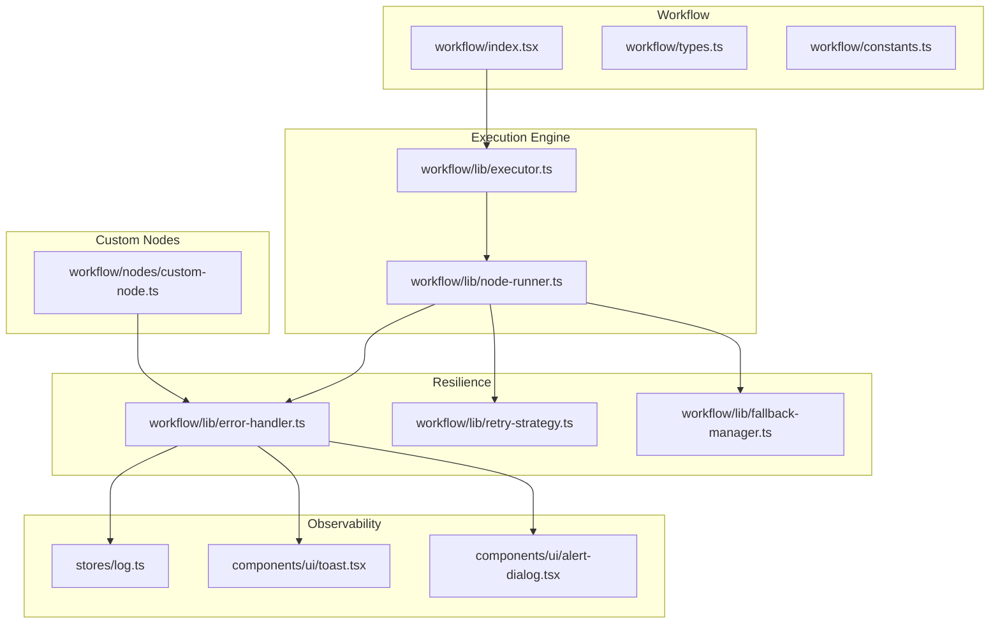
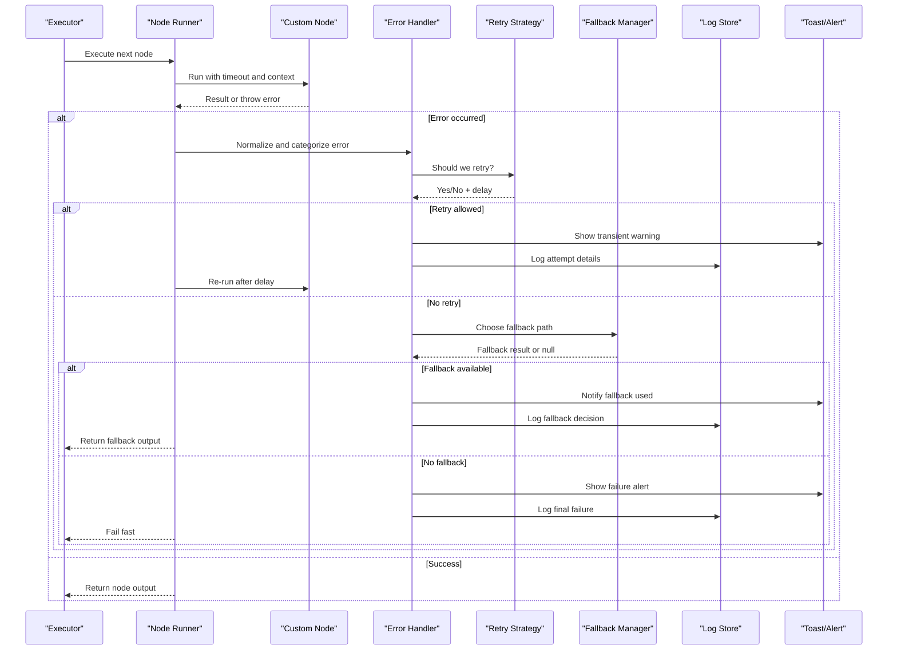
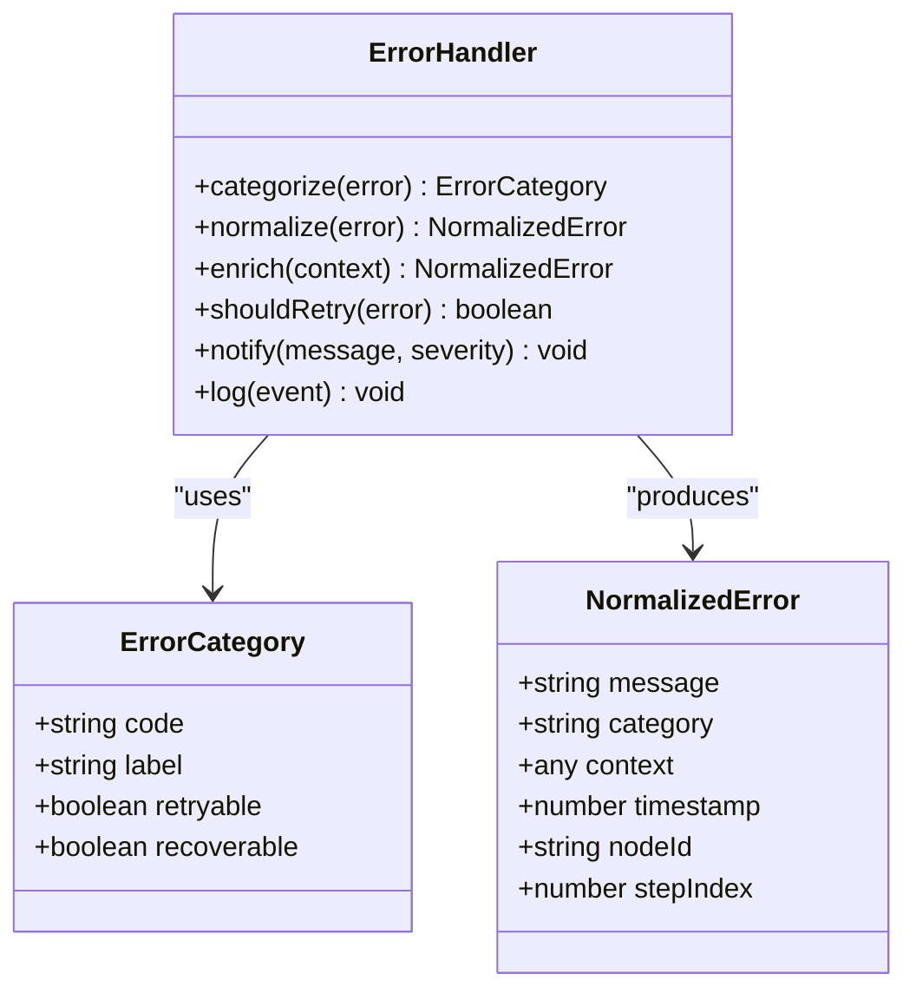
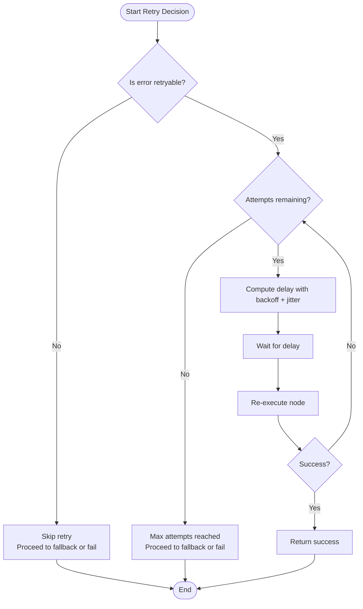
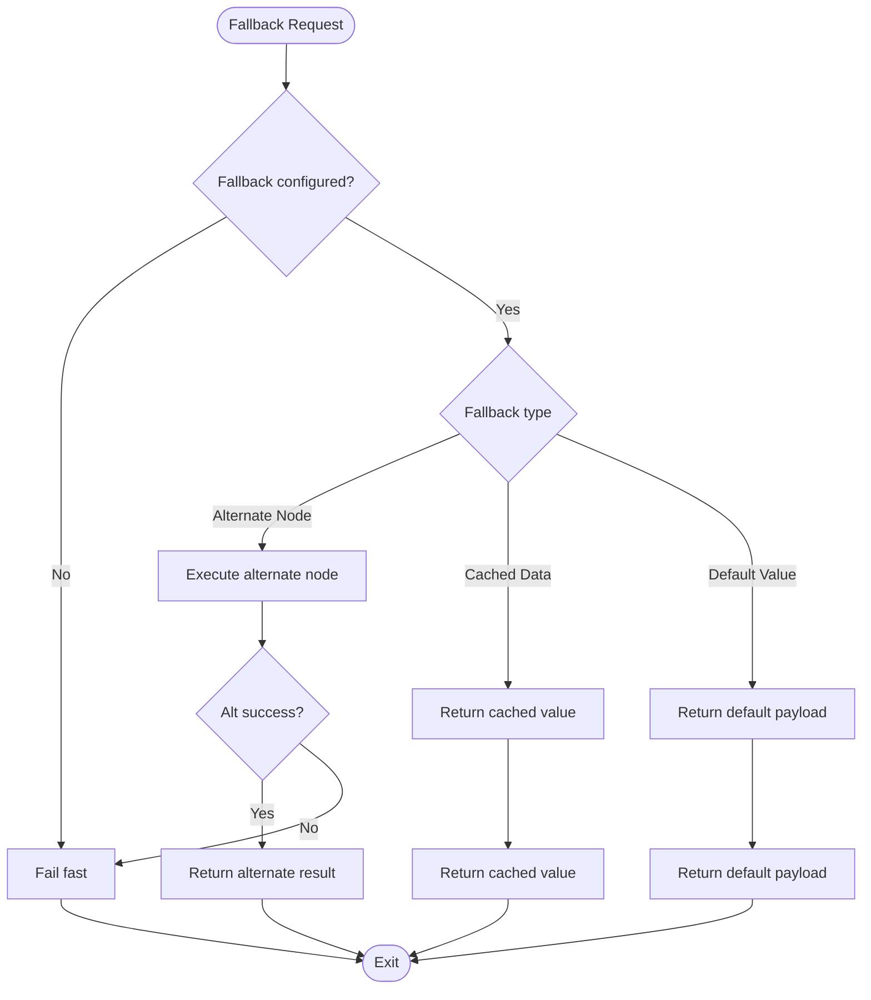
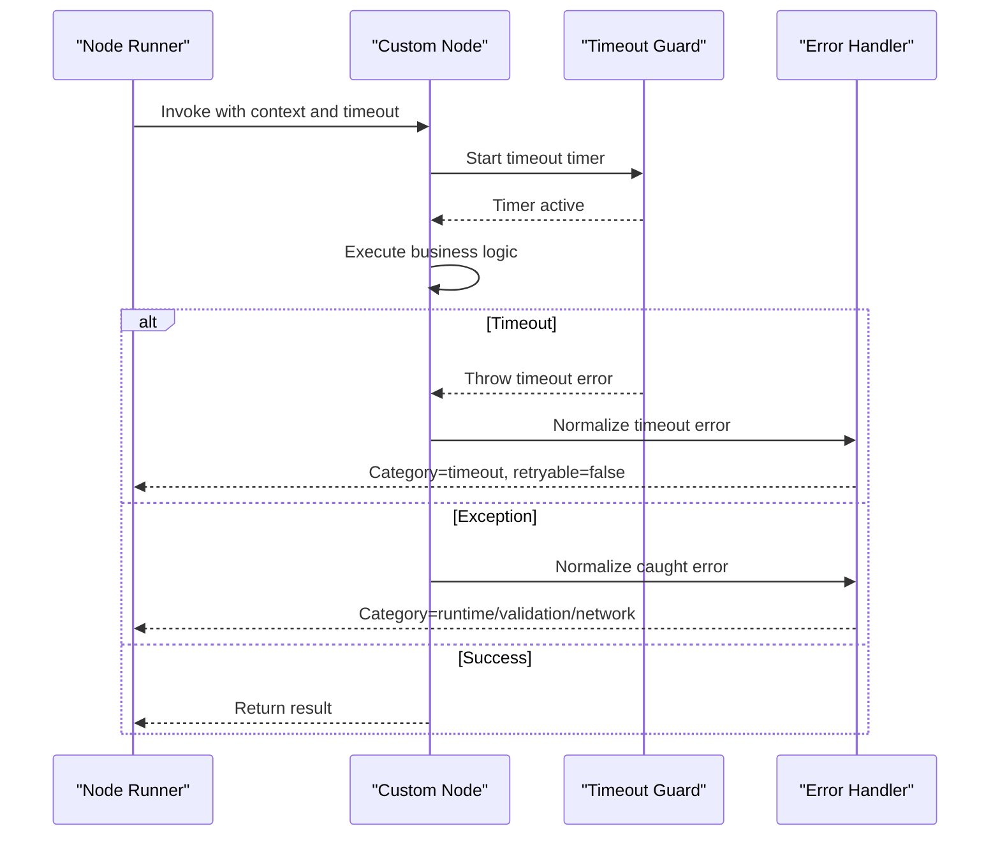
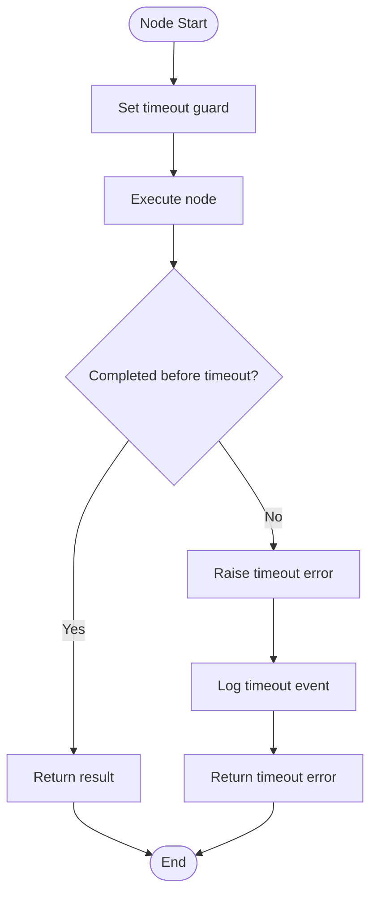
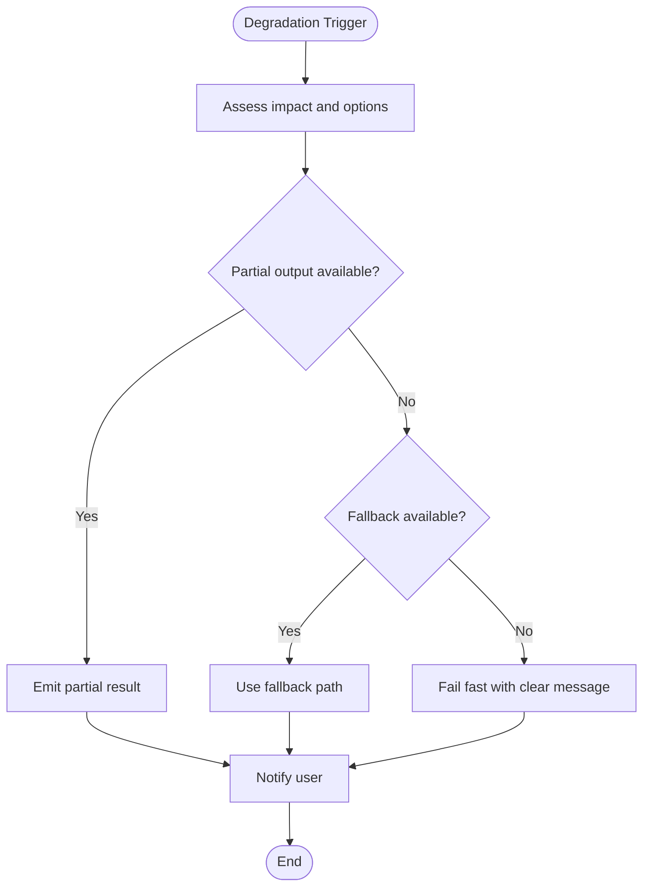
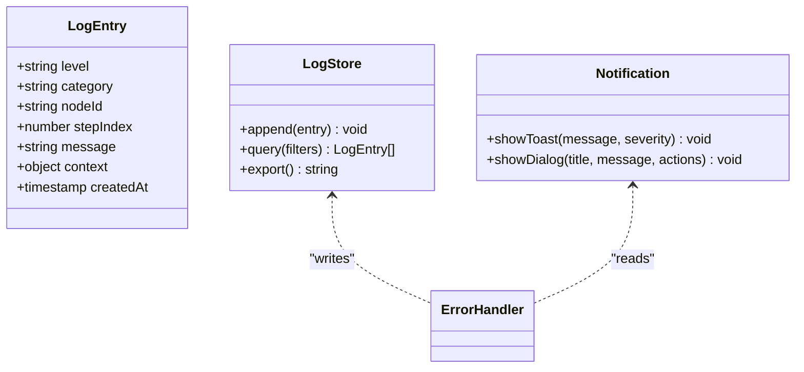
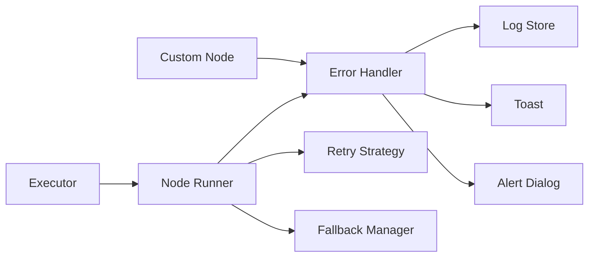

# Error Handling & Recovery

<cite>
**Referenced Files in This Document**
- [workflow/index.tsx](file://src/pages/workflow/index.tsx)
- [workflow/types.ts](file://src/pages/workflow/types.ts)
- [workflow/constants.ts](file://src/pages/workflow/constants.ts)
- [workflow/lib/executor.ts](file://src/pages/workflow/lib/executor.ts)
- [workflow/lib/node-runner.ts](file://src/pages/workflow/lib/node-runner.ts)
- [workflow/lib/error-handler.ts](file://src/pages/workflow/lib/error-handler.ts)
- [workflow/lib/retry-strategy.ts](file://src/pages/workflow/lib/retry-strategy.ts)
- [workflow/lib/fallback-manager.ts](file://src/pages/workflow/lib/fallback-manager.ts)
- [workflow/nodes/custom-node.ts](file://src/pages/workflow/nodes/custom-node.ts)
- [stores/log.ts](file://src/stores/log.ts)
- [components/ui/toast.tsx](file://src/components/ui/toast.tsx)
- [components/ui/alert-dialog.tsx](file://src/components/ui/alert-dialog.tsx)
</cite>

## Table of Contents
1. [Introduction](#introduction)
2. [Project Structure](#project-structure)
3. [Core Components](#core-components)
4. [Architecture Overview](#architecture-overview)
5. [Detailed Component Analysis](#detailed-component-analysis)
6. [Dependency Analysis](#dependency-analysis)
7. [Performance Considerations](#performance-considerations)
8. [Troubleshooting Guide](#troubleshooting-guide)
9. [Conclusion](#conclusion)

## Introduction
This document explains the error handling mechanisms for workflow execution, focusing on error propagation, retry logic, fallback strategies, categorization, logging, and reporting. It also covers exception handling in custom nodes, timeout management, graceful degradation, and debugging failed executions with concrete patterns you can apply.

## Project Structure
The workflow subsystem is implemented under src/pages/workflow with supporting UI and stores:
- Workflow orchestration and state live in the workflow directory (index, types, constants).
- Execution engine and node runner handle step-by-step processing and error flow.
- Dedicated modules implement retry strategies, fallback management, and centralized error handling.
- Custom node templates show how to integrate robust error handling into user-defined steps.
- Logging and user-facing notifications are provided by shared stores and UI components.

**Diagram sources**
- [workflow/index.tsx](file://src/pages/workflow/index.tsx)
- [workflow/lib/executor.ts](file://src/pages/workflow/lib/executor.ts)
- [workflow/lib/node-runner.ts](file://src/pages/workflow/lib/node-runner.ts)
- [workflow/lib/error-handler.ts](file://src/pages/workflow/lib/error-handler.ts)
- [workflow/lib/retry-strategy.ts](file://src/pages/workflow/lib/retry-strategy.ts)
- [workflow/lib/fallback-manager.ts](file://src/pages/workflow/lib/fallback-manager.ts)
- [workflow/nodes/custom-node.ts](file://src/pages/workflow/nodes/custom-node.ts)
- [stores/log.ts](file://src/stores/log.ts)
- [components/ui/toast.tsx](file://src/components/ui/toast.tsx)
- [components/ui/alert-dialog.tsx](file://src/components/ui/alert-dialog.tsx)

**Section sources**
- [workflow/index.tsx](file://src/pages/workflow/index.tsx)
- [workflow/types.ts](file://src/pages/workflow/types.ts)
- [workflow/constants.ts](file://src/pages/workflow/constants.ts)

## Core Components
- Executor: Drives workflow execution, manages step lifecycle, and coordinates retries and fallbacks.
- Node Runner: Executes individual nodes, captures exceptions, and normalizes errors for downstream handling.
- Error Handler: Categorizes errors, enriches context, logs details, and triggers user notifications.
- Retry Strategy: Implements backoff policies, max attempts, and jitter; decides whether to continue or fail fast.
- Fallback Manager: Selects alternative paths or default outputs when primary execution fails.
- Custom Node Template: Demonstrates safe execution boundaries, timeouts, and structured error reporting.
- Logging Store and UI: Centralized logging and user-visible alerts for failed runs and partial successes.

Key responsibilities:
- Propagate errors up the call stack while preserving context.
- Apply retry policies based on error categories.
- Switch to fallbacks deterministically when configured.
- Record actionable diagnostics for debugging.

**Section sources**
- [workflow/lib/executor.ts](file://src/pages/workflow/lib/executor.ts)
- [workflow/lib/node-runner.ts](file://src/pages/workflow/lib/node-runner.ts)
- [workflow/lib/error-handler.ts](file://src/pages/workflow/lib/error-handler.ts)
- [workflow/lib/retry-strategy.ts](file://src/pages/workflow/lib/retry-strategy.ts)
- [workflow/lib/fallback-manager.ts](file://src/pages/workflow/lib/fallback-manager.ts)
- [workflow/nodes/custom-node.ts](file://src/pages/workflow/nodes/custom-node.ts)
- [stores/log.ts](file://src/stores/log.ts)
- [components/ui/toast.tsx](file://src/components/ui/toast.tsx)
- [components/ui/alert-dialog.tsx](file://src/components/ui/alert-dialog.tsx)

## Architecture Overview
The execution pipeline enforces a consistent error model across all nodes. Errors are captured at the boundary, categorized, and then either retried, routed to a fallback, or escalated to the executor and UI.

**Diagram sources**
- [workflow/lib/executor.ts](file://src/pages/workflow/lib/executor.ts)
- [workflow/lib/node-runner.ts](file://src/pages/workflow/lib/node-runner.ts)
- [workflow/lib/error-handler.ts](file://src/pages/workflow/lib/error-handler.ts)
- [workflow/lib/retry-strategy.ts](file://src/pages/workflow/lib/retry-strategy.ts)
- [workflow/lib/fallback-manager.ts](file://src/pages/workflow/lib/fallback-manager.ts)
- [stores/log.ts](file://src/stores/log.ts)
- [components/ui/toast.tsx](file://src/components/ui/toast.tsx)
- [components/ui/alert-dialog.tsx](file://src/components/ui/alert-dialog.tsx)

## Detailed Component Analysis

### Error Propagation and Categorization
Errors are normalized at the node boundary and tagged with category metadata (e.g., network, validation, resource, timeout). The error handler enriches each event with node identity, step index, timestamps, and correlation IDs. Categories drive retry decisions and fallback selection.

**Diagram sources**
- [workflow/lib/error-handler.ts](file://src/pages/workflow/lib/error-handler.ts)
- [workflow/types.ts](file://src/pages/workflow/types.ts)

**Section sources**
- [workflow/lib/error-handler.ts](file://src/pages/workflow/lib/error-handler.ts)
- [workflow/types.ts](file://src/pages/workflow/types.ts)

### Retry Logic and Backoff
The retry strategy evaluates whether an error is retryable and computes delay using exponential backoff with jitter. It tracks attempts and enforces maximum limits. Non-retryable errors bypass retries and proceed to fallback or fail-fast.

**Diagram sources**
- [workflow/lib/retry-strategy.ts](file://src/pages/workflow/lib/retry-strategy.ts)

**Section sources**
- [workflow/lib/retry-strategy.ts](file://src/pages/workflow/lib/retry-strategy.ts)

### Fallback Strategies
Fallbacks are selected based on configuration and error category. Options include returning cached data, executing an alternate node, or producing a safe default. The manager records which fallback was chosen and why.

**Diagram sources**
- [workflow/lib/fallback-manager.ts](file://src/pages/workflow/lib/fallback-manager.ts)

**Section sources**
- [workflow/lib/fallback-manager.ts](file://src/pages/workflow/lib/fallback-manager.ts)

### Exception Handling in Custom Nodes
Custom nodes should encapsulate their logic within try/catch blocks, enforce timeouts, and return structured results or typed errors. They must avoid leaking internal stack traces to the UI and instead rely on the error handler for enrichment and logging.

**Diagram sources**
- [workflow/nodes/custom-node.ts](file://src/pages/workflow/nodes/custom-node.ts)
- [workflow/lib/node-runner.ts](file://src/pages/workflow/lib/node-runner.ts)
- [workflow/lib/error-handler.ts](file://src/pages/workflow/lib/error-handler.ts)

**Section sources**
- [workflow/nodes/custom-node.ts](file://src/pages/workflow/nodes/custom-node.ts)
- [workflow/lib/node-runner.ts](file://src/pages/workflow/lib/node-runner.ts)

### Timeout Management
Timeouts are enforced per node execution to prevent hangs. When exceeded, a standardized timeout error is raised, categorized as non-retryable unless explicitly configured otherwise. Timeouts are logged with elapsed time and node metadata.

**Diagram sources**
- [workflow/lib/node-runner.ts](file://src/pages/workflow/lib/node-runner.ts)

**Section sources**
- [workflow/lib/node-runner.ts](file://src/pages/workflow/lib/node-runner.ts)

### Graceful Degradation
When failures occur, the system degrades gracefully by:
- Returning partial results where possible.
- Using fallbacks to maintain core functionality.
- Notifying users via toast or dialog without blocking the workflow.
- Persisting diagnostic logs for later analysis.

[No sources needed since this diagram shows conceptual workflow, not actual code structure]

### Logging and Reporting
All errors and decisions are recorded in a central log store with structured fields: category, node id, step index, timestamps, and messages. User-facing notifications use toast and alert dialogs to inform about transient issues, fallback usage, and final failures.

**Diagram sources**
- [stores/log.ts](file://src/stores/log.ts)
- [components/ui/toast.tsx](file://src/components/ui/toast.tsx)
- [components/ui/alert-dialog.tsx](file://src/components/ui/alert-dialog.tsx)
- [workflow/lib/error-handler.ts](file://src/pages/workflow/lib/error-handler.ts)

**Section sources**
- [stores/log.ts](file://src/stores/log.ts)
- [components/ui/toast.tsx](file://src/components/ui/toast.tsx)
- [components/ui/alert-dialog.tsx](file://src/components/ui/alert-dialog.tsx)
- [workflow/lib/error-handler.ts](file://src/pages/workflow/lib/error-handler.ts)

## Dependency Analysis
The execution layer depends on resilience modules and observability primitives. Coupling is minimized through interfaces and explicit contracts for error normalization and retry decisions.

**Diagram sources**
- [workflow/lib/executor.ts](file://src/pages/workflow/lib/executor.ts)
- [workflow/lib/node-runner.ts](file://src/pages/workflow/lib/node-runner.ts)
- [workflow/lib/error-handler.ts](file://src/pages/workflow/lib/error-handler.ts)
- [workflow/lib/retry-strategy.ts](file://src/pages/workflow/lib/retry-strategy.ts)
- [workflow/lib/fallback-manager.ts](file://src/pages/workflow/lib/fallback-manager.ts)
- [stores/log.ts](file://src/stores/log.ts)
- [components/ui/toast.tsx](file://src/components/ui/toast.tsx)
- [components/ui/alert-dialog.tsx](file://src/components/ui/alert-dialog.tsx)

**Section sources**
- [workflow/lib/executor.ts](file://src/pages/workflow/lib/executor.ts)
- [workflow/lib/node-runner.ts](file://src/pages/workflow/lib/node-runner.ts)
- [workflow/lib/error-handler.ts](file://src/pages/workflow/lib/error-handler.ts)
- [workflow/lib/retry-strategy.ts](file://src/pages/workflow/lib/retry-strategy.ts)
- [workflow/lib/fallback-manager.ts](file://src/pages/workflow/lib/fallback-manager.ts)
- [stores/log.ts](file://src/stores/log.ts)
- [components/ui/toast.tsx](file://src/components/ui/toast.tsx)
- [components/ui/alert-dialog.tsx](file://src/components/ui/alert-dialog.tsx)

## Performance Considerations
- Prefer bounded retries with jitter to avoid thundering herds.
- Cache fallback responses when appropriate to reduce repeated failures.
- Keep timeout values realistic per node type; avoid overly aggressive timeouts that trigger unnecessary retries.
- Batch logging writes to minimize overhead during high-error scenarios.
- Avoid deep exception stacks in hot paths; normalize early and keep payloads small.

[No sources needed since this section provides general guidance]

## Troubleshooting Guide
Common issues and resolutions:
- Intermittent network errors: Verify retry policy and backoff settings; check if the error category is marked retryable.
- Timeouts: Inspect node execution duration; adjust timeout thresholds and ensure async operations complete promptly.
- Missing fallbacks: Confirm fallback configuration exists for the failing node and category.
- Excessive noise: Filter logs by category and node id; suppress transient warnings if acceptable.
- Partial failures: Review partial result emission and ensure downstream consumers handle incomplete payloads.

Debugging steps:
- Open the log store and filter by the failing node id and step index.
- Inspect normalized error details for category and context.
- Reproduce with increased verbosity and capture toast/dialog events.
- Validate custom node boundaries and ensure proper error normalization.

**Section sources**
- [stores/log.ts](file://src/stores/log.ts)
- [components/ui/toast.tsx](file://src/components/ui/toast.tsx)
- [components/ui/alert-dialog.tsx](file://src/components/ui/alert-dialog.tsx)
- [workflow/lib/error-handler.ts](file://src/pages/workflow/lib/error-handler.ts)
- [workflow/lib/retry-strategy.ts](file://src/pages/workflow/lib/retry-strategy.ts)
- [workflow/lib/fallback-manager.ts](file://src/pages/workflow/lib/fallback-manager.ts)
- [workflow/nodes/custom-node.ts](file://src/pages/workflow/nodes/custom-node.ts)

## Conclusion
Robust workflow execution relies on clear error categorization, disciplined retry policies, deterministic fallbacks, and comprehensive logging. By enforcing timeouts, capturing structured diagnostics, and notifying users appropriately, the system maintains reliability and usability even under adverse conditions. Adopt the patterns outlined here to build resilient workflows that degrade gracefully and provide actionable insights when things go wrong.