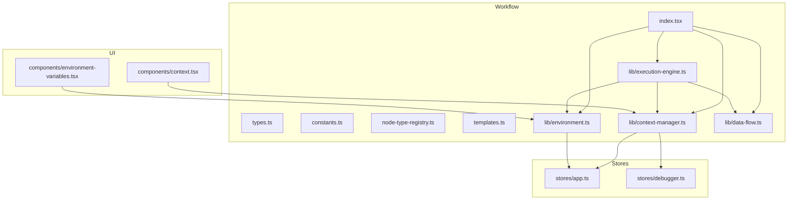
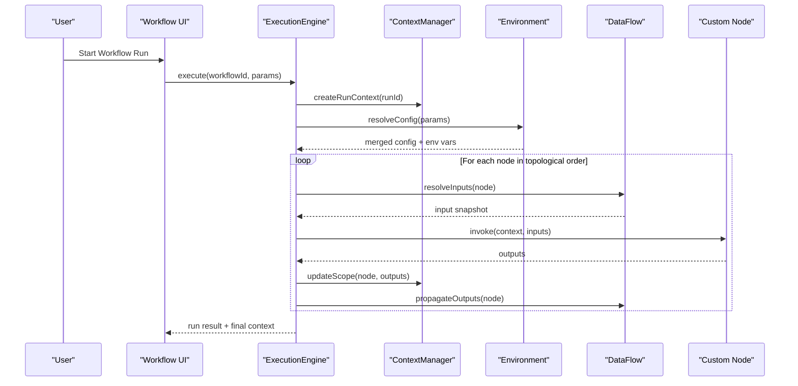
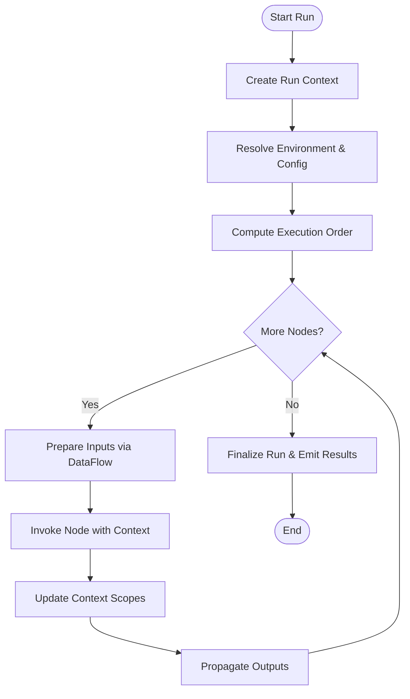
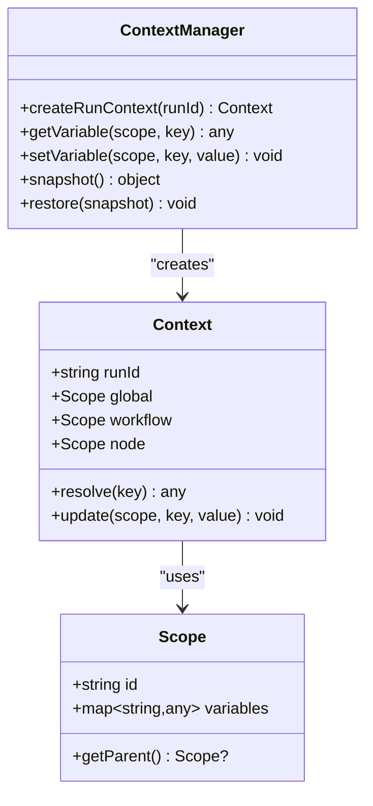
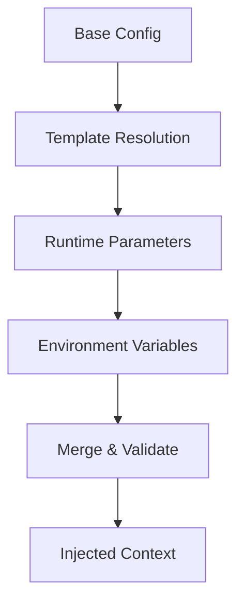
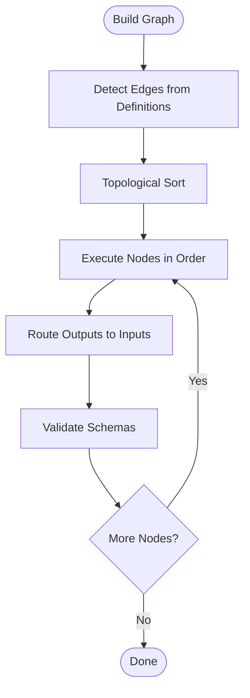
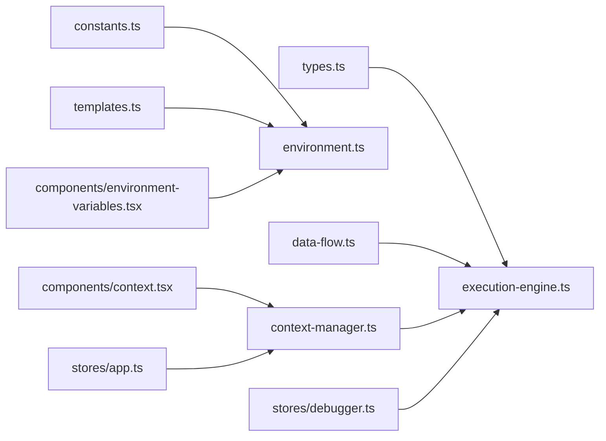

# Execution Context & Environment

<cite>
**Referenced Files in This Document**
- [workflow/index.tsx](file://src/pages/workflow/index.tsx)
- [workflow/types.ts](file://src/pages/workflow/types.ts)
- [workflow/constants.ts](file://src/pages/workflow/constants.ts)
- [workflow/node-type-registry.ts](file://src/pages/workflow/node-type-registry.ts)
- [workflow/templates.ts](file://src/pages/workflow/templates.ts)
- [workflow/lib/execution-engine.ts](file://src/pages/workflow/lib/execution-engine.ts)
- [workflow/lib/context-manager.ts](file://src/pages/workflow/lib/context-manager.ts)
- [workflow/lib/environment.ts](file://src/pages/workflow/lib/environment.ts)
- [workflow/lib/data-flow.ts](file://src/pages/workflow/lib/data-flow.ts)
- [workflow/components/context.tsx](file://src/pages/workflow/components/context.tsx)
- [workflow/components/environment-variables.tsx](file://src/pages/workflow/components/environment-variables.tsx)
- [stores/app.ts](file://stores/app.ts)
- [stores/debugger.ts](file://stores/debugger.ts)
</cite>

## Table of Contents
1. [Introduction](#introduction)
2. [Project Structure](#project-structure)
3. [Core Components](#core-components)
4. [Architecture Overview](#architecture-overview)
5. [Detailed Component Analysis](#detailed-component-analysis)
6. [Dependency Analysis](#dependency-analysis)
7. [Performance Considerations](#performance-considerations)
8. [Troubleshooting Guide](#troubleshooting-guide)
9. [Conclusion](#conclusion)

## Introduction
This document explains how execution contexts and environments are created, managed, and isolated for each workflow run. It covers variable scoping, state management, data flow between nodes, environment setup, configuration injection, and runtime parameter handling. It also provides examples of context usage in custom nodes and guidance for debugging context-related issues.

## Project Structure
The workflow feature is implemented under src/pages/workflow with supporting UI components and stores. Key areas:
- Workflow orchestration and types
- Execution engine and context manager
- Environment and data flow utilities
- UI for inspecting and editing context and environment variables
- Global app and debugger stores for cross-cutting concerns

**Diagram sources**
- [workflow/index.tsx](file://src/pages/workflow/index.tsx)
- [workflow/lib/execution-engine.ts](file://src/pages/workflow/lib/execution-engine.ts)
- [workflow/lib/context-manager.ts](file://src/pages/workflow/lib/context-manager.ts)
- [workflow/lib/environment.ts](file://src/pages/workflow/lib/environment.ts)
- [workflow/lib/data-flow.ts](file://src/pages/workflow/lib/data-flow.ts)
- [workflow/components/context.tsx](file://src/pages/workflow/components/context.tsx)
- [workflow/components/environment-variables.tsx](file://src/pages/workflow/components/environment-variables.tsx)
- [stores/app.ts](file://stores/app.ts)
- [stores/debugger.ts](file://stores/debugger.ts)

**Section sources**
- [workflow/index.tsx](file://src/pages/workflow/index.tsx)
- [workflow/types.ts](file://src/pages/workflow/types.ts)
- [workflow/constants.ts](file://src/pages/workflow/constants.ts)
- [workflow/node-type-registry.ts](file://src/pages/workflow/node-type-registry.ts)
- [workflow/templates.ts](file://src/pages/workflow/templates.ts)
- [workflow/lib/execution-engine.ts](file://src/pages/workflow/lib/execution-engine.ts)
- [workflow/lib/context-manager.ts](file://src/pages/workflow/lib/context-manager.ts)
- [workflow/lib/environment.ts](file://src/pages/workflow/lib/environment.ts)
- [workflow/lib/data-flow.ts](file://src/pages/workflow/lib/data-flow.ts)
- [workflow/components/context.tsx](file://src/pages/workflow/components/context.tsx)
- [workflow/components/environment-variables.tsx](file://src/pages/workflow/components/environment-variables.tsx)
- [stores/app.ts](file://stores/app.ts)
- [stores/debugger.ts](file://stores/debugger.ts)

## Core Components
- Execution Engine: Orchestrates node execution, manages lifecycle events, and coordinates context and environment per run.
- Context Manager: Creates isolated execution contexts, handles variable scoping (global, workflow, node), and persists transient state.
- Environment: Manages configuration injection, environment variables, and runtime parameters; merges defaults with user overrides.
- Data Flow: Routes outputs from one node to inputs of downstream nodes according to graph topology and schemas.
- UI Components: Provide interfaces to view/edit context values and environment variables during development and debugging.
- Stores: Persist application-wide settings and debug logs that influence or reflect context behavior.

**Section sources**
- [workflow/lib/execution-engine.ts](file://src/pages/workflow/lib/execution-engine.ts)
- [workflow/lib/context-manager.ts](file://src/pages/workflow/lib/context-manager.ts)
- [workflow/lib/environment.ts](file://src/pages/workflow/lib/environment.ts)
- [workflow/lib/data-flow.ts](file://src/pages/workflow/lib/data-flow.ts)
- [workflow/components/context.tsx](file://src/pages/workflow/components/context.tsx)
- [workflow/components/environment-variables.tsx](file://src/pages/workflow/components/environment-variables.tsx)
- [stores/app.ts](file://stores/app.ts)
- [stores/debugger.ts](file://stores/debugger.ts)

## Architecture Overview
The execution pipeline creates a fresh context per workflow run, injects environment configuration, executes nodes in dependency order, and propagates data through edges. Each node receives a scoped context and returns outputs consumed by downstream nodes.

**Diagram sources**
- [workflow/lib/execution-engine.ts](file://src/pages/workflow/lib/execution-engine.ts)
- [workflow/lib/context-manager.ts](file://src/pages/workflow/lib/context-manager.ts)
- [workflow/lib/environment.ts](file://src/pages/workflow/lib/environment.ts)
- [workflow/lib/data-flow.ts](file://src/pages/workflow/lib/data-flow.ts)

## Detailed Component Analysis

### Execution Engine
Responsibilities:
- Create a new run context per invocation
- Resolve environment configuration and merge runtime parameters
- Execute nodes in a deterministic order based on dependencies
- Capture and store intermediate outputs for downstream consumption
- Handle errors and emit diagnostics to the debugger store

Key behaviors:
- Isolation: Each run gets its own context instance to prevent cross-run leakage
- Determinism: Topological ordering ensures consistent execution
- Observability: Logs and snapshots are emitted for debugging

**Diagram sources**
- [workflow/lib/execution-engine.ts](file://src/pages/workflow/lib/execution-engine.ts)
- [workflow/lib/data-flow.ts](file://src/pages/workflow/lib/data-flow.ts)
- [workflow/lib/context-manager.ts](file://src/pages/workflow/lib/context-manager.ts)

**Section sources**
- [workflow/lib/execution-engine.ts](file://src/pages/workflow/lib/execution-engine.ts)

### Context Manager
Responsibilities:
- Manage per-run context instances
- Implement scoping rules: global, workflow-level, and node-level scopes
- Provide read/write APIs for variables within scope boundaries
- Snapshot context at checkpoints for replay and inspection

Scoping model:
- Global scope: Immutable across runs unless explicitly updated by system actions
- Workflow scope: Shared across all nodes within a single run
- Node scope: Local to a specific node; can be promoted to workflow scope if configured

**Diagram sources**
- [workflow/lib/context-manager.ts](file://src/pages/workflow/lib/context-manager.ts)

**Section sources**
- [workflow/lib/context-manager.ts](file://src/pages/workflow/lib/context-manager.ts)

### Environment Management
Responsibilities:
- Load base configuration from templates and constants
- Merge runtime parameters provided by the user or upstream systems
- Inject environment variables into the execution context
- Validate and sanitize sensitive values

Configuration layers:
- Defaults: Hardcoded or template-based baseline
- Overrides: User-provided parameters and environment variables
- Runtime: Dynamic updates during execution (e.g., secrets resolved at runtime)

**Diagram sources**
- [workflow/lib/environment.ts](file://src/pages/workflow/lib/environment.ts)
- [workflow/templates.ts](file://src/pages/workflow/templates.ts)
- [workflow/constants.ts](file://src/pages/workflow/constants.ts)

**Section sources**
- [workflow/lib/environment.ts](file://src/pages/workflow/lib/environment.ts)
- [workflow/templates.ts](file://src/pages/workflow/templates.ts)
- [workflow/constants.ts](file://src/pages/workflow/constants.ts)

### Data Flow Between Nodes
Responsibilities:
- Build a dependency graph from node definitions
- Compute topological order for execution
- Route outputs to matching inputs based on schemas
- Handle missing or invalid inputs with clear error messages

**Diagram sources**
- [workflow/lib/data-flow.ts](file://src/pages/workflow/lib/data-flow.ts)
- [workflow/types.ts](file://src/pages/workflow/types.ts)

**Section sources**
- [workflow/lib/data-flow.ts](file://src/pages/workflow/lib/data-flow.ts)
- [workflow/types.ts](file://src/pages/workflow/types.ts)

### Custom Node Usage Examples
Guidelines:
- Read required inputs from the provided context and input snapshot
- Write outputs to the return value or context update API
- Avoid mutating shared state directly; use scoped updates
- Use environment variables for configuration and secrets

Example patterns:
- HTTP request node: Reads URL and headers from context, returns response body and metadata
- Transformation node: Reads input payload, applies transformation, writes output to workflow scope
- Secret resolver node: Reads secret name from inputs, resolves from secure store, injects into context

[No sources needed since this section doesn't analyze specific files]

### Debugging Context-Related Issues
Common symptoms:
- Undefined variables in nodes
- Unexpected value overwrites between nodes
- Secrets not injected correctly
- Non-deterministic execution order

Debugging steps:
- Inspect context snapshots at checkpoints
- Review data flow logs for missing or mismatched inputs
- Verify environment variable precedence and resolution
- Use debugger store to trace execution timeline and errors

Tools:
- Context inspector UI component
- Environment variables editor
- Debugger store entries for logs and snapshots

**Section sources**
- [workflow/components/context.tsx](file://src/pages/workflow/components/context.tsx)
- [workflow/components/environment-variables.tsx](file://src/pages/workflow/components/environment-variables.tsx)
- [stores/debugger.ts](file://stores/debugger.ts)

## Dependency Analysis
The workflow module depends on:
- Types and constants for schema and default configurations
- Templates for reusable node definitions and environment baselines
- Stores for persistence and debugging
- UI components for interactive inspection and editing

**Diagram sources**
- [workflow/types.ts](file://src/pages/workflow/types.ts)
- [workflow/constants.ts](file://src/pages/workflow/constants.ts)
- [workflow/templates.ts](file://src/pages/workflow/templates.ts)
- [workflow/lib/data-flow.ts](file://src/pages/workflow/lib/data-flow.ts)
- [workflow/lib/context-manager.ts](file://src/pages/workflow/lib/context-manager.ts)
- [workflow/lib/execution-engine.ts](file://src/pages/workflow/lib/execution-engine.ts)
- [workflow/lib/environment.ts](file://src/pages/workflow/lib/environment.ts)
- [workflow/components/context.tsx](file://src/pages/workflow/components/context.tsx)
- [workflow/components/environment-variables.tsx](file://src/pages/workflow/components/environment-variables.tsx)
- [stores/app.ts](file://stores/app.ts)
- [stores/debugger.ts](file://stores/debugger.ts)

**Section sources**
- [workflow/types.ts](file://src/pages/workflow/types.ts)
- [workflow/constants.ts](file://src/pages/workflow/constants.ts)
- [workflow/templates.ts](file://src/pages/workflow/templates.ts)
- [workflow/lib/data-flow.ts](file://src/pages/workflow/lib/data-flow.ts)
- [workflow/lib/context-manager.ts](file://src/pages/workflow/lib/context-manager.ts)
- [workflow/lib/execution-engine.ts](file://src/pages/workflow/lib/execution-engine.ts)
- [workflow/lib/environment.ts](file://src/pages/workflow/lib/environment.ts)
- [workflow/components/context.tsx](file://src/pages/workflow/components/context.tsx)
- [workflow/components/environment-variables.tsx](file://src/pages/workflow/components/environment-variables.tsx)
- [stores/app.ts](file://stores/app.ts)
- [stores/debugger.ts](file://stores/debugger.ts)

## Performance Considerations
- Minimize context mutations: Batch updates where possible to reduce overhead
- Cache expensive computations in node-scoped memory when safe
- Avoid deep cloning large payloads; prefer references with validation
- Limit logging volume in production; enable detailed logs only during debugging
- Precompute topological order once per workflow definition to avoid recomputation

[No sources needed since this section provides general guidance]

## Troubleshooting Guide
Symptoms and resolutions:
- Variable not found: Ensure correct scope resolution and verify upstream outputs exist
- Value overwritten unexpectedly: Check for conflicting assignments in different scopes
- Secrets missing: Confirm environment variable precedence and secure resolution path
- Execution order anomalies: Validate graph edges and node dependencies

Useful tools:
- Context inspector: View current scope variables and their origins
- Environment editor: Adjust variables and re-run to validate changes
- Debugger store: Inspect logs, snapshots, and error traces

**Section sources**
- [workflow/components/context.tsx](file://src/pages/workflow/components/context.tsx)
- [workflow/components/environment-variables.tsx](file://src/pages/workflow/components/environment-variables.tsx)
- [stores/debugger.ts](file://stores/debugger.ts)

## Conclusion
The workflow execution context and environment system provides robust isolation, clear scoping, and predictable data flow. By leveraging the execution engine, context manager, and environment utilities, developers can build reliable, testable workflows with strong debugging support. Adhering to scoping best practices and using the provided tools will help avoid common pitfalls and ensure consistent behavior across runs.