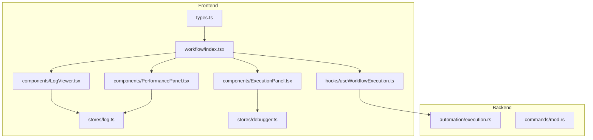
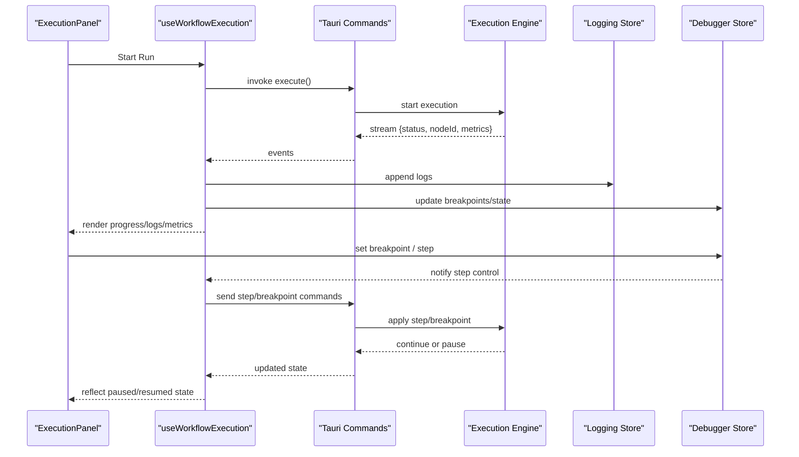
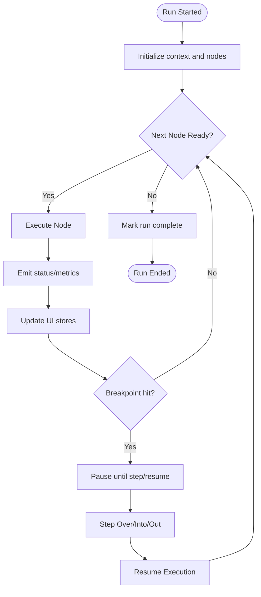
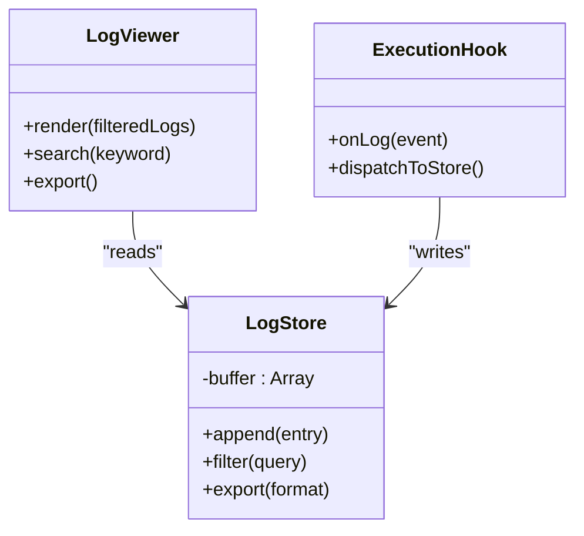
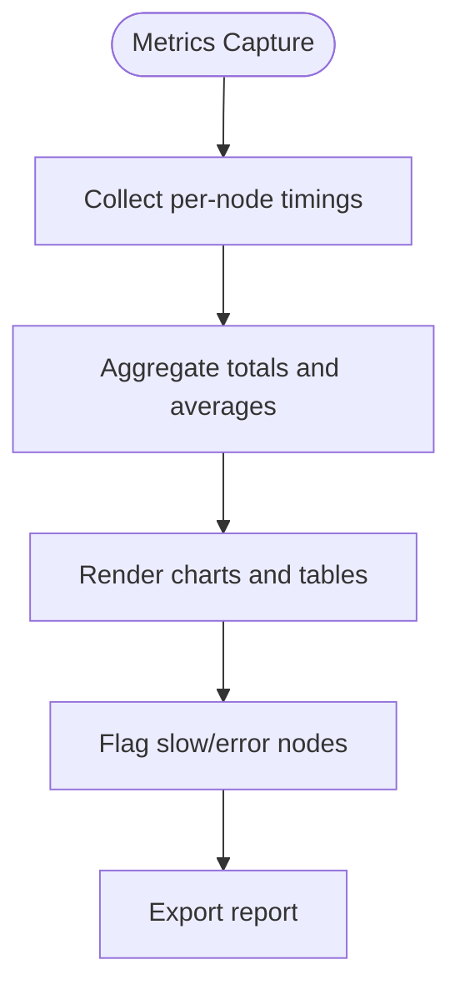
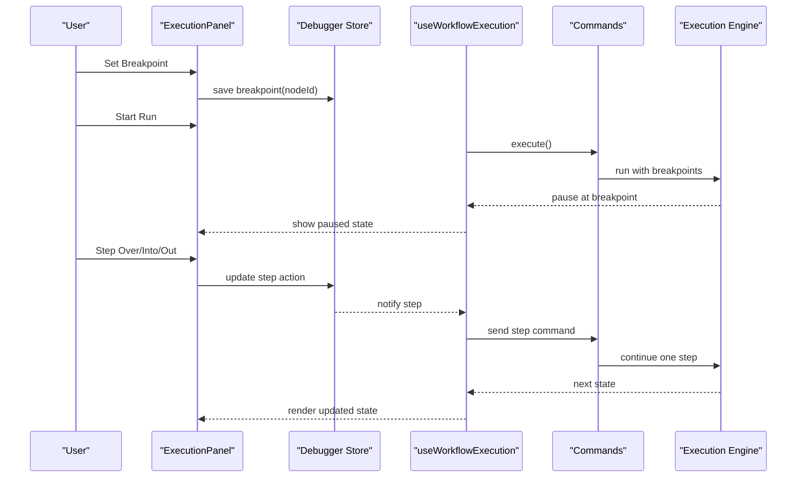
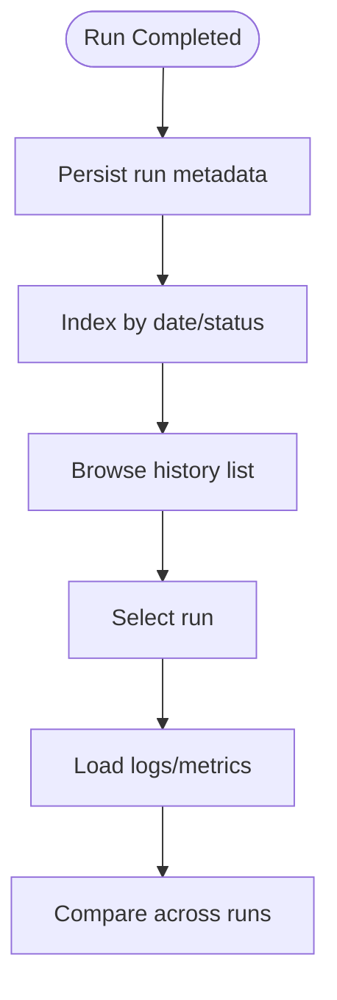
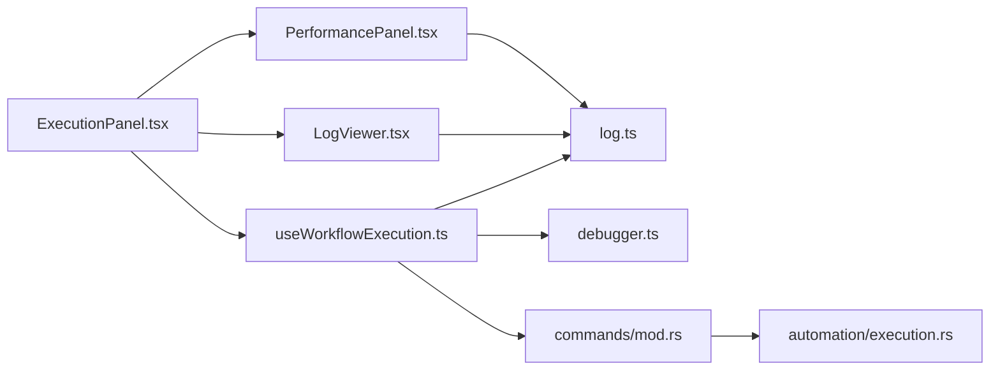

# Monitoring & Debugging

<cite>
**Referenced Files in This Document**
- [src/stores/log.ts](file://src/stores/log.ts)
- [src/stores/debugger.ts](file://src/stores/debugger.ts)
- [src/pages/workflow/index.tsx](file://src/pages/workflow/index.tsx)
- [src/pages/workflow/lib/execution-engine.mjs](file://src/pages/workflow/lib/execution-engine.mjs)
- [src/pages/workflow/components/ExecutionPanel.tsx](file://src/pages/workflow/components/ExecutionPanel.tsx)
- [src/pages/workflow/components/LogViewer.tsx](file://src/pages/workflow/components/LogViewer.tsx)
- [src/pages/workflow/components/PerformancePanel.tsx](file://src/pages/workflow/components/PerformancePanel.tsx)
- [src/pages/workflow/hooks/useWorkflowExecution.ts](file://src/pages/workflow/hooks/useWorkflowExecution.ts)
- [src/pages/workflow/types.ts](file://src/pages/workflow/types.ts)
- [src-tauri/src/automation/execution.rs](file://src-tauri/src/automation/execution.rs)
- [src-tauri/src/commands/mod.rs](file://src-tauri/src/commands/mod.rs)
</cite>

## Table of Contents
1. [Introduction](#introduction)
2. [Project Structure](#project-structure)
3. [Core Components](#core-components)
4. [Architecture Overview](#architecture-overview)
5. [Detailed Component Analysis](#detailed-component-analysis)
6. [Dependency Analysis](#dependency-analysis)
7. [Performance Considerations](#performance-considerations)
8. [Troubleshooting Guide](#troubleshooting-guide)
9. [Conclusion](#conclusion)

## Introduction
This document explains the monitoring and debugging capabilities for workflows, focusing on real-time execution tracking, log collection, performance metrics, and step-through debugging. It covers how to observe live runs, collect logs, profile performance, identify bottlenecks, and use breakpoints and step controls to diagnose issues. Practical examples are included to help you quickly get started with diagnosing workflow problems and optimizing performance.

## Project Structure
The monitoring and debugging features span both the frontend (React + Tauri) and backend (Rust). Key areas include:
- Workflow UI pages and components for execution panels, logs, and performance views
- Stores for logging and debugger state
- Hooks that orchestrate execution lifecycle and events
- Backend automation execution engine and commands exposed to the frontend

**Diagram sources**
- [src/pages/workflow/index.tsx](file://src/pages/workflow/index.tsx)
- [src/pages/workflow/components/ExecutionPanel.tsx](file://src/pages/workflow/components/ExecutionPanel.tsx)
- [src/pages/workflow/components/LogViewer.tsx](file://src/pages/workflow/components/LogViewer.tsx)
- [src/pages/workflow/components/PerformancePanel.tsx](file://src/pages/workflow/components/PerformancePanel.tsx)
- [src/pages/workflow/hooks/useWorkflowExecution.ts](file://src/pages/workflow/hooks/useWorkflowExecution.ts)
- [src/stores/log.ts](file://src/stores/log.ts)
- [src/stores/debugger.ts](file://src/stores/debugger.ts)
- [src/pages/workflow/types.ts](file://src/pages/workflow/types.ts)
- [src-tauri/src/automation/execution.rs](file://src-tauri/src/automation/execution.rs)
- [src-tauri/src/commands/mod.rs](file://src-tauri/src/commands/mod.rs)

**Section sources**
- [src/pages/workflow/index.tsx](file://src/pages/workflow/index.tsx)
- [src/stores/log.ts](file://src/stores/log.ts)
- [src/stores/debugger.ts](file://src/stores/debugger.ts)
- [src/pages/workflow/hooks/useWorkflowExecution.ts](file://src/pages/workflow/hooks/useWorkflowExecution.ts)
- [src-tauri/src/automation/execution.rs](file://src-tauri/src/automation/execution.rs)
- [src-tauri/src/commands/mod.rs](file://src-tauri/src/commands/mod.rs)

## Core Components
- Execution Panel: Displays live run status, node progress, and provides controls to start, pause, resume, stop, and step through executions.
- Log Viewer: Streams and filters logs emitted by nodes and the runtime, supporting search and export.
- Performance Panel: Shows timing metrics per node, overall duration, throughput, and identifies hotspots.
- Logging Store: Centralized log buffer with append-only semantics, filtering, and persistence hooks.
- Debugger Store: Manages breakpoints, current step, and step controls (step over/into/out).
- Execution Hook: Orchestrates lifecycle events, connects to backend execution, and updates UI state.
- Backend Execution Engine: Executes workflow steps, emits telemetry, and handles breakpoints and stepping requests.

**Section sources**
- [src/pages/workflow/components/ExecutionPanel.tsx](file://src/pages/workflow/components/ExecutionPanel.tsx)
- [src/pages/workflow/components/LogViewer.tsx](file://src/pages/workflow/components/LogViewer.tsx)
- [src/pages/workflow/components/PerformancePanel.tsx](file://src/pages/workflow/components/PerformancePanel.tsx)
- [src/stores/log.ts](file://src/stores/log.ts)
- [src/stores/debugger.ts](file://src/stores/debugger.ts)
- [src/pages/workflow/hooks/useWorkflowExecution.ts](file://src/pages/workflow/hooks/useWorkflowExecution.ts)
- [src-tauri/src/automation/execution.rs](file://src-tauri/src/automation/execution.rs)

## Architecture Overview
The system uses a reactive frontend backed by a Rust execution engine. The frontend orchestrates user interactions and renders live data; the backend executes nodes, enforces breakpoints, and streams logs and metrics.

**Diagram sources**
- [src/pages/workflow/components/ExecutionPanel.tsx](file://src/pages/workflow/components/ExecutionPanel.tsx)
- [src/pages/workflow/hooks/useWorkflowExecution.ts](file://src/pages/workflow/hooks/useWorkflowExecution.ts)
- [src-tauri/src/commands/mod.rs](file://src-tauri/src/commands/mod.rs)
- [src-tauri/src/automation/execution.rs](file://src-tauri/src/automation/execution.rs)
- [src/stores/log.ts](file://src/stores/log.ts)
- [src/stores/debugger.ts](file://src/stores/debugger.ts)

## Detailed Component Analysis

### Real-Time Execution Tracking
- ExecutionPanel subscribes to lifecycle events and displays node-level progress, current step, and overall status.
- useWorkflowExecution centralizes event handling, maps backend events to UI state, and coordinates store updates.
- Backend execution engine emits structured events with timestamps, node identifiers, and optional payloads.

**Diagram sources**
- [src/pages/workflow/components/ExecutionPanel.tsx](file://src/pages/workflow/components/ExecutionPanel.tsx)
- [src/pages/workflow/hooks/useWorkflowExecution.ts](file://src/pages/workflow/hooks/useWorkflowExecution.ts)
- [src-tauri/src/automation/execution.rs](file://src-tauri/src/automation/execution.rs)

**Section sources**
- [src/pages/workflow/components/ExecutionPanel.tsx](file://src/pages/workflow/components/ExecutionPanel.tsx)
- [src/pages/workflow/hooks/useWorkflowExecution.ts](file://src/pages/workflow/hooks/useWorkflowExecution.ts)
- [src-tauri/src/automation/execution.rs](file://src-tauri/src/automation/execution.rs)

### Log Collection and Streaming
- Logs are appended to a centralized store with timestamps, severity, and contextual metadata.
- LogViewer supports filtering by level, keyword, and node, and allows exporting logs for analysis.
- The execution hook routes backend log events into the store and ensures thread-safe updates.

**Diagram sources**
- [src/stores/log.ts](file://src/stores/log.ts)
- [src/pages/workflow/components/LogViewer.tsx](file://src/pages/workflow/components/LogViewer.tsx)
- [src/pages/workflow/hooks/useWorkflowExecution.ts](file://src/pages/workflow/hooks/useWorkflowExecution.ts)

**Section sources**
- [src/stores/log.ts](file://src/stores/log.ts)
- [src/pages/workflow/components/LogViewer.tsx](file://src/pages/workflow/components/LogViewer.tsx)
- [src/pages/workflow/hooks/useWorkflowExecution.ts](file://src/pages/workflow/hooks/useWorkflowExecution.ts)

### Performance Metrics and Profiling
- PerformancePanel aggregates per-node durations, total run time, and throughput.
- Metrics are collected from execution events and stored alongside logs for correlation.
- Hotspot identification highlights nodes with high latency or error rates.

**Diagram sources**
- [src/pages/workflow/components/PerformancePanel.tsx](file://src/pages/workflow/components/PerformancePanel.tsx)
- [src/stores/log.ts](file://src/stores/log.ts)
- [src/pages/workflow/hooks/useWorkflowExecution.ts](file://src/pages/workflow/hooks/useWorkflowExecution.ts)

**Section sources**
- [src/pages/workflow/components/PerformancePanel.tsx](file://src/pages/workflow/components/PerformancePanel.tsx)
- [src/stores/log.ts](file://src/stores/log.ts)
- [src/pages/workflow/hooks/useWorkflowExecution.ts](file://src/pages/workflow/hooks/useWorkflowExecution.ts)

### Breakpoints and Step-Through Execution
- Debugger Store manages breakpoints and current execution state.
- ExecutionPanel exposes step controls (step over, step into, step out) and pause/resume actions.
- Backend respects breakpoints and pauses execution until resumed.

**Diagram sources**
- [src/stores/debugger.ts](file://src/stores/debugger.ts)
- [src/pages/workflow/components/ExecutionPanel.tsx](file://src/pages/workflow/components/ExecutionPanel.tsx)
- [src/pages/workflow/hooks/useWorkflowExecution.ts](file://src/pages/workflow/hooks/useWorkflowExecution.ts)
- [src-tauri/src/commands/mod.rs](file://src-tauri/src/commands/mod.rs)
- [src-tauri/src/automation/execution.rs](file://src-tauri/src/automation/execution.rs)

**Section sources**
- [src/stores/debugger.ts](file://src/stores/debugger.ts)
- [src/pages/workflow/components/ExecutionPanel.tsx](file://src/pages/workflow/components/ExecutionPanel.tsx)
- [src/pages/workflow/hooks/useWorkflowExecution.ts](file://src/pages/workflow/hooks/useWorkflowExecution.ts)
- [src-tauri/src/commands/mod.rs](file://src-tauri/src/commands/mod.rs)
- [src-tauri/src/automation/execution.rs](file://src-tauri/src/automation/execution.rs)

### Execution History
- Past runs are recorded with timestamps, outcomes, and summary metrics.
- Users can replay or compare runs to analyze regressions and improvements.
- History integrates with logs and performance data for deep-dive analysis.

[No sources needed since this diagram shows conceptual workflow, not actual code structure]

## Dependency Analysis
The monitoring and debugging stack has clear separation between UI, state, and backend execution.

**Diagram sources**
- [src/pages/workflow/components/ExecutionPanel.tsx](file://src/pages/workflow/components/ExecutionPanel.tsx)
- [src/pages/workflow/hooks/useWorkflowExecution.ts](file://src/pages/workflow/hooks/useWorkflowExecution.ts)
- [src/pages/workflow/components/LogViewer.tsx](file://src/pages/workflow/components/LogViewer.tsx)
- [src/pages/workflow/components/PerformancePanel.tsx](file://src/pages/workflow/components/PerformancePanel.tsx)
- [src/stores/log.ts](file://src/stores/log.ts)
- [src/stores/debugger.ts](file://src/stores/debugger.ts)
- [src-tauri/src/commands/mod.rs](file://src-tauri/src/commands/mod.rs)
- [src-tauri/src/automation/execution.rs](file://src-tauri/src/automation/execution.rs)

**Section sources**
- [src/pages/workflow/components/ExecutionPanel.tsx](file://src/pages/workflow/components/ExecutionPanel.tsx)
- [src/pages/workflow/hooks/useWorkflowExecution.ts](file://src/pages/workflow/hooks/useWorkflowExecution.ts)
- [src/stores/log.ts](file://src/stores/log.ts)
- [src/stores/debugger.ts](file://src/stores/debugger.ts)
- [src-tauri/src/commands/mod.rs](file://src-tauri/src/commands/mod.rs)
- [src-tauri/src/automation/execution.rs](file://src-tauri/src/automation/execution.rs)

## Performance Considerations
- Prefer streaming updates with batching to avoid UI thrash during high-frequency logs.
- Use pagination or virtualization for large log sets to maintain responsiveness.
- Profile nodes with coarse-grained timers first; refine granularity only where needed.
- Avoid heavy computations in the main thread; offload filtering/exporting to workers if necessary.
- Cache frequently accessed metrics and summaries to reduce recomputation.

[No sources needed since this section provides general guidance]

## Troubleshooting Guide
Common issues and resolutions:
- No logs appearing: Ensure the execution hook is subscribed to backend log events and that the logging store is initialized before starting a run.
- Breakpoints not triggering: Verify breakpoints are set on valid node IDs and that the backend recognizes them; confirm the engine is running in debug mode.
- Paused state stuck: Send a resume command via step controls; check for unhandled exceptions in node execution.
- Slow performance: Inspect the Performance Panel for hotspots; add targeted logging around suspected sections; consider parallelizing independent nodes.
- History missing: Confirm run completion persists metadata and indexes entries by date and status.

**Section sources**
- [src/stores/log.ts](file://src/stores/log.ts)
- [src/stores/debugger.ts](file://src/stores/debugger.ts)
- [src/pages/workflow/hooks/useWorkflowExecution.ts](file://src/pages/workflow/hooks/useWorkflowExecution.ts)
- [src-tauri/src/automation/execution.rs](file://src-tauri/src/automation/execution.rs)

## Conclusion
The workflow monitoring and debugging system provides comprehensive visibility into execution, robust log collection, actionable performance metrics, and interactive debugging tools. By leveraging real-time tracking, breakpoints, and profiling, you can quickly diagnose issues and optimize workflows for reliability and speed.