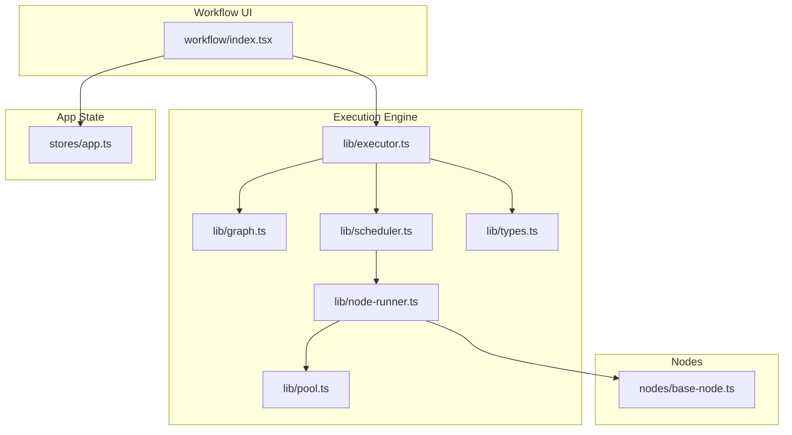
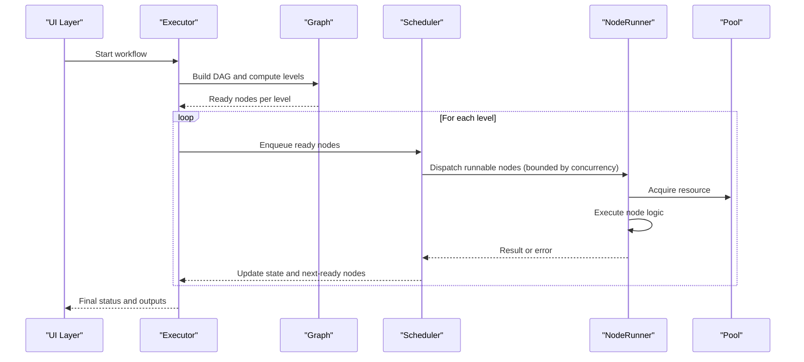
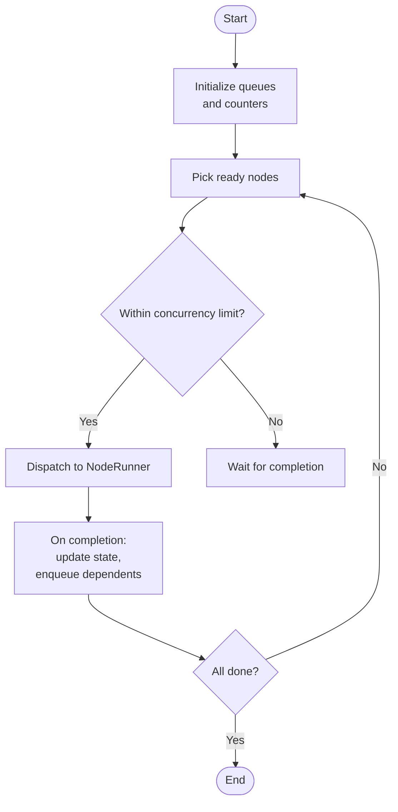
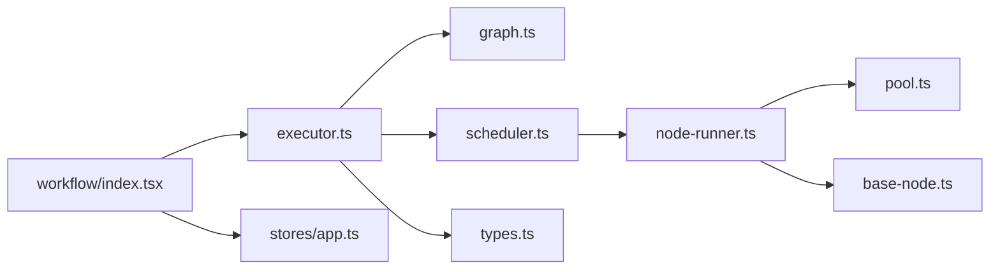

# Parallel Processing & Concurrency

<cite>
**Referenced Files in This Document**
- [src/pages/workflow/index.tsx](file://src/pages/workflow/index.tsx)
- [src/pages/workflow/lib/executor.ts](file://src/pages/workflow/lib/executor.ts)
- [src/pages/workflow/lib/graph.ts](file://src/pages/workflow/lib/graph.ts)
- [src/pages/workflow/lib/scheduler.ts](file://src/pages/workflow/lib/scheduler.ts)
- [src/pages/workflow/lib/node-runner.ts](file://src/pages/workflow/lib/node-runner.ts)
- [src/pages/workflow/lib/pool.ts](file://src/pages/workflow/lib/pool.ts)
- [src/pages/workflow/lib/types.ts](file://src/pages/workflow/lib/types.ts)
- [src/pages/workflow/nodes/base-node.ts](file://src/pages/workflow/nodes/base-node.ts)
- [src/pages/workflow/constants.ts](file://src/pages/workflow/constants.ts)
- [src/stores/app.ts](file://src/stores/app.ts)
</cite>

## Table of Contents
1. Introduction
2. Project Structure
3. Core Components
4. Architecture Overview
5. Detailed Component Analysis
6. Dependency Analysis
7. Performance Considerations
8. Troubleshooting Guide
9. Conclusion

## Introduction
This document explains how the workflow engine executes nodes concurrently, resolves dependencies, and enforces execution ordering. It covers thread safety, resource management, concurrency limits, resource pooling, memory management, and performance optimization strategies for parallel workflows. The goal is to help you design efficient, safe, and scalable workflows by understanding the underlying execution model and best practices.

## Project Structure
The workflow subsystem is implemented primarily under src/pages/workflow with supporting state and configuration elsewhere:
- Workflow UI entrypoint and orchestration hooks live in src/pages/workflow/index.tsx
- Execution engine, graph utilities, scheduler, node runner, and worker pool are in src/pages/workflow/lib
- Node base implementation and type definitions are in src/pages/workflow/nodes and src/pages/workflow/lib/types.ts
- Global application state (e.g., settings that may affect concurrency) is in src/stores/app.ts

**Diagram sources**
- [src/pages/workflow/index.tsx](file://src/pages/workflow/index.tsx)
- [src/pages/workflow/lib/executor.ts](file://src/pages/workflow/lib/executor.ts)
- [src/pages/workflow/lib/graph.ts](file://src/pages/workflow/lib/graph.ts)
- [src/pages/workflow/lib/scheduler.ts](file://src/pages/workflow/lib/scheduler.ts)
- [src/pages/workflow/lib/node-runner.ts](file://src/pages/workflow/lib/node-runner.ts)
- [src/pages/workflow/lib/pool.ts](file://src/pages/workflow/lib/pool.ts)
- [src/pages/workflow/lib/types.ts](file://src/pages/workflow/lib/types.ts)
- [src/pages/workflow/nodes/base-node.ts](file://src/pages/workflow/nodes/base-node.ts)
- [src/stores/app.ts](file://src/stores/app.ts)

**Section sources**
- [src/pages/workflow/index.tsx](file://src/pages/workflow/index.tsx)
- [src/pages/workflow/lib/executor.ts](file://src/pages/workflow/lib/executor.ts)
- [src/pages/workflow/lib/graph.ts](file://src/pages/workflow/lib/graph.ts)
- [src/pages/workflow/lib/scheduler.ts](file://src/pages/workflow/lib/scheduler.ts)
- [src/pages/workflow/lib/node-runner.ts](file://src/pages/workflow/lib/node-runner.ts)
- [src/pages/workflow/lib/pool.ts](file://src/pages/workflow/lib/pool.ts)
- [src/pages/workflow/lib/types.ts](file://src/pages/workflow/lib/types.ts)
- [src/pages/workflow/nodes/base-node.ts](file://src/pages/workflow/nodes/base-node.ts)
- [src/stores/app.ts](file://src/stores/app.ts)

## Core Components
- Executor: Orchestrates workflow lifecycle, builds dependency graphs, schedules tasks, and manages concurrency limits.
- Graph: Provides topological analysis, dependency resolution, and level-based partitioning for parallel execution.
- Scheduler: Drives execution order, tracks ready nodes, and dispatches work to runners while respecting limits.
- NodeRunner: Executes individual nodes with error handling, timeouts, and result propagation.
- Pool: Manages a bounded set of workers or resources to cap concurrency and avoid overloading the system.
- Types: Defines node interfaces, execution context, results, and configuration options.
- BaseNode: Common behavior shared across all node implementations.

Key responsibilities:
- Dependency resolution ensures correct ordering without deadlocks.
- Concurrency control prevents resource exhaustion and maintains stability.
- Resource pooling reduces allocation overhead and improves throughput.
- Error isolation contains failures to affected branches.

**Section sources**
- [src/pages/workflow/lib/executor.ts](file://src/pages/workflow/lib/executor.ts)
- [src/pages/workflow/lib/graph.ts](file://src/pages/workflow/lib/graph.ts)
- [src/pages/workflow/lib/scheduler.ts](file://src/pages/workflow/lib/scheduler.ts)
- [src/pages/workflow/lib/node-runner.ts](file://src/pages/workflow/lib/node-runner.ts)
- [src/pages/workflow/lib/pool.ts](file://src/pages/workflow/lib/pool.ts)
- [src/pages/workflow/lib/types.ts](file://src/pages/workflow/lib/types.ts)
- [src/pages/workflow/nodes/base-node.ts](file://src/pages/workflow/nodes/base-node.ts)

## Architecture Overview
The workflow engine follows a layered architecture:
- UI layer triggers execution via the executor.
- Executor constructs a directed acyclic graph (DAG) from node definitions and edges.
- Graph computes levels and ready sets based on dependencies.
- Scheduler picks ready nodes up to the configured concurrency limit and hands them off to runners.
- Runners execute nodes using pooled resources and propagate results or errors back to the executor.
- Executor aggregates outcomes and updates global state.

**Diagram sources**
- [src/pages/workflow/index.tsx](file://src/pages/workflow/index.tsx)
- [src/pages/workflow/lib/executor.ts](file://src/pages/workflow/lib/executor.ts)
- [src/pages/workflow/lib/graph.ts](file://src/pages/workflow/lib/graph.ts)
- [src/pages/workflow/lib/scheduler.ts](file://src/pages/workflow/lib/scheduler.ts)
- [src/pages/workflow/lib/node-runner.ts](file://src/pages/workflow/lib/node-runner.ts)
- [src/pages/workflow/lib/pool.ts](file://src/pages/workflow/lib/pool.ts)

## Detailed Component Analysis

### Executor
Responsibilities:
- Initialize workflow run, build the dependency graph, and prepare execution context.
- Manage lifecycle events (start, pause, resume, cancel).
- Aggregate results and handle terminal states.

Concurrency considerations:
- Delegates scheduling to the scheduler to enforce concurrency limits.
- Ensures idempotent restarts and cancellation propagation.

Error handling:
- Wraps node-level errors and marks failed branches accordingly.
- Preserves partial results where possible.

Performance tips:
- Reuse execution contexts across runs when safe.
- Avoid unnecessary graph rebuilds by caching stable parts.

**Section sources**
- [src/pages/workflow/lib/executor.ts](file://src/pages/workflow/lib/executor.ts)
- [src/pages/workflow/lib/types.ts](file://src/pages/workflow/lib/types.ts)

### Graph
Responsibilities:
- Represent nodes and edges as a DAG.
- Compute topological order and level partitions for parallelism.
- Validate cycles and missing dependencies.

Algorithm highlights:
- Kahn’s algorithm or DFS-based topological sort to detect cycles and produce levels.
- Level computation enables executing independent nodes concurrently within a level.

Complexity:
- Time O(V + E) for traversal and level assignment.
- Space O(V + E) for adjacency structures and visited arrays.

Optimization opportunities:
- Incremental updates when nodes change.
- Memoization of computed levels for repeated runs.

**Section sources**
- [src/pages/workflow/lib/graph.ts](file://src/pages/workflow/lib/graph.ts)
- [src/pages/workflow/lib/types.ts](file://src/pages/workflow/lib/types.ts)

### Scheduler
Responsibilities:
- Maintain queues of ready nodes per level.
- Track active and completed nodes.
- Enforce concurrency limits and dispatch work to runners.

Concurrency control:
- Uses a semaphore-like mechanism to bound concurrent executions.
- Dynamically enqueues newly ready nodes as dependencies resolve.

Flow overview:

**Diagram sources**
- [src/pages/workflow/lib/scheduler.ts](file://src/pages/workflow/lib/scheduler.ts)

**Section sources**
- [src/pages/workflow/lib/scheduler.ts](file://src/pages/workflow/lib/scheduler.ts)

### NodeRunner
Responsibilities:
- Execute a single node with proper error handling, timeouts, and logging.
- Manage resource acquisition/release through the pool.
- Normalize results and errors for downstream consumers.

Thread safety:
- Isolates node execution state to prevent cross-node interference.
- Uses immutable inputs where possible.

Timeouts and retries:
- Configurable timeouts per node or globally.
- Optional retry policies for transient failures.

**Section sources**
- [src/pages/workflow/lib/node-runner.ts](file://src/pages/workflow/lib/node-runner.ts)
- [src/pages/workflow/lib/types.ts](file://src/pages/workflow/lib/types.ts)

### Pool
Responsibilities:
- Provide a bounded pool of workers or resources.
- Ensure fair distribution and prevent starvation.
- Handle resource lifecycle and cleanup.

Concurrency limits:
- Limits simultaneous executions to protect CPU, I/O, or external services.
- Exposes metrics for monitoring and tuning.

Resource management:
- Pre-warms resources if beneficial.
- Gracefully handles resource exhaustion and backpressure.

**Section sources**
- [src/pages/workflow/lib/pool.ts](file://src/pages/workflow/lib/pool.ts)

### Types and BaseNode
Types define:
- Node interface (inputs, outputs, metadata).
- Execution context (shared data, flags, cancellation tokens).
- Configuration (concurrency limits, timeouts, retry policies).

BaseNode provides:
- Common validation, logging, and lifecycle hooks.
- Default behaviors for serialization and error formatting.

**Section sources**
- [src/pages/workflow/lib/types.ts](file://src/pages/workflow/lib/types.ts)
- [src/pages/workflow/nodes/base-node.ts](file://src/pages/workflow/nodes/base-node.ts)

## Dependency Analysis
The following diagram shows key module relationships and data flow:

**Diagram sources**
- [src/pages/workflow/index.tsx](file://src/pages/workflow/index.tsx)
- [src/pages/workflow/lib/executor.ts](file://src/pages/workflow/lib/executor.ts)
- [src/pages/workflow/lib/graph.ts](file://src/pages/workflow/lib/graph.ts)
- [src/pages/workflow/lib/scheduler.ts](file://src/pages/workflow/lib/scheduler.ts)
- [src/pages/workflow/lib/node-runner.ts](file://src/pages/workflow/lib/node-runner.ts)
- [src/pages/workflow/lib/pool.ts](file://src/pages/workflow/lib/pool.ts)
- [src/pages/workflow/lib/types.ts](file://src/pages/workflow/lib/types.ts)
- [src/pages/workflow/nodes/base-node.ts](file://src/pages/workflow/nodes/base-node.ts)
- [src/stores/app.ts](file://src/stores/app.ts)

**Section sources**
- [src/pages/workflow/lib/executor.ts](file://src/pages/workflow/lib/executor.ts)
- [src/pages/workflow/lib/graph.ts](file://src/pages/workflow/lib/graph.ts)
- [src/pages/workflow/lib/scheduler.ts](file://src/pages/workflow/lib/scheduler.ts)
- [src/pages/workflow/lib/node-runner.ts](file://src/pages/workflow/lib/node-runner.ts)
- [src/pages/workflow/lib/pool.ts](file://src/pages/workflow/lib/pool.ts)
- [src/pages/workflow/lib/types.ts](file://src/pages/workflow/lib/types.ts)
- [src/pages/workflow/nodes/base-node.ts](file://src/pages/workflow/nodes/base-node.ts)
- [src/stores/app.ts](file://src/stores/app.ts)

## Performance Considerations
- Set appropriate concurrency limits:
  - Tune based on CPU cores, I/O characteristics, and external service quotas.
  - Use adaptive limits that scale with available resources.
- Prefer level-based parallelism:
  - Execute all independent nodes within a level concurrently to maximize throughput.
- Minimize contention:
  - Avoid shared mutable state; pass data explicitly between nodes.
  - Use read-only snapshots for inputs where feasible.
- Resource pooling:
  - Reuse expensive resources (connections, parsers, buffers) via the pool.
  - Pre-warm pools for predictable latency.
- Memory management:
  - Release large objects promptly after use.
  - Stream large payloads instead of loading fully into memory.
- Cancellation and timeouts:
  - Propagate cancellation tokens to stop long-running tasks early.
  - Configure timeouts to prevent hangs and resource leaks.
- Observability:
  - Log execution times, queue lengths, and pool utilization.
  - Surface metrics for dynamic tuning.

[No sources needed since this section provides general guidance]

## Troubleshooting Guide
Common issues and resolutions:
- Deadlocks or stalled execution:
  - Verify no circular dependencies exist; ensure graph validation passes.
  - Confirm all dependencies are resolvable and not blocked indefinitely.
- Out-of-memory errors:
  - Reduce concurrency or batch sizes.
  - Stream large data and release references promptly.
- Slow performance:
  - Increase concurrency cautiously; monitor CPU and I/O saturation.
  - Profile hot paths inside nodes; consider memoization or caching.
- Intermittent failures:
  - Implement retries with exponential backoff for transient errors.
  - Add circuit breakers for external services.
- Resource exhaustion:
  - Inspect pool sizing and leak points; ensure proper acquire/release semantics.
  - Monitor open handles and connection counts.

**Section sources**
- [src/pages/workflow/lib/scheduler.ts](file://src/pages/workflow/lib/scheduler.ts)
- [src/pages/workflow/lib/node-runner.ts](file://src/pages/workflow/lib/node-runner.ts)
- [src/pages/workflow/lib/pool.ts](file://src/pages/workflow/lib/pool.ts)

## Conclusion
Effective parallel processing in workflows hinges on robust dependency resolution, controlled concurrency, and careful resource management. By leveraging level-based parallelism, bounded pools, and strong isolation boundaries, you can achieve high throughput while maintaining stability and predictability. Continuously monitor and tune concurrency limits, timeouts, and resource usage to optimize performance for your specific workload patterns.

[No sources needed since this section summarizes without analyzing specific files]