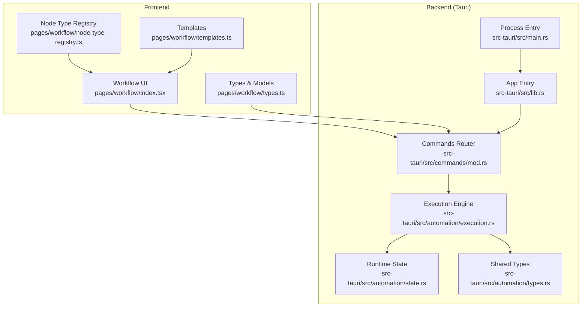
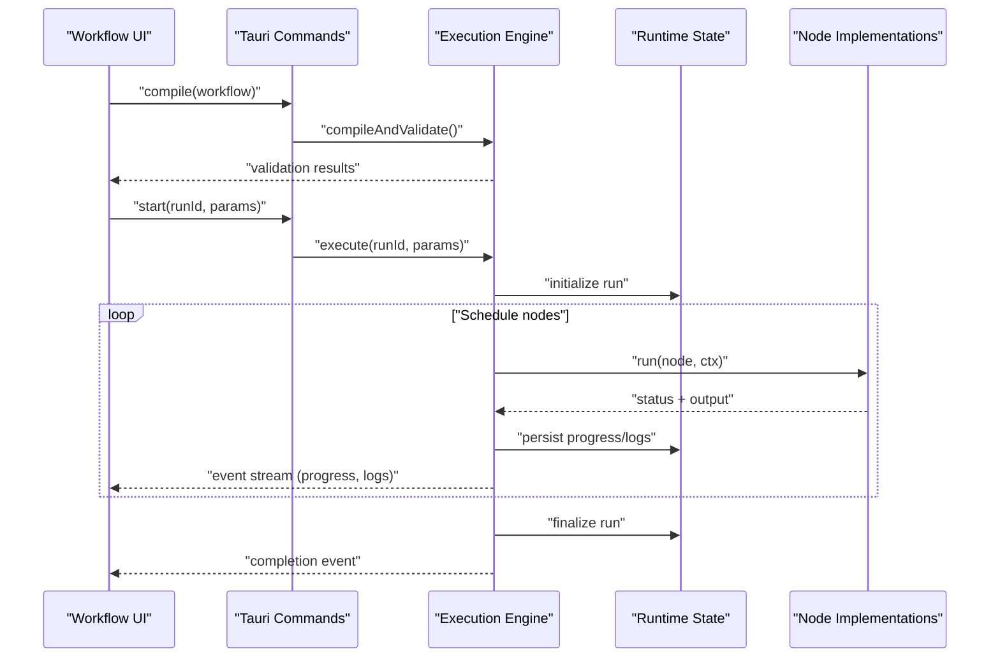
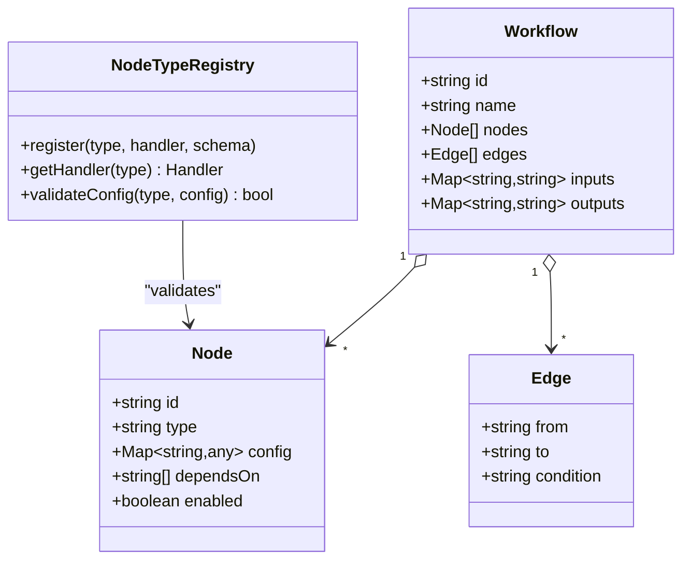
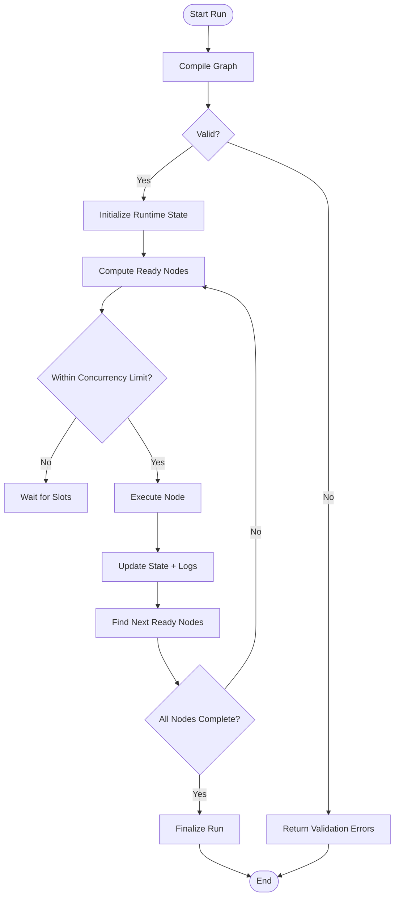
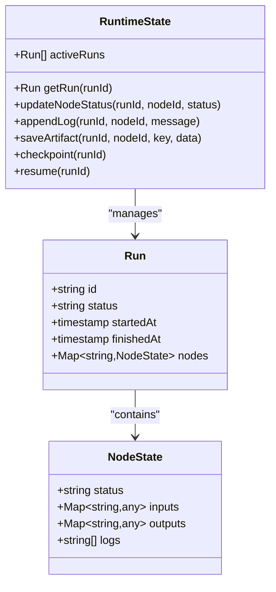
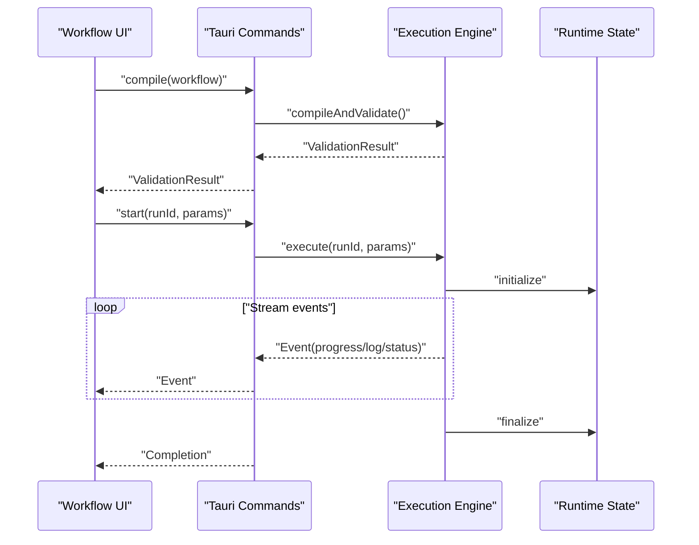
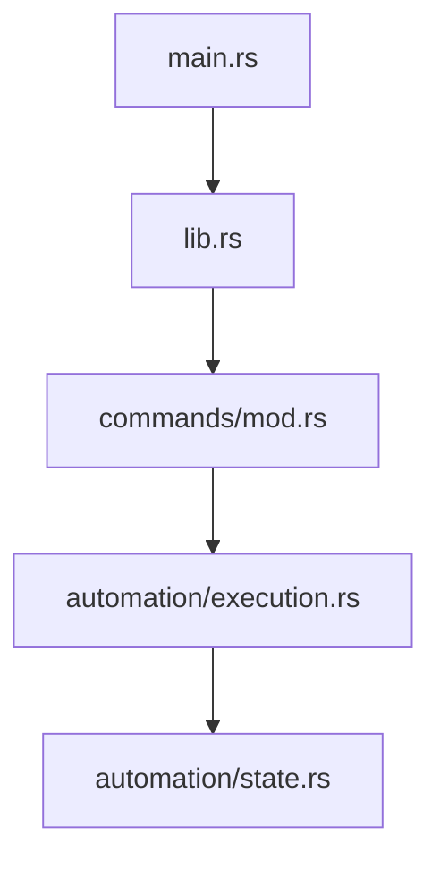
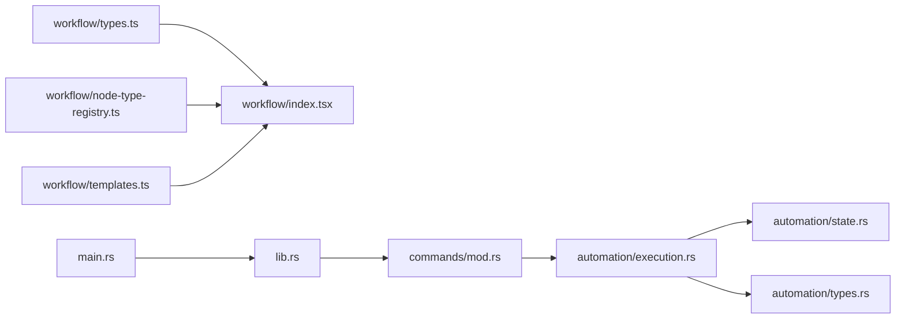

# Workflow Execution Engine

<cite>
**Referenced Files in This Document**
- [workflow/index.tsx](file://src/pages/workflow/index.tsx)
- [workflow/types.ts](file://src/pages/workflow/types.ts)
- [workflow/node-type-registry.ts](file://src/pages/workflow/node-type-registry.ts)
- [workflow/templates.ts](file://src/pages/workflow/templates.ts)
- [automation/execution.rs](file://src-tauri/src/automation/execution.rs)
- [automation/state.rs](file://src-tauri/src/automation/state.rs)
- [automation/types.rs](file://src-tauri/src/automation/types.rs)
- [commands/mod.rs](file://src-tauri/src/commands/mod.rs)
- [lib.rs](file://src-tauri/src/lib.rs)
- [main.rs](file://src-tauri/src/main.rs)
</cite>

## Table of Contents
1. [Introduction](#introduction)
2. [Project Structure](#project-structure)
3. [Core Components](#core-components)
4. [Architecture Overview](#architecture-overview)
5. [Detailed Component Analysis](#detailed-component-analysis)
6. [Dependency Analysis](#dependency-analysis)
7. [Performance Considerations](#performance-considerations)
8. [Troubleshooting Guide](#troubleshooting-guide)
9. [Conclusion](#conclusion)

## Introduction
This document explains Apprecon’s workflow execution engine: how workflows are defined, compiled, validated, executed, monitored, and optimized. It covers the runtime environment, execution context, parallel processing capabilities, error handling, logging, debugging tools, and performance tuning for large-scale automation tasks. The content is derived from the frontend workflow UI and the Tauri backend that executes workflows.

## Project Structure
The workflow feature spans two layers:
- Frontend (React/TypeScript): Defines workflow models, node types, templates, and the UI for building and running workflows.
- Backend (Rust/Tauri): Provides the execution engine, state management, and command interfaces to compile, validate, run, monitor, and control workflows.

**Diagram sources**
- [workflow/index.tsx](file://src/pages/workflow/index.tsx)
- [workflow/types.ts](file://src/pages/workflow/types.ts)
- [workflow/node-type-registry.ts](file://src/pages/workflow/node-type-registry.ts)
- [workflow/templates.ts](file://src/pages/workflow/templates.ts)
- [commands/mod.rs](file://src-tauri/src/commands/mod.rs)
- [lib.rs](file://src-tauri/src/lib.rs)
- [main.rs](file://src-tauri/src/main.rs)
- [automation/execution.rs](file://src-tauri/src/automation/execution.rs)
- [automation/state.rs](file://src-tauri/src/automation/state.rs)
- [automation/types.rs](file://src-tauri/src/automation/types.rs)

**Section sources**
- [workflow/index.tsx](file://src/pages/workflow/index.tsx)
- [workflow/types.ts](file://src/pages/workflow/types.ts)
- [workflow/node-type-registry.ts](file://src/pages/workflow/node-type-registry.ts)
- [workflow/templates.ts](file://src/pages/workflow/templates.ts)
- [commands/mod.rs](file://src-tauri/src/commands/mod.rs)
- [lib.rs](file://src-tauri/src/lib.rs)
- [main.rs](file://src-tauri/src/main.rs)
- [automation/execution.rs](file://src-tauri/src/automation/execution.rs)
- [automation/state.rs](file://src-tauri/src/automation/state.rs)
- [automation/types.rs](file://src-tauri/src/automation/types.rs)

## Core Components
- Workflow model and types: Define nodes, edges, inputs, outputs, and execution metadata used by both UI and engine.
- Node type registry: Maps user-defined or built-in node types to their implementations and schemas.
- Templates: Predefined workflow skeletons to accelerate authoring.
- Execution engine: Compiles a workflow graph into an executable plan, validates constraints, schedules tasks, manages concurrency, and tracks progress.
- Runtime state: Holds active runs, per-node status, logs, artifacts, and checkpoints.
- Commands interface: Exposes Tauri commands for compiling, validating, starting, pausing, stopping, and monitoring workflows.

Key responsibilities:
- Compilation and validation: Ensure graph integrity, resolve references, check node compatibility, and preflight dependencies.
- Execution context: Provide isolated contexts per run with scoped variables, secrets, and shared resources.
- Parallelism: Execute independent nodes concurrently within configured limits.
- Error handling: Capture failures, propagate errors, support retries, and maintain consistent state.
- Monitoring and logging: Stream events, logs, and metrics; expose progress and diagnostics.

**Section sources**
- [workflow/types.ts](file://src/pages/workflow/types.ts)
- [workflow/node-type-registry.ts](file://src/pages/workflow/node-type-registry.ts)
- [workflow/templates.ts](file://src/pages/workflow/templates.ts)
- [automation/execution.rs](file://src-tauri/src/automation/execution.rs)
- [automation/state.rs](file://src-tauri/src/automation/state.rs)
- [automation/types.rs](file://src-tauri/src/automation/types.rs)
- [commands/mod.rs](file://src-tauri/src/commands/mod.rs)

## Architecture Overview
The workflow engine follows a layered architecture:
- UI layer: Builds workflows using nodes and templates, sends compilation/validation requests, and subscribes to execution events.
- Command layer: Routes frontend calls to backend services.
- Execution layer: Schedules and runs nodes, manages concurrency, and persists state.
- State layer: Tracks runs, nodes, logs, and artifacts.

**Diagram sources**
- [commands/mod.rs](file://src-tauri/src/commands/mod.rs)
- [automation/execution.rs](file://src-tauri/src/automation/execution.rs)
- [automation/state.rs](file://src-tauri/src/automation/state.rs)
- [automation/types.rs](file://src-tauri/src/automation/types.rs)

## Detailed Component Analysis

### Workflow Model and Node Registry
- Types define the structure of workflows, including nodes, edges, parameters, and execution metadata.
- The node type registry maps node identifiers to handlers and input/output schemas, enabling dynamic composition.
- Templates provide reusable patterns to speed up workflow creation.

**Diagram sources**
- [workflow/types.ts](file://src/pages/workflow/types.ts)
- [workflow/node-type-registry.ts](file://src/pages/workflow/node-type-registry.ts)

**Section sources**
- [workflow/types.ts](file://src/pages/workflow/types.ts)
- [workflow/node-type-registry.ts](file://src/pages/workflow/node-type-registry.ts)
- [workflow/templates.ts](file://src/pages/workflow/templates.ts)

### Execution Engine
The execution engine compiles workflows into executable plans, validates constraints, schedules tasks, and manages concurrency. It maintains execution context and persists progress and logs.

**Diagram sources**
- [automation/execution.rs](file://src-tauri/src/automation/execution.rs)
- [automation/state.rs](file://src-tauri/src/automation/state.rs)

**Section sources**
- [automation/execution.rs](file://src-tauri/src/automation/execution.rs)
- [automation/state.rs](file://src-tauri/src/automation/state.rs)
- [automation/types.rs](file://src-tauri/src/automation/types.rs)

### Runtime State Management
Runtime state tracks active runs, per-node statuses, logs, artifacts, and checkpoints. It ensures consistency across concurrent operations and provides query APIs for monitoring.

**Diagram sources**
- [automation/state.rs](file://src-tauri/src/automation/state.rs)
- [automation/types.rs](file://src-tauri/src/automation/types.rs)

**Section sources**
- [automation/state.rs](file://src-tauri/src/automation/state.rs)
- [automation/types.rs](file://src-tauri/src/automation/types.rs)

### Commands Interface
Tauri commands expose operations for compiling, validating, starting, pausing, stopping, and monitoring workflows. They bridge the UI and the execution engine.

**Diagram sources**
- [commands/mod.rs](file://src-tauri/src/commands/mod.rs)
- [automation/execution.rs](file://src-tauri/src/automation/execution.rs)
- [automation/state.rs](file://src-tauri/src/automation/state.rs)

**Section sources**
- [commands/mod.rs](file://src-tauri/src/commands/mod.rs)
- [automation/execution.rs](file://src-tauri/src/automation/execution.rs)
- [automation/state.rs](file://src-tauri/src/automation/state.rs)

### Application Entrypoints
The Tauri application initializes the command router and sets up the runtime environment.

**Diagram sources**
- [main.rs](file://src-tauri/src/main.rs)
- [lib.rs](file://src-tauri/src/lib.rs)
- [commands/mod.rs](file://src-tauri/src/commands/mod.rs)
- [automation/execution.rs](file://src-tauri/src/automation/execution.rs)
- [automation/state.rs](file://src-tauri/src/automation/state.rs)

**Section sources**
- [main.rs](file://src-tauri/src/main.rs)
- [lib.rs](file://src-tauri/src/lib.rs)
- [commands/mod.rs](file://src-tauri/src/commands/mod.rs)

## Dependency Analysis
- Frontend components depend on workflow types and node registry for UI rendering and validation feedback.
- Commands depend on the execution engine and runtime state for orchestration and persistence.
- Execution engine depends on node implementations and shared types for behavior and contracts.

**Diagram sources**
- [workflow/types.ts](file://src/pages/workflow/types.ts)
- [workflow/index.tsx](file://src/pages/workflow/index.tsx)
- [workflow/node-type-registry.ts](file://src/pages/workflow/node-type-registry.ts)
- [workflow/templates.ts](file://src/pages/workflow/templates.ts)
- [commands/mod.rs](file://src-tauri/src/commands/mod.rs)
- [automation/execution.rs](file://src-tauri/src/automation/execution.rs)
- [automation/state.rs](file://src-tauri/src/automation/state.rs)
- [automation/types.rs](file://src-tauri/src/automation/types.rs)
- [lib.rs](file://src-tauri/src/lib.rs)
- [main.rs](file://src-tauri/src/main.rs)

**Section sources**
- [workflow/types.ts](file://src/pages/workflow/types.ts)
- [workflow/index.tsx](file://src/pages/workflow/index.tsx)
- [workflow/node-type-registry.ts](file://src/pages/workflow/node-type-registry.ts)
- [workflow/templates.ts](file://src/pages/workflow/templates.ts)
- [commands/mod.rs](file://src-tauri/src/commands/mod.rs)
- [automation/execution.rs](file://src-tauri/src/automation/execution.rs)
- [automation/state.rs](file://src-tauri/src/automation/state.rs)
- [automation/types.rs](file://src-tauri/src/automation/types.rs)
- [lib.rs](file://src-tauri/src/lib.rs)
- [main.rs](file://src-tauri/src/main.rs)

## Performance Considerations
- Concurrency limits: Configure maximum parallel nodes to balance throughput and resource usage.
- Graph optimization: Minimize deep dependency chains; prefer fan-out/fan-in patterns where possible.
- I/O batching: Group external calls and cache intermediate results when safe.
- Memory management: Stream large payloads instead of loading fully into memory.
- Logging level: Use verbose logging only during debugging; default to info/warn for production runs.
- Checkpointing: Enable periodic checkpoints to resume long-running workflows after interruptions.

[No sources needed since this section provides general guidance]

## Troubleshooting Guide
Common issues and resolutions:
- Validation failures: Review node configurations, edge connections, and parameter schemas. Re-run compile to see detailed errors.
- Stalled executions: Inspect runtime state for blocked nodes; verify dependencies and resource availability.
- Timeouts: Increase timeouts for slow nodes or adjust concurrency to reduce contention.
- Missing artifacts: Ensure artifact keys match expected names; verify write permissions and storage paths.
- Log inspection: Filter logs by run ID and node ID; enable debug logs for problematic nodes.

Monitoring workflow progress:
- Subscribe to event streams for real-time updates on node status and logs.
- Query runtime state for current run details, node states, and artifacts.
- Use checkpoint/resume to recover from partial failures.

Optimizing performance:
- Profile node execution times; refactor heavy steps into parallelizable units.
- Reduce unnecessary logging and payload sizes.
- Tune concurrency based on CPU/memory profiles and external service limits.

**Section sources**
- [automation/execution.rs](file://src-tauri/src/automation/execution.rs)
- [automation/state.rs](file://src-tauri/src/automation/state.rs)
- [automation/types.rs](file://src-tauri/src/automation/types.rs)
- [commands/mod.rs](file://src-tauri/src/commands/mod.rs)

## Conclusion
Apprecon’s workflow execution engine combines a flexible frontend model with a robust backend scheduler. It supports compilation, validation, parallel execution, error handling, and comprehensive monitoring. By following the guidelines here—tuning concurrency, optimizing graphs, managing I/O, and leveraging checkpoints—you can build reliable, high-performance workflows for large-scale automation tasks.

[No sources needed since this section summarizes without analyzing specific files]