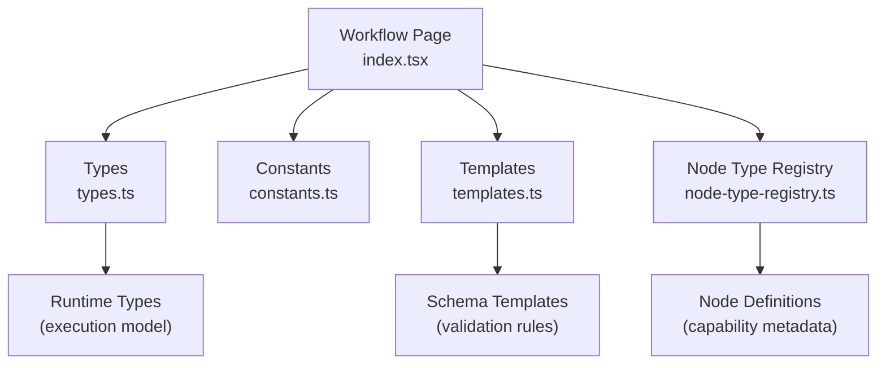
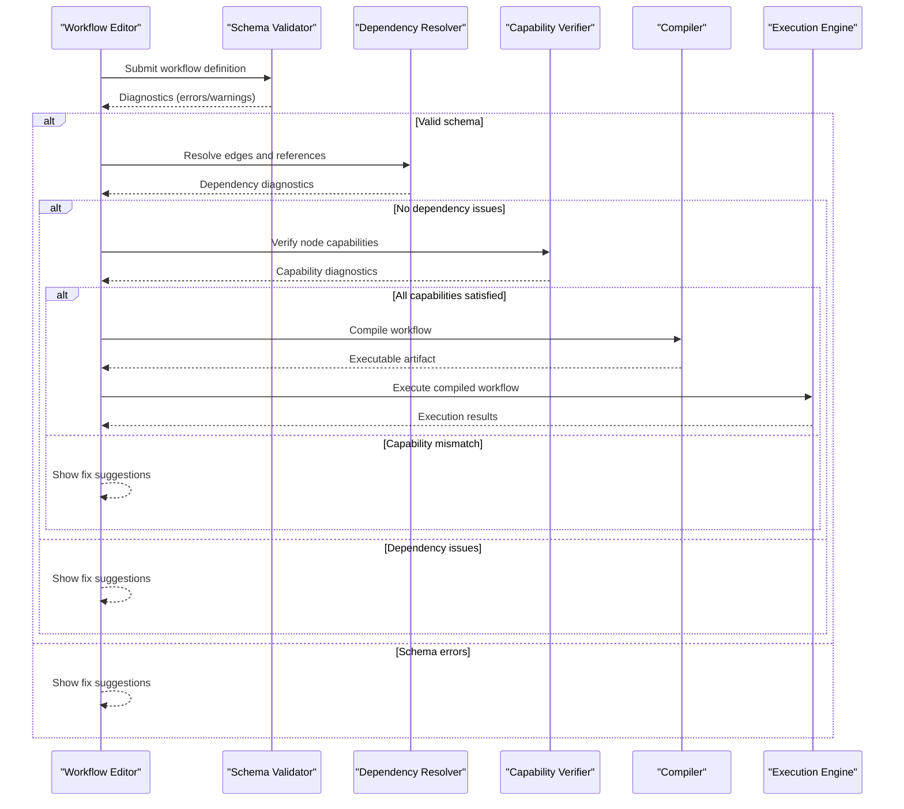
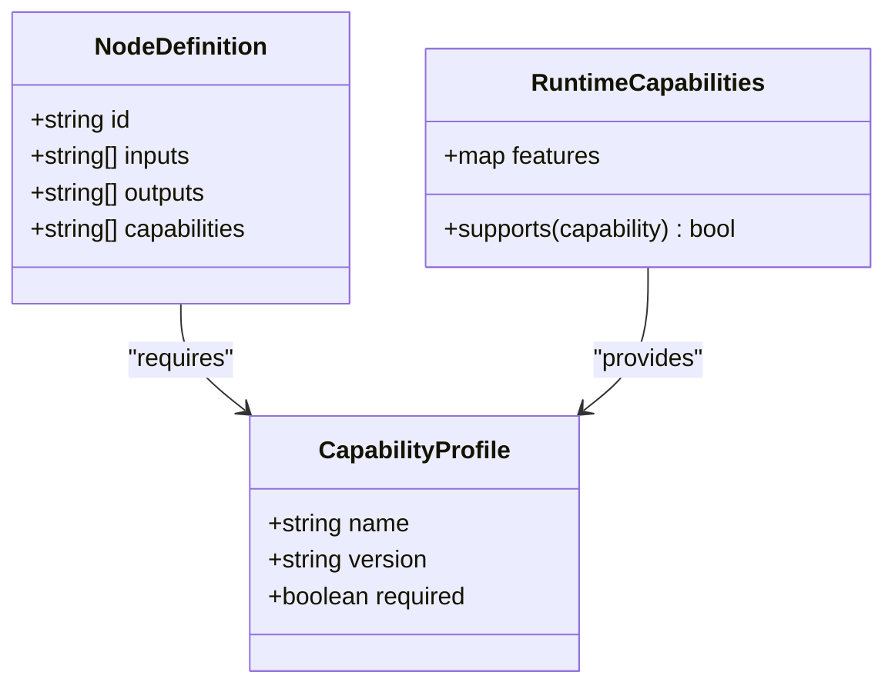
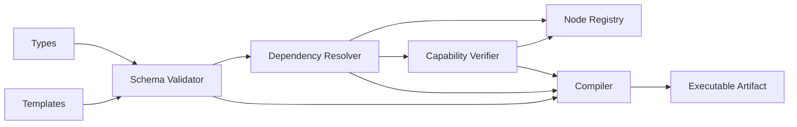

# Workflow Validation & Compilation

<cite>
**Referenced Files in This Document**
- [workflow/index.tsx](file://src/pages/workflow/index.tsx)
- [workflow/types.ts](file://src/pages/workflow/types.ts)
- [workflow/constants.ts](file://src/pages/workflow/constants.ts)
- [workflow/node-type-registry.ts](file://src/pages/workflow/node-type-registry.ts)
- [workflow/templates.ts](file://src/pages/workflow/templates.ts)
</cite>

## Table of Contents
1. [Introduction](#introduction)
2. [Project Structure](#project-structure)
3. [Core Components](#core-components)
4. [Architecture Overview](#architecture-overview)
5. [Detailed Component Analysis](#detailed-component-analysis)
6. [Dependency Analysis](#dependency-analysis)
7. [Performance Considerations](#performance-considerations)
8. [Troubleshooting Guide](#troubleshooting-guide)
9. [Conclusion](#conclusion)

## Introduction
This document explains how workflows are validated before execution and how they are compiled into executable formats. It covers schema validation, dependency checking, capability verification, error detection, validation rules, pre-execution checks, and the node capability system that ensures compatibility between different node types.

## Project Structure
The workflow subsystem is organized around a small set of core files that define types, constants, templates, and the registry used to validate and compile workflows. The key entry points include the main workflow page component, type definitions, constant configurations, template utilities, and the node type registry.

**Diagram sources**
- [workflow/index.tsx](file://src/pages/workflow/index.tsx)
- [workflow/types.ts](file://src/pages/workflow/types.ts)
- [workflow/constants.ts](file://src/pages/workflow/constants.ts)
- [workflow/templates.ts](file://src/pages/workflow/templates.ts)
- [workflow/node-type-registry.ts](file://src/pages/workflow/node-type-registry.ts)

**Section sources**
- [workflow/index.tsx](file://src/pages/workflow/index.tsx)
- [workflow/types.ts](file://src/pages/workflow/types.ts)
- [workflow/constants.ts](file://src/pages/workflow/constants.ts)
- [workflow/templates.ts](file://src/pages/workflow/templates.ts)
- [workflow/node-type-registry.ts](file://src/pages/workflow/node-type-registry.ts)

## Core Components
- Schema validation: Ensures workflow JSON conforms to expected structure and field constraints.
- Dependency checking: Validates edges and references between nodes to prevent cycles or missing targets.
- Capability verification: Confirms each node’s declared capabilities match runtime requirements.
- Compilation: Transforms validated workflow definitions into an optimized, executable representation suitable for the runtime engine.
- Error detection and reporting: Collects and surfaces validation errors with actionable messages.

Key responsibilities:
- Types define the shape of workflows, nodes, edges, and environment variables.
- Constants define default behaviors, allowed modes, and configuration flags.
- Templates provide reusable schemas and defaults for common node types.
- Node type registry maps node identifiers to their capabilities and validators.

**Section sources**
- [workflow/types.ts](file://src/pages/workflow/types.ts)
- [workflow/constants.ts](file://src/pages/workflow/constants.ts)
- [workflow/templates.ts](file://src/pages/workflow/templates.ts)
- [workflow/node-type-registry.ts](file://src/pages/workflow/node-type-registry.ts)

## Architecture Overview
The validation and compilation pipeline follows a staged approach: parse, validate, resolve dependencies, verify capabilities, and compile. Each stage produces diagnostics and short-circuits on failure.

**Diagram sources**
- [workflow/index.tsx](file://src/pages/workflow/index.tsx)
- [workflow/templates.ts](file://src/pages/workflow/templates.ts)
- [workflow/node-type-registry.ts](file://src/pages/workflow/node-type-registry.ts)

## Detailed Component Analysis

### Schema Validation
Schema validation enforces structural correctness and field-level constraints for workflows and nodes. It typically includes:
- Required fields presence checks
- Type enforcement (string, number, boolean, enum)
- Value range and pattern validations
- Nested object/array structure checks

Common validation rules:
- Workflow must have a unique identifier and version
- Nodes must declare a valid type from the registry
- Edges must reference existing source and target nodes
- Environment variables must be defined and referenced correctly

Error detection strategies:
- Aggregate all schema violations into a single pass where possible
- Provide precise location hints (node id, edge index, property path)
- Suggest corrections based on templates and defaults

Resolution examples:
- Missing required field: Add the field or remove optional flag
- Invalid enum value: Replace with one of the allowed values
- Circular dependency: Break cycle by refactoring node connections

**Section sources**
- [workflow/templates.ts](file://src/pages/workflow/templates.ts)
- [workflow/types.ts](file://src/pages/workflow/types.ts)

### Dependency Checking
Dependency checking ensures graph integrity and executability:
- Edge validity: Source and target nodes exist and are compatible
- Reachability: Start nodes can reach all necessary downstream nodes
- Cycle detection: Prevent infinite loops in execution order
- Orphaned nodes: Warn about unreachable nodes

Algorithms:
- Topological sort to derive execution order
- Graph traversal to detect cycles and compute reachability
- Reference resolution to validate cross-node links

Error detection strategies:
- Report first encountered cycle with full path
- List orphaned nodes and suggest removal or reconnection
- Flag incompatible edge types (e.g., wrong data flow direction)

Resolution examples:
- Fix broken edges by correcting node IDs
- Remove or reconnect orphaned nodes
- Refactor to eliminate cycles while preserving logic

**Section sources**
- [workflow/node-type-registry.ts](file://src/pages/workflow/node-type-registry.ts)
- [workflow/types.ts](file://src/pages/workflow/types.ts)

### Capability Verification
The node capability system ensures compatibility between node types and runtime features:
- Each node declares required capabilities (e.g., network access, file I/O, browser automation)
- Runtime advertises available capabilities based on environment and plugins
- Compatibility matrix determines if a node can execute safely

Verification steps:
- Load node capability metadata from registry
- Compare required vs. available capabilities
- Fail fast with clear messages when mismatches occur

Compatibility guarantees:
- Version pinning for critical capabilities
- Graceful degradation where supported
- Explicit opt-in for advanced features

Error detection strategies:
- Group capability failures by node and feature
- Provide installation or configuration guidance
- Offer alternative nodes with equivalent functionality

Resolution examples:
- Install missing plugin or enable feature flag
- Upgrade runtime to support newer capabilities
- Replace node with a compatible variant

**Section sources**
- [workflow/node-type-registry.ts](file://src/pages/workflow/node-type-registry.ts)

### Compilation Process
Compilation transforms validated workflows into an optimized, executable format:
- Normalization: Canonicalize IDs, sort edges, merge duplicates
- Optimization: Inline constants, prune unused nodes, simplify expressions
- Serialization: Produce a compact binary or structured payload for the runtime
- Packaging: Bundle assets and environment variables securely

Compilation stages:
- AST construction from validated JSON
- IR generation for intermediate representation
- Codegen to runtime-specific bytecode or script
- Integrity checks and checksums

Performance considerations:
- Incremental compilation on change
- Cacheable artifacts keyed by content hash
- Lazy loading of heavy transformations

**Section sources**
- [workflow/index.tsx](file://src/pages/workflow/index.tsx)
- [workflow/templates.ts](file://src/pages/workflow/templates.ts)

### Pre-Execution Checks
Before execution, additional checks ensure readiness:
- Environment variable availability and secrets masking
- Resource quotas and rate limits
- External service connectivity and credentials
- Sandbox permissions and security policies

Checklist:
- Validate env vars against schema
- Test connectivity to endpoints
- Confirm disk space and memory thresholds
- Apply policy constraints (e.g., allowlists)

Failure handling:
- Abort execution with detailed diagnostics
- Persist state for recovery
- Notify user with actionable steps

**Section sources**
- [workflow/constants.ts](file://src/pages/workflow/constants.ts)
- [workflow/types.ts](file://src/pages/workflow/types.ts)

### Node Capability System
The capability system models node requirements and runtime features:
- Node definitions include capability tags
- Registry maps node types to capability profiles
- Runtime exposes capability status per environment

Class relationships:
- NodeDefinition: declares id, inputs, outputs, capabilities
- CapabilityProfile: lists required features and versions
- RuntimeCapabilities: aggregates available features

**Diagram sources**
- [workflow/node-type-registry.ts](file://src/pages/workflow/node-type-registry.ts)
- [workflow/types.ts](file://src/pages/workflow/types.ts)

**Section sources**
- [workflow/node-type-registry.ts](file://src/pages/workflow/node-type-registry.ts)
- [workflow/types.ts](file://src/pages/workflow/types.ts)

## Dependency Analysis
Validation and compilation components interact through well-defined interfaces:
- Schema validator depends on templates and types
- Dependency resolver uses node registry and types
- Capability verifier consults registry and runtime capabilities
- Compiler consumes validated output and generates artifacts

**Diagram sources**
- [workflow/types.ts](file://src/pages/workflow/types.ts)
- [workflow/templates.ts](file://src/pages/workflow/templates.ts)
- [workflow/node-type-registry.ts](file://src/pages/workflow/node-type-registry.ts)

**Section sources**
- [workflow/types.ts](file://src/pages/workflow/types.ts)
- [workflow/templates.ts](file://src/pages/workflow/templates.ts)
- [workflow/node-type-registry.ts](file://src/pages/workflow/node-type-registry.ts)

## Performance Considerations
- Batch validation passes to reduce repeated parsing
- Memoize expensive checks (e.g., capability lookups)
- Use incremental compilation to avoid full rebuilds
- Stream large artifacts to minimize memory pressure
- Defer non-critical checks until execution time

[No sources needed since this section provides general guidance]

## Troubleshooting Guide
Common validation errors and resolutions:
- Missing required field: Add the field or adjust schema expectations
- Invalid node type: Ensure type exists in registry and matches version
- Broken edge reference: Correct node IDs or remove invalid edges
- Capability mismatch: Install missing features or upgrade runtime
- Cycle detected: Refactor node connections to break loops

Diagnostic tips:
- Inspect diagnostics for exact paths and locations
- Use templates to regenerate correct structures
- Enable verbose logging during validation
- Export workflow for offline inspection

Resolution workflow:
- Identify error category (schema, dependency, capability)
- Apply targeted fix using suggestions
- Re-run validation to confirm resolution

**Section sources**
- [workflow/templates.ts](file://src/pages/workflow/templates.ts)
- [workflow/node-type-registry.ts](file://src/pages/workflow/node-type-registry.ts)
- [workflow/types.ts](file://src/pages/workflow/types.ts)

## Conclusion
Robust workflow validation and compilation ensure safe, efficient execution. By enforcing schemas, resolving dependencies, verifying capabilities, and compiling optimized artifacts, the system minimizes runtime failures and improves developer productivity. The node capability system further guarantees compatibility across environments, enabling reliable automation at scale.

[No sources needed since this section summarizes without analyzing specific files]