# Workflow Management & Collaboration

<cite>
**Referenced Files in This Document**
- [workflow/index.tsx](file://src/pages/workflow/index.tsx)
- [workflow/types.ts](file://src/pages/workflow/types.ts)
- [workflow/constants.ts](file://src/pages/workflow/constants.ts)
- [workflow/node-type-registry.ts](file://src/pages/workflow/node-type-registry.ts)
- [workflow/templates.ts](file://src/pages/workflow/templates.ts)
- [collaborator/mod.rs](file://src-tauri/src/collaborator/mod.rs)
- [collaborator/state.rs](file://src-tauri/src/collaborator/state.rs)
- [collaborator/types.rs](file://src-tauri/src/collaborator/types.rs)
- [commands/collaborator.rs](file://src-tauri/src/commands/collaborator.rs)
- [automation/execution.rs](file://src-tauri/src/automation/execution.rs)
- [automation/state.rs](file://src-tauri/src/automation/state.rs)
- [db/schema.rs](file://src-tauri/src/db/schema.rs)
</cite>

## Table of Contents
1. [Introduction](#introduction)
2. [Project Structure](#project-structure)
3. [Core Components](#core-components)
4. [Architecture Overview](#architecture-overview)
5. [Detailed Component Analysis](#detailed-component-analysis)
6. [Dependency Analysis](#dependency-analysis)
7. [Performance Considerations](#performance-considerations)
8. [Troubleshooting Guide](#troubleshooting-guide)
9. [Conclusion](#conclusion)

## Introduction

Apprecon's workflow management system provides a comprehensive solution for creating, managing, and collaborating on automated workflows. The system supports versioning, team collaboration, and enterprise-grade features including permissions, audit trails, and disaster recovery capabilities. This documentation covers the complete workflow lifecycle from creation through deployment and maintenance.

## Project Structure

The workflow management system is built across multiple layers:

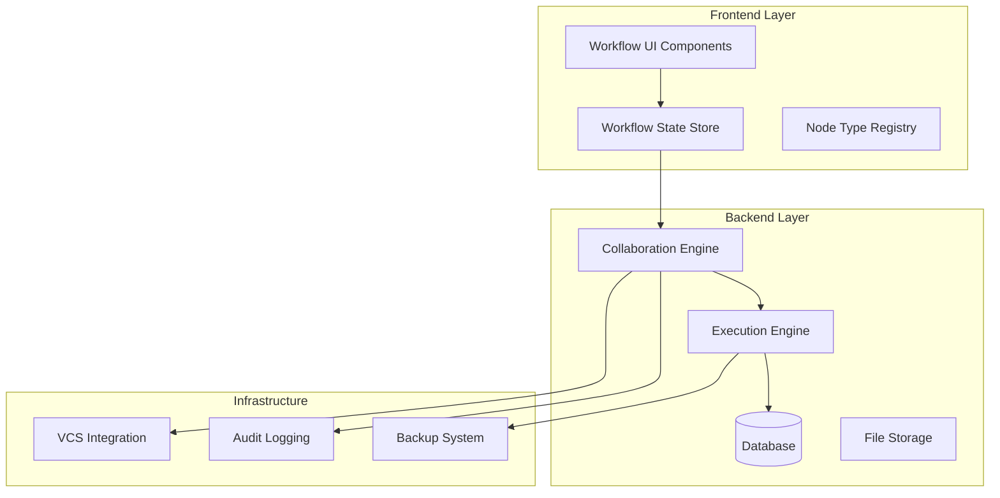

**Diagram sources**
- [workflow/index.tsx:1-50](file://src/pages/workflow/index.tsx#L1-L50)
- [collaborator/mod.rs:1-100](file://src-tauri/src/collaborator/mod.rs#L1-L100)
- [automation/execution.rs:1-150](file://src-tauri/src/automation/execution.rs#L1-L150)

**Section sources**
- [workflow/index.tsx:1-100](file://src/pages/workflow/index.tsx#L1-L100)
- [collaborator/mod.rs:1-200](file://src-tauri/src/collaborator/mod.rs#L1-L200)

## Core Components

### Workflow Engine Architecture

The workflow engine consists of several key components working together:

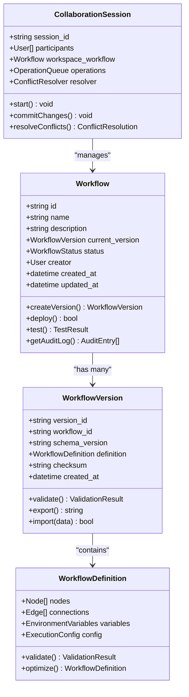

**Diagram sources**
- [workflow/types.ts:1-200](file://src/pages/workflow/types.ts#L1-L200)
- [collaborator/types.rs:1-150](file://src-tauri/src/collaborator/types.rs#L1-L150)

### Workflow Lifecycle Management

The workflow lifecycle follows a structured progression:

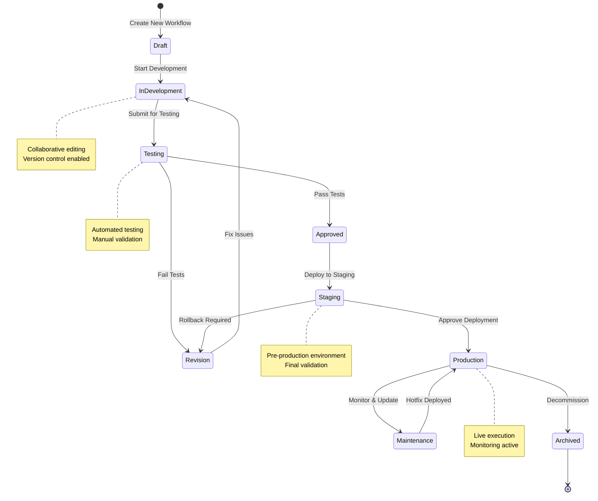

**Diagram sources**
- [workflow/constants.ts:1-100](file://src/pages/workflow/constants.ts#L1-L100)
- [automation/state.rs:1-150](file://src-tauri/src/automation/state.rs#L1-L150)

**Section sources**
- [workflow/types.ts:1-300](file://src/pages/workflow/types.ts#L1-L300)
- [automation/state.rs:1-200](file://src-tauri/src/automation/state.rs#L1-L200)

## Architecture Overview

### System Architecture

The workflow management system follows a microservices-inspired architecture with clear separation of concerns:

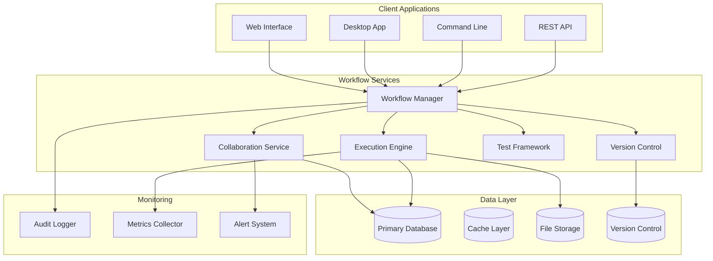

**Diagram sources**
- [collaborator/mod.rs:1-200](file://src-tauri/src/collaborator/mod.rs#L1-L200)
- [automation/execution.rs:1-300](file://src-tauri/src/automation/execution.rs#L1-L300)

### Data Flow Architecture

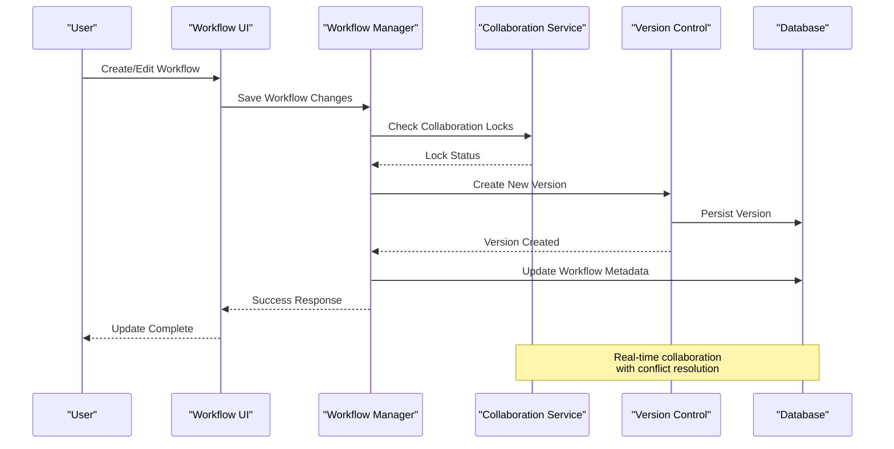

**Diagram sources**
- [commands/collaborator.rs:1-200](file://src-tauri/src/commands/collaborator.rs#L1-L200)
- [collaborator/state.rs:1-150](file://src-tauri/src/collaborator/state.rs#L1-L150)

## Detailed Component Analysis

### Workflow Versioning System

The versioning system provides comprehensive tracking and management of workflow changes:

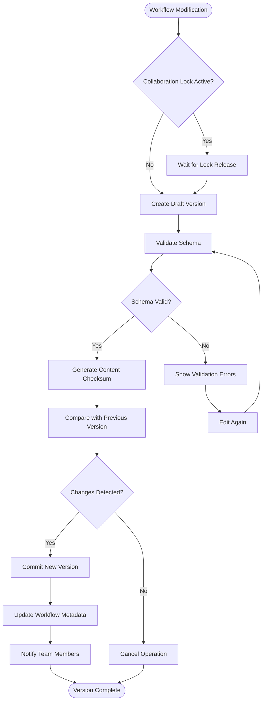

**Diagram sources**
- [workflow/templates.ts:1-100](file://src/pages/workflow/templates.ts#L1-L100)
- [db/schema.rs:1-200](file://src-tauri/src/db/schema.rs#L1-L200)

### Collaboration Engine

The collaboration engine enables real-time teamwork with conflict resolution:

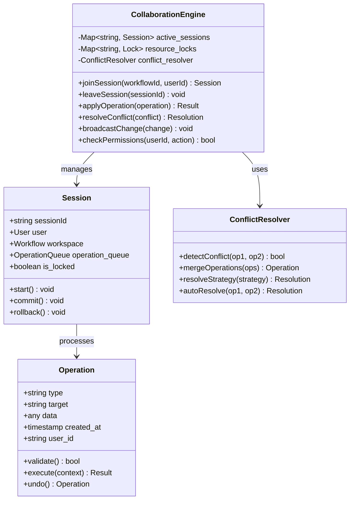

**Diagram sources**
- [collaborator/state.rs:1-200](file://src-tauri/src/collaborator/state.rs#L1-L200)
- [collaborator/types.rs:1-150](file://src-tauri/src/collaborator/types.rs#L1-L150)

### Execution Engine

The execution engine handles workflow runtime operations:

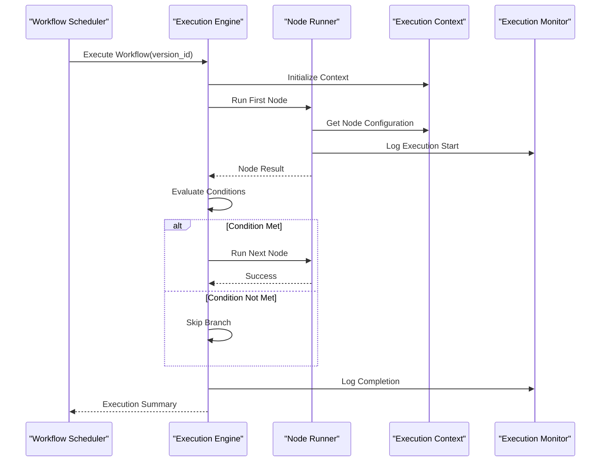

**Diagram sources**
- [automation/execution.rs:1-300](file://src-tauri/src/automation/execution.rs#L1-L300)
- [automation/state.rs:1-200](file://src-tauri/src/automation/state.rs#L1-L200)

### Permission and Access Control System

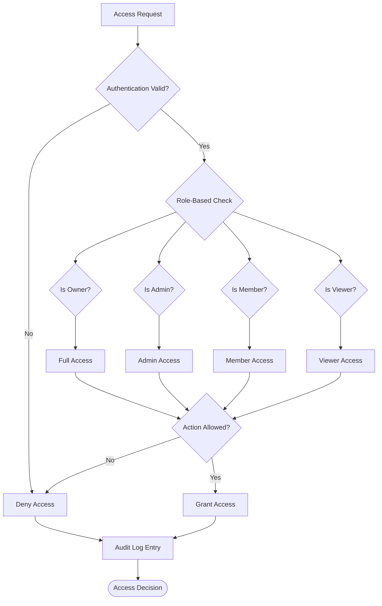

**Diagram sources**
- [commands/collaborator.rs:1-200](file://src-tauri/src/commands/collaborator.rs#L1-L200)

**Section sources**
- [workflow/types.ts:1-400](file://src/pages/workflow/types.ts#L1-L400)
- [collaborator/state.rs:1-300](file://src-tauri/src/collaborator/state.rs#L1-L300)
- [automation/execution.rs:1-400](file://src-tauri/src/automation/execution.rs#L1-L400)

## Dependency Analysis

### Component Dependencies

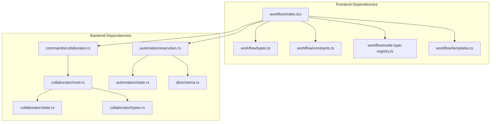

**Diagram sources**
- [workflow/index.tsx:1-100](file://src/pages/workflow/index.tsx#L1-L100)
- [collaborator/mod.rs:1-100](file://src-tauri/src/collaborator/mod.rs#L1-L100)
- [automation/execution.rs:1-100](file://src-tauri/src/automation/execution.rs#L1-L100)

### Data Flow Dependencies

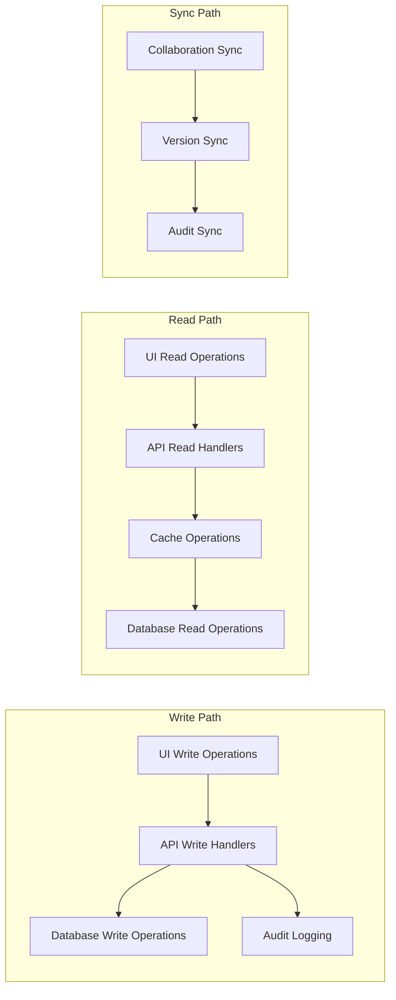

**Diagram sources**
- [commands/collaborator.rs:1-200](file://src-tauri/src/commands/collaborator.rs#L1-L200)
- [db/schema.rs:1-200](file://src-tauri/src/db/schema.rs#L1-L200)

**Section sources**
- [workflow/index.tsx:1-200](file://src/pages/workflow/index.tsx#L1-L200)
- [collaborator/mod.rs:1-200](file://src-tauri/src/collaborator/mod.rs#L1-L200)

## Performance Considerations

### Optimization Strategies

The workflow management system implements several performance optimization strategies:

- **Lazy Loading**: Workflow definitions are loaded on-demand to minimize memory usage
- **Caching Layer**: Frequently accessed workflow metadata is cached for faster retrieval
- **Batch Operations**: Multiple workflow operations are batched to reduce database load
- **Async Processing**: Long-running operations are processed asynchronously
- **Connection Pooling**: Database connections are pooled for efficient resource utilization

### Scalability Patterns

- **Horizontal Scaling**: Stateless execution engines can be scaled horizontally
- **Database Sharding**: Large workflow datasets can be sharded by organization
- **Message Queues**: Asynchronous processing uses message queues for reliability
- **Load Balancing**: Multiple instances share workload through load balancers

## Troubleshooting Guide

### Common Issues and Solutions

#### Workflow Version Conflicts

When multiple users edit the same workflow simultaneously, conflicts may occur:

1. **Automatic Resolution**: Simple field conflicts are resolved using last-write-wins strategy
2. **Manual Resolution**: Complex conflicts require manual intervention through the conflict resolution interface
3. **Rollback Capability**: Any version can be rolled back to a previous state

#### Execution Failures

Workflow execution failures can be diagnosed through:

1. **Execution Logs**: Detailed logs show node execution status and error messages
2. **Performance Metrics**: Execution time and resource usage metrics help identify bottlenecks
3. **Dependency Validation**: Pre-execution validation catches configuration errors

#### Collaboration Issues

Real-time collaboration problems typically stem from:

1. **Network Connectivity**: Ensure stable connection to collaboration server
2. **Permission Issues**: Verify user has appropriate access rights
3. **Resource Locks**: Check if workflows are locked by other users

### Recovery Procedures

#### Backup and Restore

1. **Automated Backups**: Daily incremental backups with weekly full backups
2. **Point-in-Time Recovery**: Restore to any specific point in time
3. **Selective Restore**: Restore individual workflows or collections

#### Disaster Recovery

1. **Multi-Region Replication**: Critical workflows replicated across regions
2. **Failover Automation**: Automatic failover to backup systems
3. **Data Integrity Checks**: Regular verification of backup integrity

**Section sources**
- [automation/execution.rs:1-400](file://src-tauri/src/automation/execution.rs#L1-L400)
- [collaborator/state.rs:1-300](file://src-tauri/src/collaborator/state.rs#L1-L300)

## Conclusion

Apprecon's workflow management system provides a robust, scalable, and collaborative platform for managing complex automation workflows. The system's architecture emphasizes security, performance, and ease of use while providing enterprise-grade features like versioning, collaboration, and comprehensive audit trails.

Key strengths include:

- **Comprehensive Versioning**: Full Git-like version control for workflows
- **Real-time Collaboration**: Multi-user editing with conflict resolution
- **Enterprise Security**: Granular permissions and comprehensive audit logging
- **Scalable Architecture**: Designed for high-volume workflow execution
- **Reliable Operations**: Robust backup, restore, and disaster recovery capabilities

The system continues to evolve with regular updates adding new workflow types, enhanced collaboration features, and improved performance optimizations.