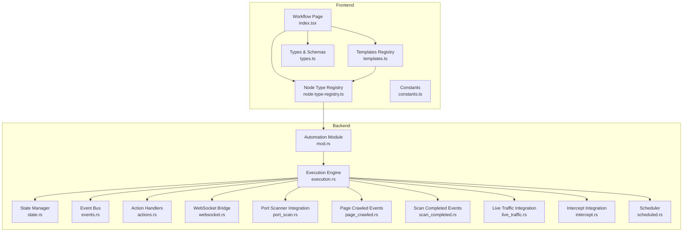
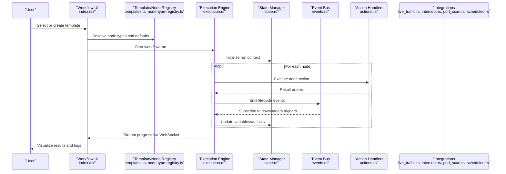
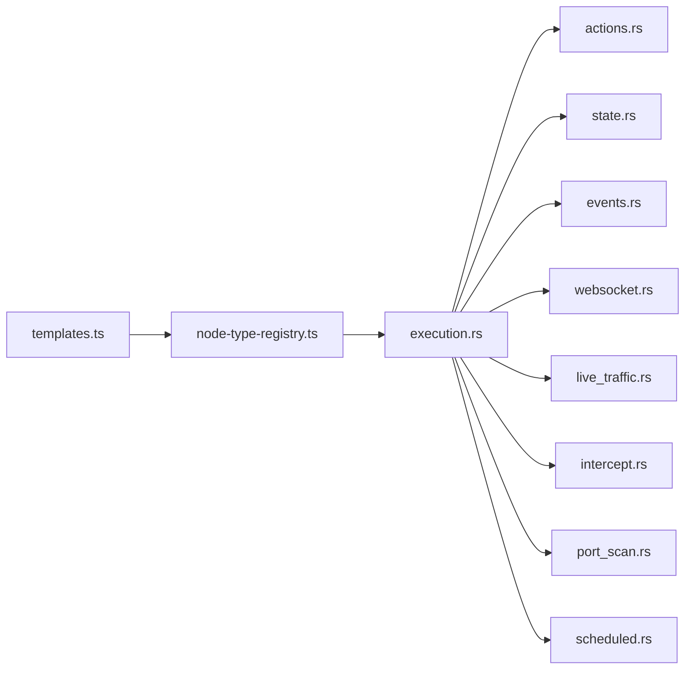

# Workflow Templates & Libraries

<cite>
**Referenced Files in This Document**
- [templates.ts](file://src/pages/workflow/templates.ts)
- [node-type-registry.ts](file://src/pages/workflow/node-type-registry.ts)
- [index.tsx](file://src/pages/workflow/index.tsx)
- [types.ts](file://src/pages/workflow/types.ts)
- [constants.ts](file://src/pages/workflow/constants.ts)
- [automation/index.ts](file://src/stores/automation/index.ts)
- [automation/types.ts](file://src/stores/automation/types.ts)
- [automation/actions.rs](file://src-tauri/src/automation/actions.rs)
- [automation/events.rs](file://src-tauri/src/automation/events.rs)
- [automation/execution.rs](file://src-tauri/src/automation/execution.rs)
- [automation/state.rs](file://src-tauri/src/automation/state.rs)
- [automation/scheduled.rs](file://src-tauri/src/automation/scheduled.rs)
- [automation/websocket.rs](file://src-tauri/src/automation/websocket.rs)
- [automation/port_scan.rs](file://src-tauri/src/automation/port_scan.rs)
- [automation/page_crawled.rs](file://src-tauri/src/automation/page_crawled.rs)
- [automation/scan_completed.rs](file://src-tauri/src/automation/scan_completed.rs)
- [automation/live_traffic.rs](file://src-tauri/src/automation/live_traffic.rs)
- [automation/intercept.rs](file://src-tauri/src/automation/intercept.rs)
- [automation/condition.rs](file://src-tauri/src/automation/condition.rs)
- [automation/mod.rs](file://src-tauri/src/automation/mod.rs)
</cite>

## Table of Contents
1. [Introduction](#introduction)
2. [Project Structure](#project-structure)
3. [Core Components](#core-components)
4. [Architecture Overview](#architecture-overview)
5. [Detailed Component Analysis](#detailed-component-analysis)
6. [Dependency Analysis](#dependency-analysis)
7. [Performance Considerations](#performance-considerations)
8. [Troubleshooting Guide](#troubleshooting-guide)
9. [Conclusion](#conclusion)
10. [Appendices](#appendices)

## Introduction
This document explains Apprecon’s workflow template system and pre-built automation libraries. It covers available template categories for security testing, API development, and general automation tasks; how to use built-in templates; how to customize them; and how to share templates across teams. It also provides examples of common workflow patterns such as automated vulnerability scanning, API regression testing, and deployment automation, along with best practices for creating reusable workflow components.

## Project Structure
Apprecon implements workflows through a dedicated page module that defines node types, templates, and execution orchestration. The frontend exposes the template registry and UI, while the backend (Tauri Rust layer) executes actions, manages state, and integrates with live traffic, port scanning, and scheduled triggers.

**Diagram sources**
- [index.tsx](file://src/pages/workflow/index.tsx)
- [templates.ts](file://src/pages/workflow/templates.ts)
- [node-type-registry.ts](file://src/pages/workflow/node-type-registry.ts)
- [types.ts](file://src/pages/workflow/types.ts)
- [constants.ts](file://src/pages/workflow/constants.ts)
- [automation/mod.rs](file://src-tauri/src/automation/mod.rs)
- [automation/execution.rs](file://src-tauri/src/automation/execution.rs)
- [automation/state.rs](file://src-tauri/src/automation/state.rs)
- [automation/events.rs](file://src-tauri/src/automation/events.rs)
- [automation/actions.rs](file://src-tauri/src/automation/actions.rs)
- [automation/websocket.rs](file://src-tauri/src/automation/websocket.rs)
- [automation/port_scan.rs](file://src-tauri/src/automation/port_scan.rs)
- [automation/page_crawled.rs](file://src-tauri/src/automation/page_crawled.rs)
- [automation/scan_completed.rs](file://src-tauri/src/automation/scan_completed.rs)
- [automation/live_traffic.rs](file://src-tauri/src/automation/live_traffic.rs)
- [automation/intercept.rs](file://src-tauri/src/automation/intercept.rs)
- [automation/scheduled.rs](file://src-tauri/src/automation/scheduled.rs)

**Section sources**
- [index.tsx](file://src/pages/workflow/index.tsx)
- [templates.ts](file://src/pages/workflow/templates.ts)
- [node-type-registry.ts](file://src/pages/workflow/node-type-registry.ts)
- [types.ts](file://src/pages/workflow/types.ts)
- [constants.ts](file://src/pages/workflow/constants.ts)
- [automation/mod.rs](file://src-tauri/src/automation/mod.rs)

## Core Components
- Template Registry: Centralized definitions of reusable workflow templates categorized by purpose (security testing, API development, general automation).
- Node Type Registry: Declarative mapping of workflow nodes (HTTP requests, browser actions, conditionals, loops, scheduling, etc.) to their runtime handlers.
- Execution Engine: Orchestrates node execution, handles branching, retries, and error propagation.
- State Management: Tracks workflow run state, variables, and artifacts across nodes.
- Event Bus: Publishes and subscribes to events (e.g., page crawled, scan completed, live traffic captured).
- Action Handlers: Concrete implementations for each node type (e.g., send HTTP request, trigger port scan, schedule job).
- Integrations: Bridges to live traffic capture, intercept rules, port scanning, and scheduled triggers.

Key responsibilities:
- Templates define structure, default parameters, and metadata for quick reuse.
- Node types decouple UI representation from backend execution logic.
- Execution engine ensures deterministic flow control and robust error handling.
- State and events enable composability and observability.

**Section sources**
- [templates.ts](file://src/pages/workflow/templates.ts)
- [node-type-registry.ts](file://src/pages/workflow/node-type-registry.ts)
- [automation/execution.rs](file://src-tauri/src/automation/execution.rs)
- [automation/state.rs](file://src-tauri/src/automation/state.rs)
- [automation/events.rs](file://src-tauri/src/automation/events.rs)
- [automation/actions.rs](file://src-tauri/src/automation/actions.rs)

## Architecture Overview
The workflow system follows a layered architecture:
- Frontend Layer: Template selection, editing, and visualization; node type registration; schema validation.
- Backend Layer: Execution engine, state management, event bus, and integrations.
- Integration Layer: Connects to live traffic, intercept, port scanner, and scheduler.

**Diagram sources**
- [index.tsx](file://src/pages/workflow/index.tsx)
- [templates.ts](file://src/pages/workflow/templates.ts)
- [node-type-registry.ts](file://src/pages/workflow/node-type-registry.ts)
- [automation/execution.rs](file://src-tauri/src/automation/execution.rs)
- [automation/state.rs](file://src-tauri/src/automation/state.rs)
- [automation/events.rs](file://src-tauri/src/automation/events.rs)
- [automation/actions.rs](file://src-tauri/src/automation/actions.rs)
- [automation/live_traffic.rs](file://src-tauri/src/automation/live_traffic.rs)
- [automation/intercept.rs](file://src-tauri/src/automation/intercept.rs)
- [automation/port_scan.rs](file://src-tauri/src/automation/port_scan.rs)
- [automation/scheduled.rs](file://src-tauri/src/automation/scheduled.rs)

## Detailed Component Analysis

### Template System
- Categories: Security Testing, API Development, General Automation.
- Built-in templates provide scaffolding with sensible defaults and parameterization points.
- Customization: Edit node parameters, add conditions, insert loops, and chain integrations.
- Sharing: Export/import templates using standardized schemas; store in shared repositories for team reuse.

Best practices:
- Keep templates focused on a single outcome.
- Parameterize environment-specific values (targets, credentials).
- Include clear metadata and usage instructions.
- Version templates alongside code changes.

**Section sources**
- [templates.ts](file://src/pages/workflow/templates.ts)
- [types.ts](file://src/pages/workflow/types.ts)
- [constants.ts](file://src/pages/workflow/constants.ts)

### Node Type Registry
- Maps node identifiers to handler modules and schemas.
- Supports composite nodes (e.g., conditional branches, loops).
- Extensible design allows adding new node types without modifying core logic.

Usage pattern:
- Register new node types with name, label, icon, schema, and handler reference.
- Validate inputs against schemas before execution.

**Section sources**
- [node-type-registry.ts](file://src/pages/workflow/node-type-registry.ts)
- [types.ts](file://src/pages/workflow/types.ts)

### Execution Engine
- Drives workflow runs deterministically.
- Handles branching, retries, timeouts, and error propagation.
- Emits lifecycle events for observability and integration.

Operational characteristics:
- Stateless per-node execution with centralized state updates.
- Backpressure-aware streaming to the frontend via WebSocket.

**Section sources**
- [automation/execution.rs](file://src-tauri/src/automation/execution.rs)
- [automation/state.rs](file://src-tauri/src/automation/state.rs)
- [automation/events.rs](file://src-tauri/src/automation/events.rs)
- [automation/websocket.rs](file://src-tauri/src/automation/websocket.rs)

### Action Handlers
- Implement concrete behaviors for each node type.
- Examples include sending HTTP requests, triggering scans, invoking browser automation, and scheduling jobs.
- Errors are normalized and surfaced to the execution engine.

Extensibility:
- Add new actions by registering handlers and wiring into the execution pipeline.

**Section sources**
- [automation/actions.rs](file://src-tauri/src/automation/actions.rs)

### Integrations
- Live Traffic: Capture and react to intercepted HTTP/WebSocket traffic.
- Intercept: Apply rules to modify or block requests/responses during runs.
- Port Scanner: Trigger scans and consume results as workflow steps.
- Scheduler: Run workflows on cron-like schedules or recurring intervals.

Integration patterns:
- Use events to connect disparate systems within a single workflow.
- Compose integrations with conditionals and loops for complex scenarios.

**Section sources**
- [automation/live_traffic.rs](file://src-tauri/src/automation/live_traffic.rs)
- [automation/intercept.rs](file://src-tauri/src/automation/intercept.rs)
- [automation/port_scan.rs](file://src-tauri/src/automation/port_scan.rs)
- [automation/page_crawled.rs](file://src-tauri/src/automation/page_crawled.rs)
- [automation/scan_completed.rs](file://src-tauri/src/automation/scan_completed.rs)
- [automation/scheduled.rs](file://src-tauri/src/automation/scheduled.rs)

### Common Workflow Patterns
- Automated Vulnerability Scanning:
  - Start with a target definition.
  - Trigger port scan and crawl endpoints.
  - On scan completion, execute targeted checks and report findings.
- API Regression Testing:
  - Load baseline responses.
  - Send requests through intercept rules.
  - Compare outputs and fail on mismatches.
- Deployment Automation:
  - Trigger on commit or schedule.
  - Build artifacts, run tests, deploy to staging/prod.
  - Notify stakeholders and roll back on failure.

[No sources needed since this section provides conceptual guidance]

### Template Creation Process
Steps:
1. Choose a base category and start from a built-in template.
2. Customize node parameters and add necessary integrations.
3. Define variables and secrets securely.
4. Test locally and validate outcomes.
5. Export and share with your team repository.

Best practices:
- Modularize repeated logic into reusable nodes.
- Document assumptions and required permissions.
- Pin versions of external tools and dependencies.

[No sources needed since this section provides conceptual guidance]

## Dependency Analysis
The workflow system separates concerns between UI, registry, execution, and integrations. This reduces coupling and improves maintainability.

**Diagram sources**
- [templates.ts](file://src/pages/workflow/templates.ts)
- [node-type-registry.ts](file://src/pages/workflow/node-type-registry.ts)
- [automation/execution.rs](file://src-tauri/src/automation/execution.rs)
- [automation/actions.rs](file://src-tauri/src/automation/actions.rs)
- [automation/state.rs](file://src-tauri/src/automation/state.rs)
- [automation/events.rs](file://src-tauri/src/automation/events.rs)
- [automation/websocket.rs](file://src-tauri/src/automation/websocket.rs)
- [automation/live_traffic.rs](file://src-tauri/src/automation/live_traffic.rs)
- [automation/intercept.rs](file://src-tauri/src/automation/intercept.rs)
- [automation/port_scan.rs](file://src-tauri/src/automation/port_scan.rs)
- [automation/scheduled.rs](file://src-tauri/src/automation/scheduled.rs)

**Section sources**
- [automation/mod.rs](file://src-tauri/src/automation/mod.rs)
- [automation/index.ts](file://src/stores/automation/index.ts)
- [automation/types.ts](file://src/stores/automation/types.ts)

## Performance Considerations
- Prefer streaming results over bulk payloads to reduce memory pressure.
- Batch network calls where possible and respect rate limits.
- Use conditionals to short-circuit unnecessary work.
- Cache expensive lookups and avoid redundant computations.
- Monitor event throughput and adjust concurrency settings based on resource availability.

[No sources needed since this section provides general guidance]

## Troubleshooting Guide
Common issues and resolutions:
- Node execution failures: Check action handler logs and normalize error messages; verify input schemas.
- Event not received: Ensure proper subscription and confirm event names match publisher contracts.
- State inconsistencies: Inspect state transitions and ensure atomic updates around critical sections.
- WebSocket disconnects: Implement reconnection logic and handle partial message recovery.
- Integration timeouts: Tune timeouts and implement retries with exponential backoff.

**Section sources**
- [automation/execution.rs](file://src-tauri/src/automation/execution.rs)
- [automation/events.rs](file://src-tauri/src/automation/events.rs)
- [automation/state.rs](file://src-tauri/src/automation/state.rs)
- [automation/websocket.rs](file://src-tauri/src/automation/websocket.rs)

## Conclusion
Apprecon’s workflow template system provides a flexible, extensible foundation for building repeatable automation across security testing, API development, and general tasks. By leveraging built-in templates, customizing node behavior, and composing integrations through events, teams can create powerful, shareable workflows that scale with their needs. Adopting best practices for modularity, documentation, and versioning ensures long-term maintainability and collaboration.

[No sources needed since this section summarizes without analyzing specific files]

## Appendices

### Example Workflows
- Automated Vulnerability Scanning:
  - Steps: Target setup -> Port scan -> Endpoint crawl -> Targeted checks -> Report generation.
- API Regression Testing:
  - Steps: Baseline load -> Request dispatch -> Response comparison -> Failure alert.
- Deployment Automation:
  - Steps: Trigger -> Build -> Test -> Deploy -> Notify -> Rollback on failure.

[No sources needed since this section provides conceptual guidance]

### Best Practices for Reusable Components
- Encapsulate logic into small, testable nodes.
- Define clear input/output schemas.
- Provide defaults and validation constraints.
- Document prerequisites and expected side effects.
- Version and tag templates for reproducibility.

[No sources needed since this section provides conceptual guidance]